# Extending Defensive Distillation

Nicolas Papernot and Patrick McDaniel Pennsylvania State University
{ngp5056,mcdaniel}@cse.psu.edu

## Abstract

Machine learning is vulnerable to adversarial examples: inputs carefully modified to force misclassification. Designing defenses against such inputs remains largely an open problem. In this work, we revisit defensive distillation—which is one of the mechanisms proposed to mitigate adversarial examples—to address its limitations. We view our results not only as an effective way of addressing some of the recently discovered attacks but also as reinforcing the importance of improved training techniques.

## 1 Introduction

Deployed machine learning (ML) models are vulnerable to inputs maliciously perturbed to force them to mispredict [1, 2]. A class of such inputs, named *adversarial examples*, are systematically constructed through slight perturbations of otherwise correctly classified inputs [3, 4]. These perturbations are chosen to maximize the model's prediction error while leaving the semantics of the input unchanged. Although this often poses a non-tractable optimization problem for popular architectures like deep neural networks, heuristics allow the adversary to find effective perturbations—typically through the evaluation of gradients of the model's output with respect to its inputs [3, 5].

To defend against adversarial examples, two classes of approaches exist. The first algorithmically improves upon the learning to make the model inherently more robust: techniques that fall in this class include adversarial training [3, 5]
or defensive distillation [6]. The second is a set of detection mechanisms used to reject inputs suspected to be malicious. One approach is to analyze internal model features for anomalies [7, 8]. Another approach chooses to add an outlier class to the set of existing outputs that make up the ML task, and then train the model to map adversarial examples to this special class [9, 10].

However, most—if not all—of these defenses fail to adapt to novel attack strategies. Defensive distillation, which is the primary mechanism discussed in the present document, is no exception. It is successful against attacks known at the time of writing, such as the Fast Gradient Sign Method (FGSM) [5] and the Jacobian-based Saliency Map Approach (JSMA) [11]. However, as advancements found new ways to mount attacks against ML, defensive distillation can now be evaded [12, 13].

1 One of the successful strategies is to mount a black-box attack, as shown in [12]: the adversary first trains an *undefended* surrogate model which mimicks the defended model, and then uses the surrogate model to generate adversarial examples that transfer back to the distilled model (i.e., the same inputs are misclassified by both the undefended and defended models). This attack strategy succeeds because of the often strong transferability of adversarial examples across models trained to solve the same ML task [3, 5, 14]
In addition, distillation can be evaded with optimization attacks `a la Szegedy et al. [3], which have been revisited in [13] with new objectives and optimizers.

This second attack strategy is successful against defensive distillation because of a phenomenon called *gradient masking* [12]: the defense mechanism destroys gradients essential to the heuristics of attacks like the FGSM and JSMA—
instead of reducing the model's error. Note that defensive distillation is not the only mechanism that yields to gradient masking [15]
Given the two failure modes identified above, we propose in this work a variant of defensive distillation that addresses them. We demonstrate that our approach is less susceptible to transferability and gradient masking by mounting black-box attacks from both undefended and defended surrogate models.

Like the original defensive distillation, the technique does not require that the defender generate adversarial examples. Its applicability is thus less likely to be limited to specific adversarial example heuristics.

Unfortunately, it is currently infeasible to formally prove robustness guarantees for models like deep neural networks. Techniques for the verification of these models are also still in their infancy [16, 17]. We thus resort to experimental validation of our approach and leave a formal analysis to future work.

## 2 Defensive Distillation

Adapted from [18], defensive distillation successively trains two instances of the same deep neural network architecture.1 The first model is trained with the original dataset {(*x, y*)} where y indicates the *expected* correct class for the input x. Learning is performed conventionally to the exception of the softmax2 temperature, which is usually set to 1 and is here increased. In the interest of space, we refer readers to the detailed presentation in [6]. Briefly, the model outputs probabilities that are closer to a uniform distribution at high softmax temperatures. This first model f is then used to label each training point x with its probability vector (roughly indicating how likely f believes the input x to be in each class of the task). This defines a newly labeled training set {(*x, f*(x))},
which the second model f dis trained on. When deployed with a temperature of 1, the model f dis found to be robust to the FGSM and JSMA attacks.

1As noted in [6], distillation is applicable to any model outputting an energy-based probability distribution for which a temperature can be defined.

2The term softmax refers here to the last layer of a neural network classifier. It transforms scores assigned by the model to each class of the task into probabilities.

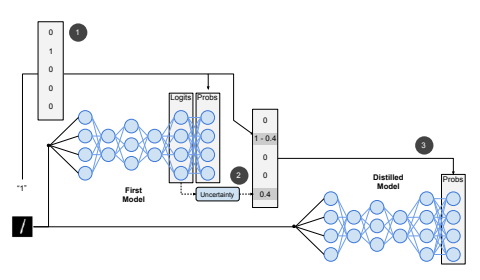

Figure 1: The extended defensive distillation procedure: (1) the first neural network is trained as usual on one-hot labels, (2) a new labeling vector is defined for each training point by combining the original label information together with the first model's predictive uncertainty—which is measured by taking several stochastic passes through the model to infer the logits, (3) the distilled model is trained at temperature T ≥ 1 with the new label vectors.

## 3 Extending Defensive Distillation

We revisit the defensive distillation approach by modifying the labeling information used to train the distilled model f d. Our changes are motivated by two lines of previous work. The first augments the output of models with an outlier class as a means to mitigate adversarial examples [9, 10]: the model learns to classify adversarial inputs in the outlier class. The second provides uncertainty estimates in neural networks through stochastic inference [19, 20].

The variant of defensive distillation described below successively trains two models and transfers the knowledge of the first model f into the second. The mechanism enables the second (i.e., distilled) model f dto be uncertain about its prediction when the input it is asked to label is far from the training manifold. Uncertainty estimates required to train this distilled model are obtained through an analysis of the predictions made by the first of the two models.

Measuring uncertainty To capture the uncertainty of the first model in the labels created to train the second—distilled—model, we use dropout at inference. Dropout is a technique which randomly "drops" (i.e., removes) some of the neurons in the neural network's architecture. It is typically applied during training as a regularizer. Instead, Gal and Ghahramani apply dropout while inferring, in order to approximate Bayesian inference [19]. We use here a similar process to quantify the predictive uncertainty of the first model f.

While dropout is still activated, we take N forward passes through the neural network f and record the N logit vectors z 0(x)*, ..., z*N−1(x) predicted. Each logit vector z m(x) is n − 1 dimensional, where n is the number of classes in the problem. The logits are scores assigned to each class, before they are transformed into a probability through the application of a softmax at the output of the network. For instance, z m j
(x) is the score assigned by model f to class j in the m-th forward pass on input x with dropout.

We then compute the mean logit vector ¯z(x) and the variance over the N
stochastic passes to measure uncertainty at the input point x considered:

$$\sigma(x)=\frac{1}{N}\sum_{m\in0..N-1}\left(\sum_{j\in0..n-1}\left(z_{j}^{m}(x)-\bar{z}_{j}\right)^{2}\right)\tag{1}$$

Unlike what was proposed in the original defensive distillation mechanism, the softmax temperature of the first model f is maintained at T = 1 at all times.

Training the distilled model with uncertainty The output of the distilled model is augmented with an outlier class, which is separate from the existing n "real" classes of the problem. When training the distilled model f d, each training point is relabeled with a vector that indicates (1) the correct class of the input and (2) the uncertainty σ(x) of the first model f. The components j ∈ 0..n of this new labeling vector k(x) are defined by:

$$k_{j}(x)={\left\{\begin{array}{l l}{1-\alpha\cdot{\frac{\sigma(x)}{\max_{x\in X}\sigma(x)}}}&{{\mathrm{if~}}j=l{\mathrm{~(correct~class)}}}\\ {\alpha\cdot{\frac{\sigma(x)}{\max_{x\in X}\sigma(x)}}}&{{\mathrm{if~}}j=n{\mathrm{~(outlier~class)}}}\\ {0}&{{\mathrm{otherwise}}}\end{array}\right.}\qquad{\mathrm{(2)}}$$

Informally, the uncertainty defines the probability assigned to the outlier class, while the remaining probability is assigned exclusively to the correct class. The parameter α weights the importance given to the uncertainty measure. When the first model f was uncertain on x, the measure σ(x) is large and kn(x) as well. Hence, the distilled model is more likely to classify uncertain inputs as outliers. As a consequence, if α is set to a too large value, all inputs are classified as outliers. The distilled model f dtrained with labeling vector k(x) learns how to correctly classify x as long as kl(x) > kn(x) where l is the index of the correct label for x and n the index of the outlier class.

Training with an outlier class is expected to increase the model's robustness to finite perturbations (e.g., FGM and JSMA adversarial examples), as observed by previous efforts including [9, 10]. We now make one last modification to the training procedure in order to address smaller perturbations (such as the ones produced by the AdaDelta strategy). Specifically, we augment the training loss of our distilled model to include the following penalty:

$$-\,\gamma\cdot\operatorname*{max}\left(\operatorname*{max}_{j\neq l,n}z_{j}(x)-z_{l}(x),\kappa\right)$$
zj (x) − zl(x), κ(3)

$$\left({\boldsymbol{3}}\right)$$

4 where l is the correct class, γ weights the relative contribution of the penalty in the training loss and κ prevents unnecessary extrema during optimization.

Finally, we note that unlike in the original defensive distillation mechanism, we maintain the temperature of the distilled model at all times equal to T = 1.

## 4 Evaluation

We evaluate the robustness of the distilled model f din the face of attacks mounted both in *white-box* and *black-box* threat models. In addition to corresponding to a more realistic threat model, robustness to black-box attacks is a compelling indicator of the absence of gradient masking. Below, the strengths and weaknesses of the approach are characterized by four rates:
- *Accuracy*: percentage of legitimate inputs correctly classified. - *False positives*: percentage of legitimate inputs classified as outliers
- *Recovered*: percentage of adversarial inputs whose class was recovered
(i.e., they are assigned the label of the originally unperturbed input).

- *Detected*: percentage of adversarial examples classified in the outlier class..

Ideally, the distilled model's accuracy should be comparable to the one of an undefended model. Combined, the recovered and detected adversarial examples should leave as few misclassified adversarial examples as possible. Finally, the false positive rate should be as low as possible, otherwise the model becomes unusable when presented with legitimate inputs.

When evaluating attacks, we also report the mean perturbation of adversarial examples that were successful for the adversary (i.e., neither recovered or detected). This allows us to better visualize the effectiveness of the defense, because it exposes the trade-off between indistinguishibility of adversarial examples and their likelihood of being misclassified.

## 4.1 Experimental Setup

We experiment with MNIST [21] using the convolutional neural network provided in the cleverhans v.1 library tutorials. Dropout layers are inserted before the input layer and after the last convolution. Hence, dropout is applied to the feature representation extracted by the convolutional layers, before the fully connected layer essential to classification. The probability of dropping a neuron is set to 0.2 before the input layer and 0.5 after the convolution.

We consider three attack strategies: the fast gradient method (FGM) [5], the Jacobian Saliency Map Approach (JSMA) [11] and the AdaDelta optimization strategy (AdaDelta) [13]. For the JSMA and AdaDelta attacks, we randomly select the target class among the set of "real" classes (i.e., we omit the outlier class since it is not a profitable output for adversaries). Adversarial examples are clipped to ensure their components are within the range of acceptable values.

In our evaluation, the JSMA and AdaDelta attacks are ran on less test inputs than the FGM—they are computationally expensive. Thus, the variability of the results for these two attacks is larger than for results relative to the FGM.

Our source code will be open-sourced through cleverhans.

## 4.2 Robustness To White-Box Attacks

In the white-box setting, the adversary has access to the defended model's architecture and parameters: the attack algorithms are directly applied to the model that is targeted (i.e., the distilled model).

The distilled model was trained for 10 epochs with N = 20 dropout passes, a variance coefficient α = 0.9, a loss penalty weight γ = 5 · 10−4, and a loss penalty constant κ = 40. This choice of hyper-parameters is justified below, except for γ and κ: they were chosen with a grid search. The model accuracy on legitimate test inputs is 97.28%, compared to a 98.41% accuracy for the same architecture trained without defensive distillation for 10 epochs. The distilled model's false positive remains below 1%.

Robustness We run the attacks mentioned in Section 4.1 with different parameters to evaluate the percentage of misclassified adversarial examples (i.e.,
those that are neither recovered or detected) with respect to their mean perturbation. Figure 2a, 2b and 2c illustrate the results respectively for the FGM,
JSMA and AdaDelta attacks. We break down correctly classified adversarial examples as recovered or detected, but stack the two rates to better visualize the inputs that were correctly processed by the model.

The defended model is robust in a certain neighborhood of the test points. In comparison, the undefended model has a misclassification rate of 90.8%, 92.2%
and 96.0% on the FGM, JSMA and AdaDelta attacks respectively. As the attacks increase the perturbation introduced, the model is less and less able to cope with adversarial input. For the FGM and JSMA attacks, the mechanism is able to correctly classify a large fraction of adversarial examples produced with a perturbation norm less than 4 according to the `2 norm. For the AdaDelta strategy, there remains an evasion window for the adversary using 2 ≤ κ ≤ 2.5.

A visual inspection reveals that when the `2 norm of adversarial examples is larger than 5, the perturbations begin to modify the correct class (e.g., the digit corresponding to the wrong class predicted by the model appears transparently in the image or the digit corresponding to the correct class is partially erased).

Parameter exploration The fraction of adversarial examples whose correct class is recovered or detected increases with the value of α, as illustrated in Figure 2d. Indeed, larger values of α assign a greater probability to the outlier class when creating the labeling vector k(x) with which the distilled model is trained. However for α ≥ 1.0, this comes at the expense of a lower accuracy on legitimate inputs: there are more false positives—because legitimate inputs are increasingly likely to be labeled by the model as outliers.

As more forward passes with dropout are taken to estimate the uncertainty of the first model, the distilled model is able to detect and recover more adversarial examples. Yet, measurements depicted in Figure 2e show that there is a number of passes (' 20) after which the curves exhibit a plateau. The approximation performed when taking successive stochastic passes eventually converges as the number of passes increases.

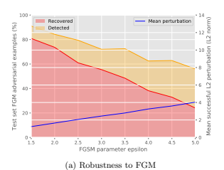

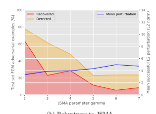

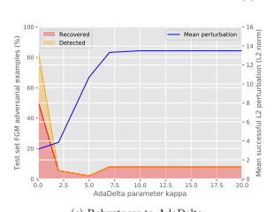

(b) Robustness to JSMA

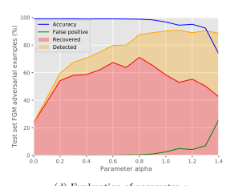

(c) Robustness to AdaDelta

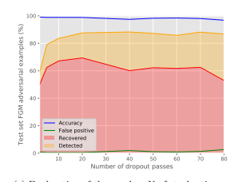

(d) Exploration of parameter α.

(e) Exploration of the number N of stochastic passes.

Figure 2: Evaluation of defensive distillation in the white-box setting. Figure 2a, 2b and 2c report the recovered and detected rates vs. the mean perturbation of successful adversarial example produced with the three attacks from Section 4.1. For clarity of presentation, the parameter exploration performed in Figures 2d and 2e is plotted with the FGM only.

7

## 4.3 Robustness To Black-Box Attacks

We mount worst-case black-box attacks through transferability from a surrogate model trained using the same architecture and data. For each attack, we consider two types of surrogate models: undefended ones (denoted by U) and ones (denoted by D) defended with the mechanism introduced in Section 3. This allows us to test for gradient masking (which would be indicated by strong transferability of adversarial examples from the surrogates to the distilled model).

Our results, reported in Figure 3, are comparable with those obtained in the white-box setting (see Figure 2). Black-box adversarial examples are somewhat more likely to be detected as outliers than their white-box counterparts. Yet, the misclassification rates of each attack are comparable in the white-box and black-box settings, regardless of the fact that the model was defended or not.

This comforts the design choices made to prevent gradient masking.

## 5 Discussion

We addressed the numerical instabilities encountered by the original defensive distillation mechanism. In lieu of extracting uncertainty estimates from the probability vectors at high temperature, we considered the logits produced by multiple stochastic passes through the neural network. Future work may build on the ideas of transferring knowledge and uncertainty between models in order to improve ML performance on other tasks in adversarial environments.

The variant proposed defends models in a comparable capacity in the face of white-box and black-box attacks. This indicates that the defense is less likely to suffer from gradient masking. While its benefits recede as perturbations become larger, defensive distillation is able to improve the robustness of a neural network in a vicinity of its test data at a reasonable price in accuracy.

Although the method is generic and applicable to any neural net and input domain, our evaluation remains preliminary. The MNIST dataset is nevertheless compelling because of the strong transferability across architectures, which makes defending against black-box attacks particularly hard.

Our results stress that it is key to defend against two types of adversarial examples—built with infinitesimal and finite perturbations. In the black-box setting, the latter can be more challenging because they are more
"transferable". However, AdaDelta adversarial examples transfer less across architectures at κ ' 2. Thus, our results on undefended black-box attacks are pessimistic in the sense that they assumed the adversary has perfect knowledge about the defended model's architecture.

Defensive distillation's most appealing aspect remains that it does not require that the defender generate adversarial examples. This leaves room for another line of work combining defensive distillation with other defenses. For example, adversarial training could be combined with defensive distillation to learn a mapping between adversarial examples and the correct or outlier classes. Given that adversarial training is typically effective against finite perturbations (e.g., the FGM), it is likely to complement defensive distillation.

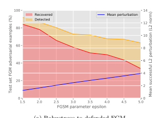

(a) Robustness to defended FGM

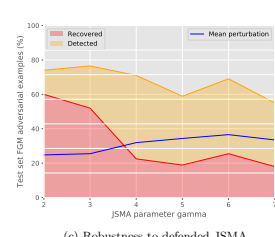

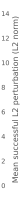

(c) Robustness to defended JSMA

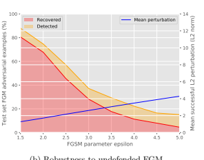

(b) Robustness to undefended FGM.

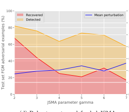

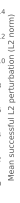

0 2 4 6 8
(d) Robustness to undefended JSMA.

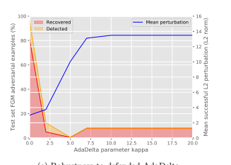

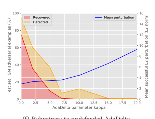

(e) Robustness to defended AdaDelta
(f) Robustness to undefended AdaDelta.

Figure 3: Evaluation of defensive distillation in the black-box setting. In Figures 3a, 3c and 3e, we use a *defended* surrogate model trained with defensive distillation. Figures 3b, 3d and 3f use an *undefended* surrogate model.

9

## Acknowledgments

Nicolas Papernot is supported by a Google PhD Fellowship in Security. We thank NVIDIA for the donation of a Titan X Pascal. Research was supported in part by the Army Research Laboratory, under Cooperative Agreement Number W911NF-13-2-0045 (ARL Cyber Security CRA), and the Army Research Office under grant W911NF-13-1-0421.

## References

[1] D. Lowd and C. Meek, "Adversarial learning," in Proceedings of the eleventh ACM SIGKDD international conference on Knowledge discovery in data mining. ACM, 2005, pp. 641–647.

[2] M. Barreno, B. Nelson, R. Sears, A. D. Joseph, and J. D. Tygar, "Can machine learning be secure?" in *Proceedings of the 2006 ACM Symposium* on Information, computer and communications security. ACM, 2006, pp.

16–25.

[3] C. Szegedy *et al.*, "Intriguing properties of neural networks," arXiv preprint arXiv:1312.6199, 2013.

[4] B. Biggio *et al.*, "Evasion attacks against machine learning at test time," in Joint European Conference on Machine Learning and Knowledge Discovery in Databases. Springer, 2013, pp. 387–402.

[5] I. J. Goodfellow *et al.*, "Explaining and harnessing adversarial examples,"
arXiv preprint arXiv:1412.6572, 2014.

[6] N. Papernot *et al.*, "Distillation as a defense to adversarial perturbations against deep neural networks," in *Security and Privacy (SP), 2016 IEEE*
Symposium on. IEEE, 2016, pp. 582–597.

[7] J. H. Metzen, T. Genewein, V. Fischer, and B. Bischoff, "On detecting adversarial perturbations," *arXiv preprint arXiv:1702.04267*, 2017.

[8] R. Feinman, R. R. Curtin, S. Shintre, and A. B. Gardner, "Detecting adversarial samples from artifacts," *arXiv preprint arXiv:1703.00410*, 2017.

[9] K. Grosse, P. Manoharan, N. Papernot, M. Backes, and P. McDaniel,
"On the (statistical) detection of adversarial examples," arXiv preprint arXiv:1702.06280, 2017.

[10] H. Hosseini *et al.*, "Blocking transferability of adversarial examples in black-box learning systems," *arXiv preprint arXiv:1703.04318*, 2017.

[11] N. Papernot *et al.*, "The limitations of deep learning in adversarial settings," in *Security and Privacy (EuroS&P), 2016 IEEE European Symposium on*. IEEE, 2016, pp. 372–387.

[12] N. Papernot, P. McDaniel, I. Goodfellow, S. Jha, Z. B. Celik, and A. Swami,
"Practical black-box attacks against machine learning," in *Proceedings of* the 2017 ACM on Asia Conference on Computer and Communications Security. ACM, 2017, pp. 506–519.

[13] N. Carlini *et al.*, "Towards evaluating the robustness of neural networks,"
arXiv preprint arXiv:1608.04644, 2016.

[14] F. Tram`er, N. Papernot, I. Goodfellow, D. Boneh, and P. McDaniel, "The space of transferable adversarial examples," arXiv preprint arXiv:1704.03453, 2017.

[15] W. Brendel and M. Bethge, "Comment on" biologically inspired protection of deep networks from adversarial attacks"," arXiv preprint arXiv:1704.01547, 2017.

[16] X. Huang, M. Kwiatkowska, S. Wang, and M. Wu, "Safety verification of deep neural networks," *arXiv preprint arXiv:1610.06940*, 2016.

[17] G. Katz, C. Barrett, D. Dill, K. Julian, and M. Kochenderfer, "Reluplex:
An efficient smt solver for verifying deep neural networks," arXiv preprint arXiv:1702.01135, 2017.

[18] G. Hinton, O. Vinyals, and J. Dean, "Distilling the knowledge in a neural network," *arXiv preprint arXiv:1503.02531*, 2015.

[19] Y. Gal and Z. Ghahramani, "Dropout as a bayesian approximation: Representing model uncertainty in deep learning," arXiv preprint arXiv:1506.02142, vol. 2, 2015.

[20] Y. Gal, "Uncertainty in deep learning," Ph.D. dissertation, PhD thesis, University of Cambridge, 2016.

[21] Y. LeCun *et al.*, "The mnist database of handwritten digits," 1998.