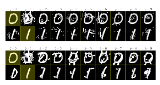

# Improving The Adversarial Robustness And Interpretability Of Deep Neural Networks By Regularizing Their Input Gradients

Andrew Slavin Ross and **Finale Doshi-Velez**
Paulson School of Engineering and Applied Sciences, Harvard University, Cambridge, MA 02138, USA
andrew ross@g.harvard.edu, finale@seas.harvard.edu

## Abstract

Deep neural networks have proven remarkably effective at solving many classification problems, but have been criticized recently for two major weaknesses: the reasons behind their predictions are uninterpretable, and the predictions themselves can often be fooled by small adversarial perturbations. These problems pose major obstacles for the adoption of neural networks in domains that require security or transparency. In this work, we evaluate the effectiveness of defenses that differentiably penalize the degree to which small changes in inputs can alter model predictions. Across multiple attacks, architectures, defenses, and datasets, we find that neural networks trained with this *input gradient* regularization exhibit robustness to transferred adversarial examples generated to fool all of the other models. We also find that adversarial examples generated to fool gradient-regularized models fool all other models equally well, and actually lead to more "legitimate," interpretable misclassifications as rated by people (which we confirm in a human subject experiment). Finally, we demonstrate that regularizing input gradients makes them more naturally interpretable as rationales for model predictions. We conclude by discussing this relationship between interpretability and robustness in deep neural networks.

## Introduction

Over the past several years, progress in training deep neural networks (DNNs) has greatly expanded the scope of what machine learning models can accomplish. However, especially as they start to be used in settings which are securitysensitive or have legal ramifications (Kang and Kang 2017),
many in the field have noted important problems that fall into two major categories.

The first is that DNNs can be easily manipulated into making incorrect predictions on carefully doctored examples which, to humans, look indistinguishable from examples it classifies correctly (Szegedy et al. 2013). Although many techniques for generating these examples (which we call "attacks") require access to model parameters, Papernot et al. (2017) have shown that it is possible and even practical to attack black-box models in the real world, in large part because of the *transferability* of adversarial examples; examples generated to fool one model tend to fool all

Copyright c 2018, Association for the Advancement of Artificial Intelligence (www.aaai.org). All rights reserved.
models trained on the same dataset. Particularly for images, these adversarial examples can be constructed to fool models across a variety of scales and perspectives (Athalye and Sutskever 2017), which poses a problem for the adoption of deep learning models in systems like self-driving cars.

Although there has recently been a great deal of research in adversarial defenses, many of these methods have struggled to achieve robustness to transferred adversarial examples (Tramer et al. 2017b). Some of the most effective de- `
fenses, such as feature squeezing (Xu, Evans, and Qi 2017), simply detect and reject adversarial examples rather than making predictions. The most common, "brute force" solution is adversarial training, where we simply include a mixture of normal and adversarially-generated examples in the training set (Kurakin, Goodfellow, and Bengio 2016b).

However, Tramer et al. (2017a) show that the robustness `
adversarial training provides can be circumvented by randomizing or transferring perturbations from other models
(though ensembling helps).

In addition to concerns about robustness, domain experts are also often concerned that DNN predictions are uninterpretable. The lack of interpretability is particularly problematic in domains where algorithmic bias is often a factor (Angwin et al. 2016) or in medical contexts where safety risks can arise when there is mismatch between how a model is trained and used (Caruana et al. 2015). Cases like these have motivated research in *explaining* DNN predictions, which can reveal their implicit biases (Adler et al. 2016)
or alert a domain expert that a prediction was made for the wrong reasons. The form these explanations often take is an interpretable local surrogate model, often a linear model, which simulates how the network will respond to small perturbations of its inputs (Ribeiro, Singh, and Guestrin 2016).

One choice for generating these local linear models is simply to take the model's gradient with respect to its inputs, which provides a local linear approximation of the model's behavior (Baehrens et al. 2010). However, especially for image classification tasks, few researchers examine the raw input gradients directly because they are noisy and difficult to interpret. This issue has spurred the development of techniques like integrated gradients (Sundararajan, Taly, and Yan 2016) and SmoothGrad (Smilkov et al. 2017) that generate smoother, more interpretable saliency maps from noisy gradients. The rationale behind these techniques is that, while the local behavior of the model may be noisy, examining the gradients over larger length scales in input space provides a better intution about the model's behavior.

However, raw input gradients are *exactly* what many attacks use to generate adversarial examples. Explanation techniques which smooth out gradients in background pixels may be inappropriately hiding the fact that the model is quite sensitive to them. We consider that perhaps the need for these smoothing techniques in the first place is indicative of a problem with our models, related to their adversarial vulnerability and capacity to overfit. Perhaps it is fundamentally hard for adversarially vulnerable models to be fully interpretable.

On the other hand, perhaps it is hard for interpretable models to be adversarially vulnerable. Our hypothesis is that by training a model to have smooth input gradients with fewer extreme values, it will not only be more interpretable but also more resistant to adversarial examples.

In the experiments that follow we confirm this hypothesis using gradient regularization, which directly optimizes the model to have smooth input gradients with respect to its predictions during training. Using gradient regularization, we demonstrate robustness to adversarial examples across multiple model architectures and datasets, and in particular demonstrate robustness to *transferred* adversarial examples: gradient-regularized models maintain significantly higher accuracy on examples generated to fool other models than baselines. Furthermore, both qualitatively and in human subject experiments, we find that adversarial examples generated to fool gradient-regularized models are, in a particular sense, more "interpretable": they fool humans as well.

## Background

In this section, we will introduce notation, and give a brief overview of the baseline attacks and defenses against which we will test and compare our methods. The methods we will analyze apply to all differentiable classification models fθ(X), which are functions parameterized by θ that return predictions yˆ ∈ R
N×K given inputs X ∈ R
N×D. These predictions indicate the probabilities that each of N inputs in D dimensions belong to each of K class labels. To train these models, we try to find sets of parameters θ
∗that minimizs the total information distance between the predictions yˆ and the true labels y (also ∈ R
N×K, one-hot encoded) on a training set:

$$\theta^{*}=\arg\min_{\theta}\sum_{n=1}^{N}\sum_{k=1}^{K}-y_{nk}\log f_{\theta}(X_{n})_{k},\tag{1}$$  which we will sometimes write as 
$$\operatorname*{arg\,min}_{\theta}H(y,{\hat{y}}),$$

with H giving the sum of the cross entropies between the predictions and the labels.

Attacks Fast Gradient Sign Method (FGSM) Goodfellow, Shlens, and Szegedy (2014) introduced this first method of generating adversarial examples by perturbing inputs in a manner that increases the local linear approximation of the loss function:

$$X_{\mathrm{FGM}}=X+\epsilon\operatorname{sign}\left(\nabla_{x}H(y,{\hat{y}})\right)$$
$$\left(2\right)$$

If  is small, these adversarial examples are indistinguishable from normal examples to a human, but the network performs significantly worse on them.

Kurakin, Goodfellow, and Bengio (2016a) noted that one can iteratively perform this attack with a small  to induce misclassifications with a smaller total perturbation (by following the nonlinear loss function in a series of small linear steps rather than one large linear step).

Targeted Gradient Sign Method (TGSM) A simple modification of the Fast Gradient Sign Method is the Targeted Gradient Sign Method, introduced by Kurakin, Goodfellow, and Bengio (2016a). In this attack, we attempt to decrease a modified version of the loss function that encourages the model to misclassify examples in a specific way:

$$X_{\mathrm{TGM}}=X-\epsilon\,\mathrm{sign}\left(\nabla_{x}H(y_{\mathrm{target}},{\hat{y}})\right),$$
$$({\mathfrak{I}})$$

where ytarget encodes an alternate set of labels we would like the model to predict instead. In the digit classification experiments below, we often picked targets by incrementing the labels y by 1 (modulo 10), which we will refer to as y+1.

The TGSM can also be performed iteratively.

Jacobian-based Saliency Map Approach (JSMA) The final attack we consider, the Jacobian-based Saliency Map Approach (JSMA), also takes an adversarial target vector ytarget. It iteratively searches for pixels or pairs of pixels in X to change such that the probability of the target label is increased and the probability of all other labels are decreased. This method is notable for producing examples that have only been changed in several dimensions, which can be hard for humans to detect. For a full description of the attack, we refer the reader to Papernot et al. (2016b).

## Defenses

As baseline defenses, we consider defensive distillation and adversarial training. To simplify comparison, we omit defenses (Xu, Evans, and Qi 2017; Nayebi and Ganguli 2017)
that are not fully architecture-agnostic or which work by detecting and rejecting adversarial examples.

Distillation Distillation, originally introduced by Ba and Caruana (2014), was first examined as a potential defense by Papernot et al. (2016c). The main idea is that we train the model twice, initially using the one-hot ground truth labels but ultimately using the initial model's softmax probability outputs, which contain additional information about the problem. Since the normal softmax function tends to converge very quickly to one-hot-ness, we divide all of the logit network outputs (which we will call zˆk instead of the probabilities yˆk) by a temperature T (during training but not evaluation):

$$f_{T,\theta}(X_{n})_{k}={\frac{e^{\hat{z}_{k}(X_{n})/T}}{\sum_{i=1}^{K}e^{\hat{z}_{i}(X_{n})/T}}},$$
$$(4)$$

where we use f*T ,θ* to denote a network ending in a softmax with temperature T. Note that as T approaches ∞, the predictions converge to 1K
. The full process can be expressed as

$$\begin{array}{l}{{\theta^{0}=\arg\operatorname*{min}_{\theta}\sum_{n=1}^{N}\sum_{k=1}^{K}-y_{n k}\log f_{T,\theta}(X_{n})_{k},}}\\ {{\theta^{*}=\arg\operatorname*{min}_{\theta}\sum_{n=1}^{N}\sum_{k=1}^{K}-f_{T,\theta^{0}}(X_{n})_{k}\log f_{T,\theta}(X_{n})_{k}.}}\end{array}$$
$$\mathbf{(5)}$$

Distillation is usually used to help small networks achieve the same accuracy as larger DNNs, but in a defensive context, we use the same model twice. It has been shown to be an effective defense against white-box FGSM attacks, but Carlini and Wagner (2016) have shown that it is not robust to all kinds of attacks. We will see that the precise way it defends against certain attacks is qualitatively different than gradient regularization, and that it can actually make the models more vulnerable to attacks than an undefended model. Adversarial Training In adversarial training (Kurakin, Goodfellow, and Bengio 2016b), we increase robustness by injecting adversarial examples into the training procedure. We follow the method implemented in Papernot et al.

(2016a), where we augment the network to run the FGSM on the training batches and compute the model's loss function as the average of its loss on normal and adversarial examples without allowing gradients to propogate so as to weaken the FGSM attack (which would also make the method secondorder). We compute FGSM perturbations with respect to predicted rather than true labels to prevent "label leaking,"
where our model learns to classify adversarial examples more accurately than regular examples.

## Input Gradient Regularization

Input gradient regularization is a very old idea. It was first introduced by Drucker and Le Cun (1992) as "double backpropagation", which trains neural networks by minimizing not just the "energy" of the network but the rate of change of that energy with respect to the input features. In their formulation the energy is a quadratic loss, but we can formulate it almost equivalently using the cross-entropy:

$$\begin{array}{c}{{\theta^{*}=\operatorname*{arg\,min}_{\theta}\sum_{n=1}^{N}\sum_{k=1}^{K}-y_{n k}\log f_{\theta}(X_{n})_{k}}}\\ {{+\lambda\sum_{d=1}^{D}\sum_{n=1}^{N}\left(\frac{\partial}{\partial x_{d}}\sum_{k=1}^{K}-y_{n k}\log f_{\theta}(X_{n})_{k}\right)^{2},}}\end{array}$$
$$(\mathbf{6})$$
whose objective we can write a bit more concisely as:
$$\operatorname*{arg\,min}_{\theta}H(y,{\hat{y}})+\lambda||\nabla_{x}H(y,{\hat{y}})||_{2}^{2},$$
θ
where λ is a hyperparameter specifying the penalty strength.

The goal of this approach is to ensure that if any input changes slightly, the KL divergence between the predictions and the labels will not change significantly. Double backpropagation was mentioned as a potential adversarial defense in the same paper which introduced defensive distillation (Papernot et al. 2016c), but to our knowledge, its effectiveness in this respect has not yet been analyzed in the literature.

Note that it is also possible to regularize the input gradients of different cross entropies besides H(y, yˆ). For example, if we replace y with a uniform distribution of 1K
for all classes (which we will abbreviate as H(
1 K
, yˆ)), then we penalize the sensitivity of the divergence between the predictions and uniform uncertainty; we will call this penalty "certainty sensitivity." Certainty sensitivity can also be interpreted as the score function of the predictions with respect to the inputs. Certainty sensitivity penalties have been used to stabilize the training of Wasserstein GANs (Gulrajani et al. 2017) and to incorporate domain knowledge-specific regularization (Ross, Hughes, and Doshi-Velez 2017). We explore the relative performance of different gradient regularization techniques at different λ in Figure 9.

## Experiments

Datasets and Models We evaluated the robustness of distillation, adversarial training, and gradient regularization to the FGSM, TGSM, and JSMA on MNIST (LeCun, Cortes, and Burges 2010), Street-View House Numbers (SVHN)
(Netzer et al. 2011), and notMNIST (Butalov 2011). On all datasets, we test a simple convolutional neural network with 5x5x32 and 5x5x64 convolutional layers followed by 2x2 max pooling and a 1024-unit fully connected layer, with batch-normalization after all convolutions and both batchnormalization and dropout on the fully-connected layer. All models were implemented in Tensorflow and trained using Adam (Kingma and Ba 2014) with α = 0.0002 and
 = 10−4for 15000 minibatches of size of 256. For SVHN,
we prepare training and validation set as described in Sermanet, Chintala, and LeCun (2012), converting the images to grayscale following Grundland and Dodgson (2007) and applying both global and local contrast normalization.

Attacks and Defenses For adversarial training and JSMA
example generation, we used the Cleverhans adversarial example library (Papernot et al. 2016a). For distillation, we used a softmax temperature of T = 50, and for adversarial training, we trained with FGSM perturbations at  = 0.3, averaging normal and adversarial losses. For gradient regularized models, we use double backpropagation, which provided the best robustness, and train over a spread of λ values.

We choose the λ with the highest accuracy against validation black-box FGSM examples but which is still at least 97%
as accurate on normal validation examples (though accuracy on normal examples tended not to be significantly different).

We explore the effects of varying λ in Figure 7. Code for all models and experiments has been open-sourced 1.

Evaluation Metrics For the FGSM and TGSM, we test all models against adversarial examples generated for *each*

1https://github.com/dtak/adversarial-robustness-public
Figure 1: Accuracy of all CNNs on FGSM examples generated to fool undefended models, defensively distilled, adversarially trained, and gradient regularized models (from left

to right) on MNIST, SVHN, and notMNIST (from top to bottom). Gradient-regularized models are the most resistant to other models' adversarial examples at high , while all models are fooled by gradient-regularized model examples. On MNIST and notMNIST, distilled model examples are usually identical to non-adversarial examples (due to gradient underflow), so they fail to fool any of the other models.

model and report accuracy. Testing this way allows us to simultaneously measure white- and black-box robustness.

On the JSMA and iterated TGSM, we found that measuring accuracy was no longer a good evaluation metric, since for our gradient-regularized models, the generated adversarial examples often resembled their targets more than their original labels. To investigate this, we performed a human subject experiment to evaluate the legitimacy of adversarial example misclassifications.

## Accuracy Evaluations (Fgsm And Tgsm)

FGSM Robustness Figure 1 shows the results of our defenses' robustness to the FGSM on MNIST, SVHN,
and notMNIST for our CNN at a variety of perturbation strengths . Consistently across datasets, we find that gradient-regularized models exhibit strong robustness to transferred FGSM attacks (examples produced by attacking other models). Although adversarial training sometimes performs slightly better at  ≤ 0.3, the value we used in training, gradient regularization generally surpasses it at higher
.

Interestingly, although gradient-regularized models seem vulnerable to white-box attacks, they actually fool all other models equally well. In this respect, gradient regularization may hold promise not just as a defense but as an attack, if examples generated to fool them are inherently more transferable.

Models trained with defensive distillation in general perform no better and often worse than undefended models. Re-

Figure 2: Applying both gradient regularization and adversarial training ("both defenses") allows us to obtain maximal

robustness to white-box and normal black-box attacks on SVHN (with a very slight label-leaking effect on the FGSM,
perhaps due to the inclusion of the ∇xH(y, yˆ) term). However, no models are able to maintain robustness to black-box attacks using gradient regularization.
markably, except on SVHN, attacks against distilled models actually fail to fool all models. Closer inspection of distilled model gradients and examples themselves reveals that this occurs because distilled FGSM gradients vanish - so the examples are not perturbed at all. As soon as we obtain a nonzero perturbation from a different model, distillation's appearance of robustness vanishes as well.

Although adversarial training and gradient regularization seem comparable in terms of accuracy, they work for different reasons and can be applied in concert to increase robustness, which we show in Figure 2. In Figure 10 we also show that, on normal and adversarially trained black-box FGSM attacks, models trained with these two defenses are fooled by different sets of adversarial examples.

TGSM Robustness Against the TGSM attack (Figure 3), defensively distilled model gradients no longer vanish, and accordingly these models start to show the same vulnerability to adversarial attacks as others. Gradient-regularized models still exhibit the same robustness even at large perturbations , and again, examples generated to fool them fool other models equally well.

One way to better understand the differences between gradient-regularized, normal, and distilled models is to examine the log probabilities they output and the norms of their loss function input gradients, whose distributions we show in Figure 4 for MNIST. We can see that the different defenses have very different statistics. Probabilities of non-predicted classes tend to be small but remain nonzero for gradient-regularized models, while they vanish on defensively distilled models evaluated at T = 0 (despite distillation's stated purpose of discouraging certainty). Perhaps because ∇ log p(x) = 1 p(x)∇p(x), defensively distilled models' non-predicted log probability input gradients are the largest by many orders of magnitude, while gradientregularized models' remain controlled, with much smaller means and variances (see Figure 7 for a visualization of

Figure 3: CNN accuracy on y+1 TGSM examples generated to fool the four models on three datasets (see Figure

1 for more explanation). Gradient-regularized models again exhibit robustness to other models' adversarial examples. Distilled model adversarial perturbations fool other models again since their input gradients no longer underflow.
how this behavior changes with λ). The other models lie between these two extremes. While we do not have a strong theoretical argument about what input gradient magnitudes should be, we believe it makes intuitive sense that having less variable, well-behaved, and non-vanishing input gradients should be associated with robustness to attacks that consist of small perturbations in input space.

## Human Subject Study (Jsma And Iterated Tgsm)

Need for a Study Reporting accuracy numbers for the JSMA can be misleading, since without a maximum distortion constraint it necessarily runs until the model predicts the target. Even with such a constraint, the perturbations it creates sometimes alter the examples so much that they no longer resemble their original labels, and in some cases bear a greater resemblance to their targets. Figure 5 shows JSMA
examples on MNIST for gradient-regularized and distilled models which attempt to convert 0s and 1s into every other digit. Although all of the perturbations "succeed" in changing the model's prediction, we can see that in the gradientregularized case, many of the JSMA examples strongly resemble their targets.

The same issues occur for other attack methods, particularly the iterated TGSM, for which we show confusion matrices for different models and datasets in the Appendix in Figure 11. For the gradient-regularized models, these psuedo-adversarial examples often represent intuitive transformations of one digit into another, which is not reflected in accuracies with respect to the original labels.

To test these intuitions more rigorously, we ran a small pilot study with 11 subjects to measure whether they found examples generated by these methods to be more or less plausible instances of their targets.

Figure 4: Distributions of (L2 norm) magnitudes of FGSM

 input gradients (top), TGSM input gradients (middle), and predicted log probabilities across all classes (bottom)
for each defense. Note the logarithmic scales. Gradientregularized models tend to assign non-predicted classes higher probabilities, and the L2 norms of the input gradients of their FGSM and TGSM loss function terms have similar orders of magnitude. Distilled models (evaluated at T = 0)
assign extremely small probabilities to all but the predicted class, and their TGSM gradients explode while their FGSM
gradients vanish (we set a minimum value of 10−20 to prevent underflow). Normal and adversarially trained models lie somewhere in the middle.
Study Protocol The pilot study consisted of a quantitative and qualitative portion. In the quantitative portion, subjects were shown 30 images of MNIST JSMA or SVHN iterated TGSM examples. Each of the 30 images corresponded to one original digit (from 0 to 9) and one model (distilled, gradient-regularized, or undefended). Note that for this experiment, we used ∇xH(
1 K
, yˆ) gradient regularization and trained models for 4 epochs at a learning rate of 0.001, which was sufficient to produce examples with explanations similar to the longer training procedure used in our earlier experiments, and actually increased the robustness of the undefended models (adversarial accuracy tends to fall with training iteration). Images were chosen uniformly at random from a larger set of 45 examples that corresponded to the first 5 images of the original digit in the test set transformed using the JSMA or iterated TGSM to each of the other 9 digits (we ensured that all models misclassified all examples as their target). Subjects were not given the original label, but were asked to input what they considered the most and second-most plausible predictions for the image that they thought a reasonable classifier would make (enter-
Figure 5: Results of applying the JSMA to MNIST 0 and

 1 images with maximum distortion parameter γ = 0.25 for a distilled model (top) and a gradient-regularized model
(bottom). Examples in each row start out as the highlighted digit but are modified until the model predicts the digit corresponding to their column or the maximum distortion is reached.

|            | MNIST (JSMA)   | SVHN (TGSM)   |        |            |
|------------|----------------|---------------|--------|------------|
| Model      | human          | mistake       | human  | mistake    |
|            | fooled         | reasonable    | fooled | reasonable |
| normal     | 2.0%           | 26.0%         | 40.0%  | 63.3%      |
| distilled  | 0.0%           | 23.5%         | 1.7%   | 25.4%      |
| grad. reg. | 16.4%          | 41.8%         | 46.3%  | 81.5%      |

Table 1: Quantitative feedback from the human subject experiment. "human fooled" columns record what percentage of examples were classified by humans as *most* plausibly their adversarial targets, and "mistake reasonable" records how often humans either rated the target plausible or marked the image unrecognizable as any label (N/A). ing N/A if they thought no label was a plausible choice).

In the qualitative portion that came afterwards, users were shown three 10x10 confusion matrices for the different defenses on MNIST (Figure 5 shows the first two rows) and were asked to write comments about the differences between the examples. Afterwards, there was a short group discussion. This study was performed in compliance with the institution's IRB.

Study Results Table 1 shows quantitative results from the human subject experiment. Overall, subjects found gradientregularized model adversarial examples most convincing.

On SVHN and especially MNIST, humans were most likely to think that gradient-regularized (rather than distilled or normal) adversarial examples were best classified as their target rather than their original digit. Additionally, when they did not consider the target the most plausible label, they were most likely to consider gradient-regularized model mispredictions "reasonable" (which we define in Table 1), and more likely to consider distilled model mispredictions unreasonable. p-values for the differences between normal and gradient regularized unreasonable error rates were 0.07 for MNIST and 0.08 for SVHN.

In the qualitative portion of the study (comparing MNIST
JSMA examples), all of the written responses described significant differences between the insensitive model's JSMA
examples and those of the other two methods. Many of the examples for the gradient-regularized model were described as "actually fairly convincing," and that the normal and distilled models "seem to be most easily fooled by adding spurious noise." Few commentators indicated any differences between the normal and distilled examples, with several saying that "there doesn't seem to be [a] stark difference" or that they "couldn't describe the difference" between them.

In the group discussion one subject remarked on how the perturbations to the gradient-regularized model felt "more intentional", and others commented on how certain transitions between digits led to very plausible fakes while others seemed inherently harder. Although the study was small, both its quantitative and qualitative results support the claim that gradient regularization, at least for the two CNNs on MNIST and SVHN, is a credible defense against the JSMA and the iterated TGSM, and that distillation is not.

## Connections To Interpretability

Finally, we present a qualitative evaluation suggesting a connection between adversarial robustness and interpretability.

In the literature on explanations, input gradients are frequently used as explanations (Baehrens et al. 2010), but sometimes they are noisy and not interpretable on their own. In those cases, smoothing techniques have been developed
(Smilkov et al. 2017; Sundararajan, Taly, and Yan 2016) to generate more interpretable explanations, but we have already argued that these techniques may obscure information about the model's sensitivity to background features.

We hypothesized that if the models had more interpretable input gradients without the need for smoothing, then perhaps their adversarial examples, which are generated directly from their input gradients, would be more interpretable as well. That is, the adversarial example would be more obviously transformative away from the original class label and towards another. The results of the user study show that our gradient-regularized models have this property; here we ask if the gradients more interpretable as explanations.

In Figure 6 we visualize input gradients across models and datasets, and while we cannot make any quantitative claims, there does appear to be a qualitative difference in the interpretability of the input gradients between the gradient-regularized models (which were relatively robust to adversarial examples) and the normal and distilled models (which were vulnerable to them). Adversarially trained models seem to exhibit slightly more interpretable gradients, but not nearly to the same degree as gradient-regularized models. When we repeatedly apply input gradient-based perturbations using the iterated TGSM (Figure 11), this difference in interpretability between models is greatly magnified, and the results for gradient-regularized models seem to provide insight into what the model has learned. When gradients are interpretable, we may actually be able to use adversarial attacks as explanations.

## Discussion

In this paper, we have analyzed the performance of gradient regularization, a novel way of training differentiable models Figure 6: Input gradients of the model's score function ∇xH(

1 K
, yˆ) that provide a local linear approximation of normal models
(top), distilled models at T = 50 (second from top), adversarially trained models (middle), and models trained with ∇xH(
1 K
, yˆ)
and ∇xH(y, yˆ) gradient regularization (bottom two). Whitening black pixels or darkening white pixels makes the model more certain of its prediction. In general, regularized model gradients appear smoother and make more intuitive sense as local linear approximations.

that penalizes the degree to which infinitesimal changes to X
affect predictions yˆ. We have shown that training with gradient regularization increases robustness to adversarial perturbations as much or more than adversarial training, and that the two methods can be combined to achieve even greater robustness. We also showed that input gradient regularization increases the interpretability of adversarial perturbations as rated by human subjects. Although a larger study that also tests adversarial training would be necessary to verify this, our results strongly suggest that the way distillation and adversarial training increase robustness is qualitatively different than gradient regularization, and not associated with greater interpretability.

There is ample opportunity to improve gradient regularization. Although we explored performance for several variants in Figure 9, there are many alternative formulations we could explore, including gradient penalties on logits rather than log probabilities, or a wider variety of example-specific cross-entropies. It may also be the case that network hyperparameters should be different when training networks with gradient regularization. Future work should explore this avenue, as well as testing on larger, more state-of-the-art networks.

One weakness of gradient regularization is that it is a second-order method; including input gradients in parameter gradient descent requires taking second derivatives, which in our experiments increased training time per batch by a factor of slightly more than 2. Figures 7 and 8 also suggest they may take longer to converge. Distillation, of course, requires twice as much training time by definition, and adversarial training increased train time by closer to a factor of 3 (since we had to evaluate, differentiate, and reevaluate each batch). However, input gradient regularization increases the size of the computational graph in a way that the other methods do not, and second derivatives are not always supported for all operations in all autodifferentiation frameworks. Overall, we feel that the increase in training time for gradient regularization is manageable, but it still comes at a cost.

What we find most promising about gradient regularization, though, is that it significantly changes the shape of the models' decision boundaries, which suggests that they make predictions for qualitatively different (and perhaps better) reasons. It is unlikely that regularizing for this kind of smoothness will be a panacea for all manifestations of the "Clever Hans" effect (Sturm 2014) in deep neural networks, but in this case the prior it represents - that predictions should not be sensitive to small perturbations in input space - helps us find models that make more robust and interpretable predictions. No matter what method proves most effective in the general case, we suspect that any progress towards ensuring either interpretability or adversarial robustness in deep neural networks will likely represent progress towards both.

## Acknowledgements

We thank Nicolas Papernot and Weiwei Pan for helpful discussions and comments. We also thank our anonymous reviewers for their comments which helped us gain insights into the generality of gradient-based regularization. FDV acknowledges support from AFOSR FA9550-17-1-0155 and we acknowledge the Berkman Klein Center.

## References

Adler, P.; Falk, C.; Friedler, S. A.; Rybeck, G.; Scheidegger, C.; Smith, B.; and Venkatasubramanian, S. 2016. Auditing black-box models for indirect influence. In Data Mining
(ICDM), 2016 IEEE 16th International Conference on, 1–
10. IEEE. Angwin, J.; Larson, J.; Mattu, S.; and Kirchner, L. 2016.

How we analyzed the compas recidivism algorithm. *ProPublica*.

Athalye, A., and Sutskever, I. 2017. Synthesizing robust adversarial examples. *arXiv preprint arXiv:1707.07397*.

Ba, J., and Caruana, R. 2014. Do deep nets really need to be deep? In Advances in neural information processing systems, 2654–2662.

Baehrens, D.; Schroeter, T.; Harmeling, S.; Kawanabe, M.;
Hansen, K.; and Muller, K.-R. 2010. How to explain indi- ¨
vidual classification decisions. *Journal of Machine Learning* Research 11(Jun):1803–1831.

Butalov, Y. 2011. The notMNIST dataset. http:// yaroslavvb.com/upload/notMNIST/.

Carlini, N., and Wagner, D. 2016. Defensive distillation is not robust to adversarial examples. *arXiv preprint* arXiv:1607.04311.

Caruana, R.; Lou, Y.; Gehrke, J.; Koch, P.; Sturm, M.; and Elhadad, N. 2015. Intelligible models for healthcare: Predicting pneumonia risk and hospital 30-day readmission. In Proceedings of the 21th ACM SIGKDD International Conference on Knowledge Discovery and Data Mining, 1721–
1730. ACM.

Drucker, H., and Le Cun, Y. 1992. Improving generalization performance using double backpropagation. *IEEE Transactions on Neural Networks* 3(6):991–997.

Goodfellow, I. J.; Shlens, J.; and Szegedy, C. 2014. Explaining and harnessing adversarial examples. arXiv preprint arXiv:1412.6572.

Grundland, M., and Dodgson, N. A. 2007. Decolorize: Fast, contrast enhancing, color to grayscale conversion. *Pattern* Recognition 40(11):2891–2896.

Gulrajani, I.; Ahmed, F.; Arjovsky, M.; Dumoulin, V.; and Courville, A. 2017. Improved training of wasserstein gans.

arXiv preprint arXiv:1704.00028.

Kang, H.-W., and Kang, H.-B. 2017. Prediction of crime occurrence from multi-modal data using deep learning. *PloS*
one 12(4):e0176244.

Kingma, D., and Ba, J. 2014. Adam: A method for stochastic optimization. *arXiv preprint arXiv:1412.6980*.

Kurakin, A.; Goodfellow, I.; and Bengio, S. 2016a. Adversarial examples in the physical world. *arXiv preprint* arXiv:1607.02533.

Kurakin, A.; Goodfellow, I.; and Bengio, S. 2016b.

Adversarial machine learning at scale. arXiv preprint arXiv:1611.01236.

LeCun, Y.; Cortes, C.; and Burges, C. J. 2010. The MNIST
database of handwritten digits. http://yann.lecun. com/exdb/mnist/.

Nayebi, A., and Ganguli, S. 2017. Biologically inspired protection of deep networks from adversarial attacks. arXiv preprint arXiv:1703.09202.

Netzer, Y.; Wang, T.; Coates, A.; Bissacco, A.; Wu, B.; and Ng, A. Y. 2011. Reading digits in natural images with unsupervised feature learning. In *NIPS Workshop on Deep* Learning and Unsupervised Feature Learning 2011.

Papernot, N.; Goodfellow, I.; Sheatsley, R.; Feinman, R.;
and McDaniel, P. 2016a. cleverhans v1.0.0: an adversarial machine learning library. *arXiv preprint arXiv:1610.00768*.

Papernot, N.; McDaniel, P.; Jha, S.; Fredrikson, M.; Celik, Z. B.; and Swami, A. 2016b. The limitations of deep learning in adversarial settings. In *Security and Privacy*
(EuroS&P), 2016 IEEE European Symposium on, 372–387.

IEEE. Papernot, N.; McDaniel, P.; Wu, X.; Jha, S.; and Swami, A.

2016c. Distillation as a defense to adversarial perturbations against deep neural networks. In Security and Privacy (SP),
2016 IEEE Symposium on, 582–597. IEEE.

Papernot, N.; McDaniel, P.; Goodfellow, I.; Jha, S.; Celik, Z. B.; and Swami, A. 2017. Practical black-box attacks against machine learning. In *Proceedings of the 2017 ACM*
on Asia Conference on Computer and Communications Security, 506–519. ACM.

Ribeiro, M. T.; Singh, S.; and Guestrin, C. 2016. Why should I trust you?: Explaining the predictions of any classifier. In *Proceedings of the 22nd ACM SIGKDD International Conference on Knowledge Discovery and Data Mining*, 1135–1144. ACM.

Ross, A. S.; Hughes, M. C.; and Doshi-Velez, F. 2017.

Right for the right reasons: Training differentiable models by constraining their explanations. In *Proceedings of the* Twenty-Sixth International Joint Conference on Artificial Intelligence, 2662–2670.

Sermanet, P.; Chintala, S.; and LeCun, Y. 2012. Convolutional neural networks applied to house numbers digit classification. In *Pattern Recognition (ICPR), 2012 21st International Conference on*, 3288–3291. IEEE.

Smilkov, D.; Thorat, N.; Kim, B.; Viegas, F.; and Watten- ´
berg, M. 2017. Smoothgrad: removing noise by adding noise. *arXiv preprint arXiv:1706.03825*.

Sturm, B. L. 2014. A simple method to determine if a music information retrieval system is a horse. *IEEE Transactions* on Multimedia 16(6):1636–1644.

Sundararajan, M.; Taly, A.; and Yan, Q. 2016. Gradients of counterfactuals. *arXiv preprint arXiv:1611.02639*.

Szegedy, C.; Zaremba, W.; Sutskever, I.; Bruna, J.; Erhan, D.; Goodfellow, I.; and Fergus, R. 2013. Intriguing properties of neural networks. *arXiv preprint arXiv:1312.6199*.

Tramer, F.; Kurakin, A.; Papernot, N.; Boneh, D.; and Mc- `
Daniel, P. 2017a. Ensemble adversarial training: Attacks and defenses. *arXiv preprint arXiv:1705.07204*.

Tramer, F.; Papernot, N.; Goodfellow, I.; Boneh, D.; and Mc- `
Daniel, P. 2017b. The space of transferable adversarial examples. *arXiv preprint arXiv:1704.03453*. Xu, W.; Evans, D.; and Qi, Y. 2017. Feature squeezing: Detecting adversarial examples in deep neural networks. *arXiv* preprint arXiv:1704.01155.

Appendix

SVHN Gradient Regularization Train Curves for Different λ

Figure 7: Variation in several important training quantities by gradient regularization penalty strength ). In general, less regularized models tend to have larger input gradients (left two plots) and lower FGSM validation accuracy (second from right), while more regularized models have smaller input gradients and better FGSM accuracy. However, they take longer to reach high normal accuracy (right), and it is possible to over-regularize them (bottom two curves). Over-regularized models tend to have equal gradients with respect to all log probabilities (as well as equal normal and adversarial accuracy).

Figure 8: Variation in training quantities across defense method. Although distillation in general causes true-label input gradients V .H (y) to vanish for most examples, enough other examples' gradients explode to ensure the average value remains highest. Adversarially trained model input gradients are similar in magnitude to normal model input gradients, suggesting they are more similar to normal than gradient-regularized models.

Figure 9: Left: ▽ "H ( 2, 2) input gradients of a double backpropagation-trained model on SVHN examples as we vary A. Gradient interpretability tends to track FGSM accuracy. Right: Accuracies of different gradient regularization methods as we vary
). In general, we find that double backpropagation (penalizing predicted log probabilities V "H (y, î)) obtains slightly better FGSM accuracy than certainty insensitivity (penalizing the sum of log probabilities VgH((x, g)), though it was sometimes more sensitive to the value of ). We also noticed the certainty sensitivity penalty sometimes destabilized our training procedure
(see the blip at \ = 10}). To see if we could combine distillation and gradient regularization, we also tried using distilled probabilities faissilled obtained from a normal CNN trained and evaluated at T = 50, which was comparable to but no beterr than double backpropagation. Using the model's own probability outputs â (i.e. its entropy) seemed to have no effect.

Figure 10: Venn diagrams showing overlap in which MNIST  = 0.4 FGSM examples, generated for normal, adversarially

trained, and gradient regularized models, fool all three. Undefended models tend to be fooled by examples from all models, while the sets of adversarially trained model FGSM examples that fool the two defended models are closer to disjoint. Gradientregularized model FGSM examples fool all models. These results suggest that ensembling different forms of defense may be effective in defending against black box attacks (unless those black box attacks use a gradient-regularized proxy).

Figure 11: Partial confusion matrices showing results of applying the iterated TGSM for 15 iterations at  = 0.1. Each row is generated from the same example but modified to make the model to predict every other class. TGSM examples generated for gradient-regularized models (right) resemble their targets more than their original labels and may provide insight into what the model has learned. Animated versions of these examples can be seen at http://goo.gl/q8ZM1T, and code to generate them is available at http://github.com/dtak/adversarial-robustness-public.