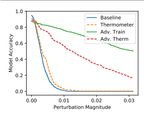
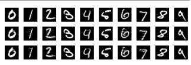

# Obfuscated Gradients Give A False Sense Of Security: Circumventing Defenses To Adversarial Examples

Anish Athalye * 1 **Nicholas Carlini** * 2 **David Wagner** 2

## Abstract

We identify obfuscated gradients, a kind of gradient masking, as a phenomenon that leads to a false sense of security in defenses against adversarial examples. While defenses that cause obfuscated gradients appear to defeat iterative optimizationbased attacks, we find defenses relying on this effect can be circumvented. We describe characteristic behaviors of defenses exhibiting the effect, and for each of the three types of obfuscated gradients we discover, we develop attack techniques to overcome it. In a case study, examining noncertified white-box-secure defenses at ICLR 2018, we find obfuscated gradients are a common occurrence, with 7 of 9 defenses relying on obfuscated gradients. Our new attacks successfully circumvent 6 completely, and 1 partially, in the original threat model each paper considers.

## 1. Introduction

In response to the susceptibility of neural networks to adversarial examples (Szegedy et al., 2013; Biggio et al., 2013),
there has been significant interest recently in constructing defenses to increase the robustness of neural networks. While progress has been made in understanding and defending against adversarial examples in the white-box setting, where the adversary has full access to the network, a complete solution has not yet been found.

As benchmarking against iterative optimization-based attacks (e.g., Kurakin et al. (2016a); Madry et al. (2018);
Carlini & Wagner (2017c)) has become standard practice in evaluating defenses, new defenses have arisen that appear to be robust against these powerful optimization-based attacks.

We identify one common reason why many defenses provide

*Equal contribution 1Massachusetts Institute of Technology 2University of California, Berkeley. Correspondence to: Anish Athalye <aathalye@mit.edu>, Nicholas Carlini
<npc@berkeley.edu>.

Proceedings of the 35 th International Conference on Machine Learning, Stockholm, Sweden, PMLR 80, 2018. Copyright 2018 by the author(s).
apparent robustness against iterative optimization attacks:
obfuscated gradients, a term we define as a special case of gradient masking (Papernot et al., 2017). Without a good gradient, where following the gradient does not successfully optimize the loss, iterative optimization-based methods cannot succeed. We identify three types of obfuscated gradients:
shattered gradients are nonexistent or incorrect gradients caused either intentionally through non-differentiable operations or unintentionally through numerical instability; stochastic gradients depend on test-time randomness; and vanishing/exploding gradients in very deep computation result in an unusable gradient.

We propose new techniques to overcome obfuscated gradients caused by these three phenomena. We address gradient shattering with a new attack technique we call Backward Pass Differentiable Approximation, where we approximate derivatives by computing the forward pass normally and computing the backward pass using a differentiable approximation of the function. We compute gradients of randomized defenses by applying Expectation Over Transformation (Athalye et al., 2017). We solve vanishing/exploding gradients through reparameterization and optimize over a space where gradients do not explode/vanish.

To investigate the prevalence of obfuscated gradients and understand the applicability of these attack techniques, we use as a case study the ICLR 2018 non-certified defenses that claim white-box robustness. We find that obfuscated gradients are a common occurrence, with 7 of 9 defenses relying on this phenomenon. Applying the new attack techniques we develop, we overcome obfuscated gradients and circumvent 6 of them completely, and 1 partially, under the original threat model of each paper. Along with this, we offer an analysis of the evaluations performed in the papers.

Additionally, we hope to provide researchers with a common baseline of knowledge, description of attack techniques, and common evaluation pitfalls, so that future defenses can avoid falling vulnerable to these same attack approaches.

To promote reproducible research, we release our reimplementation of each of these defenses, along with implementations of our attacks for each. 1 1https://github.com/anishathalye/obfuscated-gradients

## 2. Preliminaries 2.1. Notation

We consider a neural network f(·) used for classification where f(x)i represents the probability that image x corresponds to label i. We classify images, represented as x ∈ [0, 1]w·h·cfor a c-channel image of width w and height h. We use f j(·) to refer to layer j of the neural network, and f 1..j (·) the composition of layers 1 through j. We denote the classification of the network as c(x) = arg maxi f(x)i, and c
∗(x) denotes the true label.

## 2.2. Adversarial Examples

Given an image x and classifier f(·), an adversarial example
(Szegedy et al., 2013) x 0satisfies two properties: D(*x, x*0)
is small for some distance metric D, and c(x 0) 6= c
∗(x).

That is, for images, x and x 0appear visually similar but x 0 is classified incorrectly.

In this paper, we use the `∞ and `2 distortion metrics to measure similarity. Two images which have a small distortion under either of these metrics will appear visually identical.

We report `∞ distance in the normalized [0, 1] space, so that a distortion of 0.031 corresponds to 8/256, and `2 distance as the total root-mean-square distortion normalized by the total number of pixels (as is done in prior work).

## 2.3. Datasets & Models

We evaluate these defenses on the same datasets on which they claim robustness. If a defense argues security on MNIST and any other dataset, we only evaluate the defense on the larger dataset. On MNIST and CIFAR-10, we evaluate defenses over the entire test set and generate untargeted adversarial examples.

On ImageNet, we evaluate over 1000 randomly selected images in the test set, construct *targeted* adversarial examples with randomly selected target classes, and report attack success rate in addition to model accuracy. Generating targeted adversarial examples is a strictly harder problem that we believe is a more meaningful metric for evaluating attacks. 2 Conversely, for a defender, the harder task is to argue robustness to untargeted attacks.

We use standard models for each dataset. For MNIST we use a standard 5-layer convolutional neural network which reaches 99.3% accuracy. On CIFAR-10 we train a wide ResNet (Zagoruyko & Komodakis, 2016; He et al., 2016)
to 95% accuracy. For ImageNet we use the InceptionV3
(Szegedy et al., 2016) network which reaches 78.0% top-1 and 93.9% top-5 accuracy.

2Misclassification is a less meaningful metric on ImageNet, where a misclassification of closely related classes (e.g., a German shepherd classified as a Doberman) may not be meaningful.

## 2.4. Threat Models

Prior work considers adversarial examples in white-box and black-box threat models. In this paper, we consider defenses designed for the *white-box* setting, where the adversary has full access to the neural network classifier (architecture and weights) and defense, but not test-time randomness (only the distribution). We evaluate each defense under the threat model under which it claims to be secure (e.g., bounded `∞
distortion of  = 0.031). It often easy to find imperceptibly perturbed adversarial examples by violating the threat model, but by doing so under the original threat model, we show that the original evaluations were inadequate and the claims of defenses' security were incorrect.

## 2.5. Attack Methods

We construct adversarial examples with iterative optimization-based methods. For a given instance x, these attacks attempt to search for a δ such that c(x + δ) 6= c
∗(x) either minimizing kδk, or maximizing the classification loss on f(x + δ). To generate `∞ bounded adversarial examples we use Projected Gradient Descent
(PGD) confined to a specified `∞ ball; for `2, we use the Lagrangian relaxation of Carlini & Wagner (2017c). We use between 100 and 10,000 iterations of gradient descent, as needed to obtain convergance. The specific choice of optimizer is far less important than choosing to use iterative optimization-based methods (Madry et al., 2018).

## 3. Obfuscated Gradients

A defense is said to cause *gradient masking* if it "does not have useful gradients" for generating adversarial examples (Papernot et al., 2017); gradient masking is known to be an incomplete defense to adversarial examples (Papernot et al., 2017; Tramer et al. ` , 2018). Despite this, we observe that 7 of the ICLR 2018 defenses rely on this effect.

To contrast from previous defenses which cause gradient masking by learning to break gradient descent (e.g., by learning to make the gradients point the wrong direction (Tramer`
et al., 2018)), we refer to the case where defenses are *designed* in such a way that the constructed defense necessarily causes gradient masking as *obfuscated gradients*. We discover three ways in which defenses obfuscate gradients (we use this word because in these cases, it is the defense creator who has obfuscated the gradient information); we briefly define and discuss each of them.

Shattered Gradients are caused when a defense is nondifferentiable, introduces numeric instability, or otherwise causes a gradient to be *nonexistent or incorrect*. Defenses that cause gradient shattering can do so unintentionally, by using differentiable operations but where following the gradient does not maximize classification loss globally.

Stochastic Gradients are caused by randomized defenses, where either the network itself is randomized or the input is randomly transformed before being fed to the classifier, causing the gradients to become randomized. This causes methods using a single sample of the randomness to incorrectly estimate the true gradient.

Exploding & Vanishing Gradients are often caused by defenses that consist of multiple iterations of neural network evaluation, feeding the output of one computation as the input of the next. This type of computation, when unrolled, can be viewed as an extremely deep neural network evaluation, which can cause vanishing/exploding gradients.

## 3.1. Identifying Obfuscated & Masked Gradients

Some defenses intentionally break gradient descent and cause obfuscated gradients. However, others defenses *unintentionally* break gradient descent, but the cause of gradient descent being broken is a direct result of the design of the neural network. We discuss below characteristic behaviors of defenses which cause this to occur. These behaviors may not perfectly characterize all cases of masked gradients. One-step attacks perform better than iterative attacks.

Iterative optimization-based attacks applied in a white-box setting are strictly stronger than single-step attacks and should give strictly superior performance. If single-step methods give performance superior to iterative methods, it is likely that the iterative attack is becoming stuck in its optimization search at a local minimum. Black-box attacks are better than white-box attacks.

The black-box threat model is a strict subset of the whitebox threat model, so attacks in the white-box setting should perform better; if a defense is obfuscating gradients, then black-box attacks (which do not use the gradient) often perform better than white-box attacks (Papernot et al., 2017).

Unbounded attacks do not reach 100% success. With unbounded distortion, any classifier should have 0% robustness to attack. If an attack does not reach 100% success with sufficiently large distortion bound, this indicates the attack is not performing optimally against the defense, and the attack should be improved.

Random sampling finds adversarial examples. Bruteforce random search (e.g., randomly sampling 105 or more points) within some -ball should not find adversarial examples when gradient-based attacks do not.

Increasing distortion bound does not increase success.

A larger distortion bound should monotonically increase attack success rate; significantly increasing distortion bound should result in significantly higher attack success rate.

## 4. Attack Techniques

Generating adversarial examples through optimizationbased methods requires useful gradients obtained through backpropagation (Rumelhart et al., 1986). Many defenses therefore either intentionally or unintentionally cause gradient descent to fail because of obfuscated gradients caused by gradient shattering, stochastic gradients, or vanishing/exploding gradients. We discuss a number of techniques that we develop to overcome obfuscated gradients.

## 4.1. Backward Pass Differentiable Approximation

Shattered gradients, caused either unintentionally, e.g. by numerical instability, or intentionally, e.g. by using nondifferentiable operations, result in nonexistent or incorrect gradients. To attack defenses where gradients are not readily available, we introduce a technique we call Backward Pass Differentiable Approximation (BPDA) 3.

## 4.1.1. A Special Case: The Straight-Through Estimator

As a special case, we first discuss what amounts to the straight-through estimator (Bengio et al., 2013) applied to constructing adversarial examples.

Many non-differentiable defenses can be expressed as follows: given a pre-trained classifier f(·), construct a preprocessor g(·) and let the secured classifier ˆf(x) = f(g(x))
where the preprocessor g(·) satisfies g(x) ≈ x (e.g., such a g(·) may perform image denoising to remove the adversarial perturbation, as in Guo et al. (2018)). If g(·) is smooth and differentiable, then computing gradients through the combined network ˆf is often sufficient to circumvent the defense (Carlini & Wagner, 2017b). However, recent work has constructed functions g(·) which are neither smooth nor differentiable, and therefore can not be backpropagated through to generate adversarial examples with a white-box attack that requires gradient signal.

Because g is constructed with the property that g(x) ≈ x, we can approximate its derivative as the derivative of the identity function: ∇xg(x) ≈ ∇xx = 1. Therefore, we can approximate the derivative of f(g(x)) at the point xˆ as:

## ∇Xf(G(X))|X=ˆX ≈ ∇Xf(X)|X=G(ˆX)

This allows us to compute gradients and therefore mount a white-box attack. Conceptually, this attack is simple. We perform forward propagation through the neural network as usual, but on the backward pass, we replace g(·) with the identity function. In practice, the implementation can be expressed in an even simpler way: we approximate ∇xf(g(x))
by evaluating ∇xf(x) at the point g(x). This gives us an 3The BPDA approach can be used on an arbitrary network, even if it is already differentiable, to obtain a more useful gradient.

approximation of the true gradient, and while not perfect, is sufficiently useful that when averaged over many iterations of gradient descent still generates an adversarial example.

The math behind the validity of this approach is similar to the special case.

## 4.1.2. Generalized Attack: Bpda

While the above attack is effective for a simple class of networks expressible as f(g(x)) when g(x) ≈ x, it is not fully general. We now generalize the above approach into our full attack, which we call Backward Pass Differentiable Approximation (BPDA).

Let f(·) = f 1*...j* (·) be a neural network, and let f i(·) be a non-differentiable (or not usefully-differentiable) layer. To approximate ∇xf(x), we first find a differentiable approximation g(x) such that g(x) ≈ f i(x). Then, we can approximate ∇xf(x) by performing the forward pass through f(·)
(and in particular, computing a forward pass through f i(x)),
but on the backward pass, replacing f i(x) with g(x). Note that we perform this replacement only on the backward pass.

As long as the two functions are similar, we find that the slightly inaccurate gradients still prove useful in constructing an adversarial example. Applying BPDA often requires more iterations of gradient descent than without because each individual gradient descent step is not exactly correct.

We have found applying BPDA is often necessary: replacing f i(·) with g(·) on both the forward and backward pass is either completely ineffective (e.g. with Song et al. (2018)) or many times less effective (e.g. with Buckman et al. (2018)).

## 4.2. Attacking Randomized Classifiers

Stochastic gradients arise when using randomized transformations to the input before feeding it to the classifier or when using a stochastic classifier. When using optimizationbased attacks on defenses that employ these techniques, it is necessary to estimate the gradient of the stochastic function.

Expectation over Transformation. For defenses that employ randomized transformations to the input, we apply Expectation over Transformation (EOT) (Athalye et al., 2017)
to correctly compute the gradient over the expected transformation to the input.

When attacking a classifier f(·) that first randomly transforms its input according to a function t(·) sampled from a distribution of transformations T, EOT optimizes the expectation over the transformation Et∼T f(t(x)). The optimization problem can be solved by gradient descent, noting that
∇Et∼T f(t(x)) = Et∼T ∇f(t(x)), differentiating through the classifier and transformation, and approximating the expectation with samples at each gradient descent step.

## 4.3. Reparameterization

We solve vanishing/exploding gradients by reparameterization. Assume we are given a classifier f(g(x)) where g(·)
performs some optimization loop to transform the input x to a new input xˆ. Often times, this optimization loop means that differentiating through g(·), while possible, yields exploding or vanishing gradients.

To resolve this, we make a change-of-variable x = h(z)
for some function h(·) such that g(h(z)) = h(z) for all z, but h(·) is differentiable. For example, if g(·) projects samples to some manifold in a specific manner, we might construct h(z) to return points exclusively on the manifold.

This allows us to compute gradients through f(h(z)) and thereby circumvent the defense.

## 5. Case Study: Iclr 2018 Defenses

As a case study for evaluating the prevalence of obfuscated gradients, we study the ICLR 2018 non-certified defenses that argue robustness in a white-box threat model. Each of these defenses argues a high robustness to adaptive, whitebox attacks. We find that seven of these nine defenses rely on this phenomenon, and we demonstrate that our techniques can completely circumvent six of those (and partially circumvent one) that rely on obfuscated gradients. We omit two defenses with provable security claims (Raghunathan et al., 2018; Sinha et al., 2018) and one that only argues black-box security (Tramer et al. ` , 2018). We include one paper, Ma et al. (2018), that was not proposed as a defense per se, but suggests a method to detect adversarial examples.

There is an asymmetry in attacking defenses versus constructing robust defenses: to show a defense can be bypassed, it is only necessary to demonstrate one way to do so; in contrast, a defender must show no attack can succeed.

Table 1 summarizes our results. Of the 9 accepted papers, 7 rely on obfuscated gradients. Two of these defenses argue robustness on ImageNet, a much harder task than CIFAR-10; and one argues robustness on MNIST, a much easier task than CIFAR-10. As such, comparing defenses across datasets is difficult.

## 5.1. Non-Obfuscated Gradients 5.1.1. Adversarial Training

Defense Details. Originally proposed by Goodfellow et al. (2014b), adversarial training solves a min-max game through a conceptually simple process: train on adversarial examples until the model learns to classify them correctly.

Given training data X and loss function `(·), standard training chooses network weights θ as

$$\theta^{*}=\operatorname*{arg\,min}_{\theta}\quad\operatorname*{\mathbb{E}}_{(x,y)\in{\mathcal{X}}}\ell(x;y;F_{\theta}).$$

| Defense                    | Dataset   | Distance   | Accuracy   |            |       |
|----------------------------|-----------|------------|------------|------------|-------|
| Buckman et al. (2018)      | CIFAR     | 0.031 (`∞) | 0%∗        |            |       |
| Ma et al. (2018)           | CIFAR     | 0.031 (`∞) | 5%         |            |       |
| Guo et al. (2018)          | ImageNet  | 0.005 (`2) | 0%∗        |            |       |
| Dhillon et al. (2018)      | CIFAR     | 0.031 (`∞) | 0%         |            |       |
| Xie et al. (2018)          | ImageNet  | 0.031 (`∞) | 0%∗        |            |       |
| Song et al. (2018)         | CIFAR     | 0.031 (`∞) | 9%∗        |            |       |
| Samangouei                 | et        | al.        | MNIST      | 0.005 (`2) | 55%∗∗ |
| (2018) Madry et al. (2018) | CIFAR     | 0.031 (`∞) | 47%        |            |       |
| Na et al. (2018)           | CIFAR     | 0.015 (`∞) | 15%        |            |       |

Table 1. **Summary of Results:** Seven of nine defense techniques accepted at ICLR 2018 cause obfuscated gradients and are vulnerable to our attacks. Defenses denoted with ∗ propose combining adversarial training; we report here the defense alone, see §5 for full numbers. The fundamental principle behind the defense denoted with ∗∗ has 0% accuracy; in practice, imperfections cause the theoretically optimal attack to fail, see §5.4.2 for details.

We study the adversarial training approach of Madry et al.

(2018) which for a given -ball solves

$$\theta^{*}=\operatorname*{arg\,min}_{\theta}\;\;\mathbb{E}_{(x,y)\in\mathcal{X}}\left[\operatorname*{max}_{\delta\in[-\epsilon,\epsilon]^{N}}\ell(x+\delta;y;F_{\theta})\right].$$

To approximately solve this formulation, the authors solve the inner maximization problem by generating adversarial examples using projected gradient descent.

Discussion. We believe this approach does not cause obfuscated gradients: our experiments with optimizationbased attacks do succeed with some probability (but do not invalidate the claims in the paper). Further, the authors' evaluation of this defense performs all of the tests for characteristic behaviors of obfuscated gradients that we list. However, we note that (1) adversarial retraining has been shown to be difficult at ImageNet scale (Kurakin et al., 2016b),
and (2) training exclusively on `∞ adversarial examples provides only limited robustness to adversarial examples under other distortion metrics (Sharma & Chen, 2017).

## 5.1.2. Cascade Adversarial Training

Cascade adversarial machine learning (Na et al., 2018) is closely related to the above defense. The main difference is that instead of using iterative methods to generate adversarial examples at each mini-batch, the authors train a first model, generate adversarial examples (with iterative methods) on that model, add these to the training set, and then train a second model on the augmented dataset only single-step methods for efficiency. Additionally, the authors construct a "unified embedding" and enforce that the clean and adversarial logits are close under some metric.

Discussion. Again, as above, we are unable to reduce the claims made by the authors. However, these claims are weaker than other defenses (because the authors correctly performed a strong optimization-based attack (Carlini &
Wagner, 2017c)): 16% accuracy with  = .015, compared to over 70% at the same perturbation budget with adversarial training as in Madry et al. (2018).

## 5.2. Gradient Shattering 5.2.1. Thermometer Encoding

Defense Details. In contrast to prior work (Szegedy et al., 2013) which viewed adversarial examples as "blind spots" in neural networks, Goodfellow et al. (2014b) argue that the reason adversarial examples exist is that neural networks behave in a largely linear manner. The purpose of thermometer encoding is to break this linearity.

Given an image x, for each pixel color x*i,j,c*, the l-level thermometer encoding τ (x*i,j,c*) is a l-dimensional vector where τ (x*i,j,c*)k = 1 if if xi,j,c *> k/l*, and 0 otherwise (e.g., for a 10-level thermometer encoding, τ (0.66) = 1111110000).

Due to the discrete nature of thermometer encoded values, it is not possible to directly perform gradient descent on a thermometer encoded neural network. The authors therefore construct Logit-Space Projected Gradient Ascent
(LS-PGA) as an attack over the discrete thermometer encoded inputs. Using this attack, the authors perform the adversarial training of Madry et al. (2018) on thermometer encoded networks. On CIFAR-10, just performing thermometer encoding was found to give 50% accuracy within  = 0.031 under `∞
distortion. By performing adversarial training with 7 steps of LS-PGA, robustness increased to 80%.

Discussion. While the intention behind this defense is to break the local linearity of neural networks, we find that this defense in fact causes gradient shattering. This can be observed through their black-box attack evaluation: adversarial examples generated on a standard adversarially trained model transfer to a thermometer encoded model reducing the accuracy to 67%, well below the 80% robustness to the white-box iterative attack.

Evaluation. We use the BPDA approach from §4.1.2, where we let f(x) = τ (x). Observe that if we define

$${\hat{\tau}}(x_{i,j,c})_{k}=\operatorname*{min}(\operatorname*{max}(x_{i,j,c}-k/l,0),1)$$
then
$$\tau(x_{i,j,c})_{k}=\operatorname{floor}({\hat{\tau}}(x_{i,j,c})_{k})$$

so we can let g(x) = ˆτ (x) and replace the backwards pass with the function g(·).

Figure 1. Model accuracy versus distortion (under `∞). Adversarial training increases robustness to 50% at  = 0.031; thermometer encoding by itself provides limited value, and when coupled with adversarial training performs worse than adversarial training alone.
LS-PGA only reduces model accuracy to 50% on a thermometer-encoded model trained *without* adversarial training (bounded by  = 0.031). In contrast, we achieve 1% model accuracy with the lower  = 0.015 (and 0% with
 = 0.031). This shows no measurable improvement from standard models, trained without thermometer encoding.

When we attack a thermometer-encoded adversarially trained model 4, we are able to reproduce the 80% accuracy at  = 0.031 claim against LS-PGA. However, our attack reduces model accuracy to 30%. This is significantly weaker than the original Madry et al. (2018) model that does not use thermometer encoding. Because this model is trained against the (comparatively weak) LS-PGA attack, it is unable to adapt to the stronger attack we present above.

Figure 1 shows a comparison of thermometer encoding, with and without adversarial training, against the baseline classifier, over a range of perturbation magnitudes, demonstrating that thermometer encoding provides limited value.

## 5.2.2. Input Transformations

Defense Details. Guo et al. (2018) propose five input transformations to counter adversarial examples.

As a baseline, the authors evaluate *image cropping and* rescaling, *bit-depth reduction*, and *JPEG compression*.

Then the authors suggest two new transformations: (a) randomly drop pixels and restore them by performing *total* variance minimization; and (b) *image quilting*: reconstruct images by replacing small patches with patches from "clean" images, using minimum graph cuts in overlapping boundary regions to remove edge artifacts.

4That is, a thermometer encoded model that is trained using the approach of (Madry et al., 2018).

The authors explore different combinations of input transformations along with different underlying ImageNet classifiers, including adversarially trained models. They find that input transformations provide protection even with a vanilla classifier.

Discussion. The authors find that a ResNet-50 classifier provides a varying degree of accuracy for each of the five proposed input transformations under the strongest attack with a normalized `2 dissimilarity of 0.01, with the strongest defenses achieving over 60% top-1 accuracy. We reproduce these results when evaluating an InceptionV3 classifier.

The authors do not succeed in white-box attacks, crediting lack of access to test-time randomness as "particularly crucial in developing strong defenses" (Guo et al., 2018). 5 Evaluation. It is possible to bypass each defense independently (and ensembles of defenses usually are not much stronger than the strongest sub-component (He et al., 2017)).

We circumvent image cropping and rescaling with a direct application of EOT. To circumvent bit-depth reduction and JPEG compression, we use BPDA and approximate the backward pass with the identity function. To circumvent total variance minimization and image quilting, which are both non-differentiable and randomized, we apply EOT and use BPDA to approximate the gradient through the transformation. With our attack, we achieve 100% targeted attack success rate and accuracy drops to 0% for the strongest defense under the smallest perturbation budget considered in Guo et al. (2018), a root-mean-square perturbation of 0.05
(and a "normalized" `2 perturbation as defined in Guo et al.

(2018) of 0.01).

## 5.2.3. Local Intrinsic Dimensionality (Lid)

LID is a general-purpose metric that measures the distance from an input to its neighbors. Ma et al. (2018) propose using LID to characterize properties of adversarial examples.

The authors emphasize that this classifier is not intended as a defense against adversarial examples 6, however the authors argue that it is a robust method for detecting adversarial examples that is not easy to evade by attempting their own adaptive attack and showing it fails.

Analysis Overview. Instead of actively attacking the detection method, we find that LID is not able to detect high confidence adversarial examples (Carlini & Wagner, 2017a),
even in the unrealistic threat model where the adversary is entirely oblivious to the defense and generates adversarial examples on the original classifier. A full discussion of this 5This defense may be stronger in a threat model where the adversary does not have complete information about the exact quilting process used (personal communication with authors).

6Personal communication with authors.

attack is given in Appendix A.

## 5.3. Stochastic Gradients 5.3.1. Stochastic Activation Pruning (Sap)

Defense Details. SAP (Dhillon et al., 2018) introduces randomness into the evaluation of a neural network to defend against adversarial examples. SAP randomly drops some neurons of each layer f ito 0 with probability proportional to their absolute value. That is, SAP essentially applies dropout at each layer where instead of dropping with uniform probability, nodes are dropped with a weighted distribution. Values which are retained are scaled up (as is done in dropout) to retain accuracy. Applying SAP decreases clean classification accuracy slightly, with a higher drop probability decreasing accuracy, but increasing robustness. We study various levels of drop probability and find they lead to similar robustness numbers.

Discussion. The authors only evaluate SAP by taking a single step in the gradient direction (Dhillon et al., 2018).

While taking a single step in the direction of the gradient can be effective on non-randomized neural networks, when randomization is used, computing the gradient with respect to one sample of the randomness is ineffective.

Evaluation. To resolve this difficulty, we estimate the gradients by computing the expectation over instantiations of randomness. At each iteration of gradient descent, instead of taking a step in the direction of ∇xf(x) we move in the direction of Pk i=1 ∇xf(x) where each invocation is randomized with SAP. We have found that choosing k = 10 provides useful gradients. We additionally had to resolve a numerical instability when computing gradients: this defense caused computing a backward pass to cause exploding gradients due to division by numbers very close to 0.

With these approaches, we are able to reduce SAP model accuracy to 9% at  = .015, and 0% at  = 0.031. If we consider an attack successful only when an example is classified incorrectly 10 times out of 10 (and consider it correctly classified if it is ever classified as the correct label),
model accuracy is below 10% with  = 0.031.

## 5.3.2. Mitigating Through Randomization

Defense Details. Xie et al. (2018) propose to defend against adversarial examples by adding a randomization layer before the input to the classifier. For a classifier that takes a 299 × 299 input, the defense first randomly rescales the image to a r × r image, with r ∈ [299, 331), and then randomly zero-pads the image so that the result is 331×331.

The output is then fed to the classifier.

Discussion. The authors consider three attack scenarios:
vanilla attack (an attack on the original classifier), singlepattern attack (an attack assuming some fixed randomization pattern), and ensemble-pattern attack (an attack over a small ensemble of fixed randomization patterns). The authors strongest attack reduces InceptionV3 model accuracy to 32.8% top-1 accuracy (over images that were originally classified correctly).

The authors dismiss a stronger attack over larger choices of randomness, stating that it would be "computationally impossible" (emphasis ours) and that such an attack "may not even converge" (Xie et al., 2018).

Evaluation. We find the authors' ensemble attack overfits to the ensemble with fixed randomization. We bypass this defense by applying EOT, optimizing over the (in this case, discrete) distribution of transformations. Using this attack, even if we consider the attack successful only when an example is classified incorrectly 10 times out of 10, we achieve 100% targeted attack success rate and reduce the accuracy of the classifier from 32.8% to 0.0%
with a maximum `∞ perturbation of  = 0.031.

## 5.4. Vanishing & Exploding Gradients 5.4.1. Pixeldefend

Defense Details. Song et al. (2018) propose using a PixelCNN generative model to project a potential adversarial example back onto the data manifold before feeding it into a classifier. The authors argue that adversarial examples mainly lie in the low-probability region of the data distribution. PixelDefend "purifies" adversarially perturbed images prior to classification by using a greedy decoding procedure to approximate finding the highest probability example within an -ball of the input image.

Discussion. The authors evaluate PixelDefend on CIFAR-10 over various classifiers and perturbation budgets.

With a maximum `∞ perturbation of  = 0.031, PixelDefend claims 46% accuracy (with a vanilla ResNet classifier).

The authors dismiss the possibility of end-to-end attacks on PixelDefend due to the difficulty of differentiating through an unrolled version of PixelDefend due to vanishing gradients and computation cost.

Evaluation. We sidestep the problem of computing gradients through an unrolled version of PixelDefend by approximating gradients with BPDA, and we successfully mount an end-to-end attack using this technique 7. With this attack, 7In place of a PixelCNN, due to the availability of a pre-trained model, we use a PixelCNN++ (Salimans et al., 2017) and discretize the mixture of logistics to produce a 256-way softmax.

we can reduce the accuracy of a naturally trained classifier which achieves 95% accuracy to 9% with a maximum `∞
perturbation of  = 0.031. We find that combining adversarial training (Madry et al., 2018) with PixelDefend provides no additional robustness over just using the adversarially trained classifier.

## 5.4.2. Defense-Gan

Defense-GAN (Samangouei et al., 2018) uses a Generative Adversarial Network (Goodfellow et al., 2014a) to project samples onto the manifold of the generator before classifying them. That is, the intuition behind this defense is nearly identical to PixelDefend, but using a GAN instead of a PixelCNN. We therefore summarize results here and present the full details in Appendix B.

Analysis Overview. Defense-GAN is not argued secure on CIFAR-10, so we use MNIST. We find that adversarial examples exist on the manifold defined by the generator.

That is, we show that we are able to construct an adversarial example x 0 = G(z) so that x 0 ≈ x but c(x) 6= c(x 0). As such, a perfect projector would not modify this example x 0 because it exists on the manifold described by the generator.

However, while this attack would defeat a perfect projector mapping x to its nearest point on G(z), the imperfect gradient descent based approach taken by Defense-GAN does not perfectly preserve points on the manifold. We therefore construct a second attack using BPDA to evade Defense-GAN,
although at only a 45% success rate.

## 6. Discussion

Having demonstrated attacks on these seven defenses, we now take a step back and discuss the method of evaluating a defense against adversarial examples.

The papers we study use a variety of approaches in evaluating robustness of the proposed defenses. We list what we believe to be the most important points to keep in mind while building and evaluating defenses. Much of what we describe below has been discussed in prior work (Carlini &
Wagner, 2017a; Madry et al., 2018); we repeat these points here and offer our own perspective for completeness.

## 6.1. Define A (Realistic) Threat Model

A threat model specifies the conditions under which a defense argues security: a precise threat model allows for an exact understanding of the setting under which the defense is meant to work. Prior work has used words including whitebox, grey-box, *black-box*, and *no-box* to describe slightly different threat models, often overloading the same word.

Instead of attempting to, yet again, redefine the vocabulary, we enumerate the various aspects of a defense that might be revealed to the adversary or held secret to the defender:
model architecture and model weights; *training algorithm* and *training data*; test time *randomness* (either the values chosen or the distribution); and, if the model weights are held secret, whether *query access* is allowed (and if so, the type of output, e.g. logits or only the top label).

While there are some aspects of a defense that might be held secret, threat models should not contain unrealistic constraints. We believe any compelling threat model should at the very least grant knowledge of the model architecture, training algorithm, and allow query access.

It is not meaningful to restrict the computational power of an adversary artificially (e.g., to fewer than several thousand attack iterations). If two defenses are equally robust but generating adversarial examples on one takes one second and another takes ten seconds, the robustness *has not increased*.

## 6.2. Make Specific, Testable Claims

Specific, testable claims in a clear threat model precisely convey the claimed robustness of a defense. For example, a complete claim might be: "We achieve 90% accuracy when bounded by `∞ distortion with  = 0.031, when the attacker has full white-box access."
In this paper, we study all papers under the threat model the authors define. However, if a paper is evaluated under a *different* threat model, explicitly stating so makes it clear that the original paper's claims are not being violated.

A defense being specified completely, with all hyperparameters given, is a prerequisite for claims to be testable.

Releasing source code and a pre-trained model along with the paper describing a specific threat model and robustness claims is perhaps the most useful method of making testable claims. At the time of writing this paper, four of the defenses we study made complete source code available (Madry et al.,
2018; Ma et al., 2018; Guo et al., 2018; Xie et al., 2018).

## 6.3. Evaluate Against Adaptive Attacks

A strong defense is robust *not only* against existing attacks, but *also* against future attacks within the specified threat model. A necessary component of any defense proposal is therefore an attempt at an adaptive attack.

An *adaptive attack* is one that is constructed *after* a defense has been completely specified, where the adversary takes advantage of knowledge of the defense and is only restricted by the threat model. One useful attack approach is to perform many attacks and report the mean over the best attack *per image*. That is, for a set of attacks a ∈ A instead of reporting the value min a∈A
mean x∈A
f(a(x)) report mean x∈A
min a∈A
f(a(x)).

If a defense is modified after an evaluation, an adaptive attack is one that considers knowledge of the new defense.

In this way, concluding an evaluation with a final adaptive attack can be seen as analogous to evaluating a model on the test data.

## 7. Conclusion

Constructing defenses to adversarial examples requires defending against not only existing attacks but also future attacks that may be developed. In this paper, we identify obfuscated gradients, a phenomenon exhibited by certain defenses that makes standard gradient-based methods fail to generate adversarial examples. We develop three attack techniques to bypass three different types of obfuscated gradients. To evaluate the applicability of our techniques, we use the ICLR 2018 defenses as a case study, circumventing seven of nine accepted defenses.

More generally, we hope that future work will be able to avoid relying on obfuscated gradients (and other methods that only prevent gradient descent-based attacks) for perceived robustness, and use our evaluation approach to detect when this occurs. Defending against adversarial examples is an important area of research and we believe performing a careful, thorough evaluation is a critical step that can not be overlooked when designing defenses.

## Acknowledgements

We are grateful to Aleksander Madry, Andrew Ilyas, and Aditi Raghunathan for helpful comments on an early draft of this paper. We thank Bo Li, Xingjun Ma, Laurens van der Maaten, Aurko Roy, Yang Song, and Cihang Xie for useful discussion and insights on their defenses.

This work was partially supported by the National Science Foundation through award CNS-1514457, Qualcomm, and the Hewlett Foundation through the Center for Long-Term Cybersecurity.

## References

Amsaleg, L., Chelly, O., Furon, T., Girard, S., Houle, M. E.,
Kawarabayashi, K.-i., and Nett, M. Estimating local intrinsic dimensionality. In *Proceedings of the 21th ACM*
SIGKDD International Conference on Knowledge Discovery and Data Mining, pp. 29–38. ACM, 2015.

Athalye, A., Engstrom, L., Ilyas, A., and Kwok, K. Synthesizing robust adversarial examples. arXiv preprint arXiv:1707.07397, 2017.

Bengio, Y., Leonard, N., and Courville, A. Estimating or ´
propagating gradients through stochastic neurons for conditional computation. *arXiv preprint arXiv:1308.3432*,
2013.

Biggio, B., Corona, I., Maiorca, D., Nelson, B., Srndi ˇ c, N., ´
Laskov, P., Giacinto, G., and Roli, F. Evasion attacks against machine learning at test time. In *Joint European* Conference on Machine Learning and Knowledge Discovery in Databases, pp. 387–402. Springer, 2013.

Buckman, J., Roy, A., Raffel, C., and Goodfellow, I. Thermometer encoding: One hot way to resist adversarial examples. *International Conference on Learning Representations*, 2018. URL https://openreview.net/
forum?id=S18Su--CW. accepted as poster.

Carlini, N. and Wagner, D. Adversarial examples are not easily detected: Bypassing ten detection methods. *AISec*,
2017a.

Carlini, N. and Wagner, D. Magnet and "efficient defenses against adversarial attacks" are not robust to adversarial examples. *arXiv preprint arXiv:1711.08478*, 2017b.

Carlini, N. and Wagner, D. Towards evaluating the robustness of neural networks. In IEEE Symposium on Security
& Privacy, 2017c.

Dhillon, G. S., Azizzadenesheli, K., Bernstein, J. D., Kossaifi, J., Khanna, A., Lipton, Z. C., and Anandkumar, A. Stochastic activation pruning for robust adversarial defense. *International Conference on Learning Representations*, 2018. URL https://openreview.net/
forum?id=H1uR4GZRZ. accepted as poster.

Goodfellow, I., Pouget-Abadie, J., Mirza, M., Xu, B.,
Warde-Farley, D., Ozair, S., Courville, A., and Bengio, Y. Generative adversarial nets. In Advances in neural information processing systems, pp. 2672–2680, 2014a.

Goodfellow, I. J., Shlens, J., and Szegedy, C. Explaining and harnessing adversarial examples. arXiv preprint arXiv:1412.6572, 2014b.

Gulrajani, I., Ahmed, F., Arjovsky, M., Dumoulin, V., and Courville, A. Improved training of wasserstein gans. arXiv preprint arXiv:1704.00028, 2017.

Guo, C., Rana, M., Cisse, M., and van der Maaten, L. Countering adversarial images using input transformations.

International Conference on Learning Representations, 2018. URL https://openreview.net/forum?

id=SyJ7ClWCb. accepted as poster.

He, K., Zhang, X., Ren, S., and Sun, J. Deep residual learning for image recognition. In *Proceedings of the IEEE*
conference on computer vision and pattern recognition, pp. 770–778, 2016.

He, W., Wei, J., Chen, X., Carlini, N., and Song, D. Adversarial example defenses: Ensembles of weak defenses are not strong. *arXiv preprint arXiv:1706.04701*, 2017.

Ilyas, A., Jalal, A., Asteri, E., Daskalakis, C., and Dimakis, A. G. The robust manifold defense: Adversarial training using generative models. arXiv preprint arXiv:1712.09196, 2017.

Samangouei, P., Kabkab, M., and Chellappa, R. Defensegan: Protecting classifiers against adversarial attacks using generative models. *International Conference* on Learning Representations, 2018. URL https://
openreview.net/forum?id=BkJ3ibb0-. accepted as poster.

Kurakin, A., Goodfellow, I., and Bengio, S. Adversarial examples in the physical world. *arXiv preprint* arXiv:1607.02533, 2016a.

Sharma, Y. and Chen, P.-Y. Attacking the madry defense model with L1-based adversarial examples. *arXiv* preprint arXiv:1710.10733, 2017.

Kurakin, A., Goodfellow, I. J., and Bengio, S. Adversarial machine learning at scale. *arXiv preprint* arXiv:1611.01236, 2016b.

Sinha, A., Namkoong, H., and Duchi, J. Certifiable distributional robustness with principled adversarial training.

International Conference on Learning Representations, 2018. URL https://openreview.net/forum? id=Hk6kPgZA-.

Ma, X., Li, B., Wang, Y., Erfani, S. M., Wijewickrema, S.,
Schoenebeck, G., Houle, M. E., Song, D., and Bailey, J.

Characterizing adversarial subspaces using local intrinsic dimensionality. International Conference on Learning Representations, 2018. URL https://openreview.

net/forum?id=B1gJ1L2aW. accepted as oral presentation.

Song, Y., Kim, T., Nowozin, S., Ermon, S., and Kushman, N. Pixeldefend: Leveraging generative models to understand and defend against adversarial examples.

International Conference on Learning Representations, 2018. URL https://openreview.net/forum? id=rJUYGxbCW. accepted as poster.

Madry, A., Makelov, A., Schmidt, L., Tsipras, D., and Vladu, A. Towards deep learning models resistant to adversarial attacks. International Conference on Learning Representations, 2018. URL https://openreview.

net/forum?id=rJzIBfZAb. accepted as poster.

Szegedy, C., Zaremba, W., Sutskever, I., Bruna, J., Erhan, D., Goodfellow, I., and Fergus, R. Intriguing properties of neural networks. *ICLR*, 2013.

Szegedy, C., Vanhoucke, V., Ioffe, S., Shlens, J., and Wojna, Z. Rethinking the inception architecture for computer vision. In *Proceedings of the IEEE Conference on Computer Vision and Pattern Recognition*, pp. 2818–2826, 2016.

Na, T., Ko, J. H., and Mukhopadhyay, S. Cascade adversarial machine learning regularized with a unified embedding. In *International Conference on Learning Representations*, 2018. URL https://openreview.net/
forum?id=HyRVBzap-.

Tramer, F., Kurakin, A., Papernot, N., Goodfellow, I., `
Boneh, D., and McDaniel, P. Ensemble adversarial training: Attacks and defenses. *International Conference* on Learning Representations, 2018. URL https://
openreview.net/forum?id=rkZvSe-RZ. accepted as poster.

Papernot, N., McDaniel, P., Goodfellow, I., Jha, S., Celik, Z. B., and Swami, A. Practical black-box attacks against machine learning. In Proceedings of the 2017 ACM on Asia Conference on Computer and Communications Security, ASIA CCS '17, pp. 506–519, New York, NY, USA, 2017. ACM. ISBN 978-1-4503-4944-4. doi:
10.1145/3052973.3053009. URL http://doi.acm.

org/10.1145/3052973.3053009.

Xie, C., Wang, J., Zhang, Z., Ren, Z., and Yuille, A. Mitigating adversarial effects through randomization. *International Conference on Learning Representations*,
2018. URL https://openreview.net/forum? id=Sk9yuql0Z. accepted as poster.

Raghunathan, A., Steinhardt, J., and Liang, P. Certified defenses against adversarial examples. *International Conference on Learning Representations*, 2018. URL https:
//openreview.net/forum?id=Bys4ob-Rb.

Zagoruyko, S. and Komodakis, N. Wide residual networks.

arXiv preprint arXiv:1605.07146, 2016.

Rumelhart, D. E., Hinton, G. E., and Williams, R. J. Learning representations by back-propagating errors. *Nature*,
323:533–536, 1986.

Salimans, T., Karpathy, A., Chen, X., and Kingma, D. P.

Pixelcnn++: A pixelcnn implementation with discretized logistic mixture likelihood and other modifications. In ICLR, 2017.

## A. Local Intrinsic Dimensionality

Defense Details. The Local Intrinsic Dimensionality
(Amsaleg et al., 2015) "assesses the space-filling capability of the region surrounding a reference example, based on the distance distribution of the example to its neighbors" (Ma et al., 2018). The authors present evidence that the LID is significantly larger for adversarial examples generated by existing attacks than for normal images, and they construct a classifier that can distinguish these adversarial images from normal images. Again, the authors indicate that LID is not intended as a defense and only should be used to explore properties of adversarial examples. However, it would be natural to wonder whether it would be effective as a defense, so we study its robustness; our results confirm that it is not adequate as a defense. The method used to compute the LID relies on finding the k nearest neighbors, a nondifferentiable operation, rendering gradient descent based methods ineffective.

Let S be a mini-batch of N clean examples. Let ri(x)
denote the distance (under metric d(*x, y*)) between sample x and its i-th nearest neighbor in S (under metric d). Then LID can be approximated by

$$\mathrm{LID}_{d}(x)=-\left(\frac{1}{k}\sum_{i=1}^{k}\log\frac{r_{i}(x)}{r_{k}(x)}\right)^{-1}$$

where k is a defense hyperparameter the controls the number of nearest neighbors to consider. The authors use the distance function

$$d_{j}(x,y)=\left\|f^{1\cdot j}(x)-f^{1\cdot j}(y)\right\|_{\,2}$$

to measure the distance between the jth activation layers.

The authors compute a vector of LID values for each sample:

$$\overrightarrow{\mathrm{LID}}(x)=\{\mathrm{LID}_{d_{j}}(x)\}_{j=1}^{n}.$$

Finally, they compute the −−→LID(x) over the training data and adversarial examples generated on the training data, and train a logistic regression classifier to detect adversarial examples. We are grateful to the authors for releasing their complete source code.

Discussion. While LID is not a defense itself, the authors assess the ability of LID to detect different types of attacks.

Through solving the formulation

$$\operatorname*{min.}\;|x-x^{\prime}|_{2}^{2}+\alpha\left(\ell(x^{\prime})+\mathrm{LID-loss}(x^{\prime})\right)$$

the authors attempt to determine if the LID metric is a good metric for detecting adversarial examples. Here, LID-loss(·)
is a function that can be minimized to reduce the LID score.

However, the authors report that this modified attack still achieves 0% success. Because Carlini and Wagner's `2 attack is unbounded, any time the attack does not reach 100% success indicates that the attack became stuck in a local minima. When this happens, it is often possible to slightly modify the loss function and return to 100% attack success (Carlini & Wagner, 2017b).

In this case, we observe the reason that performing this type of adaptive attack fails is that gradient descent does not succeed in optimizing the LID loss, even though the LID computation is differentiable. Computing the LID term involves computing the k-nearest neighbors when computing ri(x). Minimizing the gradient of the distance to the current k-nearest neighbors is not representative of the true direction to travel in for the optimal set of k-nearest neighbors. As a consequence, we find that adversarial examples generated with gradient methods when penalizing for a high LID either (a) are not adversarial; or (b) are detected as adversarial, despite penalizing for the LID loss.

Evaluation. We now evaluate what would happen if a defense would directly apply LID to detect adversarial examples. Instead of performing gradient descent over a term that is difficult to differentiate through, we have found that generating high confidence adversarial examples (Carlini &
Wagner, 2017a) (completely oblivious to to the detector) is sufficient to fool this detector. We obtain from the authors their detector trained on both the Carlini and Wagner's `2 attack and train our own on the Fast Gradient Sign attack, both of which were found to be effective at detecting adversarial examples generated by other methods. By generating high-confidence adversarial examples minimizing `∞ distortion, we are able to reduce model accuracy to 2% success within  = 0.015. LID reports these adversarial examples are benign at a 97% rate (unmodified test data is flagged as benign with a 98% rate).

This evaluation demonstrates that the LID metric can be circumvented, and future work should carefully evaluate if building a detector relying on LID is robust to adversarial examples explicitly targeting such a detector. This work also raises questions whether a large LID is a fundamental characteristic of all adversarial examples, or whether it is a by-product of certain attacks.

## B. Defense-Gan

Defense Details. The defender first trains a Generative Adversarial Network with a generator G(z) that maps samples from a latent space (typically z ∼ N (0, 1)) to images that look like training data. Defense-GAN takes a trained classifier f(·), and to classify an input x, instead of returning f(x), returns f(arg minz |G(z) − x|). To perform this projection to the manifold, the authors take many steps of gradient descent starting from different random initializations.

Defense-GAN was not shown to be effective on CIFAR-10.

We therefore evaluate it on MNIST (where it was argued to be secure).

Discussion. In Samangouei et al. (2018), the authors construct a white-box attack by unrolling the gradient descent used during classification. Despite an unbounded `2 perturbation size, Carlini and Wagner's attack only reaches 30% misclassification rate on the most vulnerable model and under 5% on the strongest. This leads us to believe that unrolling gradient descent breaks gradients.

Figure 2. Images on the MNIST test set. Row 1: Clean images.

Row 2: Adversarial examples on an unsecured classifier. Row 3:
Adversarial examples on Defense-GAN.

Concurrent to our work, Ilyas et al. (2017) also develop a nearly identical approach to Defense-GAN; they also find it is vulnerable to the attack we outline above, but increase the robustness further with adversarial training. We do not evaluate this extended approach.

Evaluation. We find that adversarial examples do exist on the data manifold as described by the generator G(·).

However, Defense-GAN *does not* completely project to the projection of the generator, and therefore often does not identify these adversarial examples actually on the manifold.

Evaluation B. The above attack *does not* succeed on Defense-GAN. While the adversarial examples are directly on the projection of the Generator, the projection process will actually move it off the projection.

We therefore present two evaluations. In the first, we assume that Defense-GAN were to able to perfectly project to the data manifold, and give a construction for generating adversarial examples. In the second, we take the actual implementation of Defense-GAN as it is, and perform BPDA
to generate adversarial examples with 50% success under reasonable `2 bounds.

To mount an attack on the approximate projection process, we use the BPDA attack regularized for `2 distortion. Our attack approach is identical to that of PixelDefend, except we replace the manifold projection with a PixelCNN with the manifold projection by gradient descent on the GAN.

Under these settings, we succeed at reducing model accuracy to 55% with a maximum normalized distortion of .0051 for successful attacks.

Evaluation A. Performing the manifold projection is nontrivial as an inner optimization step when generating adversarial examples. To sidestep this difficulty, we show that adversarial examples exist *directly on* the projection of the generator. That is, we construct an adversarial example x 0 = G(z
∗) so that |x − x 0| is small and c(x) 6= c(x 0).

To do this, we solve the re-parameterized formulation min. kG(z) − xk 2 2 + c · `(G(z)).

We initialize z = arg minz |G(z) − x| (also found via gradient descent). We train a WGAN using the code the authors provide (Gulrajani et al., 2017), and a MNIST CNN to 99.3% accuracy.

We run for 50k iterations of gradient descent for generating each adversarial example; this takes under one minute per instance. The unsecured classifier requires a mean `2 distortion of 0.0019 (per-pixel normalized, 1.45 un-normalized)
to fool. When we mount our attack, we require a mean distortion of 0.0027, an increase in distortion of 1.46×; see Figure 2 for examples of adversarial examples. The reason our attacks succeed with 100% success without suffering from vanishing or exploding gradients is that our gradient computation only needs to differentiate through the generator G(·) once.