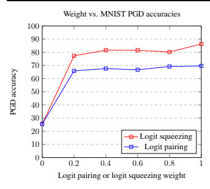

# 

Harini Kannan* 1 Alexey Kurakin 1**Ian Goodfellow** 1

## Abstract

In this paper, we develop improved techniques for defending against adversarial examples at scale. First, we implement the state of the art version of adversarial training at unprecedented scale on ImageNet and investigate whether it remains effective in this setting—an important open scientific question (Athalye et al., 2018). Next, we introduce enhanced defenses using a technique we call logit pairing, a method that encourages logits for pairs of examples to be similar. When applied to clean examples and their adversarial counterparts, logit pairing improves accuracy on adversarial examples over vanilla adversarial training; we also find that logit pairing on clean examples only is competitive with adversarial training in terms of accuracy on two datasets. Finally, we show that adversarial logit pairing achieves the **state of the art** defense on Imagenet against PGD white box attacks, with an accuracy improvement from **1.5% to 27.9%**.

Adversarial logit pairing also successfully damages the current state of the art defense against black box attacks on Imagenet (Tram`er et al.,
2018), dropping its accuracy from **66.6% to**
47.1%. With this new accuracy drop, adversarial logit pairing ties with Tram`er et al. (2018) for the state of the art on black box attacks on ImageNet.

## 1. Introduction

Many deep learning models today are vulnerable to **adversarial examples**, or inputs that have been intentionally optimized to cause misclassification. In the context of computer vision, object recognition classifiers incorrectly recognize images that have been modified with small, often

1Google Brain, Mountain View, CA, USA. Correspondence to: Harini Kannan <hkannan@google.com>, Alexey Kurakin <kurakin@google.com>, Ian Goodfellow <goodfellow@google.com>.

*Work done as a member of the Google Brain Residency program (g.co/brainresidency)
imperceptible perturbations. It is important to develop models that are robust to adversarial perturbations for a variety of reasons:
- so that machine learning can be used in situations where an attacker may attempt to interfere with the operation of the deployed system,
- so that machine learning is more useful for modelbased optimization,
- to gain a better understanding of how to provide performance guarantees for models under distribution shift,
- to gain a better understanding of how to enforce smoothness assumptions, etc.

In this paper, we investigate defenses against such adversarial attacks. The contributions of this paper are the following:
- We implement the state of the art version of adversarial training at unprecedented scale and investigate its effectiveness on the ImageNet dataset.

- We propose **logit pairing**, a method that encourages the logits for two pairs of examples to be similar. We propose two flavors of logit pairing: clean and adversarial.

- We show that **clean logit pairing** is a method with minimal computational cost that defends against PGD
black box attacks almost as well as adversarial training for two datasets.

- We show that **adversarial logit pairing** is a method that leads to higher accuracy when subjected to white box and black box attacks. We achieve the current state of the art on black-box and white-box accuracies with our model trained with adversarial logit pairing.

- We show that attacks constructed with our adversarially trained models **substantially damage** the current state of the art for black box defenses on ImageNet
(Tram`er et al., 2018). We then show that our models are resistant to these attacks.

## 2. Definitions And Threat Models

Defense mechanisms are intended to provide security under particular threat models. The threat model specifies the capabilities of the adversary. In this paper, we always assume the adversary is capable of forming attacks that consist of perturbations of limited L∞ norm. This is a simplified task chosen because it is more amenable to benchmark evaluations. Realistic attackers against computer vision systems would likely use different attacks that are difficult to characterize with norm balls, such as Brown et al. (2017). We consider two different threat models characterizing amounts of information the adversary can have:
1. **White box**: the attacker has full information about the model (i.e. knows the architecture, parameters, etc.).

2. **Black box**: the attacker has no information about the model's architecture or parameters, and no ability to send queries to the model to gather more information.

## 3. The Challenges Of Defending Imagenet Classifiers

Multiple methods to defend against adversarial examples have been proposed (Buckman et al., 2018; Goodfellow et al., 2014; Kolter & Wong, 2017; Madry et al., 2017; Papernot et al., 2016; Szegedy et al., 2013; Tram`er et al., 2018; Xu et al., 2017). Recently, Athalye et al. (2018) broke several defenses proposed for the white box setting that relied on empirical testing to establish their level of robustness. In our work we choose to focus on Madry et al. (2017) because it is a method that has withstood intense scrutiny even in the white box setting. Athalye et al. (2018) endorsed Madry et al. (2017) as the only such method that they were not able to break. However, they observe that the defense from Madry et al.

(2017) has not been shown to scale to ImageNet. There are also certified defenses (Aditi Raghunathan, 2018; Aman Sinha, 2018; Kolter & Wong, 2017) that provide guaranteed robustness, but the total amount of robustness they guarantee is small compared to the amount empirically claimed by Madry et al. (2017). This leaves Madry et al.

(2017) as a compelling defense to study because it provides a large benefit that has withstood intensive scrutiny.

In this paper, we implement the Madry et al. (2017) defense at ImageNet scale for the first time and evaluate it using the same attack methodology as has been used at smaller scale. Our results provide an important conclusive answer to an open question (Athalye et al., 2018) about whether this defense strategy scales.

The defense used by Madry et al. (2017) consists of using adversarial training (Goodfellow et al., 2014; Szegedy et al., 2013) with an attack called "projected gradient descent" (PGD). Their PGD attack consists of initializing the search for an adversarial example at a random point within the allowed norm ball, then running several iterations of the basic iterative method (Kurakin et al., 2017b) to find an adversarial example. The noisy initial point creates a stronger attack than other previous iterative methods such as BIM (Kurakin et al., 2017a), and performing adversarial training with this stronger attack makes their defense more successful (Madry et al., 2017). Kurakin et al. (2017a) earlier reported that adversarial training with (non-noisy) BIM
adversarial examples did not result in general robustness to a wide variety of attacks.

All previous attempted defenses on ImageNet
(Kurakin et al., 2017a; Tram`er et al., 2018) report **error rates of 99 percent** on strong, multi-step white box attacks. We, for the first time, scale the Madry et al.

(2017) defense to this setting and successfully apply it.

Furthermore, we also introduce an enhanced defense that greatly improves over this baseline and improves the amount of robustness achieved.

## 4. Methods 4.1. Adversarial Training

Madry et al. (2017) suggests that PGD is a universal first order adversary - in other words, developing robustness against PGD attacks also implies resistance against many other first order attacks. We use adversarial training with PGD as the underlying basis for our methods:

$$\operatorname*{arg\,min}_{\theta}\mathbb{E}_{(x,y)\in{\hat{p}}_{\mathrm{data}}}\left(\operatorname*{max}_{\delta\in S}L(\theta,x+\delta,y)\right)\qquad(1)$$

where pˆ**data** is the underlying training data distribution, L(**θ, x, y**) is a loss function at data point x which has true class y for a model with parameters θ, and the maximization with respect to δ is approximated using noisy BIM.

We find that we achieve better performance not by literally solving the min-max problem described by Madry et al.

(2017). Instead, we train on a mixture of clean and adversarial examples, as recommended by Goodfellow et al.

(2014); Kurakin et al. (2017a):

$$\operatorname*{arg\,min}_{\theta}\left[\mathbb{E}_{(x,y)\in\hat{p}_{\mathrm{data}}}\bigg(\operatorname*{max}_{\delta\in S}L(\theta,x+\delta,y)\bigg)+\right.$$ $$\left.\mathbb{E}_{(x,y)\in\hat{p}_{\mathrm{data}}}\bigg(L(\theta,x,y)\bigg)\right]\tag{2}$$

This formulation helps to maintain good accuracy on clean examples. We call this defense formulation **mixedminibatch PGD** (M-PGD). We note that though we have varied the defense slightly from the one used in Madry et al.

(2017), we still use the attack from Madry et al. (2017), which is also endorsed by Athalye et al. (2018).

## 4.2. Logit Pairing

We propose **logit pairing**, a method to encourage the logits from two images to be similar to each other. For a model that takes inputs x and computes a vector of logits z = f(x), logit pairing adds a loss

$$\lambda L\left(f(\mathbf{x}),f(\mathbf{x}^{\prime})\right)$$

for pairs of training examples x and x
′
, where λ is a coefficient determining the strength of the logit pairing penalty and L is a loss function encouraging the logits to be similar. In this paper we use L
2loss for L, but other losses such as L
1 or Huber could also be suitable choices.

We explored two logit pairing techniques which are described below. We found each of them to be useful: adversarial logit pairing obtains the best-yet defense against the Madry attack, while clean logit pairing, and a related idea we call logit squeezing, provide competitive defenses at significantly reduced cost.

## 4.2.1. Adversarial Logit Pairing

Adversarial logit pairing (ALP) matches the logits from a clean image x and its corresponding adversarial image x
′
.

In traditional adversarial training, the model is trained to assign both x and x
′
to the same output class label, but the model does not receive any information indicating that x
′
is more similar to x than to another example of the same class.

ALP provides an extra regularization term encouraging similar embeddings of the clean and adversarial versions of the same example, helping guide the model towards better internal representations of the data.

Consider a model with parameters θ trained on a minibatch M of clean examples {x
(1)**, . . . ,** x
(m)} and corresponding adversarial examples {x˜
(1)**, . . . ,** x˜
(m)}. Let f(x; θ) be the function mapping from inputs to logits of the model. Let J(M, θ) be the cost function used for adversarial training
(the cross-entropy loss applied to train the classifier on each example in the minibatch, plus any weight decay, etc.). Adversarial logit pairing consists of minimizing the loss

$$J(\mathbb{M},\pmb{\theta})+\lambda\frac{1}{m}\sum_{i=1}^{m}L\left(f(\pmb{x}^{(i)};\pmb{\theta}),f(\pmb{\bar{x}}^{(i)};\pmb{\theta})\right).$$

## 4.2.2. Clean Logit Pairing

In **clean logit pairing** (CLP), x and x
′
are two randomly selected *clean* training examples, and thus are typically not even from the same class. Let J
(clean)(M, θ) be the loss function used to train a classifier on a minibatch M, such as a cross-entropy loss and any other loss terms such as weight decay. Clean logit pairing consists of minimizing the loss

$$J^{(\mathrm{clean})}(\mathbb{M},\pmb{\theta})+\lambda\frac{2}{m}\sum_{i=1}^{\frac{m}{2}}L\left(f(\pmb{x}^{(i)};\pmb{\theta}),f(\pmb{x}^{(i+\frac{m}{2})};\pmb{\theta})\right).$$

We included experiments with clean logit pairing in order to perform an ablation study, understanding the contribution of the pairing loss itself relative to the formation of clean and adversarial pairs. To our surprise, inducing similarity between random pairs of logits led to high levels of robustness on MNIST and SVHN. This leads us to suggest clean logit pairing as a method worthy of study in its own right rather than just as a baseline. CLP is surprisingly effective and has significantly lower computation cost than adversarial training or ALP.

We note that our best results with CLP relied on adding Gaussian noise to the input during training, a standard neural network regularization technique (Sietsma & Dow, 1991).

## 4.2.3. Clean Logit Squeezing

Since clean logit pairing led to high accuracies, we hypothesized that the model was learning to predict logits of smaller magnitude and therefore being penalized for becoming overconfident. To this end, we tested penalizing the norm of the logits, which we refer to as "logit squeezing" for the rest of the paper. For MNIST, it turned out that logit squeezing gave us better results than logit pairing.

## 5. Adversarial Logit Pairing Results And Discussion 5.1. Results On Mnist

Here, we first present results with adversarial logit pairing on MNIST. We found that the exact value of the logit pairing weight did not matter too much on MNIST as long as it was roughly between 0.2 and 1. As long as *some* logit pairing was added, the accuracy on adversarial examples improved compared to vanilla adversarial training. We used a final logit pairing weight of 1 in the values reported in Table 1. A weight of 1 corresponds to weighting both the adversarial logit pairing loss and the cross-entropy loss equally.

We used the LeNet model as in Madry et al. (2017). We also used the same attack parameters they used: total adversarial perturbation of 76.5/255 (0.3), perturbation per step of 2.55/255 (0.01), and 40 total attack steps with 1 random restart. Similar to Madry et al. (2017), we generated black box examples for MNIST by independently initializing and adversarially training a copy of the LeNet model. We then used the PGD attack on this model to generate the black box examples.

| Method   | White Box   | Black Box   | Clean   |
|----------|-------------|-------------|---------|
| M-PGD    | 93.2%       | 96.0%       | 98.5%   |
| ALP      | 96.4%       | 97.5%       | 98.8%   |

Table 1. Comparison of adversarial logit pairing and vanilla adversarial training on MNIST. All accuracies reported are for the PGD
attack.

As shown in Table 1, adversarial logit pairing achieves state of the art on MNIST for the PGD attack. It improves white box accuracy from 93.2% to **96.4%**, and it improves black box accuracy from 96.0% to **97.5%**.

| Method   | White Box   | Black Box   | Clean   |
|----------|-------------|-------------|---------|
| M-PGD    | 44.4%       | 55.4%       | 96.9%   |
| ALP      | 46.9%       | 56.2%       | 96.2%   |

5.2. Results on SVHN
Table 2. Comparison of adversarial logit pairing and vanilla adversarial training on SVHN. All accuracies reported are for the PGD
attack.

Our PGD attack parameters for SVHN were as follows: a total epsilon perturbation of 12/255, a per-step epsilon of 3/255, and 10 attack iterations.

For SVHN, we used the RevNet-9 model (Gomez et al., 2017). RevNets are similar to ResNets in that they both use residual connections, have similar architectures, and get similar accuracies on multiple datasets. However, RevNets have large memory savings compared to ResNets, as their memory usage is constant and does not scale with the number of layers. Because of this, we used RevNets in order to take advantage of larger batch sizes and quicker convergence times.

Similar to MNIST, most logit pairing values from 0.5 to 1 worked, and as long as some logit pairing was added, it greatly improved accuracies. However, making the logit pairing values too large (e.g. anything larger than 2) did not lead to any benefit and was roughly the same as vanilla adversarial training. The final adversarial logit pairing weight used in Table 2 was 0.5.

## 5.3. Results On Imagenet 5.3.1. Motivation

Prior to this work, the standard baseline of PGD adversarial training had not yet been scaled to ImageNet. Kurakin et al. (2017a) showed that adversarial training with one-step attacks confers robustness to other one-step attacks, but is unable to make a difference with multi-step attacks. Training on multi-step attacks did not help either. Madry et al.

(2017) demonstrated successful defenses based on multistep *noisy* PGD adversarial training on MNIST and CIFAR10, but did not scale the process to ImageNet.

Here, we implement and scale the state of the art adversarial training method from CIFAR-10 and MNIST to ImageNet for the first time. We then implement our adversarial logit pairing method for comparison.

## 5.3.2. Implementation Details

The cost of adversarial training scales with the number of attack steps because a full round of backpropagation is performed with each step. This means that a rough estimate of the total adversarial training time of a model can be found by multiplying the total clean training time by the number of attack steps. With ImageNet, this can be especially costly without any optimizations.

To effectively scale up adversarial training with PGD to ImageNet, we implemented synchronous distributed training in Tensorflow with 53 workers: 50 were used for gradient aggregation, and 3 were left as backup replicas. Each worker had one p100 card. We experimented with asynchronous gradient updates, but we found that it led to stale gradients and poor convergence. Additionally, we used 17 parameter servers that ran on CPUs. Large batch training helped to scale up adversarial training as well: each replica had a batch size of 32, for an effective batch size of 1600 images. We found that the total time to convergence was approximately 6 days. Similar to Kurakin et al. (2017a), we use the InceptionV3 model to implement adversarial training on ImageNet in order to better compare results.

Like Szegedy et al. (2016), we used RMSProp for our optimizer, a starting learning rate of 0.045, a learning rate decay every two epochs at an exponential rate of 0.94, and momentum of 0.9.

Finally, we used the Cleverhans library (Nicolas Papernot, 2017) to implement our adversarial attacks.

## 5.3.3. Targeted Vs. Untargeted Attacks

Athalye et al. (2018) state that on ImageNet, accuracy on targeted attacks is a much more meaningful metric to use than accuracy on untargeted attacks. They state that this is because untargeted attacks can cause misclassification of very similar classes (e.g. images of two very similar dog breeds), which is not meaningful. This is consistent with observations by Kurakin et al. (2017a).

To that end, as Athalye et al. (2018) recommends, all accuracies we report on ImageNet are for targeted attacks, and all adversarial training was done with targeted attacks.

## 5.3.4. Results And Discussion

Results with adversarial logit pairing. We present our main ImageNet results in Tables 3 and 4. All accuracies reported refer to the worst case accuracies among all attacks we tried in each of the two threat models we consider
(white box and black box). We used the following attacks in our attack suite, which are all from Madry et al. (2017),
Kurakin et al. (2017a), and Tram`er et al. (2018): Step-LL, Step-Rand, R+Step-LL, R+Step-Rand, Iter-Rand, Iter-LL, PGD-Rand, and PGD-LL. The suffixes "Rand" and "LL" denote targeting a random class and targeting the least likely class, respectively. For the multi-step attacks in our suite, we varied the size of the total adversarial perturbation, the size of the perturbation per step, and the number of attack steps. Below are the maximum values of each of these sizes that we tried:
- Size of total adversarial perturbation: 16/255 on a scale of 0 to 1
- Size of total adversarial perturbation per step: 2/255 on a scale of 0 to 1
- Number of attack steps: 10 All accuracies reported are on the ImageNet validation set.

|                        | White Box   | White Box   |
|------------------------|-------------|-------------|
| Method                 | Top 1       | Top 5       |
| Regular training       | 0.7%        | 4.4 %       |
| Tram`er et al. (2018)  | 1.3%        | 6.5 %       |
| Kurakin et al. (2017a) | 1.5%        | 5.5 %       |
| M-PGD                  | 3.9%        | 10.3%       |
| ALP                    | 27.9%       | 55.4%       |

|                       | Black Box   | Black Box   |
|-----------------------|-------------|-------------|
| Method                | Top 1       | Top 5       |
| M-PGD                 | 36.5%       | 62.3%       |
| ALP                   | 46.7%       | 74.0%       |
| Tram`er et al. (2018) | 47.1%       | 74.3%       |

Table 3. Comparison of adversarial logit pairing and vanilla adversarial training on ImageNet. All accuracies reported are for **white**
box accuracy on the ImageNet validation set.

Table 4. Comparison of adversarial logit pairing and vanilla adversarial training on ImageNet. All accuracies reported are for **black**
box accuracy on the ImageNet validation set.

Damaging Ensemble Adversarial Training. Ensemble adversarial training (Tram`er et al., 2018) reported the state of the art for ImageNet black box attacks at 66.6% Top1 black box accuracy for InceptionV3. Here, we present a black box attack that significantly damages the defense proposed in Ensemble Adversarial Training.

We construct a black box attack by taking an ALP-trained ImageNet model and constructing a transfer attack with that model. Out of all of the attacks we tried, we found that the Iter-Rand attack (Kurakin et al., 2017a) was the strongest against Ensemble Adversarial Training. This attack reduces the accuracy of Ensemble Adversarial Training from 66.6% Top-1 black box accuracy to **47.1%**.

We hypothesize that the reason this attack was so strong is because it came from a model that had used multi-step adversarial training. The attacks used in Tram`er et al. (2018)
all came from models that had been trained with one or two steps of adversarial training. Black box results from Madry et al. (2017) generally show that examples from adversarially trained models are more likely to transfer to other models.

Thus, we recommend adversarial training with full iterative attacks to provide a minimal level of white box and black box robustness on ImageNet. When testing black box accuracy on ImageNet, we recommend using attacks from models that have been adversarially trained with multiple steps to get a sense of the strongest possible black box attack. Adversarial training with one step attacks (even with ensemble training) on ImageNet can be broken in both the white box and black box case.

Discussion. Firstly, our results show that PGD adversarial training can lead to convergence on ImageNet when combined with synchronous gradient updates and large batch sizes. Scaling adversarial training to ImageNet had not been previously shown before and had been an open question (Athalye et al., 2018). Multi-step adversarial training does show an improvement on white box accuracies from the previous state-of-the-art, from 1.5% to **3.9%**.

Secondly, we see that ALP further improves white box accuracy from the adversarial training baseline - showing an improvement from 3.9% to **27.9%**. Adversarial logit pairing also improves black box accuracy from the M-PGD
baseline, going from 36.5% to **47.1%**.

Finally, these results show that adversarial logit pairing achieves**state of the art on ImageNet** on white box attacks
- with a drastic 20x improvement over the previous state of the art (Kurakin et al., 2017a; Tram`er et al., 2018). We do this while still matching the black box results of Ensemble Adversarial Training, the current state-of-the-art black box defense (Tram`er et al., 2018).

We hypothesize that adversarial logit pairing works well because it provides an additional prior that regularizes the model toward a more accurate understanding of the classes.

If we train the model with only the cross-entropy loss, it is prone to learning spurious functions that fit the training distribution but have undefined behavior off the training manifold. Adversarial training adds additional information about the structure of the space. By adding an assumption that small perturbations should not change the class, regardless of direction, adversarial training introduces another prior that forces the model to select functions that have sensible behavior over a much larger region. However, adversarial training does not include any information about the relationship between a clean adversarial example and the adversarial version of the same example. In adversarial training, we might take an image of a cat, perturb it so the model thinks it is a dog, and then ask the model to still recognize the image as a cat. There is no signal to tell the model that the adversarial example is similar specifically to the individual cat image that started the process.

Adversarial logit pairing forces the explanations of a clean example and the corresponding adversarial example to be similar. This is essentially a prior encouraging the model to learn logits that are a function of the truly meaningful features in the image (position of cat ears, etc.) and ignore the features that are spurious (off-manifold directions introduced by adversarial perturbations). We can also think of the process as distilling (Hinton et al., 2015) the knowledge from the clean domain into the adversarial domain and vice versa.

Similar to the dip in clean accuracy on CIFAR-10 reported by Madry et al. (2017), we found that our models have a slight dip in clean accuracy to 72%. However, we believe this is outweighed by the large gains in adversarial accuracies.

## 5.3.5. Comparison Of Different Architectures

Model architecture plays a role in adversarial robustness
(Cubuk et al., 2017), and models with higher capacities tend to be more robust (Kurakin et al., 2017a; Madry et al.,
2017). Since ImageNet is a particularly challenging dataset, we think that studying different model architectures in conjunction with adversarial training would be valuable. In this work, we primarily studied InceptionV3 to offer better comparisons to previous literature. With the rest of our available computational resources, we were able to study an additional model (ResNet-101) to see if residual connections impacted adversarial robustness. We used ALP to train the models, and results are reported in Tables 5 and 6.

## 5.4. Clean Logit Pairing Results

We experimented with clean logit pairing on MNIST, and we found that it gave surprisingly high results on white box and black box accuracies. As mentioned in our meth-

| Method      | White Box Top 1   | White Box Top 5   |
|-------------|-------------------|-------------------|
| InceptionV3 | 27.9%             | 55.4%             |
| ResNet-101  | 30.2%             | 55.8%             |

| Method      | Black Box Top 1   | Black Box Top 5   |
|-------------|-------------------|-------------------|
| InceptionV3 | 46.7%             | 74.0%             |
| ResNet-101  | 36.0%             | 62.2%             |

Table 5. Comparison of InceptionV3 and ResNet101 on ImageNet. All accuracies reported are for **white box** accuracy on the ImageNet validation set.

| Method          | White box   | Black box   | Clean   |
|-----------------|-------------|-------------|---------|
| M-PGD           | 93.2%       | 96.0%       | 98.8%   |
| Logit squeezing | 86.4%       | 96.8%       | 99.0%   |

Table 6. Comparison of InceptionV3 and ResNet101 on ImageNet. All accuracies reported are for **black box** accuracy on the ImageNet validation set.

ods section, we augmented images with Gaussian noise first and then applied clean logit pairing or logit squeezing. Logit squeezing resulted in slightly higher PGD accuracies than CLP (detailed in Figure 1). Table 7 contains our final MNIST results on clean logit squeezing. For evaluation with PGD, we used the same attack parameters as our evaluation for adversarial logit pairing.

Table 7. Comparison of clean logit squeezing and vanilla adversarial training on MNIST. All accuracies reported are for the PGD
attack.

As Table 7 shows, clean logit squeezing is competitive with adversarial training, despite the large reduction in computational cost.

We also experimented with changing the weight of logit pairing and logit squeezing to see if it acts as a controllable parameter, and results are in Figure 1. One thing to note about Figure 1 is that simply augmenting images with Gaussian noise is enough to bring up PGD accuracy to around 25 % - about 2.5 times better than guessing at random. We would like to emphasize that the noise was added during training time, not test time. Noise and other randomized test time defenses have been shown to be broken by Athalye et al. (2018). Going from nearly 0 percent PGD accuracy to 25 percent with just Gaussian noise suggests that there could be other simple changes to training procedures that result in better robustness against attacks.

The below table reports results on SVHN with the PGD
attack. Below are the attack parameters used:

Figure 1. Varying the logit pairing weight for MNIST
- Size of total adversarial perturbation: 12/255 on a scale of 0 to 1
- Size of total adversarial perturbation per step: 3/255 on a scale of 0 to 1
- Number of attack steps: 10

| Method   | White Box   | Black Box   | Clean   |
|----------|-------------|-------------|---------|
| M-PGD    | 44.4%       | 55.4%       | 96.9%   |
| CLP      | 39.1%       | 55.8%       | 95.5%   |

Table 8. Clean logit pairing results on SVHN.

As the above tables show, clean logit pairing is competitive with adversarial training for black box results, *despite the* large reduction in computational cost. Adversarial training with multi-step attacks scales with the number of steps per attack because full backpropagation is completed with each attack step. In other words, if the normal training time of a model is N, adversarial training with k steps per attack will roughly cause the full training time of the model to be kN.

In contrast, the cost of CLP in terms of floating point operations and memory consumption is O(1) in the sense that it does not scale with the number or size of hidden layers in the model, input image size, or number of attack steps.

It does scale with the number of logits, but this is negligible compared to the other factors. Typically the number of logits is determined by the task (10 for CIFAR-10, 100 for ImageNet) and remains fixed, while other factors like model size are desirable to increase. For example, binary We hope that CLP points the way to further effective defenses that are essentially free. Defenses with low computational cost are more likely to be adopted since they require fewer resources. The future of machine learning security is much brighter if security can be accomplished without a major tradeoff against training efficiency.

classification is a common task in many real world applications like spam and fraud detection.

## 6. Comparison To Other Possible Approaches

Logit pairing is similar to two other approaches that have been previously shown to improve adversarial robustness:
label smoothing and **mixup**.

Label smoothing (Szegedy et al., 2016) consists of training a classifier using soft targets for the cross-entropy loss rather than hard targets. The correct class is given a target probability of 1 − δ and the remaining δ probability mass is divided uniformly between the incorrect classes.

This technique is somewhat related to our work because smaller logits will generally cause smoother output distributions, but note that label smoothing would be satisfied to have very large logits so long as the probabilities after normalization are smooth. Warde-Farley & Goodfellow
(2016) showed that label smoothing offers a small amount of robustness to adversarial examples, and it is included by default in the CleverHans tutorial on adversarial examples
(Nicolas Papernot, 2017).

Mixup (Zhang et al., 2017) trains the model on input points that are interpolated between training examples. At these interpolated input points, the output target is formed by similarly interpolating between the target distributions for each of the training examples. Zhang et al. (2017) reports that mixup increases robustness to adversarial examples.

| Method          | Top 1   | Top 5   |
|-----------------|---------|---------|
| Mixup           | 0.1%    | 1.5%    |
| Label smoothing | 1.6%    | 10.0%   |
| ALP             | 30.2%   | 55.8%   |

We present our results comparing adversarial logit pairing to label smoothing and mixup in Table 9. Here, we use ResNet-101 on ImageNet, and all evaluations are with PGD. We find that adversarial logit pairing provides a much stronger defense than either of these two approaches.

Table 9. White box accuracies under Madry et al. (2017) attack on ImageNet for label smoothing, mixup, and adversarial logit pairing.

Besides these related methods of defense against adversarial examples, ALP is also similar to a method of *semi-supervised learning*: virtual adversarial training
(Miyato et al., 2017). Virtual adversarial training (VAT) is a method designed to learn from *unlabeled data* by training the model to resist adversarial perturbations of unlabeled data. The goal of VAT is to reduce test error when training with a small set of labeled examples, not to cause robustness to adversarial examples. VAT consists of:
1. Construct adversarial examples by perturbing unlabeled examples 2. Specifically, make the adversarial examples by maximizing the KL divergence between the predictions on the clean examples and the predictions on the adversarial examples.

3. During model training, add a loss term that minimizes KL divergence between predictions on clean and adversarial examples.

ALP does not include (1) or (2) but does resemble (3). Both ALP and VAT encourage the full distribution of predictions on clean and adversarial examples to be similar. VAT does so using a non-symmetric loss applied to the output probabilities; ALP does so using a symmetric loss applied to the logits. During the design of our defense, we found that VAT offered an improvement over the baseline Madry model on MNIST, but ALP consistently performed better than VAT on MNIST across several hyperparameter values.

ALP also performed better than VAT with the direction of the KL flipped. We therefore focused on further developing ALP. The better performance of ALP than VAT may be due to the fact that the KL divergence can suffer from saturating gradients or it may be due to the fact that the KL divergence is invariant to a shift of all the logits for an individual example while the logit pairing loss is not. Logit pairing encourages the logits for the clean and adversarial example to be centered on the same mean logit value, which doesn't change the information in the output probabilities but may affect the learning dynamics.

## 7. Conclusion And Future Work

In conclusion, we implement adversarial training at unprecendented scale and present logit pairing as a defense.

The experiments in this paper were run on NVIDIA p100s, but with the recent availability of much more powerful hardware (NVIDIA v100s, Cloud TPUs, etc.), we believe that defenses for adversarial examples on ImageNet will become even more scalable. Specifically our contributions are:
- We introduce adversarial logit pairing (ALP), an extension to adversarial training that greatly increases its effectiveness.

- We introduce clean logit pairing and logit squeezing, low-cost alternatives to adversarial training that can increase the adoption of robust machine learning due to their requirement of very few resources.

- We demonstrate that ALP-trained models can generate attacks strong enough to significantly damage the previously state of the art Ensemble Adversarial Training defense, which was used by all 10 of the top defense teams in the NIPS 2017 competition on adversarial examples.

- We show that adversarial logit pairing achieves the state of the art defense for white box and black box attacks on ImageNet.

Our results suggest that feature pairing (matching adversarial and clean intermediate features instead of logits) may also prove useful in the future. One limitation to our defenses is that they are not currently certified or verified (there is no proof that the true robustness of the system is similar to the robustness that we measured empirically). Research into certification and verification methods (Aditi Raghunathan, 2018; Aman Sinha, 2018; Katz et al., 2017; Kolter & Wong, 2017) could make it possible to certify or verify these same networks in future work. Current certification methods do not scale to the size of models we trained here or are only able to provide tight certification bounds for models that were trained to be easy to certify using a specific certification method.

We would like to note that these defense mechanisms are not yet sufficient to secure machine learning in a real system (see many of the concerns raised by (Brown et al.,
2017) and Gilmer et al. (2018)), and that attacks could be developed against our work in the future. Here, we use ALP in conjunction with the PGD attack since it is the strongest attack presented so far, but since ALP is independent of the actual attack it is used with, it is conceivable that ALP could be used in conjunction with future attacks to develop stronger defenses. In conclusion, we present our defense as the current state of the art of research into defenses, and we believe it will serve as one step along the path to a complete defense in the future.

## Acknowledgements

- We answer the open question as to whether adversarial training scales to ImageNet.

We thank Tom Brown for helpful feedback on drafts of this article.

## References

Kolter, J Zico and Wong, Eric. Provable defenses against adversarial examples via the convex outer adversarial polytope. *arXiv preprint arXiv:1711.00851*, 2017.

Aditi Raghunathan, Jacob Steinhardt, Percy Liang. Certified defenses against adversarial examples. *International* Conference on Learning Representations, 2018. URL
https://openreview.net/forum?id=Bys4ob-Rb.

Kurakin, Alexey, Goodfellow, Ian, and Bengio, Samy. Adversarial machine learning at scale. In *ICLR 2017*, 2017a.

URL https://arxiv.org/abs/1611.01236.

Aman Sinha, Hongseok Namkoong, John Duchi.

Certifiable distributional robustness with principled adversarial training. *International Conference on Learning Representations*, 2018. URL
https://openreview.net/forum?id=Hk6kPgZA-.

Kurakin, Alexey, Goodfellow, Ian, and Bengio, Samy. Adversarial examples in the physical world. In *ICLR'2017 Workshop*, 2017b. URL
https://arxiv.org/abs/1607.02533.

Madry, A., Makelov, A., Schmidt, L., Tsipras, D., and Vladu, A. Towards deep learning models resistant to adversarial attacks. Technical report, arXiv, 2017. URL
https://arxiv.org/pdf/1706.06083.pdf.

Athalye, Anish, Carlini, Nicholas, and Wagner, David.

Obfuscated gradients give a false sense of security: Circumventing defenses to adversarial examples. Technical report, arXiv, 2018. URL
https://arxiv.org/abs/1802.00420.

Miyato, Takeru, Maeda, Shin-ichi, Koyama, Masanori, and Ishii, Shin. Virtual adversarial training: a regularization method for supervised and semi-supervised learning.

arXiv preprint arXiv:1704.03976, 2017.

Brown, Tom B, Man´e, Dandelion, Roy, Aurko, Abadi, Mart´ın, and Gilmer, Justin. Adversarial patch. arXiv preprint arXiv:1712.09665, 2017.

Nicolas Papernot, Nicholas Carlini, Ian Goodfellow Reuben Feinman Fartash Faghri Alexander Matyasko Karen Hambardzumyan Yi-Lin Juang Alexey Kurakin Ryan Sheatsley Abhibhav Garg Yen-Chen Lin. cleverhans v2.0.0: an adversarial machine learning library.

arXiv preprint arXiv:1610.00768, 2017.

Buckman, Jacob, Roy, Aurko, Raffel, Colin, and Goodfellow, Ian. Thermometer encoding: One hot way to resist adversarial examples. *ICLR*, 2018. URL
https://openreview.net/forum?id=S18Su--CW.

Cubuk, E. D., Zoph, B., Schoenholz, S., and Le, Q. Intriguing properties of adversarial examples. Technical report, arXiv, 2017. URL
https://arxiv.org/pdf/1711.02846.pdf.

Papernot, Nicolas, McDaniel, Patrick, Wu, Xi, Jha, Somesh, and Swami, Ananthram. Distillation as a defense to adversarial perturbations against deep neural networks. In *Security and Privacy (SP), 2016 IEEE Symposium on*, pp. 582–597. IEEE, 2016.

Gilmer, Justin, Metz, Luke, Faghri, Fartash, Schoenholz, Samuel S., Raghu, Maithra, Wattenberg, Martin, and Goodfellow, Ian. Adversarial spheres. In *ICLR 2018 workshop*, 2018. URL
https://arxiv.org/abs/1801.02774.

Sietsma, J. and Dow, R. Creating artificial neural networks that generalize. *Neural Networks*, 4(1):67–79, 1991.

Szegedy, Christian, Zaremba, Wojciech, Sutskever, Ilya, Bruna, Joan, Erhan, Dumitru, Goodfellow, Ian, and Fergus, Rob. Intriguing properties of neural networks. *arXiv* preprint arXiv:1312.6199, 2013.

Gomez, Aidan, Ren, Mengye, Urtasun, Raquel, and Grosse, Roger. The reversible residual network: Backpropagation without storing activations. In *NIPS 2017*, 2017.

URL https://arxiv.org/abs/1707.04585.

Szegedy, Christian, Vanhoucke, Vincent, Ioffe, Sergey, Shlens, Jon, and Wojna, Zbigniew. Rethinking the inception architecture for computer vision. In *Proceedings* of the IEEE Conference on Computer Vision and Pattern Recognition, pp. 2818–2826, 2016.

Goodfellow, Ian J, Shlens, Jonathon, and Szegedy, Christian. Explaining and harnessing adversarial examples.

arXiv preprint arXiv:1412.6572, 2014.

Hinton, Geoffrey, Vinyals, Oriol, and Dean, Jeff. Distilling the knowledge in a neural network. *arXiv preprint* arXiv:1503.02531, 2015.

Tram`er, F., Kurakin, A., Papernot, N., Boneh, D., and McDaniel, P. Ensemble adversarial training: Attacks and defenses. In *ICLR 2018*, 2018. URL
https://arxiv.org/abs/1705.07204.

Katz, Guy, Barrett, Clark, Dill, David L, Julian, Kyle, and Kochenderfer, Mykel J. Reluplex: An efficient smt solver for verifying deep neural networks. In *International Conference on Computer Aided Verification*, pp.

97–117. Springer, 2017.

Warde-Farley, David and Goodfellow, Ian. Adversarial perturbation of deep neural networks. In Hazan, Tamir, Papandreou, George, and Tarlow, Daniel (eds.), *Perturbation, Optimization, and Statistics*. MIT Press, 2016.

Xu, Weilin, Evans, David, and Qi, Yanjun. Feature squeezing: Detecting adversarial examples in deep neural networks. *arXiv preprint arXiv:1704.01155*, 2017. Zhang, H., Cisse, M., Dauphin, Y., and LopezPaz, D. Mixup: Beyond empirical risk minimization. Technical report, arXiv, 2017. URL
https://arxiv.org/pdf/1710.09412.pdf.