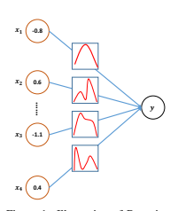
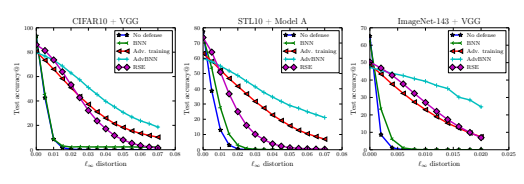
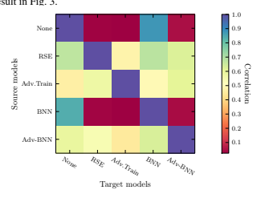
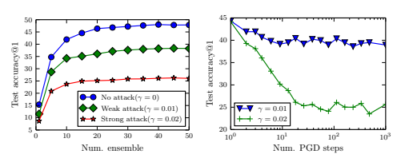

# Ad V-Bnn: Improved Adversarial Defense Through Robust Bayesian Neural Network

Xuanqing Liu1**, Yao Li**2,∗
, Chongruo Wu3,∗**& Cho-Jui Hsieh**1 1: Department of Computer Science, UCLA
{xqliu,choheish}@cs.ucla.edu 2: Department of Statistics, UC Davis 3: Department of Computer Science, UC Davis
{crwu,yaoli}@ucdavis.edu

## Abstract

We present a new algorithm to train a robust neural network against adversarial attacks. Our algorithm is motivated by the following two ideas. First, although recent work has demonstrated that fusing randomness can improve the robustness of neural networks (Liu et al., 2017), we noticed that adding noise blindly to all the layers is not the optimal way to incorporate randomness. Instead, we model randomness under the framework of Bayesian Neural Network (BNN) to formally learn the posterior distribution of models in a scalable way. Second, we formulate the mini-max problem in BNN to learn the best model distribution under adversarial attacks, leading to an adversarial-trained Bayesian neural network. Experiment results demonstrate that the proposed algorithm achieves state-of-the-art performance under strong attacks. On CIFAR-10 with VGG network, our model leads to 14% accuracy improvement compared with adversarial training (Madry et al.,
2017) and random self-ensemble (Liu et al., 2017) under PGD attack with 0.035 distortion, and the gap becomes even larger on a subset of ImageNet1.

## 1 Introduction

Deep neural networks have demonstrated state-of-the-art performances on many difficult machine learning tasks. Despite the fundamental breakthroughs in various tasks, deep neural networks have been shown to be utterly vulnerable to adversarial attacks (Szegedy et al., 2013; Goodfellow et al.,
2015). Carefully crafted perturbations can be added to the inputs of the targeted model to drive the performances of deep neural networks to chance-level. In the context of image classification, these perturbations are imperceptible to human eyes but can change the prediction of the classification model to the wrong class. Algorithms seek to find such perturbations are denoted as adversarial attacks (Chen et al., 2018; Carlini & Wagner, 2017b; Papernot et al., 2017), and some attacks are still effective in the physical world (Kurakin et al., 2017; Evtimov et al., 2017). The inherent weakness of lacking robustness to adversarial examples for deep neural networks brings out security concerns, especially for security-sensitive applications which require strong reliability.

To defend from adversarial examples and improve the robustness of neural networks, many algorithms have been recently proposed (Papernot et al., 2016; Zantedeschi et al., 2017; Kurakin et al., 2017; Huang et al., 2015; Xu et al., 2015). Among them, there are two lines of work showing effective results on medium-sized data (e.g., CIFAR-10). The first line of work uses adversarial training to improve robustness, and the recent algorithm proposed in Madry et al. (2017) has been recognized as one of the most successful defenses, as shown in Athalye et al. (2018). The second line of work adds stochastic components in the neural network to hide gradient information from attackers. In the black-box setting, stochastic outputs can significantly increase query counts for attacks using finite-difference techniques (Chen et al., 2018; Ilyas et al., 2018), and even in the white-box setting

∗Indicates equal contribution.

1Code for reproduction has been made available online at https://github.com/xuanqing94/
BayesianDefense
1 the recent Random Self-Ensemble (RSE) approach proposed by Liu et al. (2017) achieves similar performance to Madry's adversarial training algorithm.

In this paper, we propose a new defense algorithm called Adv-BNN. The idea is to combine adversarial training and Bayesian network, although trying BNNs in adversarial attacks is not new (e.g.

(???)), and very recently ? also tried to combine Bayesian learning with adversarial training, this is the first time we scale the problem to complex data and our approach achieves better robustness than previous defense methods. The contributions of this paper can be summarized below:
- Instead of adding randomness to the input of each layer (as what has been done in RSE),
we directly assume all the weights in the network are stochastic and conduct training with techniques commonly used in Bayesian Neural Network (BNN).

- We propose a new mini-max formulation to combine adversarial training with BNN, and show the problem can be solved by alternating between projected gradient descent and SGD.

- We test the proposed Adv-BNN approach on CIFAR10, STL10 and ImageNet143 datasets, and show significant improvement over previous approaches including RSE and adversarial training.

Notations A neural network parameterized by weights w ∈ R
dis denoted by f(x; w), where x ∈ R
pis an input example and y is the corresponding label, the training/testing dataset is Dtr/te with size Ntr/te respectively. When necessary, we abuse Dtr/te to define the empirical distributions, i.e. Dtr/te =
1 Ntr/te PNtr/te i=1 δ(xi)δ(yi), where δ(·) is the Dirac delta function. xo represents the original input and x adv denotes the adversarial example. The loss function is represented as
`f(xi; w), yi
, where i is the index of the data point. Our approach works for any loss but we consider the cross-entropy loss in all the experiments. The adversarial perturbation is denoted as ξ ∈ R
p, and adversarial example is generated by x adv = xo + ξ. In this paper, we focus on the attack under norm constraint Madry et al. (2017), so that kξk ≤ γ. In order to align with the previous works, in the experiments we set the norm to *k · k*∞. The Hadamard product is denoted as .

## 2 Backgrounds 2.1 Adversarial Attack And Defense

In this section, we summarize related works on adversarial attack and defense.

Attack: Most algorithms generate adversarial examples based on the gradient of loss function with respect to the inputs. For example, FGSM (Goodfellow et al., 2015) perturbs an example by the
sign of gradient, and use a step size to control the `∞ norm of perturbation. Kurakin et al. (2017)
proposes to run multiple iterations of FGSM. More recently, C&W attack Carlini & Wagner (2017a) formally poses attack as an optimization problem, and applies a gradient-based iterative solver to
get an adversarial example. Both C&W attack and PGD attack (Madry et al., 2017) have been
frequently used to benchmark the defense algorithms due to their effectiveness (Athalye et al., 2018).
Throughout, we take the PGD attack as an example, largely following Madry et al. (2017).
The goal of PGD attack is to find adversarial examples in a γ-ball, which can be naturally formulated
as the following objective function:
$$\operatorname*{max}_{\|\xi\|_{\infty}\leq\gamma}\ell(f(\mathbf{x}_{o}+\mathbf{\xi};\mathbf{w}),y_{o}).$$
`(f(xo + ξ; w), yo). (1)
Starting from x 0 = xo, PGD attack conducts projected gradient descent iteratively to update the adversarial example:

$$\mathbf{x}^{t+1}=\Pi_{\gamma}\left\{\mathbf{x}^{t}+\alpha\cdot\mathrm{sign}\Big(\nabla_{\mathbf{x}}\ell\big(f(\mathbf{x}^{t};\mathbf{w}),y_{o}\big)\Big)\right\},$$
o , (2)
where Πγ is the projection to the set {x| kx−xok∞ ≤ γ}. Although multi-step PGD iterations may not necessarily return the optimal adversarial examples, we decided to apply it in our experiments, following the previous work of (Madry et al., 2017). An advantage of PGD attack over C&W attack is that it gives us a direct control of distortion by changing γ, while in C&W attack we can only do this indirectly via tuning the regularizer.

$$(1)$$
$$(2)$$

Since we are dealing with networks with random weights, we elaborate more on which strategy
should attackers take to increase their success rate, and the details can be found in Athalye et al.
(2018). In random neural networks, an attacker seeks a universal distortion ξ that cheats a majority
of realizations of the random weights. This can be achieved by maximizing the loss expectation
$$\xi\triangleq\operatorname*{arg\,max}_{\|\xi\|_{\infty}\leq\gamma}\mathbb{E}[\ell(f(\mathbf{x}_{o}+\xi;\mathbf{w}),y_{o})].$$
[`(f(xo + ξ; w), yo)]. (3)
Here the model weights w are considered as random vector following certain distributions. In fact, solving (3) to a saddle point can be done easily by performing multi-step (projected) SGD updates.

This is done inherently in some iterative attacks such as C&W or PGD discussed above, where the only difference is that we sample new weights w at each iteration.

Defense: There are a large variety of defense methods proposed in recent years, e.g. denoiser based HGD (?) and randomized image preprocessing (?). Readers can find more from ?. Below we select two representative ones that turn out to be effective to white box attacks. They are the major baselines in our experiments.

The first example is the adversarial training (Szegedy et al., 2013; Goodfellow et al., 2015). It is essentially a data augmentation method, which trains the deep neural networks on adversarial examples until the loss converges. Instead of searching for adversarial examples and adding them into the training data, Madry et al. (2017) proposed to incorporate the adversarial search inside the training process, by solving the following robust optimization problem:

$$({\mathfrak{I}})$$

$$\mathbf{w}^{*}=\operatorname*{arg\,min}_{\mathbf{w}}\,\operatorname*{\mathbb{E}}_{(\mathbf{x},y)\sim{\mathcal{D}}_{\mathrm{tr}}}\left\{\operatorname*{max}_{\|\mathbf{\xi}\|_{\infty}\leq\gamma}\ell\big(f(\mathbf{x}+\mathbf{\xi};\mathbf{w}),y)\right\},$$
$${}^{(4)}$$

where Dtr is the training data distribution. The above problem is approximately solved by generating adversarial examples using PGD attack and then minimizing the classification loss of the adversarial example. In this paper, we propose to incorporate adversarial training in Bayesian neural network to achieve better robustness.

The other example is RSE (Liu et al., 2017), in this algorithm the authors proposed a "noise layer",
which fuses input features with Gaussian noise. They show empirically that an ensemble of models can increase the robustness of deep neural networks. Besides, their method can generate an infinite number of models on-the-fly without any additional memory cost. The noise layer is applied in both training and testing phases, so the prediction accuracy will not be largely affected. Our algorithm is different from RSE in two folds: 1) We add noise to each weight instead of input or hidden feature, and formally model it as a BNN. 2) We incorporate adversarial training to further improve the performance.

## 2.2 Bayesian Neural Networks (Bnn)

 
The idea of BNN is illustrated in Fig. 1. Given the observable random variables (x, y), we aim to estimate the distributions of hidden variables w. In our case, the observable random variables correspond to the features x and labels y, and we are interested in the posterior over the weights p(w|x, y) given the prior p(w). However, the exact solution of posterior is often intractable: notice that p(w|x, y) = p(x,y|w)p(w)
p(x,y)but the denominator involves a high dimensional integral (Blei et al.,
2017), hence the conditional probabilities are hard to compute.

To speedup inference, we generally have two approaches—we can either sample w ∼ p(w|x, y) efficiently without knowing the closed-form formula through, for example, Stochastic Gradient Langevin Dynamics (SGLD) (Welling & Teh, 2011),
or we can approximate the true posterior p(w|x, y) by a parametric distribution qθ(w), where the unknown parameter θ is estimated by minimizing KLqθ(w) k p(w|x, y)over θ. For neural network, the exact form of KL-divergence can be unobtainable, but we can easily find an unbiased gradient estimator of it using backward propagation, namely *Bayes by Backprop* (Blundell et al., 2015).

Figure 1: Illustration of Bayesian neural networks.

Despite that both methods are widely used and analyzed in-depth, they have some obvious shortcomings, making high dimensional Bayesian inference remain to be an open problem. For SGLD
and its extension (e.g. (Li et al., 2016)), since the algorithms are essentially SGD updates with extra Gaussian noise, they are very easy to implement. However, they can only get one sample w ∼ p(w|x, y) in each minibatch iteration at the cost of one forward-backward propagation, thus not efficient enough for fast inference. In addition, as the step size ηt in SGLD decreases, the samples become more and more correlated so that one needs to generate many samples in order to control the variance. Conversely, the variational inference method i s efficient to generate samples since we know the approximated posterior qθ(w) once we minimized the KL-divergence. The problem is that for simplicity we often assume the approximation qθ to be a fully factorized Gaussian distribution:

$$q_{\theta}(\mathbf{w})=\prod_{i=1}^{d}q_{\theta_{i}}(\mathbf{w}_{i}),\text{and}q_{\theta_{i}}(\mathbf{w}_{i})=\mathcal{N}(\mathbf{w}_{i};\mathbf{\mu}_{i},\mathbf{\sigma}_{i}^{2}).\tag{1}$$
$$(5)$$
$$(6)$$
$$\left(7\right)$$

4
Although our assumption (5) has a simple form, it inherits the main drawback from mean-field approximation. When the ground truth posterior has significant correlation between variables, the approximation in (5) will have a large deviation from true posterior p(w|x, y). This is especially true for convolutional neural networks, where the values in the same convolutional kernel seem to be highly correlated. However, we still choose this family of distribution in our design as the simplicity and efficiency are mostly concerned.

In fact, there are many techniques in deep learning area borrowing the idea of Bayesian inference without mentioning explicitly. For example, Dropout (Srivastava et al., 2014) is regarded as a powerful regularization tool for deep neural networks, which applies an element-wise product of the feature maps and i.i.d. Bernoulli or Gaussian r.v. B(1, α) (or N (1, α)). If we allow each dimension to have an independent dropout rate and take them as model parameters to be learned, then we can extend it to the variational dropout method (Kingma et al., 2015). Notably, learning the optimal dropout rates for data relieves us from manually tuning hyper-parameter on hold-out data. Similar idea is also used in RSE (Liu et al., 2017), except that it was used to improve the robustness under adversarial attacks. As we discussed in the previous section, RSE incorporates Gaussian noise
 ∼ N (0, σ2) in an additive manner, where the variance σ 2is user predefined in order to maximize the performance. Different from RSE, our Adv-BNN has two degrees of freedom (mean and variance) and the network is trained on adversarial examples.

## 3 Method

In our method, we combine the idea of adversarial training (Madry et al., 2017) with Bayesian neural network, hoping that the randomness in the weights w provides stronger protection for our model.

To build our Bayesian neural network, we assume the joint distribution qµ,s(w) is fully factorizable
(see (5)), and each posterior qµi,si
(wi) follows normal distribution with mean µi and standard deviation exp(si) > 0. The prior distribution is simply isometric Gaussian N (0d, s20Id×d). We choose the Gaussian prior and posterior for its simplicity and closed-form KL-divergence, that is, for any two Gaussian distributions s and t,

$$\mathsf{KL}(s\parallel t)=\log{\frac{\sigma_{t}}{\sigma_{s}}}+{\frac{\sigma_{s}^{2}+(\mu_{s}-\mu_{t})^{2}}{2\sigma_{t}^{2}}}-0.5,\qquad s\;\mathrm{or}\;t\sim\mathcal{N}(\mu_{s\;\mathrm{or}\;t},\sigma_{s\;\mathrm{or}\;t}^{2}).$$
). (6)
Note that it is also possible to choose more complex priors such as "spike-and-slab" (Ishwaran et al.,
2005) or Gaussian mixture, although in these cases the KL-divergence of prior and posterior is hard to compute and practically we replace it with the Monte-Carlo estimator, which has higher variance, resulting in slower convergence rate (?).

Following the recipe of variational inference, we adapt the robust optimization to the evidence lower bound (ELBO) *w.r.t.* the variational parameters during training. First of all, recall the ELBO on the original dataset (the unperturbed data) can be written as

$$-\operatorname{KL}\left(q_{\mu,s}(\mathbf{w})\parallel p(\mathbf{w})\right)+\sum_{(\mathbf{x}_{i},y_{i})\in\mathcal{D}_{\mathrm{tr}}}\mathbb{E}_{\mathbf{w}\sim q_{\mu,s}}\log p(y_{i}|\mathbf{x}_{i},\mathbf{w}),$$
log p(yi|xi, w), (7)
rather than directly maximizing the ELBO in (7), we consider the following alternative objective,

$$\mathcal{L}(\mu,s)\triangleq-\mathsf{KL}\big{(}q_{\mu,s}(\mathbf{w})\parallel p(\mathbf{w})\big{)}+\sum_{(\mathbf{x}_{i},y_{i})\in\mathcal{D}_{\mu}}\min_{\|\mathbf{x}_{i}^{\text{adv}}\sim\mathbf{x}_{i}\|\leq\gamma}\mathbb{E}_{\mathbf{w}\sim q_{\mu,s}}\log p(y_{i}|\mathbf{x}_{i}^{\text{adv}},\mathbf{w}).\tag{8}$$
$$(9)$$

This is essentially finding the minima for each data point (xi, yi) ∈ Dtr inside the γ-norm ball, we can also interpret (8) as an even looser lower bound of evidence. So the robust optimization procedure is to maximize (8), i.e.

$$\mu^{*},s^{*}=\operatorname*{arg\,max}_{\mu,s}{\mathcal{L}}(\mu,s).$$

To make the objective more specific, we combine (8) with (9) and get

$$\arg\max_{\mathbf{\mu},\mathbf{s}}\left\{\left[\sum_{(\mathbf{x}_{i},y_{i})\in D_{\mathbf{u}}}\min_{\|\mathbf{x}_{i}^{\text{adv}}-\mathbf{a},1\|\leq\gamma}\mathbb{E}_{\mathbf{w}\sim\mathbf{u}_{\mathbf{\mu},\mathbf{s}}}\log p(y_{i}|\mathbf{x}_{i}^{\text{adv}},\mathbf{w})\right]-\mathsf{KL}\big{(}q_{\mathbf{\mu},\mathbf{s}}(\mathbf{w})\parallel p(\mathbf{w})\big{)}\right\}\tag{10}$$

In our case, p(y|x adv, w) = Softmaxf(x adv i; w)[yi] is the network output on the adversarial sample (x adv i, yi). More generally, we can reformulate our model as y = f(x; w)+ζ and assume the residual ζ follows either Logistic(0, 1) or Gaussian distribution depending on the specific problem, so that our framework includes both classification and regression tasks. We can see that the only difference between our Adv-BNN and the standard BNN training is that the expectation is now taken over the adversarial examples (x adv, y), rather than natural examples (x, y). Therefore, at each iteration we first apply a randomized PGD attack (as introduced in eq (3)) for T iterations to find x adv, and then fix the x adv to update µ, s.

When updating µ and s, the KL term in (8) can be calculated exactly by (6), whereas the second term
is very complex (for neural networks) and can only be approximated by sampling. Besides, in order
to fit into the back-propagation framework, we adopt the *Bayes by Backprop* algorithm (Blundell
et al., 2015). Notice that we can reparameterize w = µ + exp(s)  , where  ∼ N (0d, Id×d) is a
parameter free random vector, then for any differentiable function h(w, µ, s), we can show that
$$\frac{\partial}{\partial\mathbf{\mu}}\,\mathbb{E}[h(\mathbf{w},\mathbf{\mu},\mathbf{s})]=\mathbb{E}\left[\frac{\partial}{\partial\mathbf{w}}h(\mathbf{w},\mathbf{\mu},\mathbf{s})+\frac{\partial}{\partial\mathbf{\mu}}h(\mathbf{w},\mathbf{\mu},\mathbf{s})\right]\tag{11}$$ $$\frac{\partial}{\partial\mathbf{s}}\,\mathbb{E}[h(\mathbf{w},\mathbf{\mu},\mathbf{s})]=\mathbb{E}\left[\exp(\mathbf{s})\odot\mathbf{\epsilon}\odot\frac{\partial}{\partial\mathbf{w}}h(\mathbf{w},\mathbf{\mu},\mathbf{s})+\frac{\partial}{\partial\mathbf{s}}h(\mathbf{w},\mathbf{\mu},\mathbf{s})\right].$$

Now the randomness is decoupled from model parameters, and thus we can generate multiple  to form a unbiased gradient estimator. To integrate into deep learning framework more easily, we also designed a new layer called RandLayer, which is summarized in appendix.

It is worth noting that once we assume the simple form of variational distribution (5), we can also adopt the *local reparameterization trick* (Kingma et al., 2015). That is, rather than sampling the weights w, we directly sample the activations and enjoy the lower variance during the sampling process. Although in our experiments we find the simple *Bayes by Backprop* method efficient enough.

For ease of doing SGD iterations, we rewrite (9) into a finite sum problem by dividing both sides by the number of training samples Ntr

$$\mu^{*},s^{*}=\arg\operatorname*{min}_{\mu,s}-{\frac{1}{N_{\mathrm{tr}}}}\sum_{i=1}^{N_{\mathrm{tr}}}\log p(y_{i}|x_{i}^{\mathrm{adv}},\mathbf{w})+{\frac{1}{N_{\mathrm{tr}}}}g(\mu,s),$$
$$(12)$$
$$(13)$$

here we define g(µ, s) , KL(qµ,s(w) k p(w)) by the closed form solution (6), so there is no randomness in it. We sample new weights by w = µ + exp(s)   in each forward propagation, so that the stochastic gradient is unbiased. In practice, however, we need a weaker regularization for small dataset or large model, since the original regularization in (12) can be too large. We fix this problem by adding a factor 0 < α ≤ 1 to the regularization term, so the new loss becomes

$$-\,\frac{1}{N_{\mathrm{tr}}}\sum_{i=1}^{N_{\mathrm{tr}}}\log p(y_{i}|\mathbf{x}_{i}^{\mathrm{adv}},\mathbf{w})+\frac{\alpha}{N_{\mathrm{tr}}}g(\mathbf{\mu},\mathbf{s}),\quad0<\alpha\leq1.$$

In our experiments, we found little to no performance degradation compared with the same network without randomness, if we choose a suitable hyper-parameter α, as well as the prior distribution N (0, s20I).

The overall training algorithm is shown in Alg. 1. To sum up, our Adv-BNN method trains an arbitrary Bayesian neural network with the min-max robust optimization, which is similar to Madry et al. (2017). As we mentioned earlier, even though our model contains noise and eventually the gradient information is also noisy, by doing multiple forward-backward iterations, the noise will be cancelled out due to the law of large numbers. This is also the suggested way to bypass some stochastic defenses in Athalye et al. (2018).

Algorithm 1 Code snippet for training Adv-BNN

| 2:                                                                                                                            | . Perform the PGD-attack (2), omitted for brevity   |                                                  |           |                             |
|-------------------------------------------------------------------------------------------------------------------------------|-----------------------------------------------------|--------------------------------------------------|-----------|-----------------------------|
| 3: procedure train(data, w) 4: . Input: dataset and network weights w 5: for (x, y) in data do 6: x adv ← pgd attack(x, y, w) |                                                     | . Generate adversarial images                    |           |                             |
| 7:                                                                                                                            | w ← µ + exp(s)  ,  ∼ N (0d, Id×d)                                                     | . Sample new model parameters                    |           |                             |
| 8:                                                                                                                            | yˆ ← forward(w, x adv)                              | . Forward propagation                            |           |                             |
| 9:                                                                                                                            | loss ce ← cross entropy(ˆy, y)                      | . Cross-entropy loss                             |           |                             |
| 10:                                                                                                                           | loss kl ← kl divergence(w)                          | . KL-divergence following (6)                    |           |                             |
| 11:                                                                                                                           | L(µ, s) ← loss ce +                                 | α                                                | · loss kl | . Total loss following (13) |
|                                                                                                                               |                                                     | Ntr                                              |           |                             |
|                                                                                                                               | ∂L                                                  |                                                  |           |                             |
| 12:                                                                                                                           | ∂L , ∂s ← backward L(µ, s)                                                      | . Backward propagation to get gradients          |           |                             |
|                                                                                                                               | ∂µ                                                  |                                                  |           |                             |
| 13:                                                                                                                           | µ, s ← µ − ηt ∂L , s − ηt ∂L ∂µ ∂s                  | . SGD update, omitting momentum and weight decay |           |                             |
| 14:                                                                                                                           | return net                                          |                                                  |           |                             |

Will it be beneficial to have randomness in adversarial training? After all, both randomized network and adversarial training can be viewed as different ways for controlling local Lipschitz constants of the loss surface around the image manifold, and thus it is non-trivial to see whether combining those two techniques can lead to better robustness. The connection between randomized network (in particular, RSE) and local Lipschitz regularization has been derived in Liu et al. (2017). Adversarial training can also be connected to local Lipschitz regularization with the following arguments. Recall that the loss function given data (xi, yi) is denoted as `f(xi; w), yi
, and similarly the loss on perturbed data (xi + ξ, yi) is `f(xi + ξ; w), yi). Then if we expand the loss to the first order

$$\Delta\ell\triangleq\ell{\big(}f(\mathbf{x}_{i}+\mathbf{\xi};\mathbf{w}),y_{i}{\big)}-\ell{\big(}f(\mathbf{x}_{i};\mathbf{w}),y_{i}{\big)}=\mathbf{\xi}^{\intercal}\nabla_{\mathbf{x}_{i}}\ell{\big(}f(\mathbf{x}_{i};\mathbf{w}),y_{i}{\big)}+\mathcal{O}(\|\mathbf{\xi}\|^{2}),$$
2), (14)
we can see that the robustness of a deep model is closely related to the gradient of the loss over the input, i.e. ∇xi
`f(xi), yi
. If k∇xi
`f(xi), yi k is large, then we can find a suitable ξ such that
∆` is large. Under such condition, the perturbed image xi + ξ is very likely to be an adversarial example. It turns out that adversarial training (4) directly controls the local Lipschitz value on the training set, this can be seen if we combine (14) with (4)

$$\min_{\mathbf{w}}\ell(f(\mathbf{x}_{i}^{\text{adv}};\mathbf{w}),y_{i})=\min_{\mathbf{w}}\max_{\|\mathbf{\xi}\|\leq\gamma}\ell(f(\mathbf{x}_{i}+\mathbf{\xi};\mathbf{w})$$ $$=\min_{\mathbf{w}}\max_{\|\mathbf{\xi}\|\leq\gamma}\ell(f(\mathbf{x}_{i};\mathbf{w}),y_{i})+\mathbf{\xi}^{\intercal}\nabla_{\mathbf{x}_{i}}\ell(f(\mathbf{x}_{i};\mathbf{w}),y_{i})+\mathcal{O}(\|\mathbf{\xi}\|^{2}).$$
$$(14)$$
2).(15)
Moreover, if we ignore the higher order term O(kξk 2) then (15) becomes

$$\operatorname*{min}_{\mathbf{w}}\ell(f(\mathbf{x}_{i};\mathbf{w}),y_{i})+\gamma\cdot\|\nabla_{\mathbf{x}_{i}}\ell(f(\mathbf{x}_{i};\mathbf{w}),y_{i})\|.$$
`(f(xi; w), yi)k. (16)
In other words, the adversarial training can be simplified to Lipschitz regularization, and if the model generalizes, the local Lipschitz value will also be small on the **test set**. Yet, as (Liu & Hsieh, 2018) indicates, for complex dataset like CIFAR-10, the local Lipschitz is still very large on **test set**, even though it is controlled on **training set**. The drawback of adversarial training motivates us to combine the randomness model with adversarial training, and we observe a significant improvement over adversarial training or RSE alone (see the experiment section below).

$$(15)$$
$$(16)$$

## 4 Experimental Results

In this section, we test the performance of our robust Bayesian neural networks (Adv-BNN) with strong baselines on a wide variety of datasets. In essence, our method is inspired by adversarial training (Madry et al., 2017) and BNN (Blundell et al., 2015), so these two methods are natural baselines. If we see a significant improvement in adversarial robustness, then it means that randomness and robust optimization have independent contributions to defense. Additionally, we would like to compare our method with RSE (Liu et al., 2017), another strong defense algorithm relying on randomization. Lastly, we include the models without any defense as references. For ease of reproduction, we list the hyper-parameters in the appendix. Readers can also refer to the source code on github.

It is known that adversarial training becomes increasingly hard for high dimensional data (Schmidt et al., 2018). In addition to standard low dimensional dataset such as CIFAR-10, we also did experiments on two more challenging datasets: 1) STL-10 (Coates et al., 2011), which has 5,000 training images and 8,000 testing images. Both of them are 96 × 96 pixels; 2) ImageNet-143, which is a subset of ImageNet (Deng et al., 2009), and widely used in conditional GAN training (Miyato & Koyama, 2018). The dataset has 18,073 training and 7,105 testing images, and all images are 64×64 pixels. It is a good benchmark because it has much more classes than CIFAR-10, but is still manageable for adversarial training.

## 4.1 Evaluating Models Under White Box `∞-Pgd Attack

In the first experiment, we compare the accuracy under the white box `∞-PGD attack. We set the maximum `∞ distortion to γ ∈ [0:0.07:0.005] and report the accuracy on test set. The results are shown in Fig. 2. Note that when attacking models with stochastic components, we adjust PGD
accordingly as mentioned in Section 2.1. To demonstrate the relative performance more clearly, we show some numerical results in Tab. 1.

Figure 2: Accuracy under `∞-PGD attack on three different datasets: CIFAR-10, STL-10 and ImageNet-143. In particular, we adopt a smaller network for STL-10 namely "Model A"1, while the other two datasets are trained on VGG.
From Fig. 2 and Tab. 1 we can observe that although BNN itself does not increase the robustness of the model, when combined with the adversarial training method, it dramatically increase the testing accuracy for ∼10% on a variety of datasets. Moreover, the overhead of Adv-BNN over adversarial training is small: it will only double the parameter space (for storing mean and variance), and the total training time does not increase much. Finally, similar to RSE, modifying existing network architectures into BNN is fairly simple, we only need to replace Conv/BatchNorm/Linear layers by their variational version. Hence we can easily build robust models based on existing ones.

## 4.2 Black Box Transfer Attack

Is our Adv-BNN model susceptible to transfer attack? we answer this question by studying the affinity between models, because if two models are similar (e.g. in loss landscape) then we can 1Publicly available at https://github.com/aaron-xichen/pytorch-playground/tree/
master/stl10, repository has no affiliation with us.

Data Defense 0 0.015 0.035 0.055 0.07

CIFAR10 Adv. Training **80.3** 58.3 31.1 15.5 10.3

Adv-BNN 79.7 **68.7 45.4 26.9 18.6**

STL10 Adv. Training **63.2** 46.7 27.4 12.8 7.0

Adv-BNN 59.9 **51.8 37.6 27.2 21.1**

Data Defense 0 0.004 0.01 0.016 0.02

ImageNet-143 Adv. Training **48.7** 37.6 23.0 12.4 7.5

Adv-BNN 47.3 **43.8 39.3 30.2 24.6**

Table 1: Comparing the testing accuracy under different levels of PGD attacks. We include our method, Adv-BNN, and the state of the art defense method, the multi-step adversarial training proposed in Madry et al. (2017). The better accuracy is marked in **bold**. Notice that although our Adv-BNN incurs larger accuracy drop in the original test set (where kξk∞ = 0), we can choose a smaller α in (13) so that the regularization effect is weakened, in order to match the accuracy.
easily attack one model using the adversarial examples crafted through the other. In this section, we
measure the adversarial sample transferability between different models namely None (no defense),
BNN, Adv.Train, RSE and Adv-BNN. This is done by the method called "transfer attack" (Liu
et al., 2016). Initially it was proposed as a black box attack algorithm: when the attacker has no
access to the *target model*, one can instead train a similar model from scratch (called *source model*), and then generate adversarial samples with *source model*. As we can imagine, the success rate of
transfer attack is directly linked with how similar the source/target models are. In this experiment,
we are interested in the following question: how easily can we transfer the adversarial examples
between these five models? We study the affinity between those models, where the affinity is defined
by
$$\rho_{A\to B}={\frac{\operatorname{Acc}[B]-\operatorname{Acc}[B|A]}{\operatorname{Acc}[B]-\operatorname{Acc}[B|B]}},$$
, (17)

$$(17)$$

where ρA7→B measures the success rate using source model A and target model B, Acc[B] denotes the accuracy of model B without attack, Acc[B|A(or B)] means the accuracy under adversarial samples generated by model A(or B). Most of the time, it is easier to find adversarial examples through the target model itself, so we have Acc[B|A] ≥ Acc[B|B] and thus 0 ≤ ρA7→B ≤ 1.

However, ρA7→B = ρB7→A is not necessarily true, so the affinity matrix is not likely to be symmetric.

We illustrate the result in Fig. 3.

Figure 3: Black box, transfer attack experiment results. We select all combinations of source and target models trained from 5 defense methods and calculate the affinity according to (17).
We can observe that {None, BNN} are similar models, their affinity is strong (ρ ≈ 0.85) for both direction: ρBNN7→None and ρNone7→BNN. Likewise, {RSE, Adv-BNN, Adv.Train} constitute the other group, yet the affinity is not very strong (ρ ≈ 0.5∼0.6), meaning these three methods are all robust to the black box attack to some extent.

## 4.3 Miscellaneous Experiments

Following experiments are not crucial in showing the success of our method, however, we still include them to help clarifying some doubts of careful readers.

The first question is about sample efficiency, recall in prediction stage we sample weights from the approximated posterior and generate the label by

$${\hat{y}}=\arg\operatorname*{max}_{y}{\frac{1}{m}}\sum_{k=1}^{m}p(y|\mathbf{x},\mathbf{w}_{k}),\quad\mathbf{w}_{k}\sim q_{\mu,s}.$$
$$(18)$$

In practice, we do not want to average over lots of forward propagation to control the variance, which will be much slower than other models during the prediction stage. Here we take ImageNet-143 data + VGG network as an example, to show that only 10∼20 forward operations are sufficient for robust and accurate prediction. Furthermore, the number seems to be independent on the adversarial distortion, as we can see in Fig. 4(*left*). So our algorithm is especially suitable to large scale scenario.

One might also be concerned about whether 20 steps of PGD iterations are sufficient to find adversarial examples. It has been known that for certain adversarial defense method, the effectiveness appears to be worse than claimed (Engstrom et al., 2018), if we increase the PGD-steps from 20 to 100. In Fig. 4(*right*), we show that even if we increase the number of iteration to 1000, the accuracy does not change very much. This means that even the adversary invests more resources to attack our model, its marginal benefit is negligible.

Figure 4: *Left*: we tried different number of forward propagation and averaged the results to make prediction (18). We see that for different scales of perturbation γ ∈ {0, 0.01, 0.02}, choosing number of ensemble n = 10∼20 is good enough. *Right*: testing accuracy stabilizes quickly as #PGDsteps goes greater than 20, so there is no necessity to further increase the number of PGD steps.

## 5 Conclusion & Discussion

To conclude, we find that although the Bayesian neural network has no defense functionality, when combined with adversarial training, its robustness against adversarial attack increases significantly.

So this method can be regarded as a non-trivial combination of BNN and the adversarial training:
robust classification relies on the controlled local Lipschitz value, while adversarial training does not generalize this property well enough to the test set; if we train the BNN with adversarial examples, the robustness increases by a large margin. Admittedly, our method is still far from the ideal case, and it is still an open problem on what the optimal defense solution will be.

## Acknowledgements

We would like to thank the support from NSF IIS1719097, Intel, Google Cloud and AITRICS.

## References

Anish Athalye, Nicholas Carlini, and David Wagner. Obfuscated gradients give a false sense of security: Circumventing defenses to adversarial examples. *arXiv preprint arXiv:1802.00420*,
2018.

David M Blei, Alp Kucukelbir, and Jon D McAuliffe. Variational inference: A review for statisticians. *Journal of the American Statistical Association*, 112(518):859–877, 2017.

Charles Blundell, Julien Cornebise, Koray Kavukcuoglu, and Daan Wierstra. Weight uncertainty in neural network. In *International Conference on Machine Learning*, pp. 1613–1622, 2015.

Nicholas Carlini and David Wagner. Adversarial examples are not easily detected: Bypassing ten detection methods. In Proceedings of the 10th ACM Workshop on Artificial Intelligence and Security, AISec '17, pp. 3–14, New York, NY, USA, 2017a. ACM. ISBN 978-1-4503-52024. doi: 10.1145/3128572.3140444. URL http://doi.acm.org/10.1145/3128572.

3140444.

Nicholas Carlini and David Wagner. Towards evaluating the robustness of neural networks. In Security and Privacy (SP), 2017 IEEE Symposium on, pp. 39–57. IEEE, 2017b.

Pin-Yu Chen, Huan Zhang, Yash Sharma, Jinfeng Yi, and Cho-Jui Hsieh. Zoo: Zeroth order optimization based black-box attacks to deep neural networks without training substitute models. In Proceedings of the Thirty-Second AAAI Conference on Artificial Intelligence, 2018.

Adam Coates, Andrew Ng, and Honglak Lee. An analysis of single-layer networks in unsupervised feature learning. In *Proceedings of the fourteenth international conference on artificial intelligence and statistics*, pp. 215–223, 2011.

Jia Deng, Wei Dong, Richard Socher, Li-Jia Li, Kai Li, and Li Fei-Fei. Imagenet: A large-scale hierarchical image database. In Computer Vision and Pattern Recognition, 2009. CVPR 2009.

IEEE Conference on, pp. 248–255. Ieee, 2009.

Logan Engstrom, Andrew Ilyas, and Anish Athalye. Evaluating and understanding the robustness of adversarial logit pairing. *arXiv preprint arXiv:1807.10272*, 2018.

Ivan Evtimov, Kevin Eykholt, Earlence Fernandes, Tadayoshi Kohno, Bo Li, Atul Prakash, Amir Rahmati, and Dawn Song. Robust physical-world attacks on machine learning models. arXiv preprint arXiv:1707.08945, 2017.

Ian Goodfellow, Jonathon Shlens, and Christian Szegedy. Explaining and harnessing adversarial examples. In *International Conference on Learning Representations*, 2015. URL http:// arxiv.org/abs/1412.6572.

Ruitong Huang, Bing Xu, Dale Schuurmans, and Csaba Szepesvari. Learning with a strong adver- ´
sary. *arXiv preprint arXiv:1511.03034*, 2015.

Andrew Ilyas, Logan Engstrom, Anish Athalye, and Jessy Lin. Black-box adversarial attacks with limited queries and information. *arXiv preprint arXiv:1804.08598*, 2018.

Hemant Ishwaran, J Sunil Rao, et al. Spike and slab variable selection: frequentist and bayesian strategies. *The Annals of Statistics*, 33(2):730–773, 2005.

Harini Kannan, Alexey Kurakin, and Ian Goodfellow. Adversarial logit pairing. arXiv preprint arXiv:1803.06373, 2018.

Diederik P Kingma, Tim Salimans, and Max Welling. Variational dropout and the local reparameterization trick. In *Advances in Neural Information Processing Systems*, pp. 2575–2583, 2015.

Alexey Kurakin, Ian Goodfellow, and Samy Bengio. Adversarial machine learning at scale. In International Conference of Learning Representation, 2017.

Chunyuan Li, Changyou Chen, David E Carlson, and Lawrence Carin. Preconditioned stochastic gradient langevin dynamics for deep neural networks. In *AAAI*, volume 2, pp. 4, 2016.

Xuanqing Liu and Cho-Jui Hsieh. From adversarial training to generative adversarial networks.

arXiv preprint arXiv:1807.10454, 2018.

Xuanqing Liu, Minhao Cheng, Huan Zhang, and Cho-Jui Hsieh. Towards robust neural networks via random self-ensemble. *arXiv preprint arXiv:1712.00673*, 2017.

Yanpei Liu, Xinyun Chen, Chang Liu, and Dawn Song. Delving into transferable adversarial examples and black-box attacks. *arXiv preprint arXiv:1611.02770*, 2016.

Aleksander Madry, Aleksandar Makelov, Ludwig Schmidt, Dimitris Tsipras, and Adrian Vladu.

Towards deep learning models resistant to adversarial attacks. *arXiv preprint arXiv:1706.06083*,
2017.

Takeru Miyato and Masanori Koyama. cgans with projection discriminator. 2018. Kirill Neklyudov, Dmitry Molchanov, Arsenii Ashukha, and Dmitry P Vetrov. Structured bayesian pruning via log-normal multiplicative noise. In *Advances in Neural Information Processing Systems*, pp. 6775–6784, 2017.

Nicolas Papernot, Patrick McDaniel, Xi Wu, Somesh Jha, and Ananthram Swami. Distillation as a defense to adversarial perturbations against deep neural networks. In Security and Privacy (SP),
2016 IEEE Symposium on, pp. 582–597. IEEE, 2016.

Nicolas Papernot, Patrick McDaniel, Ian Goodfellow, Somesh Jha, Z Berkay Celik, and Ananthram Swami. Practical black-box attacks against machine learning. In *Proceedings of the 2017 ACM*
on Asia Conference on Computer and Communications Security, pp. 506–519. ACM, 2017.

J. W. T. Peters and M. Welling. Probabilistic Binary Neural Networks. *ArXiv e-prints*, September 2018.

Ludwig Schmidt, Shibani Santurkar, Dimitris Tsipras, Kunal Talwar, and Aleksander Madry. Adversarially robust generalization requires more data. *arXiv preprint arXiv:1804.11285*, 2018.

Nitish Srivastava, Geoffrey Hinton, Alex Krizhevsky, Ilya Sutskever, and Ruslan Salakhutdinov.

Dropout: a simple way to prevent neural networks from overfitting. The Journal of Machine Learning Research, 15(1):1929–1958, 2014.

Christian Szegedy, Wojciech Zaremba, Ilya Sutskever, Joan Bruna, Dumitru Erhan, Ian Goodfellow, and Rob Fergus. Intriguing properties of neural networks. *arXiv preprint arXiv:1312.6199*, 2013.

Max Welling and Yee W Teh. Bayesian learning via stochastic gradient langevin dynamics. In Proceedings of the 28th International Conference on Machine Learning (ICML-11), pp. 681–688, 2011.

Kelvin Xu, Jimmy Ba, Ryan Kiros, Kyunghyun Cho, Aaron Courville, Ruslan Salakhudinov, Rich Zemel, and Yoshua Bengio. Show, attend and tell: Neural image caption generation with visual attention. In *International Conference on Machine Learning*, pp. 2048–2057, 2015.

Valentina Zantedeschi, Maria-Irina Nicolae, and Ambrish Rawat. Efficient defenses against adversarial attacks. In *Proceedings of the 10th ACM Workshop on Artificial Intelligence and Security*,
pp. 39–49. ACM, 2017.

## A How To Attack The Randomized Network

We largely follow the guidelines of attacking networks with "obfuscated gradients" in Athalye et al.
(2018). Specifically, we derive the algorithm for white box attack to random networks denoted as
f(w; ), where w is the (fixed) network parameters and  is the random vector. Many random neural
networks can be reparameterized to this form, where each forward propagation returns different
results. In particular, this framework includes our Adv-BNN model by setting w = (µ, s). Recall
the prediction is made through "majority voting":
yˆ = arg min
$\mathfrak{H}$ III. 
E

`f(x; w, ), y. (19)
$$\Gamma(J({\boldsymbol{x}};{\boldsymbol{w}},{\boldsymbol{\epsilon}}),$$
$\sigma$
So the optimal white-box attack should maximize the loss (19) on the ground truth label y∗. That is,

$$\xi^{*}=\arg\operatorname*{max}_{\xi}\mathbb{E}\,\ell\big(f(\mathbf{x}+\xi;\mathbf{w},\mathbf{\epsilon}),y^{*}\big),$$
$$(20)$$
$$(21)$$

`f(x + ξ; w, ), y∗, (20)
and then x adv , x + ξ∗. To do that we apply SGD optimizer and sampling  at each iteration,

$$\xi_{t+1}\leftarrow\xi_{t}+\eta_{t}\frac{\partial}{\partial\xi}\ell\big(f(\mathbf{x}+\xi;\mathbf{w},\mathbf{\epsilon}),y^{*}\big)\Big|_{\xi=\xi_{t}},$$
, (21)
one can see the iteration (21) approximately solves (20).

## B Forward & Backward In Randlayer

It is very easy to implement the forward & backward propagation in BNN. Here we introduce the RandLayer that can seamlessly integrate into major deep learning frameworks. We take PyTorch as an example, the code snippet is shown in Alg. 1.

Algorithm 1: Code snippet for implementing RandLayer

| 1   | class RandLayerFunc(Function):                                         |
|-----|------------------------------------------------------------------------|
| 2   | @staticmethod                                                          |
| 3   | def forward(ctx, mu, sigma, eps, sigma_0, N):                          |
| 4   | eps.normal_()                                                          |
| 5   | ctx.save_for_backward(mu, sigma, eps)                                  |
| 6   | ctx.sigma_0 = sigma_0                                                  |
| 7   | ctx.N = N                                                              |
| 8   | return mu + torch.exp(sigma) * eps                                     |
| 9   | @staticmethod                                                          |
| 10  | def backward(ctx, grad_output):                                        |
| 11  | mu, sigma, eps = ctx.saved_tensors                                     |
| 12  | sigma_0, N = ctx.sigma_0, ctx.N                                        |
| 13  | grad_mu = grad_sigma = grad_eps = grad_sigma_0 = grad_N = None         |
| 14  | tmp = torch.exp(sigma)                                                 |
| 15  | if ctx.needs_input_grad[0]:                                            |
| 16  | grad_mu = grad_output + mu/(sigma_0*sigma_0*N)                         |
| 17  | if ctx.needs_input_grad[1]:                                            |
| 18  | grad_sigma = grad_output*tmp*eps - 1 / N + tmp*tmp/(sigma_0*sigma_0*N) |
| 19  | return grad_mu, grad_sigma, grad_eps, grad_sigma_0, grad_N             |
| 20  | rand_layer = RandLayerFunc.apply                                       |

Based on RandLayer, we can further implement variational Linear layer below in Alg. 2. The other layers such as Conv/BatchNorm are very similar.

| 1   | class Linear(Module):                                                   |
|-----|-------------------------------------------------------------------------|
| 2   | def __init__(self, d_in, d_out):                                        |
| 3   | self.d_in = d_in                                                        |
| 4   | self.d_in = d_in                                                        |
| 5   | self.d_out = d_out                                                      |
| 6   | self.init_s = init_s                                                    |
| 7   | self.mu_weight = Parameter(torch.Tensor(d_out, d_in))                   |
| 8   | self.sigma_weight = Parameter(torch.Tensor(d_out, d_in))                |
| 9   | self.register_buffer('eps_weight', torch.Tensor(d_out, d_in))           |
| 10  | def forward(self, x):                                                   |
| 11  | weight = rand_layer(self.mu_weight, self.sigma_weight, self.eps_weight) |
| 12  | bias = None                                                             |
| 13  | return F.linear(input, weight, bias)                                    |

Algorithm 2: Code snippet for implementing variational Linear layer

## C Hyper-Parameters

We list the key hyper-parameters in Tab. 2, note that we did not tune the hyper-parameters very hard, therefore it is entirely possible to find better ones.

| Name   | Value                                | Notes                                          |
|--------|--------------------------------------|------------------------------------------------|
| k      | 20                                   | #PGD iterations in attack                      |
| k 0    | 10                                   | #PGD iterations in adversarial training        |
| γ      | CIFAR10/STL10: 8/256, ImageNet: 0.01 | `∞-norm in adversarial training                |
| σ0     | CIFAR10: 0.05, others: 0.15          | Std. of the prior distribution (not sensitive) |
| α      | CIFAR10: 1.0, others: 1.0/50         | See (13)                                       |
| n      | 10∼20                                | #Forward passes when doing ensemble inference  |

Table 2: Hyper-parameters setting in our experiments.