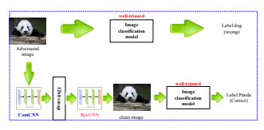
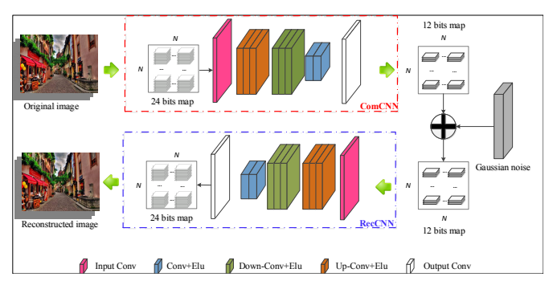
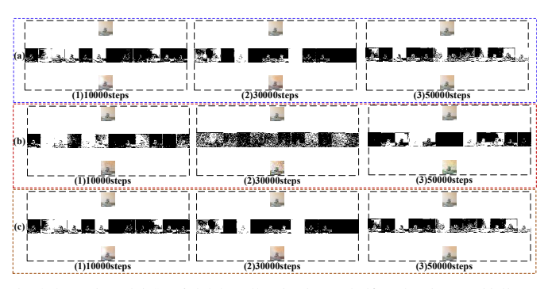
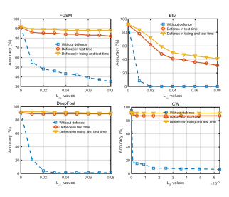

# Comdefend: An Efficient Image Compression Model To Defend Adversarial Examples

Xiaojun Jia1,2, Xingxing Wei3∗, Xiaochun Cao1,2∗, Hassan Foroosh4 1Institute of Information Engineering, Chinese Academy of Sciences 2Cyberspace Security Research Center, Peng Cheng Laboratory, Shenzhen 518055, China 3Department of Computer Science and Technology, Tsinghua University, 4Department of Electrical Engineering and Computer Science, University of Central Florida jiaxiaojun@iie.ac.cn, xwei11@mail.tsinghua.edu.cn, caoxiaochun@iie.ac.cn, foroosh@cs.ucf.edu

## Abstract

Deep neural networks (DNNs) have been demonstrated to be vulnerable to adversarial examples. Specifically, adding imperceptible perturbations to clean images can fool the well trained deep neural networks. In this paper, we propose an end-to-end image compression model to defend adversarial examples: **ComDefend***. The proposed* model consists of a compression convolutional neural network (ComCNN) and a reconstruction convolutional neural network (RecCNN). The ComCNN is used to maintain the structure information of the original image and purify adversarial perturbations. And the RecCNN is used to reconstruct the original image with high quality. In other words, ComDefend can transform the adversarial image to its clean version, which is then fed to the trained classifier. Our method is a pre-processing module, and does not modify the classifier's structure during the whole process.

Therefore, it can be combined with other model-specific defense models to jointly improve the classifier's robustness.

A series of experiments conducted on MNIST, CIFAR10 and ImageNet show that the proposed method outperforms the state-of-the-art defense methods, and is consistently effective to protect classifiers against adversarial attacks.

## 1. Introduction

As we know, deep learning technique [14] plays the leading role in Artificial Intelligence (AI) area, and has ushered in a new development climax in the fields such as image recognition [8], natural language processing [3], and speech processing [9]. However, Szegedy *et al.* [19] formally propose the concept of adversarial examples which bring the great danger to the neural networks. Specifically, impercep-

* Corresponding Author

Figure 1. The main idea of our end-to-end image compression model to defend adversarial examples. The perturbation between the adversarial image and the original image is very tiny, but the perturbation is amplified during the high-level representation of the image classification model. We use ComCNN to remove the redundant information of the adversarial image and RecCNN to reconstruct the clean image. In this way, the influence of adversarial perturbations is suppressed.

tible perturbations added to clean images can induce networks to make incorrect predictions with high confidence during the test time, even when the amount of perturbation is very small, and imperceptible to human observers.

What's more, [12] has proved that adversarial examples also exist in the physical-world scenarios. The existence of adversarial examples has become a major security concern in real-world applications of deep networks, such as selfdriving cars and identity recognition, etc.

In recent years, a lot of methods defending the adversarial examples have been proposed. These methods can be roughly categorized into two classes. The first class is to enhance the robustness of neural networks itself. Adversarial training [20] is a typical method among them, which injects adversarial examples into the training data to retrain the network. Label smoothing [22], which converts one-hot labels to soft targets, also belongs to this class. The second

Figure 2. The overview of ComDefend. The ComCNN is used to preserve the main structure information of original images. The original 24 bits map for RGB three channels is compressed into 12 bits map (each channel is assigned 4 bits). And the RecCNN is responsible for reconstructing the clean-version original images. The gaussian noise is added on the compressed compact representation to improve the reconstructed quality, and further enhance the defense ability.
one denotes the various pre-processing methods. For example, In [18], Song *et al.* propose the PixelDefend, which can transform the adversarial images into clean images before they are fed into the classifier. Similarly, [15] regards the imperceptible perturbations as the noises, and designs a high-level representation guided denoiser (HGD) to remove these noises. HGD wins the first place in the NIPS2017 adversarial vision challenge [13]. Generally speaking, the latter methods are more efficient because they don't need to retrain the neural networks. However, HGD still requires a lot of adversarial images when training the denoiser . Therefore, it is hard to get a good HGD in the case of few adversarial images. The main idea of PixelDefend is to simulate the distribution of image space. When the space is too large, the result of the simulation will be bad.

Image compression is a low-level image transformation task. Because there is strong similarity and relevance between neighbor pixels in the local structure, image compression can help reduce the redundant information of an image, while retaining the dominant information. Based on this observation, we devised ComDefend, which utilizes the image compression to remove adversarial perturbations or destroy the structure of adversarial perturbations. The basic idea of ComDefend is listed in Figure 1.

ComDefend consists of two CNN modules. The first CNN, called compression CNN (ComCNN), is used to transform the input image into a compact representation.

In details, the original 24-bits pixel is compressed into 12 bits. The compact representation extracted from the input image is expected to retain the enough information of the original image. The second CNN, called reconstruction CNN (RecCNN), is used to reconstruct the original image with high quality. The ComCNN and RecCNN are finally combined into a unified end-to-end framework to learn their weights. Figure 2 gives the illustration of ComDefend.

Noted that ComDefend is trained on the clean images. In this way, the network will learn the distribution of clean images, and thus can reconstruct a clean-version image from the adversarial image. Compared with HGD and PixelDefend, ComDefend doesn't require the adversarial examples in training phase, and thus reduces the computation cost.

In addition, ComDefend is performed on an image with the patch-by-patch manner instead of the whole image, which improve the processing efficiency. The code is released at https://github.com/jiaxiaojunQAQ/Comdefend.git.

In summary, this paper has the following contributions:
1) We propose the *ComDefend*, an end-to-end image compression model to defend adversarial examples. The ComCNN extracts the structure information of the original image and removes the imperceptible perturbations. The RecCNN reconstructs the input image with high quality.

During the whole process, the deployed model is not modified.

2) We design a unified learning algorithm to simultaneously learn the weights of two CNN modules within ComDefend. In addition, we find that adding gaussian noise to the compact representation can help reconstruct better images, and further improve the defending performance.

3) Our method greatly improves the resilience across a wide variety of strong attacking methods, and defeats the state-of-the-art defense models including the winner of NIPS 2017 adversarial challenge.

The remainder of this paper is organized as follows. Section 2 briefly reviews the related work. Section 3 introduces the details of the proposed ComDefend. Section 4 shows a series of experimental results. Finally, Section 5 shows the conclusion.

## 2. Related Work

We investigate the related work from two aspects: Attack methods to generate adversarial examples, and Defensive methods to resist adversarial examples.

## 2.1. Attack Methods

In [6], Goodfellow *et al*. propose the Fast Gradient Sign Method (FGSM). An adversarial example is produced by adding increments in the gradient direction of the loss gradient. After that, Basic Iterative Method (BIM) which is the improved version of the FGSM, is proposed in [12].

Compared with FGSM, BIM performs multiple steps. This method is also called Projected Gradient Descent (PGD) in
[16]. To deal with the selection of parameters in FGSM,
in [17], Moosavi-Dezfooli *et al*. propose to use an iterative linearization of the classifier and geometric formulas to generate an adversarial example. In [1], Carlini-Wagner et al. design an efficient optimization objective (C&W) to find the smallest perturbations. The C&W can reliably produce samples correctly classified by human subjects but misclassified in specific targets by the well-trained classifier.

## 2.2. Defensive Methods

In [20], Adversarial training adds the adversarial images generated by different attack methods to the training image dataset. The growth of the training image dataset makes the image classification model easier to simulate the distribution of the entire image space. And in [21], WardeFarley and Goodfellow propose label smoothing method which uses soft targets to replace one-hot labels. The image classifier is trained on the one-hot labels at first, and then the soft targets are generated by the well-trained image classifier. In [25], Xu *et al*. propose to use feature squeezing methods which include the color bit depth of each pixel and spatial smoothing to achieve defend adversarial examples. PiexlDefend is proposed in [18]. The basic idea of PiexlDefend is to purify input images before they are fed to the image classifier. In [15], the authors propose a highlevel representation guided denoiser(HGD) method to defend adversarial examples. The proposed model is trained on the training dataset which includes 210k clean and adversarial images.

## 3. End-To-End Image Compression Model 3.1. The Basic Idea Of Comdefend

Let us first look back at the reason of adversarial examples. The adversarial examples are generated by adding some imperceptible perturbation to the clean images. The added perturbation is too slight to be perceptible to humans. However, when the adversarial examples are fed to a deep learning network, the effect of the imperceptible perturbation increases rapidly along with the deepth of the network. Therefore, the carefully designed perturbation will fool powerful CNNs. More specifically, from previously related researches, we can regard the imperceptible perturbation as the noise with the particular structure. Kurakin et al. in [12] consider that this kind of noise which can fool powerful CNNs exists in the real world. In other words, the perturbations do not affect the structure information of the original image. The imperceptible perturbations can be considered as the redundant information of the images. From this point of view, we can use the characteristics of image redundancy information in image compression model to defend adversarial examples.

In order to remove the imperceptible perturbations or break up the particular structure of the imperceptible perturbations, we propose an end-to-end image compression model which not only compresses the input image but also transforms the input image to a clean image. As shown in Figure 2, the image compression model contains the compression and reconstruction processes. During the compression process, the ComCNN extracts the image structure information and removes the redundant information of the image. During the reconstruction process, the RecCNN
reconstructs the input image without the adversarial perturbations. In particular, the ComCNN compress the 24-bits pixel image into 12 bits. That is to say, the 12-bits pixel image removes the redundancy information of the original image and preserves the main information of the original image. And thus the RecCNN use the 12-bits pixel image to reconstruct the original image. During the whole process, we hope that the 12-bits pixel images extracted from the original image and adversarial example are as same as possible. Therefore, we can transform the adversarial example into the clean image.

## 3.2. Structure Of The Comcnn

ComCNN consists of 9 weight layers, which can compress the input image into the 12-bits pixel image. That is to say, the main structure information of the input image is reserved and the redundancy information including the

Figure 3. The comparison results in ComDefend whether to add gaussian noises. In each subfigure, The top images are original images, The middle images are the compressed 12bits maps and the bottom images are the reconstructed images. (a) ComDefend reconstructs the image through the un-binarized 12bits map. (b) Without gaussian noises, ComDefend reconstructs the image through the binarized 12bits map. (c) With gaussian noises, ComDefend reconstructs the image through the binarized 12bits map. We see the reconstructed quality in
(c) is the same with that in (a). That means the increment information of un-binarized maps are actually noises. Therefore, when gaussian noises are added on the binarized maps, the better images are reconstructed.

| Table 2. Hyperparameters of the RecCNN Layers   |          |                 |                |             |
|-------------------------------------------------|----------|-----------------|----------------|-------------|
| layer                                           | type     | output channels | input channels | filter size |
| 1st layer                                       | Conv+ELU | 32              | 12             | 3 × 3       |
| 2nd layer                                       | Conv+ELU | 64              | 32             | 3 × 3       |
| 3rd layer                                       | Conv+ELU | 128             | 64             | 3 × 3       |
| 4th layer                                       | Conv+ELU | 256             | 128            | 3 × 3       |
| 5th layer                                       | Conv+ELU | 128             | 256            | 3 × 3       |
| 6th layer                                       | Conv+ELU | 64              | 128            | 3 × 3       |
| 7th layer                                       | Conv+ELU | 32              | 64             | 3 × 3       |
| 8th layer                                       | Conv+ELU | 16              | 32             | 3 × 3       |
| 9th layer                                       | Conv     | 3               | 16             | 3 × 3       |

| Table 1. Hyperparameters of the ComCNN Layers   |          |                 |                |             |
|-------------------------------------------------|----------|-----------------|----------------|-------------|
| layer                                           | type     | output channels | input channels | filter size |
| 1st layer                                       | conv+ELU | 16              | 3              | 3 × 3       |
| 2nd layer                                       | Conv+ELU | 32              | 16             | 3 × 3       |
| 3rd layer                                       | Conv+ELU | 64              | 32             | 3 × 3       |
| 4th layer                                       | Conv+ELU | 128             | 64             | 3 × 3       |
| 5th layer                                       | Conv+ELU | 356             | 128            | 3 × 3       |
| 6th layer                                       | Conv+ELU | 128             | 256            | 3 × 3       |
| 7th layer                                       | Conv+ELU | 64              | 128            | 3 × 3       |
| 8th layer                                       | Conv+ELU | 32              | 64             | 3 × 3       |
| 9th layer                                       | Conv     | 12              | 32             | 3 × 3       |

imperceptible perturbation of the input image is removed.

The combination of convolution and ELU [2] are used in ComCNN. As shown in Table 1, ComCNN consists of two components, the first one is used to extract the features of the original image and generate 256 feature maps. The 1st to the 4th layers which consist of 32 filters of size 3×3×3, 64 filters of size 3 × 3 × 32, 128 filters of size 3 × 3 × 64 and 256 filters of size 3 × 3 × 128 are the main part of the first component. And the ELU nonlinearity is used as an activation function. The second one is used to downscale and enhance the features of the input image. The 5th to the 9th layers which consist of 128 filters of size 3 × 3 × 256, 64 filters of size 3×3×128, 64 filters of size 3×3×64, 32 filters of size 3×3×64 and 3 filters of size 3×3×32 are the main part of the second component. The ComCNN is used to extract the features of the original image and construct the compact representation.

## 3.3. Structure Of The Reccnn

RecCNN consists of 9 weight layers, which is used to reconstruct the original image without the imperceptible perturbation. As shown in Table 2, For the 1st layer to the 9th layers, 32 filters of size 3 × 3 × 12, 64 filters of size 3 × 3 × 32, 128 filters of size 3 × 3 × 64, 256 filters of size 3×3×128, 128 filters of size 3×3×256, 64 filters of size 3 × 3 × 128, 64 filters of size 3 × 3 × 64, 32 filters of size 3×3×64 and 3 filters of size 3×3×32 are used, and ELU
is added. The RecCNN makes use of the compact representation to reconstruct the output image. The output image has the fewer perturbations than the input image. That is to say, the output image can break up the particular structure of the perturbations. In this way, the compression model can defend the adversarial examples.

## 3.4. Loss Functions

As for ComCNN, the goal of the ComCNN is to use more 0 to encode the image information. Therefore, the loss function of the ComCNN can be defined as:

$$L_{1}(\theta_{1})=\lambda\|C o m(\theta_{1},x)\|^{2},$$
2, (1)
where θ1 is the trainable parameter of the ComCNN,
Com() represents the ComCNN, and λ is a super parameter which we use a large number experiments to certify.

Please refer to Section 4 for more details.

As for RecCNN, the goal of the RecCNN is expected to reconstruct the original image with high quality. Therefore, we use MSE to define the loss function of the RecCNN:

$$L_{2}(\theta_{2})=\frac{1}{2N}\Sigma\|Rec(\theta_{2},Com(\theta_{1},x)+\varphi)-x\|^{2},\tag{2}$$  where $Com()$ is the ComCNN, $\theta_{2}$ represents the trainable 
parameter of the RecCNN, Rec() represents the RecCNN,
θ1 represents the trained parameter of the ComCNN. And ϕ represents the random Gaussian noise.

In order to make the compression model more effective, we design a unified loss function to simultaneously update the parameters of ComCNN and RecCNN. It is defined as:

$$\begin{split}L(\theta_{1},\theta_{2})=\frac{1}{2N}\Sigma\|R e c(\theta_{2},C o m(\theta_{1},x)+\varphi)-x\|^{2}\\ +\lambda\|C o m(\theta_{1},x)\|^{2}.\end{split}\tag{3}$$

According to this loss function, it is clear that both ComCNN and RecCNN work together to resist the noise attack.

The parameters θ1, θ2 are upgraded at the same time during the model training.

## 3.5. Learning Algorithm

In order to train the compression model, we design a unified learning algorithm for both ComCNN and RecCNN.

The optimization goal for ComDefend is formulated as:

$$(\theta_{1},\theta_{2})=a r g\min(\frac{1}{2N}\Sigma\|R e c(\theta_{2},R e c(\theta_{1},x)+\varphi)-x\|^{2}$$ $$+\|C o m(\theta_{1},x)\|^{2}),\tag{4}$$

where x is the input image. ϕ represents the random Gaussian noise. θ1 and θ2 are the parameters of ComCNN and RecCNN respectively. Com() represents the ComCNN and Rec() represents RecCNN.

During the whole process, the ComCNN encodes the input image x into a same size image y with each pixel occupies 12 floats. Then the sigmoid function is used to limit

| Table 3. The experiments versus selection of compression bit   | s     |       |       |       |       |
|----------------------------------------------------------------|-------|-------|-------|-------|-------|
| Compressed bits                                                | 8     | 10    | 12    | 14    | 16    |
| PSNR                                                           | 31.01 | 31.01 | 31.78 | 28.77 | 30.95 |

$$(1)$$

the image y to between 0 and 1. Note that, the sigmoid output makes use of the different shades of gray information to represent the input image instead of 0 and 1. And RecCNN
can reconstruct the original image through these shades of gray information. If these shades of gray information are binarized, the main structure information of original image is completely lost. In order to deal with this problem, we propose to use the noise attack.

In particular, we add the random Gaussian noise ϕ (the mean of the gaussian noise is 0 and the variance of the gaussian noise is ϕ) to the output before the sigmoid function.

The information encoded with 0 and 1 is easier to resist the noise attack. Therefore, during the training, the compression model learns to use the binary information to defend the noise attack. As shown in Figure 3, we can see that adding the random gaussian noise contributes to improving the performance of the compression model. In addition, We choose the compression bits mainly according to the reconstructed performance. We try different compression bits in Table 3, and find the 12 bits show the best PSNR reconstructed performance.

## 3.6. Network Implementation

The weights of the ComCNN and the RecCNN are initialized by using the method in [7]. We also use Adam algorithm [10] with parameters setting α = 0.001, β1 =
0.9, β2 = 0.999 and ε = 10−8to upgrade the weights of the compression model. After the hyperparameters γ and λ being confirmed, we train ComCNN and RecCNN for 30 epochs using a batch size of 50. The learning rate is decayed exponentially from 0.01 to 0.0001 for 30 epochs.

## 4. Experimental Results And Analysis

In this section, in order to evaluate the performance of the proposed method, we conduct several experiments, which include: generation of adversarial examples, selection of hyper parameters in neural networks, image classification with the proposed method, comparisons with other defensive methods and performance analysis. The proposed method can significantly perform well against the state-ofthe-art adversarial attacks.

## 4.1. Datasets For Training And Testing

In order to clearly verify our proposed method, the ComCNN and RecCNN training are based on the 50,000 clean
(not perturbed) images of the CIFAR-10 dataset [11]. For testing, we use 10,000 testing images in the CIFAR-10 dataset, 10,000 testing images in the Fashion-mnist [23] and

|             | Table 4. THE SELECTION OF PARAMETERS IN THE OUR PROPOSED METHOD . ϕ = 1.0 ϕ = 10.0 ϕ = 20.0 ϕ = 25.0 ϕ = 30.0 ϕ = 35.0 ϕ = 40.0 ϕ = 50.0   |        |        |        |        |        | Average   |        |        |
|-------------|--------------------------------------------------------------------------------------------------------------------------------------------|--------|--------|--------|--------|--------|-----------|--------|--------|
| λ = 0.01    | 68.39%                                                                                                                                     | 90.22% | 86.69% | 87.52% | 86.12% | 85.42% | 86.22%    | 86.71% | 84.66% |
| λ = 0.001   | 88.99%                                                                                                                                     | 89.64% | 72.23% | 90.23% | 91.09% | 90.41% | 90.55%    | 90.56% | 87.96% |
| λ = 0.0001  | 89.61%                                                                                                                                     | 90.77% | 91.82% | 90.98% | 89.45% | 91.24% | 90.61%    | 90.33% | 90.60% |
| λ = 0.00001 | 89.06%                                                                                                                                     | 91.65% | 90.99% | 91.37% | 90.74% | 91.05% | 90.25%    | 90.65% | 90.72% |
| λ = 0.0     | 90.00%                                                                                                                                     | 90.39% | 91.45% | 91.27% | 91.01% | 90.88% | 88.18%    | 90.10% | 90.41% |
| Average     | 85.19%                                                                                                                                     | 90.53% | 86.63% | 90.27% | 89.88% | 89.80% | 89.16%    | 89.67% | 88.89% |

1000 random images of the imagenet dataset [4]. We also train ResNet [8] which is one of the state-of-the-art deep neural network image classifiers in recent years on these three datasets.

## 4.2. Adversarial Examples

In the literature, three common distance metrics are used for generating adversarial examples: L0, L2, L∞. L0 represents the number of the different pixels between the clean image and adversarial example. L2 measures the standard Euclidean distance between the clean image and adversarial example. L∞ represents the maximum value of the imperceptible perturbation in the adversarial example. In [22],
Goodfellow et al. argue to use L∞ to construct the adversarial examples. And the related research literature main use L2 and L∞ to conduct related researches. Therefore, we make use of L2 and L∞ to achieve the adversarial attacks.

In particular, we use the L∞ distance metric to achieve FSGM, BIM and DeepFool adversarial attacks and the L2 distance metric to achieve C&W adversarial attacks.

## 4.3. Selection Of Hyper Parameters

There are two hyper parameters in the neural networks that need to be determined by a large number of experiments. The first one is the standard normal distribution gaussian noise parameter ϕ, and the second one is the penalty item parameter λ. In order to improve the performance of the proposed method, the value of ϕ and λ is depending on the performance of image classification. Specifically, image compression discards part of the image information even if it retains the main structural information of the image. In order to keep the accuracy of image classifier, we compute the average accuracy of the well-trained Resnet50 on the 1000 random images of the cifar-10 training dataset. For more details, please refer to Table 4.

From Table 4, we can see that when the parameter λ is fixed, the accuracy of the classifier first increases and then decreases with the increase of parameter ϕ. More specifically, when parameter λ = 0.0001 and ϕ = 1.0 ∼ 20.0, the average accuracy increases constantly. But when parameter λ = 0.0001 and ϕ = 20.0 ∼ 50.0, the average accuracy decreases constantly. That is, when the noise is too large, the network is not enough to resist it, resulting in a decline in network performance and when the noise is too small, the network learns to use the gray scale information

Figure 4. The classification accuracy of ResNet-50 on adversarial images produced by four attacks using the proposed method at

the test time and at training and test time. The dotted line represents the accuracy of the ResNet-50 model on adversarial images without any defense.
between 0 and 1 to encode the image instead of using 0 and 1. Similarly, when the parameter ϕ is fixed, the accuracy of the classifier first increases and then decreases with the decrease of parameter λ. Therefore, the appropriate parameter settings can protect the accuracy of image classification models. In accordance with Table 4, λ = 0.0001 and ϕ = 20.0 can obtain the best performance of the classifier. In addition, In this paper, the value of the parameter λ is 0.0001 and the value of the parameter ϕ is 20.0.

## 4.4. Image Classification With The Proposed Method

Simply detecting adversarial images is not sufficient for the task of the image classification. It is often critical to be able to correctly classify adversarial examples. In this section, there are two scenarios where our proposed method is used to defend the adversarial attacks. One is using the image compression at test time, the other is using the image compression at training and test time.

## 4.4.1 Image Compression At Test Time

The image classification model has been trained on the clean images. The test images consist of clean images and

|          | Table 5. THE RESULT OF COMPARISONS WITH OTHER DEFENSIVE METHODS(CIFAR-10 ,L∞ = 2/8/16)   |             |             |             |             |             |             |
|----------|------------------------------------------------------------------------------------------|-------------|-------------|-------------|-------------|-------------|-------------|
| Network  | Defensive method                                                                         | Clean       | FGSM        | BIM         | DeepFool    | C&W         |             |
|          | In training time                                                                         |             |             |             |             |             |             |
| Resnet50 | Normal                                                                                   | 92%/92%/92% | 39%/20%/18% | 08%/00%/00% | 21%/01%/01% | 17%/00%/00% |             |
|          | Adversarial FGSM                                                                         | 91%/91%/91% | 88%/91%/91% | 24%/07%/00% | 45%/00%/00% | 20%/00%/07% |             |
|          | Adversarial BIM                                                                          | 87%/87%/87% | 80%/52%/34% | 74%/32%/06% | 79%/48%/25% | 76%/42%/08% |             |
|          | Label Smoothing                                                                          | 92%/92%/92% | 73%/54%/28% | 59%/08%/01% | 56%/20%/10% | 30%/02%/02% |             |
|          | Proposed method                                                                          | 92%/92%/92% | 89%/89%/87% | 84%/47%/40% | 90%/90%/90% | 91%/90%/90% |             |
|          | Feature Squeezing                                                                        | 84%/84%/84% | 31%/20%/18% | 13%/00%/00% | 75%/75%/75% | 78%/78%/78% |             |
|          | In test time                                                                             | PiexlDefend | 85%/85%/88% | 73%/46%/24% | 71%/46%/25% | 80%/80%/80% | 78%/78%/78% |
|          | Proposed method                                                                          | 91%/91%/91% | 86%/84%/83% | 78%/41%/34% | 88%/88%/88% | 89%/87%/87% |             |

| Table 6. THE RESULT OF COMPARISONS WITH OTHER DEFENSIVE METHODS(Fashion-mnist ,L∞   |                  |         |         | = 8/25)   |          |         |
|-------------------------------------------------------------------------------------|------------------|---------|---------|-----------|----------|---------|
| Network                                                                             | Defensive Method | Clean   | FGSM    | BIM       | DeepFool | C&W     |
| Resnet50                                                                            | Normal           | 93%/93% | 38%/24% | 00%/00%   | 06%/06%  | 00%/00% |
| Adversarial FGSM                                                                    | 93%/93%          | 85%/85% | 51%/00% | 63%/07%   | 67%/21%  |         |
| Adversarial BIM                                                                     | 92%/91%          | 84%/79% | 76%/63% | 82%/72%   | 81%/70%  |         |
| Label Smoothing                                                                     | 93%/83%          | 73%/45% | 16%/00% | 29%/06%   | 33%/14%  |         |
| Feature Squeezing                                                                   | 84%/84%          | 70%/28% | 56%/25% | 83%/83%   | 83%/83%  |         |
| PiexlDefend                                                                         | 89%/89%          | 87%/82% | 85%/83% | 88%/88%   | 88%/88%  |         |
| Proposed method                                                                     | 93%/93%          | 89%/89% | 70%/60% | 90%/89%   | 88%/89%  |         |

Table 5. THE RESULT OF COMPARISONS WITH OTHER DEFENSIVE METHODS(CIFAR-10 ,L∞ = 2/8/16)
Table 6. THE RESULT OF COMPARISONS WITH OTHER DEFENSIVE METHODS(Fashion-mnist ,L∞ = 8/25)
adversarial images. They are first compressed and reconstructed by the proposed method, and then they are fed to the well-trained classifier. Fig 4 shows the accuracy of image classification model(Resnet50) which are tested on the adversarial examples produced by the four attacks. The dotted lines show the accuracy of image classification models tested on the adversarial images with no defense. In this respect, the proposed method using at the test time increases accuracy on the FGSM strongest attack from 35% to 83%,
the BIM strongest attack from 0% to 31%, the DeepFool strongest attack from 1% to 89% and the C&W strongest attack from 0% to 87% for CIFAR-10.

## 4.4.2 Image Compression At Training And Test Time

There is another way to defend the adversarial examples, that is to say, we apply the proposed method during the training and test time. In particular, During the training time, we train the image classification models on transformed cifar-10 training images. We first use the ComCNN
to compress the input image into the compact representation, and then use the RecCNN to reconstruct the input image before feeding it to the network. As for the test time, the test image is transformed by the proposed method before being fed to the well-trained classifier. As shown in Fig 4, we can see that the proposed method at training and test time increases accuracy on the FGSM strongest attack from 35% to 83%, the BIM strongest attack from 0% to 31%, the DeepFool strongest attack from 1% to 89% and the C&W
strongest attack from 0% to 87% for CIFAR-10.

## 4.4.3 Comparisons With Other Defensive Methods

In order to quantitatively measure the performance of our proposed method, we compare the proposed method with other conventional schemes under the L∞ distance metric.

The result of the comparison on the Cifar-10 image dataset is shown in Table 5. During training and test time, compared with these methods, our proposed method achieves huge performance improvement. In particular, it achieves nearly 90% accuracy on the FGSM, DeepFool and C&W attack methods. Compared with the image classification model on the clean images, the accuracy of the model on the adversarial examples does not decline a lot. As for defense applied in test time, the proposed method can achieve about 85% accuracy on the FGSM, DeepFool and C&W
attack methods. As for BIM attack, the performance is improved by using our proposed method. And Table 6 shows the result of the comparison with other defensive methods on the Fashion-mnist image dataset. The performance is improved a lot by using the proposed method on FGSM, DeepFool and C&W attack methods. More importantly, we do comparison experiment with HGD and ICLR2018[24]
method on the imagenet dataset. As shown in Table 7, the proposed method improves the performance of defending the FGSM, DeepFool and C&W attack methods. And to test more attacking methods, we add the deepfool and C&W
methods. The results are shown in Table 8. We see that the proposed method achieves the higher defensive accuracy against FGSM, DeepFool, MI-FGSM [5] and C&W, and the competitive accuracy against IFGSM compared with HGD, which demonstrates the effectiveness of the proposed method. Note that the  for IFGSM is set to 3 and 5, rather 8 and 16, because we find when the attack is too strong (when L∞ >= 8), the noises are perceptible to human eyes. And thus, the adversarial examples can be easily distinguished by human beings, and the defense methods are not necessary. **In fact, the core advantage of our method is that**
we train our network on the clean images rather than adversarial images. In this way, we don't need to use at-

Table 7. THE RESULT OF COMPARISONS WITH OTHER DEFENSIVE METHODS(Imagenet ,L∞ = 8/13/20)

| Table 9. Comparison results with ICLR2018 on ImageNet Network Defensive Method FGSM-8 FGSM-12 Deepfool C&W Normal 34% 32% 13% 0% IncResV2 ICLR2018 62% 50% 55% 59% Our method 62% 61% 60% 61%   |
|-------------------------------------------------------------------------------------------------------------------------------------------------------------------------------------------------|

| Table 7. THE RESULT OF COMPARISONS WITH OTHER DEFENSIVE METHODS(Imagenet ,L∞ = 8/   |                  | 13/20)      |             |             |             |             |         |
|-------------------------------------------------------------------------------------|------------------|-------------|-------------|-------------|-------------|-------------|---------|
| Network                                                                             | Defensive Method | Clean       | FGSM        | BIM         | DeepFool    | C&W         |         |
| Normal                                                                              | 76%/76%/76%      | 03%/03%/03% | 00%/00%/00% | 01%/01%/01% | 00%/00%/00% |             |         |
| Resnet101                                                                           | HGD              | 54%/54%/54% | 51%/50%/50% | 36%/36%/36% | 52%/52%/52% | 51%/51%/51% |         |
| Proposed method                                                                     | 67%/67%/67%      | 56%/56%/56% | 12%/12%/10% | 53%/53%/52% | 54%/54%/53% |             |         |
| Table 8. Comparison results with HGD on ImageNet (L∞ = 8/16)                        |                  |             |             |             |             |             |         |
| Network                                                                             | Defense          | Clean       | FGSM        | IFGSM(3/5)  | MI-FGSM     | Deepfool    | C&W     |
| Normal                                                                              | 86%              | 34%/30%     | 10%/5%      | 13%/7%      | 13%/11%     | 0%/0%       |         |
| IncResV2                                                                            | HGD              | 54%         | 47%/48%     | 42%/42%     | 46%/44%     | 48%/48%     | 48%/48% |
| Our method                                                                          | 77%              | 62%/61%     | 51%/42%     | 50%/40%     | 60%/60%     | 61%/63%     |         |
| Normal                                                                              | 83%              | 20%/18%     | 57%/49%     | 57%/50%     | 12%/11%     | 0%/0%       |         |
| IncV3                                                                               | HGD              | 70%         | 60%/60%     | 62%/61%     | 62%/62%     | 60%/60%     | 59%/59% |
| Our method                                                                          | 74%              | 62%/61%     | 64%/60%     | 69%/64%     | 60%/60%     | 60%/60%     |         |
| Normal                                                                              | 88%              | 28%/26%     | 6%/1%       | 4%/1%       | 17%/15%     | 0%/0%       |         |
| IncV4                                                                               | HGD              | 64%         | 56%/56%     | 51%/50%     | 57%/52%     | 59%/59%     | 59%/59% |
| Our method                                                                          | 74%              | 58%/56%     | 50%/46%     | 50%/40%     | 60%/60%     | 61%/60%     |         |

tacking methods to generate adversarial examples, and thus the training data set is much smaller than HGD,
and the training time is also much less than HGD. Besides, our method performes the compression based on the patch rather than the entire image, therefore, the testing time is reduced (the HGD takes 2.7 seconds to process an image. But the proposed method only takes 1.2 seconds to process the same image). We give the comparison results with [24] in Table 9. The results shows that our method can achieve the higher accuracy against deepfool, C&W, and FGSM with  = 8, 12 than [24], which verifies the effectiveness of our method. Furthermore, our proposed method does not depend on attacking methods and classifiers. And it can be combined with other defensive methods.

## 4.5. Analysis For The Proposed Method

For the test time, the proposed method transforms the input image to a clean image. And it breaks up the particular structure of the perturbations in the adversarial examples. Specifically, the ComCNN encode the input image into a compact representation. During this process, the imperceptible perturbations do not affect the result of the compact representation. In other words, the output images of the clean image and adversarial image are as same as possible. Because during the training of the network, the network learns to resist the stronger gaussian noise attack to encode the input images. For the training and test time, the proposed method compresses the space of the real samples. For the uncompressed space, there are 32×32×2 8×2 8×2 8images in this space. But for the compressed space, there only are 32×32×2 4 ×2 4 ×2 4images in this space. In this way, the proposed method makes the existing image classification models easier to simulate the image distribution. The mezzanine is between the decision surface trained by the classifier and the real surface of the sample data becomes smaller. That is to say, the probability of the adversarial example occurrence becomes smaller than before.

## 5. Conclusion

In this paper, we propose an end-to-end image compression model to defend adversarial examples. ComDefend can be used in test time and in training and test time. As for test time, it defends the adversarial examples by destroying the structure of adversarial perturbations in the adversarial image. As for training and test time, it achieves defense by compressing the image space. In this way, it reduces the search space available for an adversary to construct adversarial examples. ComDefend can achieve higher accuracy on FGSM, DeepFool and C&W attack methods compared with the state-of-the-art defense methods. And the performance on BIM attack also improves by using our proposed method. More importantly, ComDefend is performed on an image with the patch-by-patch manner instead of the whole image, which is taken less time to deal with the input image. Our work demonstrates that the performance of classifying the adversarial examples is dramatically improved by using the proposed method.

## 6. Acknowledgements

Supported by the National Key R&D Program of China
(Grant No.2018YFB0803701). National Natural Science Foundation of China (No.U1636214, 61861166002, U1803264, 61806109). Beijing Natural Science Foundation (No.L182057). Project funded by China Postdoctoral Science Foundation (No.2018M641360).

## References

[1] N. Carlini and D. Wagner. Towards evaluating the robustness of neural networks. In *2017 IEEE Symposium on Security* and Privacy (SP), pages 39–57. IEEE, 2017.

[2] D.-A. Clevert, T. Unterthiner, and S. Hochreiter. Fast and accurate deep network learning by exponential linear units
(elus). *arXiv preprint arXiv:1511.07289*, 2015.

[3] R. Collobert and J. Weston. A unified architecture for natural language processing: Deep neural networks with multitask learning. In *Proceedings of the 25th international conference* on Machine learning, pages 160–167. ACM, 2008.

[4] J. Deng, W. Dong, R. Socher, L.-J. Li, K. Li, and L. FeiFei. Imagenet: A large-scale hierarchical image database.

In *Computer Vision and Pattern Recognition, 2009. CVPR* 2009. IEEE Conference on, pages 248–255. Ieee, 2009.

[5] Y. Dong, F. Liao, T. Pang, H. Su, J. Zhu, X. Hu, and J. Li.

Boosting adversarial attacks with momentum. In Proceedings of the IEEE Conference on Computer Vision and Pattern Recognition, pages 9185–9193, 2018.

[6] I. J. Goodfellow, J. Shlens, and C. Szegedy. Explaining and harnessing adversarial examples (2014). *arXiv preprint* arXiv:1412.6572.

[7] K. He, X. Zhang, S. Ren, and J. Sun. Delving deep into rectifiers: Surpassing human-level performance on imagenet classification. In *Proceedings of the IEEE international conference on computer vision*, pages 1026–1034, 2015.

[8] K. He, X. Zhang, S. Ren, and J. Sun. Deep residual learning for image recognition. In *Proceedings of the IEEE conference on computer vision and pattern recognition*, pages 770–778, 2016.

[9] G. Hinton, L. Deng, D. Yu, G. E. Dahl, A.-r. Mohamed, N. Jaitly, A. Senior, V. Vanhoucke, P. Nguyen, T. N. Sainath, et al. Deep neural networks for acoustic modeling in speech recognition: The shared views of four research groups. IEEE
Signal processing magazine, 29(6):82–97, 2012.

[10] D. P. Kingma and J. Ba. Adam: A method for stochastic optimization. *arXiv preprint arXiv:1412.6980*, 2014.

[11] A. Krizhevsky, V. Nair, and G. Hinton. Cifar-10 (canadian institute for advanced research). URL http://www. cs.

toronto. edu/kriz/cifar. html, 2010.

[12] A. Kurakin, I. Goodfellow, and S. Bengio. Adversarial machine learning at scale. *arXiv preprint arXiv:1611.01236*,
2016.

[13] A. Kurakin, I. Goodfellow, S. Bengio, Y. Dong, F. Liao, M. Liang, T. Pang, J. Zhu, X. Hu, C. Xie, et al. Adversarial attacks and defences competition. arXiv preprint arXiv:1804.00097, 2018.

[14] Y. LeCun, Y. Bengio, and G. Hinton. Deep learning. *nature*,
521(7553):436, 2015.

[15] F. Liao, M. Liang, Y. Dong, T. Pang, J. Zhu, and X. Hu.

Defense against adversarial attacks using high-level representation guided denoiser. *arXiv preprint arXiv:1712.02976*,
2017.

[16] A. Madry, A. Makelov, L. Schmidt, D. Tsipras, and A. Vladu. Towards deep learning models resistant to adversarial attacks. *arXiv preprint arXiv:1706.06083*, 2017.

[17] S.-M. Moosavi-Dezfooli, A. Fawzi, and P. Frossard. Deepfool: a simple and accurate method to fool deep neural networks. In Proceedings of the IEEE Conference on Computer Vision and Pattern Recognition, pages 2574–2582, 2016.

[18] Y. Song, T. Kim, S. Nowozin, S. Ermon, and N. Kushman.

Pixeldefend: Leveraging generative models to understand and defend against adversarial examples. arXiv preprint arXiv:1710.10766, 2017.

[19] C. Szegedy, W. Zaremba, I. Sutskever, J. Bruna, D. Erhan, I. Goodfellow, and R. Fergus. Intriguing properties of neural networks. *arXiv preprint arXiv:1312.6199*, 2013.

[20] F. Tramer, A. Kurakin, N. Papernot, I. Goodfellow, `
D. Boneh, and P. McDaniel. Ensemble adversarial training: Attacks and defenses. *arXiv preprint arXiv:1705.07204*,
2017.

[21] D. Warde-Farley and I. Goodfellow. 11 adversarial perturbations of deep neural networks. *Perturbations, Optimization,*
and Statistics, page 311, 2016.

[22] D. Warde-Farley, I. Goodfellow, T. Hazan, G. Papandreou, and D. Tarlow. Adversarial perturbations of deep neural networks. perturbations. *Optimization, and Statistics*, 2, 2016.

[23] H. Xiao, K. Rasul, and R. Vollgraf. Fashion-mnist: a novel image dataset for benchmarking machine learning algorithms. *arXiv preprint arXiv:1708.07747*, 2017.

[24] C. Xie, J. Wang, Z. Zhang, Z. Ren, and A. Yuille. Mitigating adversarial effects through randomization. In *International* Conference on Learning Representations, 2018.

[25] W. Xu, D. Evans, and Y. Qi. Feature squeezing: Detecting adversarial examples in deep neural networks. *arXiv preprint* arXiv:1704.01155, 2017.