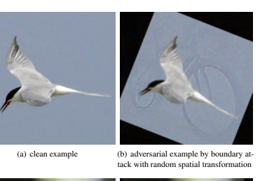

# Theoretically Principled Trade-Off Between Robustness And Accuracy

| Hongyang Zhang∗ CMU & TTIC hongyanz@cs.cmu.edu   | Yaodong Yu†                                         |                                                      |
|--------------------------------------------------|-----------------------------------------------------|------------------------------------------------------|
|                                                  | University of Virginia yy8ms@virginia.edu           | Jiantao Jiao UC Berkeley                             |
|                                                  | jiantao@eecs.berkeley.edu                           |                                                      |
| Eric P. Xing                                     |                                                     |                                                      |
| CMU & Petuum Inc. epxing@cs.cmu.edu              | Laurent El Ghaoui UC Berkeley elghaoui@berkeley.edu | Michael I. Jordan UC Berkeley jordan@cs.berkeley.edu |

## Abstract

We identify a trade-off between robustness and accuracy that serves as a guiding principle in the design of defenses against adversarial examples. Although this problem has been widely studied empirically, much remains unknown concerning the theory underlying this trade-off. In this work, we decompose the prediction error for adversarial examples (robust error) as the sum of the natural (classification) error and boundary error, and provide a differentiable upper bound using the theory of classification-calibrated loss, which is shown to be the tightest possible upper bound uniform over all probability distributions and measurable predictors. Inspired by our theoretical analysis, we also design a new defense method, TRADES, to trade adversarial robustness off against accuracy. Our proposed algorithm performs well experimentally in real-world datasets. The methodology is the foundation of our entry to the NeurIPS 2018 Adversarial Vision Challenge in which we won the 1st place out of ~2,000 submissions, surpassing the runner-up approach by 11.41% in terms of mean `2 perturbation distance.

## 1 Introduction

In response to the vulnerability of deep neural networks to small perturbations around input data [SZS+13], adversarial defenses have been an imperative object of study in machine learning [HPG+17], computer vision [SKN+18, XWZ+17, MC17], natural language processing [JL17], and many other domains. In machine learning, study of adversarial defenses has led to significant advances in understanding and defending against adversarial threat [HWC+17]. In computer vision and natural language processing, adversarial defenses serve as indispensable building blocks for a range of security-critical systems and applications, such as autonomous cars and speech recognition authorization. The problem of adversarial defenses can be stated as that of learning a classifier with high test accuracy on both natural and *adversarial examples*. The adversarial example for a given labeled data (x, y) is a data point x 0that causes a classifier c to output a different label on x 0than y, but is "imperceptibly similar" to x. Given the difficulty of providing an operational definition of "imperceptible similarity," adversarial examples typically come in the form of *restricted attacks* such as
-bounded perturbations [SZS+13], or *unrestricted attacks* such as adversarial rotations, translations, and deformations [BCZ+18, ETT+17, GAG+18, XZL+18, AAG19, ZCS+19]. The focus of this work is the former setting, though our framework can be generalized to the latter.

Despite a large literature devoted to improving the robustness of deep-learning models, many fundamental questions remain unresolved. One of the most important questions is how to trade off adversarial robustness
∗Part of this work was done while H. Z. was visiting Simons Institute for the Theory of Computing.

†Part of this work was done while Y. Y. was an intern at Petuum Inc.

1

Figure 1: **Left figure:** decision boundary learned by natural training method. **Right figure:** decision boundary

 learned by our adversarial training method, where the orange dotted line represents the decision boundary in the left figure. It shows that both methods achieve zero natural training error, while our adversarial training method achieves better robust training error than the natural training method.
against natural accuracy. Statistically, robustness can be be at odds with accuracy [TSE+19]. This has led to an empirical line of work on adversarial defense that incorporates various kinds of assumptions [SZC+18, KGB17].

On the theoretical front, methods such as *relaxation based defenses* [KW18, RSL18a] provide provable guarantees for adversarial robustness. They, however, ignore the performance of classifier on the non-adversarial examples, and thus leave open the theoretical treatment of the putative robustness/accuracy trade-off.

The problem of adversarial defense becomes more challenging when computational issues are considered.

For example, the straightforward empirical risk minimization (ERM) formulation of robust classification involves minimizing the robust 0-1 loss maxx0:kx0−xk≤ 1{c(x 0) 6= y}, a loss which is NP-hard to optimize even if  = 0 in general. Hence, it is natural to expect that some prior work on adversarial defense replaced the 0-1 loss 1(·) with a surrogate loss [MMS+18, KGB17, UOKvdO18]. However, there is little theoretical guarantee on the tightness of this approximation.

## 1.1 Our Methodology And Results

We begin with an example that illustrates the trade-off between accuracy and adversarial robustness in Section 2.4. This phenomenon was first theoretically demonstrated by [TSE+19]. We construct another toy example where the Bayes optimal classifier achieves *natural error* 0% and *robust error* 100%, while the trivial all-one classifier achieves both *natural error* and *robust error* 50% (Table 1). While a large literature on the analysis of robust error in terms of generalization [SST+18, CBM18, YRB18] and computational complexity [BPR18, BLPR18], in this work we focus on how to address the trade-off between the natural error and the robust error.

We show that the *robust error* can in general be bounded tightly using two terms: one corresponds to the natural error measured by a *surrogate* loss function, and the other corresponds to how likely the input features are close to the -extension of the decision boundary, termed as the *boundary error*. We then minimize the differentiable upper bound. Our theoretical analysis naturally leads to a new formulation of adversarial defense which has several appealing properties; in particular, it inherits the benefits of scalability to large datasets exhibited by Tiny ImageNet, and the algorithm achieves state-of-the-art performance on a range of benchmarks while providing theoretical guarantees. For example, while the defenses overviewed in [ACW18] achieve robust accuracy no higher than ~47% under white-box attacks, our method achieves robust accuracy as high as
~57% in the same setting. The methodology is the foundation of our entry to the NeurIPS 2018 Adversarial Vision Challenge where we won first place out of ~2,000 submissions, surpassing the runner-up approach by

## 1.2 Summary Of Contributions

Our work tackles the problem of trading accuracy off against robustness and advances the state-of-the-art in multiple ways.

- Theoretically, we characterize the trade-off between accuracy and robustness for classification problems via decomposing the robust error as the sum of the natural error and the boundary error. We provide differentiable upper bounds on both terms using the theory of classification-calibrated loss, which are shown to be the tightest upper bounds uniform over all probability distributions and measurable predictors.

- Algorithmically, inspired by our theoretical analysis, we propose a new formulation of adversarial defense, TRADES, as optimizing a regularized surrogate loss. The loss consists of two terms: the term of empirical risk minimization encourages the algorithm to maximize the natural accuracy, while the regularization term encourages the algorithm to push the decision boundary away from the data, so as to improve adversarial robustness (see Figure 1).

- Experimentally, we show that our proposed algorithm outperforms state-of-the-art methods under both black-box and white-box threat models. In particular, the methodology won the final round of the NeurIPS 2018 Adversarial Vision Challenge.

## 2 Preliminaries

We illustrate our methodology using the framework of binary classification, but it can be generalized to other settings as well.

## 2.1 Notations

We will use *bold capital* letters such as X and Y to represent random vector, *bold lower-case* letters such as x and y to represent realization of random vector, *capital* letters such as X and Y to represent random variable, and *lower-case* letters such as x and y to represent realization of random variable. Specifically, we denote by x ∈ X the sample instance, and by y *∈ {−*1, +1} the label, where X ⊆ R
dindicates the instance space.

sign(x) represents the sign of scalar x with sign(0) = +1. Denote by f : X → R the *score function* which maps an instance to a confidence value associated with being positive. It can be parametrized, e.g., by deep neural networks. The associated binary classifier is sign(f(·)). We will frequently use 1{event}, the 0-1 loss, to represent an indicator function that is 1 if an event happens and 0 otherwise. For norms, we denote by kxk a generic norm. Examples of norms include kxk∞, the infinity norm of vector x, and kxk2, the `2 norm of vector x. We use B(x, ) to represent a neighborhood of x: {x 0 ∈ X : kx 0 − xk ≤ }. For a given score function f, we denote by DB(f) the decision boundary of f; that is, the set {x ∈ X : f(x) = 0}. The set B(DB(f), )
denotes the neighborhood of the decision boundary of f: {x ∈ X : ∃x 0 ∈ B(x, ) s.t. f(x)f(x 0) ≤ 0}. For a given function ψ(u), we denote by ψ
∗(v) := supu{u T v − ψ(u)} the conjugate function of ψ, by ψ
∗∗ the bi-conjugate, and by ψ
−1the inverse function. We will frequently use φ(·) to indicate the surrogate of 0-1 loss.

## 2.2 Robust (Classification) Error

In the setting of adversarial learning, we are given a set of instances x1, ..., xn ∈ X and labels y1*, ..., y*n ∈
{−1, +1}. We assume that the data are sampled from an unknown distribution (X, Y ) ∼ D. To characterize

$$f(\mathbf{X})Y>0\}.{\mathrm{~We~}}$$

Figure 2: Counterexample given by Eqn. (2).
the robustness of a score function f : X → R, [SST+18, CBM18, BPR18] defined *robust (classification) error* under the threat model of bounded  perturbation: Rrob(f) := E(X,Y )∼D1{∃X0∈B(X, ) s.t. f(X0)Y ≤ 0}.

This is in sharp contrast to the standard measure of classifier performance—the *natural (classification) error* Rnat(f) := E(X,Y )∼D1{f(X)Y ≤ 0}. We note that the two errors satisfy Rrob(f) ≥ Rnat(f) for all f; the robust error is equal to the natural error when  = 0.

## 2.3 Boundary Error

We introduce the *boundary error* defined as Rbdy(f) := E(X,Y )∼D1{X ∈ B(DB(f), ), f(X)Y > 0}. We have the following decomposition of Rrob(f):

$${\mathcal{R}}_{\mathrm{{rob}}}(f)={\mathcal{R}}_{\mathrm{{nat}}}(f)+{\mathcal{R}}_{\mathrm{{body}}}(f).$$
Rrob(f) = Rnat(f) + Rbdy(f). (1)

## 2.4 Trade-Off Between Natural And Robust Errors

Our study is motivated by the trade-off between natural and robust errors. [TSE+19] theoretically showed that training models to be robust may lead to a reduction of standard accuracy by constructing a toy example. To illustrate the phenomenon, we provide another toy example here.

Example. Consider the case (X, Y ) ∼ D, where the marginal distribution over the instance space is a uniform distribution over [0, 1], and for k = 0, 1*, ...,* d 1 2 − 1e,

$$\eta(x):=\Pr(Y=1|X=x)$$ $$=\begin{cases}0,&x\in[2k\epsilon,(2k+1)\epsilon),\\ 1,&x\in((2k+1)\epsilon,(2k+2)\epsilon].\end{cases}$$
$$(1)$$
$${\mathrm{(2)}}$$

See Figure 2 for the visualization of η(x). We consider two classifiers: a) the Bayes optimal classifier sign(2η(x) − 1); b) the all-one classifier which always outputs "positive." Table 1 displays the trade-off between natural and robust errors: the minimal natural error is achieved by the Bayes optimal classifier with large robust error, while the optimal robust error is achieved by the all-one classifier with large natural error.

Our goal. In practice, one may prefer to trade-off between robustness and accuracy by introducing weights in (1) to bias more towards the natural error or the boundary error. Noting that both the natural error and the boundary error involve 0-1 loss functions, our goal is to devise *tight* differentiable upper bounds on both of these terms. Towards this goal, we utilize the theory of classification-calibrated loss.

Table 1: Comparisons of natural and robust errors of Bayes optimal classifier and all-one classifier in example (2). The Bayes optimal classifier has the optimal natural error while the all-one classifier has the optimal robust

error.

Bayes Optimal Classifier All-One Classifier

Rnat 0 (optimal) 1/2

Rbdy 1 0

Rrob 1 1/2 (optimal)

Table 2: Examples of classification-calibrated loss φ and associated ψ-transform. Here ψlog(θ) = 12
(1 −

θ) log2

(1 − θ) + 12

(1 + θ) log2

(1 + θ).

Loss φ(α) ψ(θ)

Hinge max{1 − α, 0} θ

Sigmoid 1 − tanh(α) θ

Exponential exp(−α) 1 −

√1 − θ

2

Logistic log2

(1 + exp(−α)) ψlog(θ)

## 2.5 Classification-Calibrated Surrogate Loss

Definition. Minimization of the 0-1 loss in the natural and robust errors is computationally intractable and the demands of computational efficiency have led researchers to focus on minimization of a tractable surrogate loss, Rφ(f) := E(X,Y )∼Dφ(f(X)Y ). We then need to find quantitative relationships between the excess errors associated with φ and those associated with 0–1 loss. We make a weak assumption on φ: it is classification-calibrated [BJM06]. Formally, for η ∈ [0, 1], define the conditional φ*-risk* by

$$H(\eta):=\operatorname*{inf}_{\alpha\in\mathbb{R}}C_{\eta}(\alpha):=\operatorname*{inf}_{\alpha\in\mathbb{R}}\left(\eta\phi(\alpha)+(1-\eta)\phi(-\alpha)\right),$$

and define H−(η) := infα(2η−1)≤0 Cη(α). The classification-calibrated condition requires that imposing the constraint that α has an inconsistent sign with the Bayes decision rule sign(2η − 1) leads to a strictly larger φ-risk:
Assumption 1 (Classification-Calibrated Loss). We assume that the surrogate loss φ *is classification-calibrated,*
meaning that for any η 6= 1/2, H−(η) > H(η).

We argue that Assumption 1 is indispensable for classification problems, since without it the Bayes optimal classifier cannot be the minimizer of the φ-risk. Examples of classification-calibrated loss include hinge loss, sigmoid loss, exponential loss, logistic loss, and many others (see Table 2).

Properties. Classification-calibrated loss has many structural properties that one can exploit. We begin by introducing a functional transform of classification-calibrated loss φ which was proposed by [BJM06]. Define the function ψ : [0, 1] → [0, ∞) by ψ = ψe∗∗, where ψe(θ) := H−1+θ 2
− H1+θ 2
. Indeed, the function ψ(θ)
is the largest convex lower bound on H−1+θ 2
− H1+θ 2
. The value H−1+θ 2
− H1+θ 2 characterizes how close the surrogate loss φ is to the class of non-classification-calibrated losses.

Below we state useful properties of the ψ-transform. We will frequently use the function ψ to bound Rrob(f) − R∗nat.

Lemma 2.1 ([BJM06]). Under Assumption 1, the function ψ has the following properties: ψ is non-decreasing, continuous, convex on [0, 1] and ψ(0) = 0.

## 3 Relating 0-1 Loss To Surrogate Loss

In this section, we present our main theoretical contributions for binary classification and compare our results with prior literature. Binary classification problems have received significant attention in recent years as many competitions evaluate the performance of robust models on binary classification problems [BCZ+18]. We defer the discussion of multi-class problems to Section 4.

## 3.1 Upper Bound

Our analysis leads to a guarantee on the performance of surrogate loss minimization. Intuitively, by Eqn. (1),
Rrob(f) − R∗nat = Rnat(f) − R∗nat + Rbdy(f) ≤ ψ
−1(Rφ(f) − R∗φ
) + Rbdy(f), where the last inequality holds because we choose φ as a classification-calibrated loss [BJM06]. This leads to the following result.

Theorem 3.1. Let Rφ(f) := Eφ(f(X)Y ) and R∗φ
:= minf Rφ(f). Under Assumption 1, for any nonnegative loss function φ *such that* φ(0) ≥ 1, any measurable f : X → R*, any probability distribution on* X × {±1}, and any λ > 0*, we have*1

$\mathcal{R}_{\mathrm{rob}}(f)-\mathcal{R}_{\mathrm{nat}}^{*}\leq\psi^{-1}(\mathcal{R}_{\phi}(f)-\mathcal{R}_{\phi}^{*})+\Pr[\,\boldsymbol{X}\!\in\!\mathbb{B}(\mathrm{DB}(f),\epsilon),f(\boldsymbol{X})Y>0]$  $\leq\psi^{-1}(\mathcal{R}_{\phi}(f)-\mathcal{R}_{\phi}^{*})+\mathbb{E}\max_{\boldsymbol{X}^{\prime}\in\!\mathbb{B}(\boldsymbol{X},\epsilon)}\phi(f(\boldsymbol{X}^{\prime})f(\boldsymbol{X})/\lambda).$  $\bullet$\(\bullet
Quantity governing model robustness. Our result provides a formal justification for the existence of adversarial examples: learning models are vulnerable to small adversarial attacks because the probability that data lie around the decision boundary of the model, Pr[X ∈ B(DB(f), ), f(X)Y > 0], is large. As a result, small perturbations may move the data point to the wrong side of the decision boundary, leading to weak robustness of classification models.

## 3.2 Lower Bound

We now establish a lower bound on Rrob(f)− R∗nat. Our lower bound matches our analysis of the upper bound in Section 3.1 up to an arbitrarily small constant.

Theorem 3.2. Suppose that |X | ≥ 2. Under Assumption 1, for any non-negative loss function φ *such that* φ(x) → 0 as x → +∞, any ξ > 0, and any θ ∈ [0, 1], there exists a probability distribution on X × {±1}, a function f : R
d → R, and a regularization parameter λ > 0 *such that* Rrob(f) − R∗nat = θ and

$$\psi\Big{(}\theta-\mathbb{E}_{\mathbf{X}^{\prime}\in\mathbb{R}(\mathbf{X},\epsilon)}\phi(f(\mathbf{X}^{\prime})f(\mathbf{X})/\lambda)\Big{)}\leq\mathcal{R}_{\phi}(f)-\mathcal{R}_{\phi}^{*}\leq\psi\left(\theta-\mathbb{E}_{\mathbf{X}^{\prime}\in\mathbb{R}(\mathbf{X},\epsilon)}\phi(f(\mathbf{X}^{\prime})f(\mathbf{X})/\lambda)\right)+\xi.$$

Theorem 3.2 demonstrates that in the presence of extra conditions on the loss function, i.e., limx→+∞ φ(x) =
0, the upper bound in Section 3.1 is tight. The condition holds for all the losses in Table 2.

## 4 Algorithmic Design For Defenses

Optimization. Theorems 3.1 and 3.2 shed light on algorithmic designs of adversarial defenses. In order to minimize Rrob(f) − R∗nat, the theorems suggest minimizing2

$$\operatorname*{min}_{f}\mathbb{E}\bigg\{\underbrace{\phi(f(\mathbf{X})Y)}_{\mathrm{for~accuracy}}+\underbrace{\operatorname*{max}_{\mathbf{X}^{\prime}\in\mathbb{B}(\mathbf{X},\epsilon)}\phi(f(\mathbf{X})f(\mathbf{X}^{\prime})/\lambda)}_{\mathrm{regularization~for~robustness}}\bigg\}.$$

$$\mathrm{regularize}$$
$$({\mathfrak{I}})$$
o. (3)
1We study the population form of the risk functions, and mention that by incorporating the generalization theory for classificationcalibrated losses [BJM06] one can extend the analysis to finite samples. We leave this analysis for future research.

2For simplicity of implementation, we do not use the function ψ
−1and rely on λ to approximately reflect the effect of ψ
−1, the trade-off between the natural error and the boundary error, and the tight approximation of the boundary error using the corresponding surrogate loss function.
We name our method **TRADES** (TRadeoff-inspired Adversarial DEfense via Surrogate-loss minimization).

Intuition behind the optimization. Problem (3) captures the trade-off between the natural and robust errors:
the first term in (3) encourages the natural error to be optimized by minimizing the "difference" between f(X)
and Y , while the second regularization term encourages the output to be smooth, that is, it pushes the decision boundary of classifier away from the sample instances via minimizing the "difference" between the prediction of natural example f(X) and that of adversarial example f(X0). This is conceptually consistent with the argument that smoothness is an indispensable property of robust models [CBG+17]. The tuning parameter λ plays a critical role on balancing the importance of natural and robust errors. To see how the λ affects the solution in the example of Section 2.4, problem (3) tends to the Bayes optimal classifier when λ → +∞, and tends to the all-one classifier when λ → 0.

Comparisons with prior work. We compare our approach with several related lines of research in the prior
literature. One of the best known algorithms for adversarial defense is based on *robust optimization* [MMS+18,
KW18, WSMK18, RSL18a, RSL18b]. Most results in this direction involve algorithms that approximately
minimize
$$\operatorname*{min}_{f}\mathbb{E}\left\{\operatorname*{max}_{\mathbf{X}^{\prime}\in\mathbb{B}(\mathbf{X},\epsilon)}\phi(f(\mathbf{X}^{\prime})Y)\right\},$$
, (4)
$$(4)$$
where the objective function in problem (4) serves as an upper bound of the robust error Rrob(f). In complex problem domains, however, this objective function might not be tight as an upper bound of the robust error, and may not capture the trade-off between natural and robust errors.

A related line of research is adversarial training by regularization [MMIK18, KGB17, RDV17, ZSLG16].

There are several key differences between the results in this paper and those of [KGB17, RDV17, ZSLG16].

Firstly, the optimization formulations are different. In the previous works, the regularization term either measures the "difference" between f(X0) and Y [KGB17], or its gradient [RDV17]. In contrast, our regularization term measures the "difference" between f(X) and f(X0). While [ZSLG16] generated the adversarial example X0 by adding random Gaussian noise to X, our method simulates the adversarial example by solving the inner maximization problem in Eqn. (3). Secondly, we note that the losses in [MMIK18, KGB17, RDV17, ZSLG16]
lack of theoretical guarantees. Our loss, with the presence of the second term in problem (3), makes our theoretical analysis significantly more subtle. Moreover, our algorithm takes the same computational resources as [KGB17], which makes our method scalable to large-scale datasets. We defer the experimental comparisons of various regularization based methods to Table 5.

Differences with Adversarial Logit Pairing. We also compare TRADES with Adversarial Logit Pairing
(ALP) [KKG18, EIA18]. The algorithm of ALP works as follows: given a fixed network f in each round, the algorithm firstly generates an adversarial example X0 by solving argmaxX0∈B(X,) φ(f(X0)Y ); ALP then updates the network parameter by solving a minimization problem

$$\operatorname*{min}_{f}\mathbb{E}\left\{\alpha\phi(f(\mathbf{X}^{\prime})Y)+(1-\alpha)\phi(f(\mathbf{X})Y)+\|f(\mathbf{X})-f(\mathbf{X}^{\prime})\|_{2}/\lambda\right\},$$

where 0 ≤ α ≤ 1 is a regularization parameter; the algorithm finally repeats the above-mentioned procedure until it converges. We note that there are fundamental differences between TRADES and ALP.

While ALP simulates adversarial example X0 by the FGSMkattack, TRADES simulates X0 by solving argmaxX0∈B(X,) φ(f(X)f(X0)/λ). Moreover, while ALP uses the `2 loss between f(X) and f(X0) to regularize the training procedure without theoretical guarantees, TRADES uses the classification-calibrated loss according to Theorems 3.1 and 3.2. Heuristic algorithm. In response to the optimization formulation (3), we use two heuristics to achieve more general defenses: a) extending to multi-class problems by involving multi-class calibrated loss; b) approximately solving the minimax problem via alternating gradient descent. For multi-class problems, a surrogate loss Algorithm 1 Adversarial training by TRADES
1: **Input:** Step sizes η1 and η2, batch size m, number of iterations K in inner optimization, network architecture parametrized by θ 2: **Output:** Robust network fθ 3: Randomly initialize network fθ, or initialize network with pre-trained configuration 4: **repeat**
5: Read mini-batch B = {x1*, ...,* xm} from training set 6: for i = 1*, ..., m* (in parallel) do 7: x 0 i ← xi + 0.001 · N (0, I), where N (0, I) is the Gaussian distribution with zero mean and identity variance 8: for k = 1*, ..., K* do 9: x 0 i ← ΠB(xi,)(η1sign(∇x0i L(fθ(xi), fθ(x 0 i
))) + x 0 i
), where Π is the projection operator 10: **end for**
11: **end for**
12: θ ← θ − η2Pm i=1 ∇θ[L(fθ(xi), yi) + L(fθ(xi), fθ(x 0 i
))/λ]/m 13: **until** training converged is *calibrated* if minimizers of the surrogate risk are also minimizers of the 0-1 risk [PS16]. Examples of multi-class calibrated loss include cross-entropy loss. Algorithmically, we extend problem (3) to the case of multi-class classifications by replacing φ with a multi-class calibrated loss L(·, ·):

$$\operatorname*{min}_{f}\mathbb{E}\left\{{\mathcal{L}}(f(\mathbf{X}),\mathbf{Y})+\operatorname*{max}_{\mathbf{X}^{\prime}\in\mathbb{B}(\mathbf{X},\epsilon)}{\mathcal{L}}(f(\mathbf{X}),f(\mathbf{X}^{\prime}))/\lambda\right\},$$
$$({\boldsymbol{S}})$$

L(f(X), f(X0))/λ, (5)
where f(X) is the output vector of learning model (with softmax operator in the top layer for the cross-entropy loss L(·, ·)), Y is the label-indicator vector, and λ > 0 is the regularization parameter. One can also exchange f(X) and f(X0) in the second term of (5). The pseudocode of adversarial training procedure, which aims at minimizing the empirical form of problem (5), is displayed in Algorithm 1.

The key ingredient of the algorithm is to approximately solve the linearization of inner maximization in problem (5) by the *projected gradient descent* (see Step 7). We note that xiis a global minimizer with zero gradient to the objective function g(x 0) := L(f(xi), f(x 0)) in the inner problem. Therefore, we initialize x 0 i by adding a small, random perturbation around xiin Step 5 to start the inner optimizer. More exhaustive approximations of the inner maximization problem in terms of either optimization formulations or solvers would lead to better defense performance.

Semi-supervised learning. We note that TRADES problem (5) can be straightforwardly applied to the semisupervised learning framework, as the second term in problem (5) does not depend on the label Y . Therefore, with more unlabeled data points, one can approximate the second term (in the expectation form) better by the empirical loss minimization. There are many interesting recent works which explore the benefits of invloving unlabeled data [CRS+19, SFK+19, ZCH+19].

Acceleration. Adversarial training is typically more than 10x slower than natural training. To resolve this issue for TRADES, [SNG+19, ZZL+19] proposed new algorithms to solve problem (5) at negligible additional cost compared to natural training.

## 5 Experimental Results

In this section, we verify the effectiveness of TRADES by numerical experiments. We denote by Arob(f) =
1 − Rrob(f) the robust accuracy, and by Anat(f) = 1 − Rnat(f) the natural accuracy on test dataset. We

| Table 3: Theoretical verification on the optimality of Theorem   |             | 3.1.      |                 |
|------------------------------------------------------------------|-------------|-----------|-----------------|
| λ                                                                | Arob(f) (%) | Rφ(f)     | ∆ = ∆RHS − ∆LHS |
| 2.0                                                              | 99.43       | 0.0006728 | 0.006708        |
| 3.0                                                              | 99.41       | 0.0004067 | 0.005914        |
| 4.0                                                              | 99.37       | 0.0003746 | 0.006757        |
| 5.0                                                              | 99.34       | 0.0003430 | 0.005860        |

release our code and trained models at https://github.com/yaodongyu/TRADES.

## 5.1 Optimality Of Theorem 3.1

We verify the tightness of the established upper bound in Theorem 3.1 for binary classification problem on MNIST dataset. The negative examples are '1' and the positive examples are '3'. Here we use a Convolutional Neural Network (CNN) with two convolutional layers, followed by two fully-connected layers. The output size of the last layer is 1. To learn the robust classifier, we minimize the regularized surrogate loss in Eqn. (3), and use the hinge loss in Table 2 as the surrogate loss φ, where the associated ψ-transform is ψ(θ) = θ.

To verify the tightness of our upper bound, we calculate the left hand side in Theorem 3.1, i.e.,

$$\Delta_{\mathrm{LHS}}={\mathcal{R}}_{\mathrm{rob}}(f)-{\mathcal{R}}_{\mathrm{nat}}^{*},$$

and the right hand side, i.e.,

$$\Delta_{\mathrm{RHS}}=({\mathcal{R}}_{\phi}(f)-{\mathcal{R}}_{\phi}^{*})+\mathbb{E}\operatorname*{max}_{\mathbf{X}^{\prime}\in\mathbb{B}(\mathbf{X},e)}\phi(f(\mathbf{X}^{\prime})f(\mathbf{X})/\lambda).$$

As we cannot have access to the unknown distribution D, we approximate the above expectation terms by test dataset. We first use natural training method to train a classifier so as to approximately estimate R∗nat and R∗φ
, where we find that the naturally trained classifier can achieve natural error R∗nat = 0%, and loss value R∗φ = 0.0 for the binary classification problem. Next, we optimize problem (3) to train a robust classifier f.

We take perturbation  = 0.1, number of iterations K = 20 and run 30 epochs on the training dataset. Finally, to approximate the second term in ∆RHS, we use FGSMk(white-box) attack (a.k.a. PGD attack) [KGB17] with 20 iterations to approximately calculate the worst-case perturbed data X0.

The results in Table 3 show the tightness of our upper bound in Theorem 3.1. It shows that the differences between ∆RHS and ∆LHS under various λ's are very small.

## 5.2 Sensitivity Of Regularization Hyperparameter Λ

The regularization parameter λ is an important hyperparameter in our proposed method. We show how the regularization parameter affects the performance of our robust classifiers by numerical experiments on two datasets, MNIST and CIFAR10. For both datasets, we minimize the loss in Eqn. (5) to learn robust classifiers for multi-class problems, where we choose L as the cross-entropy loss.

MNIST setup. We use the CNN which has two convolutional layers, followed by two fully-connected layers.

The output size of the last layer is 10. We set perturbation  = 0.1, perturbation step size η1 = 0.01, number of iterations K = 20, learning rate η2 = 0.01, batch size m = 128, and run 50 epochs on the training dataset.

To evaluate the robust error, we apply FGSMk(white-box) attack with 40 iterations and 0.005 step size. The results are in Table 4.

CIFAR10 setup. We apply ResNet-18 [HZRS16] for classification. The output size of the last layer is 10. We set perturbation  = 0.031, perturbation step size η1 = 0.007, number of iterations K = 10, learning rate η2 = 0.1, batch size m = 128, and run 100 epochs on the training dataset. To evaluate the robust error, we apply FGSMk(white-box) attack with 20 iterations and the step size is 0.003. The results are in Table 4.

| Table 4: Sensitivity of regularization hyperparameter λ on MNIST and CIFAR10   |                |                | datasets.      |                |
|--------------------------------------------------------------------------------|----------------|----------------|----------------|----------------|
|                                                                                | MNIST          |                | CIFAR10        |                |
| 1/λ                                                                            | Arob(f) (%)    | Anat(f) (%)    | Arob(f) (%)    | Anat(f) (%)    |
| 0.1                                                                            | 91.09 ± 0.0385 | 99.41 ± 0.0235 | 26.53 ± 1.1698 | 91.31 ± 0.0579 |
| 0.2                                                                            | 92.18 ± 0.0450 | 99.38 ± 0.0094 | 37.71 ± 0.6743 | 89.56 ± 0.2154 |
| 0.4                                                                            | 93.21 ± 0.0660 | 99.35 ± 0.0082 | 41.50 ± 0.3376 | 87.91 ± 0.2944 |
| 0.6                                                                            | 93.87 ± 0.0464 | 99.33 ± 0.0141 | 43.37 ± 0.2706 | 87.50 ± 0.1621 |
| 0.8                                                                            | 94.32 ± 0.0492 | 99.31 ± 0.0205 | 44.17 ± 0.2834 | 87.11 ± 0.2123 |
| 1.0                                                                            | 94.75 ± 0.0712 | 99.28 ± 0.0125 | 44.68 ± 0.3088 | 87.01 ± 0.2819 |
| 2.0                                                                            | 95.45 ± 0.0883 | 99.29 ± 0.0262 | 48.22 ± 0.0740 | 85.22 ± 0.0543 |
| 3.0                                                                            | 95.57 ± 0.0262 | 99.24 ± 0.0216 | 49.67 ± 0.3179 | 83.82 ± 0.4050 |
| 4.0                                                                            | 95.65 ± 0.0340 | 99.16 ± 0.0205 | 50.25 ± 0.1883 | 82.90 ± 0.2217 |
| 5.0                                                                            | 95.65 ± 0.1851 | 99.16 ± 0.0403 | 50.64 ± 0.3336 | 81.72 ± 0.0286 |

We observe that as the regularization parameter 1/λ increases, the natural accuracy Anat(f) decreases while the robust accuracy Arob(f) increases, which verifies our theory on the trade-off between robustness and accuracy. Note that for MNIST dataset, the natural accuracy does not decrease too much as the regularization term 1/λ increases, which is different from the results of CIFAR10. This is probably because the classification task for MNIST is easier. Meanwhile, our proposed method is not very sensitive to the choice of λ. Empirically, when we set the hyperparameter 1/λ in [1, 10], our method is able to learn classifiers with both high robustness and high accuracy. We will set 1/λ as either 1 or 6 in the following experiments.

## 5.3 Adversarial Defenses Under Various Attacks

Previously, [ACW18] showed that 7 defenses in ICLR 2018 which relied on obfuscated gradients may easily break down. In this section, we verify the effectiveness of our method with the same experimental setup under both white-box and black-box threat models.

MNIST setup. We use the CNN architecture in [CW17] with four convolutional layers, followed by three fully-connected layers. We set perturbation  = 0.3, perturbation step size η1 = 0.01, number of iterations K = 40, learning rate η2 = 0.01, batch size m = 128, and run 100 epochs on the training dataset.

CIFAR10 setup. We use the same neural network architecture as [MMS+18], i.e., the wide residual network WRN-34-10 [ZK16]. We set perturbation  = 0.031, perturbation step size η1 = 0.007, number of iterations K = 10, learning rate η2 = 0.1, batch size m = 128, and run 100 epochs on the training dataset.

## 5.3.1 White-Box Attacks

We summarize our results in Table 5 together with the results from [ACW18]. We also implement methods in [ZSLG16, KGB17, RDV17] on the CIFAR10 dataset as they are also regularization based methods. For MNIST dataset, we apply FGSMk(white-box) attack with 40 iterations and the step size is 0.01. For CIFAR10 dataset, we apply FGSMk(white-box) attack with 20 iterations and the step size is 0.003, under which the defense model in [MMS+18] achieves 47.04% robust accuracy. Table 5 shows that our proposed defense method can significantly improve the robust accuracy of models, which is able to achieve robust accuracy as high as 56.61%. We also evaluate our robust model on MNIST dataset under the same threat model as in [SKC18] (C&W white-box attack [CW17]), and the robust accuracy is 99.46%. See appendix for detailed information of models in Table 5.

| Table 5: Comparisons of TRADES with prior defense models under white-box attacks.   |                |                    |         |            |         |         |
|-------------------------------------------------------------------------------------|----------------|--------------------|---------|------------|---------|---------|
| Defense                                                                             | Defense type   | Under which attack | Dataset | Distance   | Anat(f) | Arob(f) |
| [BRRG18]                                                                            | gradient mask  | [ACW18]            | CIFAR10 | 0.031 (`∞) | -       | 0%      |
| [MLW+18]                                                                            | gradient mask  | [ACW18]            | CIFAR10 | 0.031 (`∞) | -       | 5%      |
| [DAL+18]                                                                            | gradient mask  | [ACW18]            | CIFAR10 | 0.031 (`∞) | -       | 0%      |
| [SKN+18]                                                                            | gradient mask  | [ACW18]            | CIFAR10 | 0.031 (`∞) | -       | 9%      |
| [NKM17]                                                                             | gradient mask  | [ACW18]            | CIFAR10 | 0.015 (`∞) | -       | 15%     |
| [WSMK18]                                                                            | robust opt.    | FGSM20 (PGD)       | CIFAR10 | 0.031 (`∞) | 27.07%  | 23.54%  |
| [MMS+18]                                                                            | robust opt.    | FGSM20 (PGD)       | CIFAR10 | 0.031 (`∞) | 87.30%  | 47.04%  |
| [ZSLG16]                                                                            | regularization | FGSM20 (PGD)       | CIFAR10 | 0.031 (`∞) | 94.64%  | 0.15%   |
| [KGB17]                                                                             | regularization | FGSM20 (PGD)       | CIFAR10 | 0.031 (`∞) | 85.25%  | 45.89%  |
| [RDV17]                                                                             | regularization | FGSM20 (PGD)       | CIFAR10 | 0.031 (`∞) | 95.34%  | 0%      |
| TRADES (1/λ = 1)                                                                    | regularization | FGSM1,000 (PGD)    | CIFAR10 | 0.031 (`∞) | 88.64%  | 48.90%  |
| TRADES (1/λ = 6)                                                                    | regularization | FGSM1,000 (PGD)    | CIFAR10 | 0.031 (`∞) | 84.92%  | 56.43%  |
| TRADES (1/λ = 1)                                                                    | regularization | FGSM20 (PGD)       | CIFAR10 | 0.031 (`∞) | 88.64%  | 49.14%  |
| TRADES (1/λ = 6)                                                                    | regularization | FGSM20 (PGD)       | CIFAR10 | 0.031 (`∞) | 84.92%  | 56.61%  |
| TRADES (1/λ = 1)                                                                    | regularization | DeepFool (`∞)      | CIFAR10 | 0.031 (`∞) | 88.64%  | 59.10%  |
| TRADES (1/λ = 6)                                                                    | regularization | DeepFool (`∞)      | CIFAR10 | 0.031 (`∞) | 84.92%  | 61.38%  |
| TRADES (1/λ = 1)                                                                    | regularization | LBFGSAttack        | CIFAR10 | 0.031 (`∞) | 88.64%  | 84.41%  |
| TRADES (1/λ = 6)                                                                    | regularization | LBFGSAttack        | CIFAR10 | 0.031 (`∞) | 84.92%  | 81.58%  |
| TRADES (1/λ = 1)                                                                    | regularization | MI-FGSM            | CIFAR10 | 0.031 (`∞) | 88.64%  | 51.26%  |
| TRADES (1/λ = 6)                                                                    | regularization | MI-FGSM            | CIFAR10 | 0.031 (`∞) | 84.92%  | 57.95%  |
| TRADES (1/λ = 1)                                                                    | regularization | C&W                | CIFAR10 | 0.031 (`∞) | 88.64%  | 84.03%  |
| TRADES (1/λ = 6)                                                                    | regularization | C&W                | CIFAR10 | 0.031 (`∞) | 84.92%  | 81.24%  |
| [SKC18]                                                                             | gradient mask  | [ACW18]            | MNIST   | 0.005 (`2) | -       | 55%     |
| [MMS+18]                                                                            | robust opt.    | FGSM40 (PGD)       | MNIST   | 0.3 (`∞)   | 99.36%  | 96.01%  |
| TRADES (1/λ = 6)                                                                    | regularization | FGSM1,000 (PGD)    | MNIST   | 0.3 (`∞)   | 99.48%  | 95.60%  |
| TRADES (1/λ = 6)                                                                    | regularization | FGSM40 (PGD)       | MNIST   | 0.3 (`∞)   | 99.48%  | 96.07%  |
| TRADES (1/λ = 6)                                                                    | regularization | C&W                | MNIST   | 0.005 (`2) | 99.48%  | 99.46%  |

Table 6: Comparisons of TRADES with prior defenses under black-box FGSM40 attack on the MNIST dataset.

The models inside parentheses are source models which provide gradients to adversarial attackers. We provide the average cross-entropy loss value L(f(X),Y ) of each defense model in the bracket. The defense model
'Madry' is the same model as in the antepenultimate line of Table 5. The defense model 'TRADES' is the same model as in the penultimate line of Table 5.

| Defense Model   | Robust Accuracy Arob(f)   |           |
|-----------------|---------------------------|-----------|
| Madry           | 97.43% [0.0078484]        | (Natural) |
| TRADES          | 97.63% [0.0075324]        | (Natural) |
| Madry           | 97.38% [0.0084962]        | (Ours)    |
| TRADES          | 97.66% [0.0073532]        | (Madry)   |

Table 7: Comparisons of TRADES with prior defenses under black-box FGSM20 attack on the CIFAR10 dataset. The models inside parentheses are source models which provide gradients to adversarial attackers. We provide the average cross-entropy loss value of each defense model in the bracket. The defense model 'Madry' is implemented based on [MMS+18], and the defense model 'TRADES' is the same model as in the 11th line of Table 5.

Defense Model Robust Accuracy Arob(f)
Madry 84.39% [0.0519784] (Natural)
TRADES **87.60%** [0.0380258] (Natural)
Madry 66.00% [0.1252672] (Ours)
TRADES **70.14**% [0.0885364] (Madry)

## 5.3.2 Black-Box Attacks

We verify the robustness of our models under black-box attacks. We first train models without using adversarial training on the MNIST and CIFAR10 datasets. We use the same network architectures that are specified in the beginning of this section, i.e., the CNN architecture in [CW17] and the WRN-34-10 architecture in [ZK16]. We denote these models by naturally trained models (*Natural*). The accuracy of the naturally trained CNN model is 99.50% on the MNIST dataset. The accuracy of the naturally trained WRN-34-10 model is 95.29% on the CIFAR10 dataset. We also implement the method proposed in [MMS+18] on both datasets. We denote these models by Madry's models (*Madry*). The accuracy of [MMS+18]'s CNN model is 99.36% on the MNIST
dataset. The accuracy of [MMS+18]'s WRN-34-10 model is 85.49% on the CIFAR10 dataset.

For both datasets, we use FGSMk(black-box) method to attack various defense models. For MNIST
dataset, we set perturbation  = 0.3 and apply FGSMk(black-box) attack with 40 iterations and the step size is 0.01. For CIFAR10 dataset, we set  = 0.031 and apply FGSMk(black-box) attack with 20 iterations and the step size is 0.003. Note that the setup is the same as the setup specified in Section 5.3.1. We summarize our results in Table 6 and Table 7. In both tables, we use two source models (noted in the parentheses) to generate adversarial perturbations: we compute the perturbation directions according to the gradients of the source models on the input images. It shows that our models are more robust against black-box attacks transfered from naturally trained models and [MMS+18]'s models. Moreover, our models can generate stronger adversarial examples for black-box attacks compared with naturally trained models and [MMS+18]'s models.

## 5.4 Case Study: Neurips 2018 Adversarial Vision Challenge

Competition settings. In the adversarial competition, the adversarial attacks and defenses are under the black-box setting. The dataset in this competition is Tiny ImageNet, which consists of 550,000 data (with

1st	(TRADES) 2.256 2nd 2.025 3rd 1.637 4th 1.585 5th 1.476 6th 1.401

Figure 3: Top-6 results (out of ~2,000 submissions) in the NeurIPS 2018 Adversarial Vision Challenge. The vertical axis represents the mean `2 perturbation distance that makes robust models fail to output correct labels.
our data augmentation) and 200 classes. The robust models only return label predictions instead of explicit gradients and confidence scores. The task for robust models is to defend against adversarial examples that are generated by the top-5 submissions in the un-targeted attack track. The score for each defense model is evaluated by the smallest perturbation distance that makes the defense model fail to output correct labels. Competition results. The methodology in this paper was applied to the competition, where our entry ranked the 1st place. We implemented our method to train ResNet models. We report the mean `2 perturbation distance of the top-6 entries in Figure 3. It shows that our method outperforms other approaches with a large margin. In particular, we surpass the runner-up submission by 11.41% in terms of mean `2 perturbation distance.

## 6 Conclusions

In this paper, we study the problem of adversarial defenses against structural perturbations around input data.

We focus on the trade-off between robustness and accuracy, and show an upper bound on the gap between robust error and optimal natural error. Our result advances the state-of-the-art work and matches the lower bound in the worst-case scenario. The bounds motivate us to minimize a new form of regularized surrogate loss, TRADES, for adversarial training. Experiments on real datasets and adversarial competition demonstrate the effectiveness of our proposed algorithms. It would be interesting to combine our methods with other related line of research on adversarial defenses, e.g., feature denoising technique [XWvdM+18] and network architecture design [CBG+17], to achieve more robust learning systems.

Acknowledgements. We thank Maria-Florina Balcan, Avrim Blum, Zico Kolter, and Aleksander M ˛adry for valuable comments and discussions.

## References

[AAG19] Rima Alaifari, Giovanni S Alberti, and Tandri Gauksson. ADef: an iterative algorithm to construct adversarial deformations. In *International Conference on Learning Representations*,
2019.

[ACW18] Anish Athalye, Nicholas Carlini, and David Wagner. Obfuscated gradients give a false sense of security: Circumventing defenses to adversarial examples. In *International Conference on* Machine Learning, 2018.

| [Bar01]                                                                                 | Franck Barthe. Extremal properties of central half-spaces for product measures. Journal of Functional Analysis, 182(1):81–107, 2001.                                                                                                 |                                 |
|-----------------------------------------------------------------------------------------|--------------------------------------------------------------------------------------------------------------------------------------------------------------------------------------------------------------------------------------|---------------------------------|
| [BCZ+18]                                                                                | Tom B Brown, Nicholas Carlini, Chiyuan Zhang, Catherine Olsson, Paul Christiano, and Ian Goodfellow. Unrestricted adversarial examples. arXiv preprint arXiv:1809.08352, 2018.                                                       |                                 |
| [BJM06]                                                                                 | Peter L Bartlett, Michael I Jordan, and Jon D McAuliffe. Convexity, classification, and risk bounds. Journal of the American Statistical Association, 101(473):138–156, 2006.                                                        |                                 |
| [BLPR18]                                                                                | Sébastien Bubeck, Yin Tat Lee, Eric Price, and Ilya Razenshteyn. Adversarial examples from cryptographic pseudo-random generators. arXiv preprint arXiv:1811.06418, 2018.                                                            |                                 |
| [BPR18]                                                                                 | Sébastien Bubeck, Eric Price, and Ilya Razenshteyn. Adversarial examples from computational constraints. arXiv preprint arXiv:1805.10204, 2018.                                                                                      |                                 |
| [BRB18]                                                                                 | Wieland Brendel, Jonas Rauber, and Matthias Bethge. Decision-based adversarial attacks: Reliable attacks against black-box machine learning models. In International Conference on Learning Representations, 2018.                   |                                 |
| [BRRG18]                                                                                | Jacob Buckman, Aurko Roy, Colin Raffel, and Ian Goodfellow. Thermometer encoding: One hot way to resist adversarial examples. In International Conference on Learning Representations, 2018.                                                                                                                                                                                                                                      |                                 |
| [CBG+17]                                                                                | Moustapha Cisse, Piotr Bojanowski, Edouard Grave, Yann Dauphin, and Nicolas Usunier. Parseval networks: Improving robustness to adversarial examples. In International Conference on Machine Learning, 2017.                         |                                 |
| [CBM18]                                                                                 | Daniel Cullina, Arjun Nitin Bhagoji, and Prateek Mittal.                                                                                                                                                                             | PAC-learning in the presence of |
| adversaries. In Advances in Neural Information Processing Systems, pages 228–239, 2018. |                                                                                                                                                                                                                                      |                                 |
| [CRS+19]                                                                                | Yair Carmon, Aditi Raghunathan, Ludwig Schmidt, Percy Liang, and John C Duchi. Unlabeled data improves adversarial robustness. arXiv preprint arXiv:1905.13736, 2019.                                                                |                                 |
| [CW17]                                                                                  | Nicholas Carlini and David Wagner. Towards evaluating the robustness of neural networks. In IEEE Symposium on Security and Privacy, pages 39–57, 2017.                                                                               |                                 |
| [DAL+18]                                                                                | Guneet S Dhillon, Kamyar Azizzadenesheli, Zachary C Lipton, Jeremy Bernstein, Jean Kossaifi, Aran Khanna, and Anima Anandkumar. Stochastic activation pruning for robust adversarial defense. arXiv preprint arXiv:1803.01442, 2018. |                                 |
| [DLP+18]                                                                                | Yinpeng Dong, Fangzhou Liao, Tianyu Pang, Hang Su, Jun Zhu, Xiaolin Hu, and Jianguo Li. Boosting adversarial attacks with momentum. In IEEE Conference on Computer Vision and Pattern Recognition, pages 9185–9193, 2018.            |                                 |
| [EIA18]                                                                                 | Logan Engstrom, Andrew Ilyas, and Anish Athalye. Evaluating and understanding the robustness of adversarial logit pairing. arXiv preprint arXiv:1807.10272, 2018.                                                                                                                                                                                                                                      |                                 |
| [ETT+17]                                                                                | Logan Engstrom, Brandon Tran, Dimitris Tsipras, Ludwig Schmidt, and Aleksander Madry. A rotation and a translation suffice: Fooling CNNs with simple transformations. arXiv preprint arXiv:1712.02779, 2017.                         |                                 |
| [FFF18]                                                                                 | Alhussein Fawzi, Hamza Fawzi, and Omar Fawzi. Adversarial vulnerability for any classifier. In Advances in Neural Information Processing Systems, pages 1186–1195, 2018.                                                             |                                 |

| [GAG+18]                                                            | Justin Gilmer, Ryan P Adams, Ian Goodfellow, David Andersen, and George E Dahl. Motivating the rules of the game for adversarial example research. arXiv preprint arXiv:1807.06732, 2018.                                                                |                                                           |
|---------------------------------------------------------------------|----------------------------------------------------------------------------------------------------------------------------------------------------------------------------------------------------------------------------------------------------------|-----------------------------------------------------------|
| [GSS15]                                                             | Ian J Goodfellow, Jonathon Shlens, and Christian Szegedy. Explaining and harnessing adversarial examples. In International Conference on Learning Representations, 2015.                                                                                                                                                                                                                                                          |                                                           |
| [HPG+17]                                                            | Sandy Huang, Nicolas Papernot, Ian Goodfellow, Yan Duan, and Pieter Abbeel. Adversarial attacks on neural network policies. arXiv preprint arXiv:1702.02284, 2017.                                                                                       |                                                           |
| [HWC+17]                                                            | Warren He, James Wei, Xinyun Chen, Nicholas Carlini, and Dawn Song. Adversarial example defenses: Ensembles of weak defenses are not strong. arXiv preprint arXiv:1706.04701, 2017.                                                                      |                                                           |
| [HXSS15]                                                            | Ruitong Huang, Bing Xu, Dale Schuurmans, and Csaba Szepesvári. Learning with a strong adversary. arXiv preprint arXiv:1511.03034, 2015.                                                                                                                  |                                                           |
| [HZRS16]                                                            | Kaiming He, Xiangyu Zhang, Shaoqing Ren, and Jian Sun. Deep residual learning for image recognition. In IEEE conference on computer vision and pattern recognition, pages 770–778, 2016.                                                                 |                                                           |
| [JL17]                                                              | Robin Jia and Percy Liang.                                                                                                                                                                                                                               | Adversarial examples for evaluating reading comprehension |
| systems. In Empirical Methods in Natural Language Processing, 2017. |                                                                                                                                                                                                                                                          |                                                           |
| [KGB17]                                                             | Alexey Kurakin, Ian Goodfellow, and Samy Bengio. Adversarial machine learning at scale. In International Conference on Learning Representations, 2017.                                                                                                   |                                                           |
| [KKG18]                                                             | Harini Kannan, Alexey Kurakin, and Ian Goodfellow. Adversarial logit pairing. arXiv preprint arXiv:1803.06373, 2018.                                                                                                                                     |                                                           |
| [KW18]                                                              | J Zico Kolter and Eric Wong. Provable defenses against adversarial examples via the convex outer adversarial polytope. In International Conference on Machine Learning, 2018.                                                                            |                                                           |
| [MC17]                                                              | Dongyu Meng and Hao Chen. Magnet: a two-pronged defense against adversarial examples. In ACM SIGSAC Conference on Computer and Communications Security, pages 135–147, 2017.                                                                             |                                                           |
| [MDFF16]                                                            | Seyed-Mohsen Moosavi-Dezfooli, Alhussein Fawzi, and Pascal Frossard. Deepfool: a simple and accurate method to fool deep neural networks. In IEEE Conference on Computer Vision and Pattern Recognition, pages 2574–2582, 2016.                          |                                                           |
| [MLW+18]                                                            | Xingjun Ma, Bo Li, Yisen Wang, Sarah M Erfani, Sudanthi Wijewickrema, Michael E Houle, Grant Schoenebeck, Dawn Song, and James Bailey. Characterizing adversarial subspaces using local intrinsic dimensionality. arXiv preprint arXiv:1801.02613, 2018. |                                                           |
| [MMIK18]                                                            | Takeru Miyato, Shin-ichi Maeda, Shin Ishii, and Masanori Koyama. Virtual adversarial training: a regularization method for supervised and semi-supervised learning. IEEE Transactions on Pattern Analysis and Machine Intelligence, 2018.                |                                                           |
| [MMS+18]                                                            | Aleksander Madry, Aleksandar Makelov, Ludwig Schmidt, Dimitris Tsipras, and Adrian Vladu. Towards deep learning models resistant to adversarial attacks. In International Conference on Learning Representations, 2018.                                  |                                                           |
| [NKM17]                                                             | Taesik Na, Jong Hwan Ko, and Saibal Mukhopadhyay. Cascade adversarial machine learning regularized with a unified embedding. arXiv preprint arXiv:1708.02582, 2017.                                                                                      |                                                           |

| [PS16]                                                                                                                 | Bernardo Ávila Pires and Csaba Szepesvári. Multiclass classification calibration functions. arXiv preprint arXiv:1609.06385, 2016.                                                                                                         |                                          |
|------------------------------------------------------------------------------------------------------------------------|--------------------------------------------------------------------------------------------------------------------------------------------------------------------------------------------------------------------------------------------|------------------------------------------|
| [RBB17]                                                                                                                | Jonas Rauber, Wieland Brendel, and Matthias Bethge. Foolbox v0. 8.0: A python toolbox to benchmark the robustness of machine learning models. arXiv preprint arXiv:1707.04131, 2017.                                                       |                                          |
| [RDV17]                                                                                                                | Andrew Slavin Ross and Finale Doshi-Velez.                                                                                                                                                                                                 | Improving the adversarial robustness and |
| interpretability of deep neural networks by regularizing their input gradients. arXiv preprint arXiv:1711.09404, 2017. |                                                                                                                                                                                                                                            |                                          |
| [RSL18a]                                                                                                               | Aditi Raghunathan, Jacob Steinhardt, and Percy Liang. Certified defenses against adversarial examples. In International Conference on Learning Representations, 2018.                                                                      |                                          |
| [RSL18b]                                                                                                               | Aditi Raghunathan, Jacob Steinhardt, and Percy S Liang. Semidefinite relaxations for certifying robustness to adversarial examples. In Advances in Neural Information Processing Systems, pages 10899–10909, 2018.                         |                                          |
| [SFK+19]                                                                                                               | Robert Stanforth, Alhussein Fawzi, Pushmeet Kohli, et al. Are labels required for improving adversarial robustness? arXiv preprint arXiv:1905.13725, 2019.                                                                                 |                                          |
| [SKC18]                                                                                                                | Pouya Samangouei, Maya Kabkab, and Rama Chellappa. Defense-gan: Protecting classifiers against adversarial attacks using generative models. arXiv preprint arXiv:1805.06605, 2018.                                                         |                                          |
| [SKN+18]                                                                                                               | Yang Song, Taesup Kim, Sebastian Nowozin, Stefano Ermon, and Nate Kushman. Pixeldefend: Leveraging generative models to understand and defend against adversarial examples. In International Conference on Learning Representations, 2018. |                                          |
| [SND18]                                                                                                                | Aman Sinha, Hongseok Namkoong, and John Duchi.                                                                                                                                                                                             | Certifiable distributional robustness    |
| with principled adversarial training. In International Conference on Learning Representations, 2018.                   |                                                                                                                                                                                                                                            |                                          |
| [SNG+19]                                                                                                               | Ali Shafahi, Mahyar Najibi, Amin Ghiasi, Zheng Xu, John Dickerson, Christoph Studer, Larry S Davis, Gavin Taylor, and Tom Goldstein. Adversarial training for free! arXiv preprint arXiv:1904.12843, 2019.                                 |                                          |
| [SST+18]                                                                                                               | Ludwig Schmidt, Shibani Santurkar, Dimitris Tsipras, Kunal Talwar, and Aleksander M ˛adry. Adversarially robust generalization requires more data. In Advances in Neural Information Processing Systems 31, pages 5019–5031, 2018.         |                                          |
| [SYN15]                                                                                                                | Uri Shaham, Yutaro Yamada, and Sahand Negahban.                                                                                                                                                                                            | Understanding adversarial train                                          |
| ing: Increasing local stability of neural nets through robust optimization.                                            | arXiv preprint                                                                                                                                                                                                                             |                                          |
| arXiv:1511.05432, 2015.                                                                                                |                                                                                                                                                                                                                                            |                                          |
| [SZC+18]                                                                                                               | Dong Su, Huan Zhang, Hongge Chen, Jinfeng Yi, Pin-Yu Chen, and Yupeng Gao. Is robustness the cost of accuracy? - a comprehensive study on the robustness of 18 deep image classification models. In European Conference on Computer Vision, 2018.                                                                                                                                                                                                                                            |                                          |
| [SZS+13]                                                                                                               | Christian Szegedy, Wojciech Zaremba, Ilya Sutskever, Joan Bruna, Dumitru Erhan, Ian Goodfellow, and Rob Fergus. Intriguing properties of neural networks. arXiv preprint arXiv:1312.6199, 2013.                                                                                                                                                                                                                                            |                                          |

| [TKP+18]                                                                               | Florian Tramèr, Alexey Kurakin, Nicolas Papernot, Ian Goodfellow, Dan Boneh, and Patrick McDaniel. Ensemble adversarial training: Attacks and defenses. In International Conference on Learning Representations, 2018.                            |
|----------------------------------------------------------------------------------------|---------------------------------------------------------------------------------------------------------------------------------------------------------------------------------------------------------------------------------------------------|
| [TSE+19]                                                                               | Dimitris Tsipras, Shibani Santurkar, Logan Engstrom, Alexander Turner, and Aleksander Madry. Robustness may be at odds with accuracy. In International Conference on Learning Representations, 2019.                                              |
| [TV16]                                                                                 | Pedro Tabacof and Eduardo Valle. Exploring the space of adversarial images. In International Joint Conference on Neural Networks, pages 426–433, 2016.                                                                                            |
| [UOKvdO18]                                                                             | Jonathan Uesato, Brendan O'Donoghue, Pushmeet Kohli, and Aaron van den Oord. Adversarial risk and the dangers of evaluating against weak attacks. In International Conference on Machine Learning, pages 5025–5034, 2018.                         |
| [VNS+18]                                                                               | Riccardo Volpi, Hongseok Namkoong, Ozan Sener, John C Duchi, Vittorio Murino, and Silvio Savarese. Generalizing to unseen domains via adversarial data augmentation. In Advances in Neural Information Processing Systems, pages 5339–5349, 2018. |
| [WSMK18]                                                                               | E Wong, F Schmidt, JH Metzen, and JZ Kolter. Scaling provable adversarial defenses. In Advances in Neural Information Processing Systems, 2018.                                                                                                   |
| [XWvdM+18] Cihang Xie, Yuxin Wu, Laurens van der Maaten, Alan Yuille, and Kaiming He.  | Feature                                                                                                                                                                                                                                           |
| denoising for improving adversarial robustness. arXiv preprint arXiv:1812.03411, 2018. |                                                                                                                                                                                                                                                   |
| [XWZ+17]                                                                               | Cihang Xie, Jianyu Wang, Zhishuai Zhang, Yuyin Zhou, Lingxi Xie, and Alan Yuille. Adversarial examples for semantic segmentation and object detection. In International Conference on Computer Vision, 2017.                                                                                                                                                                                                                                                   |
| [XZL+18]                                                                               | Chaowei Xiao, Jun-Yan Zhu, Bo Li, Warren He, Mingyan Liu, and Dawn Song. Spatially transformed adversarial examples. In International Conference on Learning Representations, 2018.                                                               |
| [YRB18]                                                                                | Dong Yin, Kannan Ramchandran, and Peter Bartlett. Rademacher complexity for adversarially robust generalization. arXiv preprint arXiv:1810.11914, 2018.                                                                                           |
| [ZCH+19]                                                                               | Runtian Zhai, Tianle Cai, Di He, Chen Dan, Kun He, John Hopcroft, and Liwei Wang. Adversarially robust generalization just requires more unlabeled data. arXiv preprint arXiv:1906.00555, 2019.                                                                                                                                                                                                                                                   |
| [ZCS+19]                                                                               | Huan Zhang, Hongge Chen, Zhao Song, Duane Boning, Inderjit S Dhillon, and Cho-Jui Hsieh. The limitations of adversarial training and the blind-spot attack. In International Conference on Learning Representations, 2019.                        |
| [Zha02]                                                                                | Tong Zhang. Covering number bounds of certain regularized linear function classes. Journal of Machine Learning Research, 2:527–550, 2002.                                                                                                         |
| [ZK16]                                                                                 | Sergey Zagoruyko and Nikos Komodakis. Wide residual networks. In British Machine Vision Conference, 2016.                                                                                                                                         |
| [ZSLG16]                                                                               | Stephan Zheng, Yang Song, Thomas Leung, and Ian Goodfellow. Improving the robustness of deep neural networks via stability training. In IEEE Conference on Computer Vision and Pattern Recognition, pages 4480–4488, 2016.                        |

| [ZSS19]   | Hongyang Zhang, Junru Shao, and Ruslan Salakhutdinov. Deep neural networks with multibranch architectures are intrinsically less non-convex. In International Conference on Artificial Intelligence and Statistics, pages 1099–1109, 2019.                                                                                                                                                                                                                            |                                                          |                |
|-----------|----------------------------------------------------------------------------------------------------------------------------------------------------------------------------------------------------------------------------|----------------------------------------------------------|----------------|
| [ZXJ+18]  | Hongyang Zhang, Susu Xu, Jiantao Jiao, Pengtao Xie, Ruslan Salakhutdinov, and Eric P Xing. Stackelberg GAN: Towards provable minimax equilibrium via multi-generator architectures. arXiv preprint arXiv:1811.08010, 2018. |                                                          |                |
| [ZZL+19]  | Dinghuai Zhang, Tianyuan Zhang, Yiping Lu, Zhanxing Zhu, and Bin Dong.                                                                                                                                                     | You only                                                 |                |
|           | propagate once:                                                                                                                                                                                                            | Accelerating adversarial training via maximal principle. | arXiv preprint |
|           | arXiv:1905.00877, 2019.                                                                                                                                                                                                    |                                                          |                |

## A Other Related Works

Attack methods. Although deep neural networks have achieved great progress in various areas [ZSS19, ZXJ+18], they are brittle to adversarial attacks. Adversarial attacks have been extensively studied in the recent years. One of the baseline attacks to deep nerual networks is the *Fast Gradient Sign Method* (FGSM) [GSS15].

FGSM computes an adversarial example as

$$x^{\prime}:=x+\epsilon\mathsf{sign}(\nabla_{x}\phi(f(x)y)),$$

where x is the input instance, y is the label, f : X → R is the *score function* (parametrized by deep nerual network for example) which maps an instance to its confidence value of being positive, and φ(·) is a surrogate of 0-1 loss. A more powerful yet natural extension of FGSM is the multi-step variant FGSMk(also known as PGD attack) [KGB17]. FGSMkapplies *projected gradient descent* by k times:

$$\mathbf{x}_{t+1}^{\prime}:=\Pi_{\mathbb{B}(\mathbf{x},\epsilon)}(\mathbf{x}_{t}^{\prime}+\epsilon\mathsf{sign}(\nabla_{\mathbf{x}}\phi(f(\mathbf{x}_{t}^{\prime})y))),$$

where x 0t is the t-th iteration of the algorithm with x 00
:= x and ΠB(x,)is the projection operator onto the ball B(x, ). Both FGSM and FGSMkare approximately solving (the linear approximation of) maximization problem:

$$\operatorname*{max}_{x^{\prime}\in\mathbb{B}(x,\epsilon)}\phi(f(x^{\prime})y).$$

They can be adapted to the purpose of black-box attacks by running the algorithms on another similar network which is white-box to the algorithms [TKP+18]. Though defenses that cause obfuscated gradients defeat iterative optimization based attacks, [ACW18] showed that defenses relying on this effect can be circumvented.

Other attack methods include MI-FGSM [DLP+18] and LBFGS attacks [TV16].

Robust optimization based defenses. Compared with attack methods, adversarial defense methods are relatively fewer. Robust optimization based defenses are inspired by the above-mentioned attacks. Intuitively, the methods train a network by fitting its parameters to the adversarial examples:

$$\operatorname*{min}_{f}\mathbb{E}\left\{\operatorname*{max}_{\mathbf{X}^{\prime}\in\mathbb{B}(\mathbf{X},\epsilon)}\phi(f(\mathbf{X}^{\prime})Y)\right\}.$$
$$(6)$$

. (6)
Following this framework, [HXSS15, SYN15] considered one-step adversaries, while [MMS+18] worked with multi-step methods for the inner maximization problem. There are, however, two critical differences between the robust optimization based defenses and the present paper. Firstly, robust optimization based defenses lack of theoretical guarantees. Secondly, such methods do not consider the trade-off between accuracy and robustness.

Relaxation based defenses. We mention another related line of research in adversarial defenses—relaxation based defenses. Given that the inner maximization in problem (6) might be hard to solve due to the nonconvexity nature of deep neural networks, [KW18] and [RSL18a] considered a convex outer approximation of the set of activations reachable through a norm-bounded perturbation for one-hidden-layer neural networks.

[WSMK18] later scaled the methods to larger models, and [RSL18b] proposed a tighter convex approximation.

[SND18, VNS+18] considered a Lagrangian penalty formulation of perturbing the underlying data distribution in a Wasserstein ball. These approaches, however, do not apply when the activation function is ReLU.

Theoretical progress. Despite a large amount of empirical works on adversarial defenses, many fundamental questions remain open in theory. There are a few preliminary explorations in recent years. [FFF18] derived upper bounds on the robustness to perturbations of any classification function, under the assumption that the data is generated with a smooth generative model. From computational aspects, [BPR18, BLPR18] showed that adversarial examples in machine learning are likely not due to information-theoretic limitations, but rather it could be due to computational hardness. From statistical aspects, [SST+18] showed that the sample complexity of robust training can be significantly larger than that of standard training. This gap holds irrespective of the training algorithm or the model family. [CBM18] and [YRB18] studied the uniform convergence of robust error Rrob(f) by extending the classic VC and Rademacher arguments to the case of adversarial learning, respectively. A recent work demonstrates the existence of trade-off between accuracy and robustness [TSE+19],
without providing a practical algorithm to address it.

## B Proofs Of Main Results

In this section, we provide the proofs of our main results.

## B.1 Proof Of Theorem 3.1

Theorem 3.1 **(restated).** Let Rφ(f) := Eφ(f(X)Y ) and R∗φ
:= minf Rφ(f). Under Assumption 1, for any non-negative loss function φ *such that* φ(0) ≥ 1, any measurable f : X → R*, any probability distribution on* X × {±1}, and any λ > 0*, we have*

$$\mathcal{R}_{\mathrm{rob}}(f)-\mathcal{R}_{\mathrm{nat}}^{*}\leq\psi^{-1}(\mathcal{R}_{\phi}(f)-\mathcal{R}_{\phi}^{*})+\Pr[\boldsymbol{X}\in\mathbb{B}(\mathrm{DB}(f),\epsilon),f(\boldsymbol{X})Y>0]$$ $$\leq\psi^{-1}(\mathcal{R}_{\phi}(f)-\mathcal{R}_{\phi}^{*})+\mathbb{E}\max_{\boldsymbol{X}^{\prime}\in\mathbb{B}(\boldsymbol{X},\epsilon)}\phi(f(\boldsymbol{X}^{\prime})f(\boldsymbol{X})/\lambda).$$

Proof. By Eqn. (1), Rrob(f) − R∗nat = Rnat(f) − R∗nat + Rbdy(f) ≤ ψ
−1(Rφ(f) − R∗φ
) + Rbdy(f), where the last inequality holds because we choose φ as a classification-calibrated loss [BJM06]. This leads to the first inequality.

Also, notice that

$$\Pr[\mathbf{X}\in\mathbb{B}(\mathrm{DB}(f),\epsilon),f(\mathbf{X})Y>0]\leq\Pr[\mathbf{X}\in\mathbb{B}(\mathrm{DB}(f),\epsilon)]$$ $$=\mathbb{E}\max_{\mathbf{X}^{\prime}\in\mathbb{B}(\mathbf{X},\epsilon)}\mathbf{1}\{f(\mathbf{X}^{\prime})\neq f(\mathbf{X})\}$$ $$=\mathbb{E}\max_{\mathbf{X}^{\prime}\in\mathbb{B}(\mathbf{X},\epsilon)}\mathbf{1}\{f(\mathbf{X}^{\prime})f(\mathbf{X})/\lambda<0\}$$ $$\leq\mathbb{E}\max_{\mathbf{X}^{\prime}\in\mathbb{B}(\mathbf{X},\epsilon)}\phi(f(\mathbf{X}^{\prime})f(\mathbf{X})/\lambda).$$

This leads to the second inequality.

## B.2 Proof Of Theorem 3.2

Theorem 3.2 **(restated).** Suppose that |X | ≥ 2. Under Assumption *1, for any non-negative loss function* φ such that φ(x) → 0 as x → +∞, any ξ > 0, and any θ ∈ [0, 1]*, there exists a probability distribution on* X × {±1}*, a function* f : R
d → R, and a regularization parameter λ > 0 *such that* Rrob(f) − R∗nat = θ and

$$\psi\Big{(}\theta-\mathbb{E}\max_{\mathbf{X}^{\prime}\in\mathbb{R}(\mathbf{X},\epsilon)}\phi\big{(}f(\mathbf{X}^{\prime})f(\mathbf{X})/\lambda\big{)}\Big{)}\leq\mathcal{R}_{\phi}(f)-\mathcal{R}_{\phi}^{*}\leq\psi\left(\theta-\mathbb{E}\max_{\mathbf{X}^{\prime}\in\mathbb{R}(\mathbf{X},\epsilon)}\phi(f(\mathbf{X}^{\prime})f(\mathbf{X})/\lambda)\right)+\xi.$$

Proof. The first inequality follows from Theorem 3.1. Thus it suffices to prove the second inequality.

Fix  > 0 and θ ∈ [0, 1]. By the definition of ψ and its continuity, we can choose γ, α1, α2 ∈ [0, 1]
such that θ = γα1 + (1 − γ)α2 and ψ(θ) ≥ γψ˜(α1) + (1 − γ)ψ˜(α2) − /3. For two distinct points x1, x2 ∈ X , we set PX such that Pr[X = x1] = γ, Pr[X = x2] = 1 − γ, η(x1) = (1 + α1)/2, and η(x2) = (1 + α2)/2. By the definition of H−, we choose function f : R
d → R such that f(x) < 0 for all x ∈ X , Cη(x1)(f(x1)) ≤ H−(η(x1)) + /3, and Cη(x2)(f(x2)) ≤ H−(η(x2)) + /3. By the continuity of ψ, there is an 0 > 0 such that ψ(θ) ≤ ψ(θ − 0) + /3 for all 0 ≤ 0 < 0. We also note that there exists an λ0 > 0 such that for any 0 *< λ < λ*0, we have

$$0\leq\mathbb{E}\operatorname*{max}_{\mathbf{X}^{\prime}\in\mathbb{B}(\mathbf{X},\epsilon)}\phi(f(\mathbf{X}^{\prime})f(\mathbf{X})/\lambda)<\epsilon^{\prime}.$$

Thus, we have

$${\mathcal{R}}_{\phi}(f)-{\mathcal{R}}_{\phi}^{*}=\mathbb{E}\phi(Y f(\mathbf{X}))-\operatorname*{inf}_{f}\mathbb{E}\phi(Y f(\mathbf{X}))$$
$\gamma[C_{\eta(\mathbf{x}_{1})}(f(\mathbf{x}_{1}))-H(\eta(\mathbf{x}_{1}))]+(1-\gamma)[C_{\eta(\mathbf{x}_{2})}(f(\mathbf{x}_{2}))-H(\eta(\mathbf{x}_{2}))]$  $\leq\gamma[H^{-}(\eta(\mathbf{x}_{1}))-H(\eta(\mathbf{x}_{1}))]+(1-\gamma)[H^{-}(\eta(\mathbf{x}_{2}))-H(\eta(\mathbf{x}_{2}))]+\epsilon/3$  $=\gamma\hat{\psi}(\alpha_{1})+(1-\gamma)\hat{\psi}(\alpha_{2})+\epsilon/3$  $\leq\psi(\theta)+2\epsilon/3$  $\leq\psi\left(\theta-\mathbb{E}\max_{\mathbf{X}^{\prime}\in\mathbb{B}(\mathbf{X},\epsilon)}\phi(f(\mathbf{X}^{\prime})f(\mathbf{X})/\lambda)\right)+\epsilon$.  
Furthermore, by Lemma $\mathbf{C.6}$, . 
$$\mathcal{R}_{\mathrm{rob}}(f)-\mathcal{R}_{\mathrm{nat}}^{*}=\mathbb{E}[\mathbf{1}\{\mathsf{sign}(f(\mathbf{X}))\neq\mathsf{sign}(f^{*}(\mathbf{X})),\mathbf{X}\in\mathbb{B}(\mathrm{DB}(f),\epsilon)^{\perp}\}|2\eta(\mathbf{X})-1|]$$ $$\qquad+\mathrm{Pr}[\mathbf{X}\in\mathbb{B}(\mathrm{DB}(f),\epsilon),\mathsf{sign}(f^{*}(\mathbf{X}))=Y]$$ $$=\mathbb{E}|2\eta(\mathbf{X})-1|$$ $$=\gamma(2\eta(\mathbf{x}_{1})-1)+(1-\gamma)(2\eta(\mathbf{x}_{2})-1)$$ $$=\theta,$$

where f
∗is the Bayes optimal classifier which outputs "positive" for all data points.

## C Extra Theoretical Results

In this section, we provide extra theoretical results for adversarial defenses.

## C.1 Adversarial Vulnerability Under Log-Concave Distributions

Theorem 3.1 states that for any classifier f, the value Pr[X ∈ B(DB(f), )] characterizes the robustness of the
classifier. In this section, we show that among all classifiers such that Pr[sign(f(X)) = +1] = 1/2, linear
classifier minimizes
$$\operatorname*{lim}_{\epsilon\rightarrow+0}{\frac{\operatorname*{Pr}[X\in\mathbb{B}(\operatorname{DB}(f),\epsilon)]}{\epsilon}},$$
provided that the marginal distribution over X is products of log-concave measures. A measure is *log-concave* if
the logarithm of its density is a concave function. The class of log-concave measures contains many well-known
(classes of) distributions as special cases, such as Gaussian and uniform measure over ball.
Our results are inspired by the isoperimetric inequality of log-concave distributions by the work of [Bar01].
Intuitively, the isoperimetric problem consists in finding subsets of prescribed measure, such that its measure
increases the less under enlargement. Our analysis leads to the following guarantee on the quantity (7).
$$\boxed{\mathrm{~L~}}$$
$$\left(7\right)$$

Figure 4: **Left figure:** boundary neighborhood of linear classifier. **Right figure:** boundary neighborhood of non-linear classifier. Theorem C.1 shows that the mass of Slinear is smaller than the mass of Snon-linear, provided that the underlying distribution over the instance space is the products of log-concave distribution on the real line.
Theorem C.1. Let µ be an absolutely continuous log-concave probability measure on R with even density function and let µ
⊗d be the products of µ with dimension d*. Denote by* dµ = e
−M(x)*, where* M : R → [0, ∞]
is convex. Assume that M(0) = 0. If pM(x) is a convex function, then for every integer d *and any classifier* f *with* Pr[sign(f(X)) = +1] = 1/2*, we have*

$$\operatorname*{liminf}_{\epsilon\to+0}{\frac{\operatorname*{Pr}_{\mathbf{X}\sim\mu^{\otimes d}}[\mathbf{X}\in\mathbb{B}(\operatorname{DB}(f),\epsilon)]}{\epsilon}}\geq c$$

for an absolute constant c > 0*. Furthermore, among all such probability measures and classifiers, the linear* classifier over products of Gaussian measure with mean 0 and variance 1/(2π) *achieves the lower bound.*
Theorem C.1 claims that under the products of log-concave distributions, the quantity Pr[X ∈ B(DB(f), )]
increases with rate at least Ω() for all classifier f, among which the linear classifier achieves the minimal value.

## C.1.1 Proofs Of Theorem C.1

For a Borel set A and for  > 0, denote by A = {x : d(x, A) ≤ }. The boundary measure of A is then
defined as
$$\mu^{+}({\mathcal A})=\operatorname*{liminf}_{\epsilon\to+0}{\frac{\mu({\mathcal A}_{\epsilon})-\mu({\mathcal A})}{\epsilon}}.$$
The isoperimetric function is
+(A) : µ(A) = 1/2}. (8)
$$I_{\mu}=\operatorname*{inf}\{\mu^{+}({\mathcal{A}}):\mu({\mathcal{A}})=1/2\}.$$
Before proceeding, we cite the following results from [Bar01].

Lemma C.2 (Theorem 9, [Bar01]). Let µ *be an absolutely continuous log-concave probability measure on* R
with even density function. Denote by dµ = e
−M(x), where M : R → [0, ∞] *is convex. Assume that* M(0) = 0.

If pM(x) is a convex function, then for every integer d, we have Iµ⊗d ≥ Iγ⊗d , where γ is the Gaussian measure with mean 0 and variance 1/(2π). In particular, among sets of measure 1/2 for µ
⊗d*, the halfspace*
[0, ∞) × R
d−1*is solution to the isoperimetric problem* (8).

$$(8)$$

Now we are ready to prove Theorem C.1.

Proof. We note that

$\Pr[\mathbf{X}\in\mathbb{B}(\text{DB}(f),\epsilon)]$  $=\Pr[\mathbf{X}\in\mathbb{B}(\text{DB}(f),\epsilon),\text{sign}(f(\mathbf{X}))=+1]+\Pr[\mathbf{X}\in\mathbb{B}(\text{DB}(f),\epsilon),\text{sign}(f(\mathbf{X}))=-1]$.  
To apply Lemma C.2, we set the A in Lemma C.2 as the event {sign(f(X)) = +1}. Therefore, the set

$${\mathcal{A}}_{\epsilon}=\{{\mathbf{X}}\in\mathbb{B}(\mathrm{DB}(f),\epsilon),\mathrm{sign}(f({\mathbf{X}}))=-1\}.$$

By Lemma C.2, we know that for linear classifier f0 which represents the halfspace [0, ∞) × R
d−1, and any classifier f,

$$\begin{split}&\liminf_{\epsilon\to+0}\frac{\Pr_{\mathbf{X}\to\mathbb{R}^{\text{od}}}[\mathbf{X}\in\mathbb{B}(\text{DB}(f),\epsilon),\mathbf{sign}(f(\mathbf{X}))=-1]-\Pr[\mathbf{sign}(f(\mathbf{X}))=+1]}{\epsilon}\\ &\geq\liminf_{\epsilon\to+0}\frac{\Pr_{\mathbf{X}\to\mathbb{R}^{\text{od}}}[\mathbf{X}\in\mathbb{B}(\text{DB}(f_{0}),\epsilon),\mathbf{sign}(f_{0}(\mathbf{X}))=-1]-\Pr[\mathbf{sign}(f_{0}(\mathbf{X}))=+1]}{\epsilon}.\end{split}\tag{9}$$

Similarly, we have

$$\begin{split}&\liminf_{\epsilon\to+0}\frac{\Pr_{\mathbf{X}\sim\mu\circ d}[\mathbf{X}\in\mathbb{B}(\text{DB}(f),\epsilon),\mathbf{sign}(f(\mathbf{X}))=+1]-\Pr[\mathbf{sign}(f(\mathbf{X}))=-1]}{\epsilon}\\ &\geq\liminf_{\epsilon\to+0}\frac{\Pr_{\mathbf{X}\sim\phi\circ d}[\mathbf{X}\in\mathbb{B}(\text{DB}(f_{0}),\epsilon),\mathbf{sign}(f_{0}(\mathbf{X}))=+1]-\Pr[\mathbf{sign}(f_{0}(\mathbf{X}))=-1]}{\epsilon}.\end{split}\tag{10}$$
$$\boxed{\mathrm{~I~}}$$

Adding both sides of Eqns. (9) and (10), we have

$$\operatorname*{lim}_{\epsilon\to+0}{\frac{\operatorname*{Pr}_{\mathbf{X}\sim\mu\circ d}[\mathbf{X}\in\mathbb{B}(\operatorname{DB}(f),\epsilon)]}{\epsilon}}\geq\operatorname*{lim}_{\epsilon\to+0}{\frac{\operatorname*{Pr}_{\mathbf{X}\sim\gamma\circ d}[\mathbf{X}\in\mathbb{B}(\operatorname{DB}(f_{0}),\epsilon)]}{\epsilon}}\geq c.$$

## C.2 Margin Based Generalization Bounds

Before proceeding, we first cite a useful lemma. We say that function f1 : R → R and f2 : R → R have a γ separator if there exists a function f3 : R → R such that |h1 − h2| ≤ γ implies f1(h1) ≤ f3(h2) ≤ f2(h1).

For any given function f1 and γ > 0, one can always construct f2 and f3 such that f1 and f2 have a γ-separator f3 by setting f2(h) = sup|h−h0|≤2γ f1(h 0) and f3(h) = sup|h−h0|≤γ f1(h 0).

Lemma C.3 (Corollary 1, [Zha02]). Let f1 be a function R → R*. Consider a family of functions* f γ 2
: R → R,
parametrized by γ*, such that* 0 ≤ f1 ≤ f γ 2 ≤ 1. Assume that for all γ, f1 and f γ 2 has a γ *separator. Assume* also that f γ 2
(z) ≥ f γ 0 2
(z) *when* γ ≥ γ 0. Let γ1 > γ2 > ... be a decreasing sequence of parameters, and pi *be a* sequence of positive numbers such that P∞
i=1 pi = 1, then for all η > 0, with probability of at least 1 − δ *over* data:

$$\mathbb{E}_{(\mathbf{X},\mathbf{Y})\sim\mathcal{D}}f_{1}(\mathcal{L}(\mathbf{w},\mathbf{X},\mathbf{Y}))\leq\frac{1}{n}\sum_{i=1}^{n}f_{2}^{\gamma}(\mathcal{L}(\mathbf{w},\mathbf{x}_{i},y_{i}))+\sqrt{\frac{32}{n}\left(\ln4\mathcal{N}_{\infty}(\mathcal{L},\gamma_{i},\mathbf{x}_{1:n})+\ln\frac{1}{p_{i}\delta}\right)}.$$

for all w and γ, where for each fixed γ, we use i *to denote the smallest index such that* γi ≤ γ. Lemma C.4 (Theorem 4, [Zha02]). If kxkp ≤ b and kwkq ≤ a, where 2 ≤ p < ∞ and 1/p + 1/q = 1*, then*
∀γ > 0,

$$\log_{2}{\mathcal{N}}_{\infty}({\mathcal{L}},\gamma,n)\leq36(p-1){\frac{a^{2}b^{2}}{\gamma^{2}}}\log_{2}[2\lceil4a b/\gamma+2\rceil+1].$$

Theorem C.5. Suppose that the data is 2-norm bounded by kxk2 ≤ b. Consider the family Γ *of linear classifier* w *with* kwk2 = 1*. Let* Rrob(w) := E(X,Y )∼D1[∃Xrob ∈ B2(X, ) *such that* Y wTXrob ≤ 0]. Then with probability at least 1−δ over n random samples (xi, yi) ∼ D, for all margin width γ > 0 and w ∈ Γ*, we have*

$${\mathcal{R}}_{\mathrm{rob}}(\mathbf{w})\leq{\frac{1}{n}}\sum_{i=1}^{n}\mathbf{1}(\exists\mathbf{x}_{i}^{\mathrm{rob}}\in{\mathbb{B}}(\mathbf{x}_{i},\epsilon)\;s.t.\;y_{i}\mathbf{w}^{T}\mathbf{x}_{i}^{\mathrm{rob}}\leq2\gamma)+{\sqrt{\frac{C}{n}}}\left({\frac{b^{2}}{\gamma^{2}}}\ln n+\ln{\frac{1}{\delta}}\right).$$

Proof. The theorem is a straightforward result of Lemmas C.3 and C.4 with

$$\mathcal{L}(\mathbf{w},\mathbf{x},y)=\min_{\mathbf{x}^{\mathrm{prob}}\in\mathbf{B}(\mathbf{x},\epsilon)}y\mathbf{w}^{T}\mathbf{x}^{\mathrm{prob}},$$  $f_{1}(g)=\mathbf{1}(g\leq0)\quad\text{and}\quad f_{2}^{\gamma}(h)=\sup_{|g-h|<2\gamma}f_{1}(g)=f_{1}(g-2\gamma)=\mathbf{1}(g\leq2\gamma),$
and γi = b/2 iand pi = 1/2 i.

We note that for the `2 ball B2(x, ) = {x 0: kx − x 0k2 ≤ }, we have

$$\mathbf{1}(\exists\mathbf{x}_{i}^{\mathrm{rob}}\in\mathbb{B}(\mathbf{x}_{i},\epsilon){\mathrm{~s.t.~}}y_{i}\mathbf{w}^{T}\mathbf{x}_{i}^{\mathrm{rob}}\leq2\gamma)=\mathbf{x}_{i}$$
i ≤ 2γ) = max
xrob
i ∈B(xi,)
$${\bf\Phi}_{)}{\bf1}(y_{i}{\mathbf{w}}^{T}{\mathbf{x}}_{i}^{\mathrm{rob}}\leq2\gamma)={\bf1}(y_{i}{\mathbf{w}}^{T}{\mathbf{x}}_{i}\leq2\gamma+\epsilon).$$

Therefore, we can design the following algorithm—Algorithm 2.

Algorithm 2 Adversarial Training of Linear Separator via Structural Risk Minimization Input: Samples (x1:n, y1:n) ∼ D, a bunch of margin parameters γ1*, ..., γ*T .

1: For k = 1, 2*, ..., T*
2: Solve the minimax optimization problem:

$$\mathcal{L}_{k}(\mathbf{w}_{k}^{*},\mathbf{x}_{1:n},y_{1:n})=\min_{\mathbf{w}\in\mathbb{S}(0,1)}\frac{1}{n}\sum_{i=1}^{n}\max_{\mathbf{x}_{i}^{\text{prob}}\in\mathbb{B}(\mathbf{x}_{i},\epsilon)}\mathbf{1}(y_{i}\mathbf{w}^{T}\mathbf{x}_{i}^{\text{prob}}\leq2\gamma_{k})$$ $$=\min_{\mathbf{w}\in\mathbb{S}(0,1)}\frac{1}{n}\sum_{i=1}^{n}\mathbf{1}(y_{i}\mathbf{w}^{T}\mathbf{x}_{i}\leq2\gamma_{k}+\epsilon).$$
$$\underline{{\square}}$$

3: End For 4: k
∗ = argmink Lk(w∗
k
, x1:n, y1:n) + rC

$$\begin{array}{l}{{\frac{C}{n}\left(\frac{b^{2}}{\gamma_{k}^{2}}\ln n+\ln\frac{1}{\delta}\right).}}\end{array}$$

Output: Hypothesis wk
∗ .

## C.3 A Lemma

We denote by f
∗(·) := 2η(·) − 1 the Bayes decision rule throughout the proofs.

Lemma C.6. For any classifier f*, we have*

$\mathcal{R}_{\text{rob}}(f)-\mathcal{R}_{\text{nat}}^{*}=\mathbb{E}[\mathbf{1}\{\text{sign}(f(\mathbf{X}))\neq\text{sign}(f^{*}(\mathbf{X})),\mathbf{X}\in\mathbb{B}(\text{DB}(f),\epsilon)^{\perp}\}|2\eta(\mathbf{X})-1|]$  $$+\Pr[\mathbf{X}\in\mathbb{B}(\text{DB}(f),\epsilon),\text{sign}(f^{*}(\mathbf{X}))=Y].$$
Proof. For any classifier f, we have Pr(∃X0 ∈ B(X, ) s.t. sign(f(X0)) 6= Y |X = x)
= Pr(Y = 1, ∃X0 ∈ B(X, ) s.t. sign(f(X0)) = −1|X = x)
+ Pr(Y = −1, ∃X0 ∈ B(X, ) s.t. sign(f(X0)) = 1|X = x)
= E[1{Y = 1}1{∃X0 ∈ B(X, ) s.t. sign(f(X0)) = −1}|X = x]
+ E[1{Y = −1}1{∃X0 ∈ B(X, ) s.t. sign(f(X0)) = 1}|X = x]
= 1{∃x 0 ∈ B(x, ) s.t. sign(f(x 0)) = −1}E1{Y = 1|X = x}
+ 1{∃x 0 ∈ B(x, ) s.t. sign(f(x 0)) = 1}E1{Y = −1|X = x}
= 1{∃x 0 ∈ B(x, ) s.t. sign(f(x 0)) = −1}η(x) + 1{∃x 0 ∈ B(x, ) s.t. sign(f(x 0)) = 1}(1 − η(x))

=
$\{\exists\mathbf{x}\in\mathbb{R}(\mathbf{x},\mathbf{e})\text{s.t.}\text{sign}(f(\mathbf{x}^{\prime}))=-1\}\eta(\mathbf{x})+1\{\neg\mathbf{x}^{\prime}\in\mathbb{R}(\mathbf{x},\mathbf{e})\}$  $1$, $\mathbf{x}\in\mathbb{B}(\text{DB})$  $1\{\text{sign}(f(\mathbf{x}))=-1\}(2\eta(\mathbf{x})-1)+(1-\eta(\mathbf{x}))$, otherwise.  
Therefore,

$$\mathbb{I}\cup J$$

Rrob(f)

= Z X Pr[∃X0 ∈ B(X, ) s.t. sign(f(X0)) 6= Y |X = x]dPrX(x) = Z B(DB(f),) Pr[∃X0 ∈ B(X, ) s.t. sign(f(X0)) 6= Y |X = x]dPrX(x) + Z B(DB(f),)⊥ Pr[∃X0 ∈ B(X, ) s.t. sign(f(X0)) 6= Y |X = x]dPrX(x) = Pr(X ∈ B(DB(f), ))
+ Z B(DB(f),)⊥ [1{sign(f(x)) = −1}(2η(x) − 1) + (1 − η(x))]dPrX(x).

We have Rrob(f) − Rnat(f
∗)

= Pr(X ∈ B(DB(f), )) + Z
$$-\int_{\mathbb{B}(\text{DB}(f),\epsilon)^{\perp}}[1\{\text{sign}(f^{*}(\mathbf{x}))=-1\}(2\eta(\mathbf{x})-1)+(1-\eta(\mathbf{x}))]d\,\text{Pr}_{\mathbf{X}}(\mathbf{x})$$ $$-\int_{\mathbb{B}(\text{DB}(f),\epsilon)}[1\{\text{sign}(f^{*}(\mathbf{x}))=-1\}(2\eta(\mathbf{x})-1)+(1-\eta(\mathbf{x}))]d\,\text{Pr}_{\mathbf{X}}(\mathbf{x})$$ $$=\text{Pr}(\mathbf{X}\in\mathbb{B}(\text{DB}(f),\epsilon))-\int_{\mathbb{B}(\text{DB}(f),\epsilon)}[1\{\text{sign}(f^{*}(\mathbf{x}))=-1\}(2\eta(\mathbf{x})-1)+(1-\eta(\mathbf{x}))]d\,\text{Pr}_{\mathbf{X}}(\mathbf{x})$$
$$f),\epsilon))+\int_{\mathbb{B}(\operatorname{DB}(f),\epsilon)^{\perp}}[\mathbf{1}\{\operatorname{sign}(f(\mathbf{x}))=-1\}(2\eta(\mathbf{x})-1)+(1-\eta(\mathbf{x}))]d\operatorname*{Pr}_{\mathbf{X}}(\mathbf{x})$$
∗(x)) = −1}(2η(x) − 1) + (1 − η(x))]dPrX(x)
+ E[1{sign(f(X)) 6= sign(η(X) − 1/2), X ∈ B(DB(f), )
⊥}|2η(X) − 1|]
= Pr(X ∈ B(DB(f), )) − E[1{X ∈ B(DB(f), )} min{η(X), 1 − η(X)}]
+ E[1{sign(f(X)) 6= sign(η(X) − 1/2), X ∈ B(DB(f), )
⊥}|2η(X) − 1|]
= E[1{X ∈ B(DB(f), )} max{η(X), 1 − η(X)}]
+ E[1{sign(f(X)) 6= sign(η(X) − 1/2), X ∈ B(DB(f), )
⊥}|2η(X) − 1|]
= Pr[X ∈ B(DB(f), ), sign(f
∗(X)) = Y ]
+ E[1{sign(f(X)) 6= sign(f
∗(X)), X ∈ B(DB(f), )
⊥}|2η(X) − 1|].

## 25 D Extra Experimental Results

In this section, we provide extra experimental results to verify the effectiveness of our proposed method TRADES.

## D.1 Experimental Setup In Section **5.3.1**

We use the same model, i.e., the WRN-34-10 architecture in [ZK16], to implement the methods in [ZSLG16],
[KGB17] and [RDV17]. The experimental setup is the same as TRADES, which is specified in the beginning of Section 5. For example, we use the same batch size and learning rate for all the methods. More specifically, we find that using one-step adversarial perturbation method like FGSM in the regularization term, defined in
[KGB17], cannot defend against FGSMk(white-box) attack. Therefore, we use FGSMk with the cross-entropy loss to calculate the adversarial example X0in the regularization term, and the perturbation step size η1 and number of iterations K are the same as in the beginning of Section 5.

As for defense models in Table 5, we implement the 'TRADES' models, the models trained by using other regularization losses in [KGB17, RDV17, ZSLG16], and the defense model 'Madry' in the antepenultimate line of Table 5. We evaluate [WSMK18]'s model based on the checkpoint provided by the authors. The rest of the models in Table 5 are reported in [ACW18].

## D.2 Extra Attack Results In Section **5.3.1**

| Table 8: Results of our method TRADES under different white-box attacks.   |                    |         |            |         |         |
|----------------------------------------------------------------------------|--------------------|---------|------------|---------|---------|
| Defense                                                                    | Under which attack | Dataset | Distance   | Anat(f) | Arob(f) |
| TRADES (1/λ = 1.0)                                                         | FGSM               | CIFAR10 | 0.031 (`∞) | 88.64%  | 56.38%  |
| TRADES (1/λ = 1.0)                                                         | DeepFool (`2)      | CIFAR10 | 0.031 (`∞) | 88.64%  | 84.49%  |
| TRADES (1/λ = 6.0)                                                         | FGSM               | CIFAR10 | 0.031 (`∞) | 84.92%  | 61.06%  |
| TRADES (1/λ = 6.0)                                                         | DeepFool (`2)      | CIFAR10 | 0.031 (`∞) | 84.92%  | 81.55%  |

Extra white-box attack results are provided in Table 8.

The attacks in Table 5 and Table 8 include FGSMk[KGB17], DeepFool (`∞) [MDFF16], LBFGSAttack [TV16], MI-FGSM [DLP+18], C&W [CW17], FGSM [KGB17], and DeepFool (`2) [MDFF16].

## D.3 Extra Attack Results In Section **5.3.2**

Extra black-box attack results are provided in Table 9 and Table 10. We apply black-box FGSM attack on the MNIST dataset and the CIFAR10 dataset.

Table 9: Comparisons of TRADES with prior defense models under black-box FGSM attack on the MNIST

dataset. The models inside parentheses are source models which provide gradients to adversarial attackers.

Defense Model Robust Accuracy Arob(f)

Madry 97.68% (Natural) 98.11% (Ours)

TRADES **97.75%** (Natural) **98.44%** (Madry)

Table 10: Comparisons of TRADES with prior defense models under black-box FGSM attack on the CIFAR10

dataset. The models inside parentheses are source models which provide gradients to adversarial attackers.

Defense Model Robust Accuracy Arob(f)

Madry 84.02% (Natural) 67.66% (Ours)

TRADES **86.84%** (Natural) **71.52**% (Madry)

## D.4 Experimental Setup In Section **5.3.2**

The robust accuracy of [MMS+18]'s CNN model is 96.01% on the MNIST dataset. The robust accuracy of [MMS+18]'s WRN-34-10 model is 47.66% on the CIFAR10 dataset. Note that we use the same white-box attack method introduced in the Section 5.3.1, i.e., FGSM20, to evaluate the robust accuracies of Madry's models.

## D.5 Interpretability Of The Robust Models Trained By Trades D.5.1 Adversarial Examples On Mnist And Cifar10 Datasets

In this section, we provide adversarial examples on MNIST and CIFAR10. We apply **foolbox**3[RBB17] to generate adversarial examples, which is able to return the smallest adversarial perturbations under the `∞ norm distance. The adversarial examples are generated by using FGSMk(white-box) attack on the models described in Section 5, including *Natural* models, *Madry*'s models and *TRADES* models. Note that the FGSMkattack is foolbox.attacks.LinfinityBasicIterativeAttack in **foolbox**. See Figure 5 and Figure 6 for the adversarial examples of different models on MNIST and CIFAR10 datasets.

## D.5.2 Adversarial Examples On Bird-Or-Bicycle Dataset

We find that the robust models trained by TRADES have strong interpretability. To see this, we apply a
(spatial-tranformation-invariant) version of TRADES to train ResNet-50 models in response to the unrestricted adversarial examples of the bird-or-bicycle dataset [BCZ+18]. The dataset is *bird-or-bicycle*, which consists of 30,000 pixel-224 × 224 images with label either 'bird' or 'bicycle'. The unrestricted threat models include structural perturbations, rotations, translations, resizing, 17+ common corruptions, etc.

We show in Figures 7 and 8 the adversarial examples by the boundary attack with random spatial transformation on our robust model trained by the variant of TRADES. The boundary attack [BRB18] is a black-box attack method which searches for data points near the decision boundary and attack robust models by these data points.

Therefore, the adversarial images obtained by boundary attack characterize the images around the decision boundary of robust models. We attack our model by boundary attack with random spatial transformations, a baseline in the competition. The classification accuracy on the adversarial test data is as high as 95% (at 80%
coverage), even though the adversarial corruptions are perceptible to human. We observe that the robust model trained by TRADES has strong interpretability: in Figure 7 all of adversarial images have obvious feature of
'bird', while in Figure 8 all of adversarial images have obvious feature of 'bicycle'. This shows that images around the decision boundary of truly robust model have features of both classes.

3Link: https://foolbox.readthedocs.io/en/latest/index.html

Figure 5: Adversarial examples on MNIST dataset. In each subfigure, the image in the first row is the original image and we list the corresponding correct label beneath the image. We show the perturbed images in the second row. The differences between the perturbed images and the original images, i.e., the perturbations, are shown in the third row. In each column, the perturbed image and the perturbation are generated by FGSMk
(white-box) attack on the model listed below. The labels beneath the perturbed images are the predictions of the corresponding models, which are different from the correct labels. We record the smallest perturbations in terms of `∞ norm that make the models predict a wrong label.

Figure 6: Adversarial examples on CIFAR10 dataset. In each subfigure, the image in the first row is the original image and we list the corresponding correct label beneath the image. We show the perturbed images in the second row. The differences between the perturbed images and the original images, i.e., the perturbations, are shown in the third row. In each column, the perturbed image and the perturbation are generated by FGSMk
(white-box) attack on the model listed below. The labels beneath the perturbed images are the predictions of the corresponding models, which are different from the correct labels. We record the smallest perturbations in terms of `∞ norm that make the models predict a wrong label **(best viewed in color)**.

 

(e) clean example (f) adversarial example by boundary attack with random spatial transformation Figure 7: Adversarial examples by boundary attack with random spatial transformation on the ResNet-50 model trained by a variant of TRADES. The ground-truth label is 'bicycle', and our robust model recognizes the adversarial examples correctly as 'bicycle'. It shows in the second column that all of adversarial images have obvious feature of 'bird' **(best viewed in color)**.

 

(e) clean example (f) adversarial example by boundary attack with random spatial transformation Figure 8: Adversarial examples by boundary attack with random spatial transformation on the ResNet-50 model trained by a variant of TRADES. The ground-truth label is 'bird', and our robust model recognizes the adversarial examples correctly as 'bird'. It shows in the second column that all of adversarial images have obvious feature of 'bicycle' **(best viewed in color)**.