# Unlabeled Data Improves Adversarial Robustness

Yair Carmon∗
Stanford University yairc@stanford.edu Aditi Raghunathan∗
Stanford University aditir@stanford.edu Ludwig Schmidt UC Berkeley ludwig@berkeley.edu Percy Liang Stanford University pliang@cs.stanford.edu John C. Duchi Stanford University jduchi@stanford.edu

## Abstract

We demonstrate, theoretically and empirically, that adversarial robustness can significantly benefit from semisupervised learning. Theoretically, we revisit the simple Gaussian model of Schmidt et al. [41] that shows a sample complexity gap between standard and robust classification.

We prove that unlabeled data bridges this gap: a simple semisupervised learning procedure (selftraining) achieves high robust accuracy using the same number of labels required for achieving high standard accuracy. Empirically, we augment CIFAR-10 with 500K unlabeled images sourced from 80 Million Tiny Images and use robust self-training to outperform state-of-the-art robust accuracies by over 5 points in (i) `∞ robustness against several strong attacks via adversarial training and (ii) certified `2 and `∞ robustness via randomized smoothing. On SVHN, adding the dataset's own extra training set with the labels removed provides gains of 4 to 10 points, within 1 point of the gain from using the extra labels.

## 1 Introduction

The past few years have seen an intense research interest in making models robust to adversarial examples [44, 4, 3]. Yet despite a wide range of proposed defenses, the state-of-the-art in adversarial robustness is far from satisfactory. Recent work points towards sample complexity as a possible reason for the small gains in robustness: Schmidt et al. [41] show that in a simple model, learning a classifier with non-trivial adversarially robust accuracy requires substantially more samples than achieving good "standard" accuracy. Furthermore, recent empirical work obtains promising gains in robustness via transfer learning of a robust classifier from a larger labeled dataset [18]. While both theory and experiments suggest that more training data leads to greater robustness, following this suggestion can be difficult due to the cost of gathering additional data and especially obtaining high-quality labels.

To alleviate the need for carefully labeled data, in this paper we study adversarial robustness through the lens of semisupervised learning. Our approach is motivated by two basic observations.

First, adversarial robustness essentially asks that predictors be stable around naturally occurring
∗ Equal contribution.

Code and data are available on GitHub at https://github.com/yaircarmon/semisup-adv and on CodaLab at https://bit.ly/349WsAC.

1 inputs. Learning to satisfy such a stability constraint should not inherently require labels. Second, the added requirement of robustness fundamentally alters the regime where semi-supervision is useful. Prior work on semisupervised learning mostly focuses on improving the standard accuracy by leveraging unlabeled data. However, in our adversarial setting the labeled data alone already produce accurate (but not robust) classifiers. We can use such classifiers on the unlabeled data and obtain useful *pseudo-labels*, which directly suggests the use of *self-training*—one of the oldest frameworks for semisupervised learning [42, 8], which applies a supervised training method on the pseudo-labeled data. We provide theoretical and experimental evidence that self-training is effective for adversarial robustness.

The first part of our paper is theoretical and considers the simple d-dimensional Gaussian model
[41] with `∞-perturbations of magnitude . We scale the model so that n0 labeled examples allow for learning a classifier with nontrivial standard accuracy, and roughly n0 · 
2pd/n0 examples are necessary for attaining any nontrivial robust accuracy. This implies a sample complexity gap in the high-dimensional regime d  n0
−4. In this regime, we prove that self training with O(n0 · 
2pd/n0)
unlabeled data and just n0 labels achieves high robust accuracy. Our analysis provides a refined perspective on the sample complexity barrier in this model: the increased sample requirement is exclusively on unlabeled data.

Our theoretical findings motivate the second, empirical part of our paper, where we test the effect of unlabeled data and self-training on standard adversarial robustness benchmarks. We propose and experiment with robust self-training (RST), a natural extension of self-training that uses standard supervised training to obtain pseudo-labels and then feeds the pseudo-labeled data into a supervised training algorithm that targets adversarial robustness. We use TRADES [56] for heuristic `∞-robustness, and stability training [57] combined with randomized smoothing [9] for certified `2-robustness.

For CIFAR-10 [22], we obtain 500K unlabeled images by mining the 80 Million Tiny Images dataset [46] with an image classifier. Using RST on the CIFAR-10 training set augmented with the additional unlabeled data, we outperform state-of-the-art *heuristic* `∞-robustness against strong iterative attacks by 7%. In terms of *certified* `2-robustness, RST outperforms our fully supervised baseline by 5% and beats previous state-of-the-art numbers by 10%. Finally, we also match the state-of-the-art certified `∞-robustness, while improving on the corresponding standard accuracy by over 16%. We show that some natural alternatives such as virtual adversarial training [30] and aggressive data augmentation do not perform as well as RST. We also study the sensitivity of RST
to varying data volume and relevance.

Experiments with SVHN show similar gains in robustness with RST on semisupervised data.

Here, we apply RST by removing the labels from the 531K extra training data and see 4–10%
increases in robust accuracies compared to the baseline that only uses the labeled 73K training set.

Swapping the pseudo-labels for the true SVHN extra labels increases these accuracies by at most 1%. This confirms that the majority of the benefit from extra data comes from the inputs and not the labels.

In independent and concurrent work, Uesato et al. [48], Najafi et al. [32] and Zhai et al. [55] also explore semisupervised learning for adversarial robustness. See Section 6 for a comparison.

Before proceeding to the details of our theoretical results in Section 3, we briefly introduce relevant background in Section 2. Sections 4 and 5 then describe our adversarial self-training approach and provide comprehensive experiments on CIFAR-10 and SVHN. We survey related work in Section 6 and conclude in Section 7.

## 2 Setup

Semi-supervised classification task. We consider the task of mapping input x *∈ X ⊆* R
dto label y ∈ Y. Let Px,y denote the underlying distribution of (*x, y*) pairs, and let Px denote its marginal on X . Given training data consisting of (i) labeled examples (*X, Y* ) = (x1, y1), . . .(xn, yn) ∼ Px,y and (ii) unlabeled examples X˜ = x˜1, x˜2*, . . .* x˜n˜ ∼ Px, the goal is to learn a classifier fθ : *X → Y* in a model family parameterized by θ ∈ Θ.

Error metrics. The standard quality metric for classifier fθ is its error probability,

$$\mathsf{err_{standard}}(f_{\theta}):=\mathbb{P}_{(x,y)\sim P_{\epsilon,y}}\left(f_{\theta}(x)\neq y\right).$$
$$(1)$$

We also evaluate classifiers on their performance on *adversarially perturbed inputs*. In this work, we consider perturbations in a `p norm ball of radius  around the input, and define the corresponding robust error probability,

$$\mathsf{err}_{\text{robust}}^{p,\epsilon}(f_{\theta}):=\mathbb{P}_{(x,y)\sim R_{x,y}}\big{(}\exists x^{\prime}\in B_{\epsilon}^{p}(x),f_{\theta}(x^{\prime})\neq y\big{)}\text{for}B_{\epsilon}^{p}(x)\coloneqq\{x^{\prime}\in\mathcal{X}\mid\big{\|}x^{\prime}-x\big{\|}_{p}\leq\epsilon\}.\tag{2}$$

In this paper we study p = 2 and p = ∞. We say that a classifier fθ has *certified* `p accuracy ξ when we can *prove* that err p, robust(fθ) ≤ 1 − ξ.

Self-training. Consider a supervised learning algorithm A that maps a dataset (*X, Y* ) to parameter θ. *Self-training* is the straightforward extension of A to a semisupervised setting, and consists of the following two steps. First, obtain an intermediate model ˆθintermediate = A(*X, Y* ), and use it to generate *pseudo-labels* y˜i = fθˆintermediate
(˜xi) for i ∈ [˜n]. Second, combine the data and pseudo-labels to obtain a final model ˆθfinal = A([X, X˜], [Y, Y˜ ]).

## 3 Theoretical Results

In this section, we consider a simple high-dimensional model studied in [41], which is the only known formal example of an information-theoretic sample complexity gap between standard and robust classification. For this model, we demonstrate the value of unlabeled data—a simple self-training procedure achieves high robust accuracy, when achieving non-trivial robust accuracy using the labeled data alone is impossible.

Gaussian model. We consider a binary classification task where X = R
d, Y = {−1, 1}, y uniform on Y and x|y ∼ N (*yµ, σ*2I) for a vector µ ∈ R
d and coordinate noise variance σ 2 > 0. We are interested in the standard error (1) and robust error err
∞,
robust (2) for `∞ perturbations of size .

Parameter setting. We choose the model parameters to meet the following desiderata: (i) there exists a classifier that achieves very high robust and standard accuracies, (ii) using n0 examples we can learn a classifier with non-trivial standard accuracy and (iii) we require much more than n0 examples to learn a classifier with nontrivial robust accuracy. As shown in [41], the following parameter setting meets the desiderata,

$$\epsilon\in(0,\frac{1}{2}),\quad\left\|\mu\right\|^{2}=d\ \ \mbox{and}\ \ \frac{\left\|\mu\right\|^{2}}{\sigma^{2}}=\sqrt{\frac{d}{n_{0}}}\gg\frac{1}{\epsilon^{2}}.\tag{3}$$

When interpreting this setting it is useful to think of  as fixed and of d/n0 as a large number, i.e. a highly overparameterized regime.

## 3.1 Supervised Learning In The Gaussian Model

We briefly recapitulate the sample complexity gap described in [41] for the fully supervised setting.

Learning a simple linear classifier. We consider linear classifiers of the form fθ = sign(θ
>x).

Given n labeled data (x1, y1), . . . ,(xn, yn)
iid∼ Px,y, we form the following simple classifier

$$\hat{\theta}_{n}:=\frac{1}{n}\sum_{i=1}^{n}y_{i}x_{i}.\tag{4}$$

We achieve nontrivial standard accuracy using n0 examples; see Appendix A.2 for proof of the following (as well as detailed rates of convergence). Proposition 1. There exists a universal constant r *such that for all* 2pd/n0 ≥ r,

$$n\geq n_{0}\ \Rightarrow\ \mathbb{E}_{\theta_{a}}\mathsf{er}_{\text{Standard}}\left(f_{\theta_{a}}\right)\leq\frac{1}{3}\quad\text{and}\quad n\geq n_{0}\cdot4e^{2}\sqrt{\frac{d}{n_{0}}}\ \Rightarrow\ \mathbb{E}_{\theta_{a}}\mathsf{er}_{\text{robust}}^{\infty,\epsilon}\left(f_{\theta_{a}}\right)\leq10^{-3}.$$  Moreover, as the following theorem states, no learning algorithm can produce a classifier with 
nontrivial robust error without observing Ωe(n0 · 
2pd/n0) examples. Thus, a sample complexity gap forms as d grows.

Theorem 1 (Schmidt et al. [41]). Let An be any learning rule mapping a dataset S ∈ (*X × Y*)
nto classifier An[S]*. Then,*

$$n\leq n_{0}\frac{e^{2}\sqrt{d/n_{0}}}{8\log d}\ \Rightarrow\ \mathbb{E}\,\mathbf{er}_{\text{robust}}^{\infty,\epsilon}(\mathsf{A}_{n}[S])\geq\frac{1}{2}(1-d^{-1}),\tag{5}$$  _where the expectation is with respect to the random draw of $S\sim P_{\text{\tiny{$\mathsf{M}$}}}^{n}$ as well as possible randomization._
in An.

## 3.2 Semi-Supervised Learning In The Gaussian Model

We now consider the semisupervised setting with n labeled examples and n˜ additional unlabeled examples. We apply the self-training methodology described in Section 2 on the simple learning rule (4); our intermediate classifier is ˆθintermediate := ˆθn =
1 n Pn i=1 yixi, and we generate pseudo-labels y˜i:= fθˆintermediate
(x˜i) = sign(x˜
> i ˆθintermediate) for i = 1*, . . . ,* n˜. We then learning rule (4) to obtain our final semisupervised classifier ˆθfinal :=
1 n˜
Pn˜
i=1 y˜ix˜i. The following theorem guarantees that ˆθfinal achieves high robust accuracy.

Theorem 2. There exists a universal constant r˜ *such that for* 2pd/n0 ≥ r˜, n ≥ n0 *labeled data* and additional n˜ *unlabeled data,*

$$\hat{n}\geq n_{0}\cdot288\epsilon^{2}\sqrt{\frac{d}{n_{0}}}\;\Rightarrow\;\mathbb{E}_{\hat{\theta}_{\mathrm{final}}}\mathsf{err}_{\mathrm{robust}}^{\infty,\epsilon}\left(f_{\hat{\theta}_{\mathrm{final}}}\right)\leq10^{-3}.$$  red to the fully supervised case, the self-training class 
Therefore, compared to the fully supervised case, the self-training classifier requires only a constant factor more input examples, and roughly a factor 2pd/n0 fewer labels. We prove Theorem 2 in Appendix A.4, where we also precisely characterize the rates of convergence of the robust error; the outline of our argument is as follows. We have ˆθfinal = ( 1n˜
Pn˜
i=1 y˜iyi)µ +
1 n˜
Pn˜
i=1 y˜iεi where εi ∼ N (0, σ2I) is the noise in example i. We show (in Appendix A.4) that with high probability 1 n˜
Pn˜
i=1 y˜iyi ≥
1 6 while the variance of 1n˜
Pn˜
i=1 y˜iεi goes to zero as n˜ grows, and therefore the angle between ˆθfinal and µ goes to zero. Substituting into a closed-form expression for err
∞,
robust(fθˆfinal
)
(Eq. (11) in Appendix A.1) gives the desired upper bound. We remark that other learning techniques, such as EM and PCA, can also leverage unlabeled data in this model. The self-training procedure we describe is similar to 2 steps of EM [11].

## 3.3 Semisupervised Learning With Irrelevant Unlabeled Data

In Appendix A.5 we study a setting where only αn˜ of the unlabeled data are relevant to the task, where we model the relevant data as before, and the irrelevant data as having no signal component, i.e., with y uniform on {−1, 1} and x ∼ N (0, σ2I) independent of y. We show that for any fixed α, high robust accuracy is still possible, but the required number of *relevant* examples grows by a factor of 1/α compared to the amount of unlabeled examples require to achieve the same robust accuracy when all the data is relevant. This demonstrates that irrelevant data can significantly hinder self-training, but does not stop it completely.

## 4 Semi-Supervised Learning Of Robust Neural Networks

Existing adversarially robust training methods are designed for the supervised setting. In this section, we use these methods to leverage additional unlabeled data by adapting the self-training framework described in Section 2.

Meta-Algorithm 1 Robust self-training Input: Labeled data (x1, y1, . . . , xn, yn) and unlabeled data (˜x1*, . . . ,* x˜n˜)
Parameters: Standard loss Lstandard, robust loss Lrobust and unlabeled weight w 1: Learn ˆθintermediate by minimizing Pn i=1 Lstandard(θ, xi, yi)
2: Generate pseudo-labels y˜i = fθˆintermediate
(˜xi) for i = 1, 2*, . . .* n˜
3: Learn ˆθfinal by minimizing Pn i=1 Lrobust(θ, xi, yi) + wPn˜
i=1 Lrobust(θ, x˜i, y˜i)
Meta-Algorithm 1 summarizes robust-self training. In contrast to standard self-training, we use a different supervised learning method in each stage, since the intermediate and the final classifiers have different goals. In particular, the only goal of ˆθintermediate is to generate high quality pseudo-labels for the (non-adversarial) unlabeled data. Therefore, we perform standard training in the first stage, and robust training in the second. The hyperparameter w allows us to upweight the labeled data, which in some cases may be more relevant to the task (e.g., when the unlabeled data comes form a different distribution), and will usually have more accurate labels.

## 4.1 Instantiating Robust Self-Training

Both stages of robust self-training perform supervised learning, allowing us to borrow ideas from the literature on supervised standard and robust training. We consider neural networks of the form fθ(x) = argmaxy∈Y pθ(y | x), where pθ(· | x) is a probability distribution over the class labels.

Standard loss. As in common, we use the multi-class logarithmic loss for standard supervised learning, Lstandard(*θ, x, y*) = − log pθ(y | x).

Robust loss. For the supervised robust loss, we use a robustness-promoting regularization term proposed in [56] and closely related to earlier proposals in [57, 30, 20]. The robust loss is

$$\begin{array}{r l}{L_{\mathrm{robust}}(\theta,x,y)=L_{\mathrm{standard}}(\theta,x,y)+\beta L_{\mathrm{reg}}(\theta,x),}\\ {{\mathrm{~where~}}\ L_{\mathrm{reg}}(\theta,x):=\operatorname*{max}_{x^{\prime}\in{\mathcal{B}}_{c}^{p}(x)}D_{\mathrm{KL}}(p_{\theta}(\cdot\mid x)\parallel p_{\theta}(\cdot\mid x^{\prime})).}\end{array}$$
$$(6)$$

The regularization term1 Lreg forces predictions to remain stable within B
p
 (x), and the hyperparameter β balances the robustness and accuracy objectives. We consider two approximations for the maximization in Lreg.

## 1. Adversarial Training: A Heuristic Defense Via Approximate Maximization.

We focus on `∞ perturbations and use the projected gradient method to approximate the regularization term of (6),

$$L_{\mathrm{reg}}^{\mathrm{adv}}(\theta,x):=D_{\mathrm{KL}}(p_{\theta}(\cdot\mid x)\parallel p_{\theta}(\cdot\mid x_{\mathrm{PG}}^{\prime}[x])),$$
$$\left(7\right)$$
PG[x])), (7)
where x 0 PG[x] is obtained via projected gradient ascent on r(x 0) = DKL(pθ(· | x) k pθ(· | x 0)).

Empirically, performing approximate maximization during training is effective in finding classifiers that are robust to a wide range of attacks [29].

## 2. Stability Training: A Certified `2 Defense Via Randomized Smoothing.

Alternatively, we consider stability training [57, 26], where we replace maximization over small perturbations with much larger additive random noise drawn from N (0, σ2I),

$$L_{\mathrm{reg}}^{\mathrm{stab}}(\theta,x):=\mathbb{E}_{x^{\prime}\sim{\mathcal{N}}(x,\sigma^{2}I)}D_{\mathrm{KL}}(p_{\theta}(\cdot\mid x)\parallel p_{\theta}(\cdot\mid x^{\prime})).$$
$$({\boldsymbol{\delta}})$$

$$(9)$$
0)). (8)
Let fθ be the classifier obtained by minimizing Lstandard + βLstab robust. At test time, we use the following *smoothed* classifier.

$$g_{\theta}(x):=\operatorname*{argmax}_{y\in\mathcal{Y}}\;\;q_{\theta}(y\mid x),\;\;\;\mathrm{where}\;\;\;q_{\theta}(y\mid x):=\mathbb{P}_{x^{\prime}\sim\mathcal{N}(x,\sigma^{2}I)}(f_{\theta}(x^{\prime})=y).$$
0) = y). (9)
Improving on previous work [24, 26], Cohen et al. [9] prove that robustness of fθ to large random perturbations (the goal of stability training) implies *certified* `2 adversarial robustness of the smoothed classifier gθ.

## 5 Experiments

In this section, we empirically evaluate robust self-training (RST) and show that it leads to *consistent* and substantial improvement in robust accuracy, on both CIFAR-10 [22] and SVHN [53] and with both adversarial (RSTadv) and stability training (RSTstab). For CIFAR-10, we mine unlabeled data from 80 Million Tiny Images and study in depth the strengths and limitations of RST. For SVHN, we simulate unlabeled data by removing labels and show that with RST the harm of removing the labels is small. This indicates that most of the gain comes from additional inputs rather than additional labels. Our experiments build on open source code from [56, 9]; we release our data and code at https://github.com/yaircarmon/semisup-adv and on CodaLab at https://bit.ly/349WsAC.

Evaluating heuristic defenses. We evaluate RSTadv and other heuristic defenses on their performance against the strongest known `∞ attacks, namely the projected gradient method [29], denoted PG and the Carlini-Wagner attack [7] denoted CW.

Evaluating certified defenses. For RSTstab and other models trained against random noise, we evaluate *certified* robust accuracy of the *smoothed* classifier against `2 attacks. We perform the certification using the randomized smoothing protocol described in [9], with parameters N0 = 100, N = 104, α = 10−3 and noise variance σ = 0.25.

1Zhang et al. [56] write the regularization term DKL(pθ(· | x 0) k pθ(· | x)), i.e. with pθ(· | x 0) rather than pθ(· | x)
taking role of the label, but their open source implementation follows (6).

| Model                  | PGMadry   | PGTRADES   | PGOurs   | CW [7]   | Best attack   | No attack   |
|------------------------|-----------|------------|----------|----------|---------------|-------------|
| RSTadv(50K+500K)       | 63.1      | 63.1       | 62.5     | 64.9     | 62.5 ±0.1     | 89.7 ±0.1   |
| TRADES [56]            | 55.8      | 56.6       | 55.4     | 65.0     | 55.4          | 84.9        |
| Adv. pre-training [18] | 57.4      | 58.2       | 57.7     | -        | 57.4†         | 87.1        |
| Madry et al. [29]      | 45.8      | -          | -        | 47.8     | 45.8          | 87.3        |
| Standard self-training | -         | 0.3        | 0        | -        | 0             | 96.4        |

Table 1: Heuristic defense. CIFAR-10 test accuracy under different optimization-based `∞ attacks of magnitude  = 8/255. Robust self-training (RST) with 500K unlabeled Tiny Images outperforms the state-of-the-art robust models in terms of robustness as well as standard accuracy (no attack).

Standard self-training with the same data does not provide robustness. †: A projected gradient attack with 1K restarts reduces the accuracy of this model to 52.9%, evaluated on 10% of the test set [18].

Evaluating variability. We repeat training 3 times and report accuracy as X ± Y, with X the median across runs and Y half the difference between the minimum and maximum.

## 5.1 Cifar-10 5.1.1 Sourcing Unlabeled Data

To obtain unlabeled data distributed similarly to the CIFAR-10 images, we use the 80 Million Tiny Images (80M-TI) dataset [46], of which CIFAR-10 is a manually labeled subset. However, most images in 80M-TI do not correspond to CIFAR-10 image categories. To select relevant images, we train an 11-way classifier to distinguish CIFAR-10 classes and an 11th "non-CIFAR-10" class using a Wide ResNet 28-10 model [54] (the same as in our experiments below). For each class, we select additional 50K images from 80M-TI using the trained model's predicted scores2—this is our 500K
images unlabeled which we add to the 50K CIFAR-10 training set when performing RST. We provide a detailed description of the data sourcing process in Appendix B.6.

## 5.1.2 Benefit Of Unlabeled Data

We perform robust self-training using the unlabeled data described above. We use a Wide ResNet 28-10 architecture for both the intermediate pseudo-label generator and final robust model. For adversarial training, we compute xPG exactly as in [56] with  = 8/255, and denote the resulting model as RSTadv(50K+500K). For stability training, we set the additive noise variance to to σ = 0.25 and denote the result RSTstab(50K+500K). We provide training details in Appendix B.1.

Robustness of RSTadv(50K+500K) against strong attacks. In Table 1, we report the accuracy of RSTadv(50K+500K) and the best models in the literature against various strong attacks at  = 8/255
(see Appendix B.3 for details). PGTRADES and PGMadry correspond to the attacks used in [56] and [29]
respectively, and we apply the Carlini-Wagner attack CW [7] on 1,000 random test examples, where we use the implementation [34] that performs search over attack hyperparameters. We also tune a PG attack against RSTadv(50K+500K) (to maximally reduce its accuracy), which we denote PGOurs
(see Appendix B.3 for details).

RSTadv(50K+500K) gains 7% over TRADES [56], which we can directly attribute to the unlabeled data (see Appendix B.4). In Appendix C.7 we also show this gain holds over different attack radii.

2We exclude any image close to the CIFAR-10 test set; see Appendix B.6 for detail.

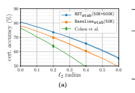

| Model                       | `∞ acc. at  = 2 255            | Standard acc.   |
|-----------------------------|------------|-----------------|
| RSTstab(50K+500K)           | 63.8 ± 0.5 | 80.7 ± 0.3      |
| Baselinestab(50K)           | 58.6 ± 0.4 | 77.9 ± 0.1      |
| Wong et al. (single) [50]   | 53.9       | 68.3            |
| Wong et al. (ensemble) [50] | 63.6       | 64.1            |
| IBP [17]                    | 50.0       | 70.2            |
|                             | (b)        |                 |

Figure 1: Certified defense. Guaranteed CIFAR-10 test accuracy under all `2 and `∞ attacks.

Stability-based robust self-training with 500K unlabeled Tiny Images (RSTstab(50K+500K)) outperforms stability training with only labeled data (Baselinestab(50K)). (a) Accuracy vs. `2 radius, certified via randomized smoothing [9]. Shaded regions indicate variation across 3 runs. Accuracy at `2 radius 0.435 implies accuracy at `∞ radius 2/255. (b) The implied `∞ certified accuracy is comparable to the state-of-the-art in methods that directly target `∞ robustness.
The model of Hendrycks et al. [18] is based on ImageNet adversarial pretraining and is less directly comparable to ours due to the difference in external data and training method. Finally, we perform standard self-training using the unlabeled data, which offers a moderate 0.4% improvement in standard accuracy over the intermediate model but is not adversarially robust (see Appendix C.6).

Certified robustness of RSTstab(50K+500K). Figure 1a shows the certified robust accuracy as a function of `2 perturbation radius for different models. We compare RSTadv(50K+500K) with [9],
which has the highest reported certified accuracy, and Baselinestab(50K), a model that we trained using only the CIFAR-10 training set and the same training configuration as RSTstab(50K+500K). RSTstab(50K+500K) improves on our Baselinestab(50K) by 3–5%. The gains of Baselinestab(50K)
over the previous state-of-the-art are due to a combination of better architecture, hyperparameters, and training objective (see Appendix B.5). The certified `2 accuracy is strong enough to imply state-of-the-art certified `∞ robustness via elementary norm bounds. In Figure 1b we compare RSTstab(50K+500K) to the state-of-the-art in certified `∞ robustness, showing a a 10% improvement over single models, and performance on par with the cascade approach of [50]. We also outperform the cascade model's standard accuracy by 16%.

## 5.1.3 Comparison To Alternatives And Ablations Studies

Consistency-based semisupervised learning (Appendix C.1). Virtual adversarial training
(VAT), a state-of-the-art method for (standard) semisupervised training of neural network [30, 33], is easily adapted to the adversarially-robust setting. We train models using adversarial- and stabilityflavored adaptations of VAT, and compare them to their robust self-training counterparts. We find that the VAT approach offers only limited benefit over fully-supervised robust training, and that robust self-training offers 3–6% higher accuracy.

Data augmentation (Appendix C.2). In the low-data/standard accuracy regime, strong data augmentation is competitive against and complementary to semisupervised learning [10, 51], as it effectively increases the sample size by generating different plausible inputs. It is therefore natural to compare state-of-the-art data augmentation (on the labeled data only) to robust self-training. We consider two popular schemes: Cutout [13] and AutoAugment [10]. While they provide significant benefit to standard accuracy, both augmentation schemes provide essentially no improvements when

| Model             | PGOurs     | No attack   |
|-------------------|------------|-------------|
| Baselineadv(73K)  | 75.3 ± 0.4 | 94.7 ± 0.2  |
| RSTadv(73K+531K)  | 86.0 ± 0.1 | 97.1 ± 0.1  |
| Baselineadv(604K) | 86.4 ± 0.2 | 97.5 ± 0.1  |

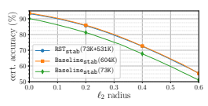

Baselineadv(73K) 75.3 ± 0.4 94.7 ± 0.2 RSTadv(73K+531K) 86.0 ± 0.1 97.1 ± 0.1 Baselineadv(604K) 86.4 ± 0.2 97.5 ± 0.1
Figure 2: SVHN test accuracy for robust training without the extra data, with unlabeled extra
(self-training), and with the labeled extra data. Left: Adversarial training and accuracies under
`∞ attack with  = 4/255. Right: Stability training and certified `2 accuracies as a function of perturbation radius. Most of the gains from extra data comes from the unlabeled inputs.

## We Add Them To Our Fully Supervised Baselines.

Relevance of unlabeled data (Appendix C.3). The theoretical analysis in Section 3 suggests that self-training performance may degrade significantly in the presence of irrelevant unlabeled data; other semisupervised learning methods share this sensitivity [33]. In order to measure the effect on robust self-training, we mix out unlabeled data sets with different amounts of random images from 80M-TI and compare the performance of resulting models. We find that stability training is more sensitive than adversarial training, and that both methods still yield noticeable robustness gains, even with only 50% relevant data.

Amount of unlabeled data (Appendix C.4). We perform robust self-training with varying amounts of unlabeled data and observe that 100K unlabeled data provide roughly half the gain provided by 500K unlabeled data, indicating diminishing returns as data amount grows. However, as we report in Appendix C.4, hyperparameter tuning issues make it difficult to assess how performance trends with data amount.

Amount of labeled data (Appendix C.5). Finally, to explore the complementary question of the effect of varying the amount of labels available for pseudo-label generation, we strip the labels of all but n0 CIFAR-10 images, and combine the remainder with our 500K unlabeled data. We observe that n0 = 8K labels suffice to to exceed the robust accuracy of the (50K labels) fully-supervised baselines for both adversarial training and the PGOurs attack, and certified robustness via stability training.

## 5.2 Street View House Numbers (Svhn)

The SVHN dataset [53] is naturally split into a core training set of about 73K images and an 'extra' training set with about 531K easier images. In our experiments, we compare three settings: (i) robust training on the core training set only, denoted Baseline*(73K), (ii) robust self-training with the core training set and the extra training images, denoted RST*(73K+531K), and (iii) robust training on all the SVHN training data, denoted Baseline*(604K). As in CIFAR-10, we experiment with both adversarial and stability training, so ∗ stands for either adv or stab.

Beyond validating the benefit of additional data, our SVHN experiments measure the loss inherent in using pseudo-labels in lieu of true labels. Figure 2 summarizes the results: the unlabeled provides significant gains in robust accuracy, and the accuracy drop due to using pseudo-labels is below 1%.

This reaffirms our intuition that in regimes of interest, *perfect labels are not crucial* for improving robustness. We give a detailed account of our SVHN experiments in Appendix D, where we also compare our results to the literature.

## 6 Related Work

Semisupervised learning. The literature on semisupervised learning dates back to beginning of machine learning [42, 8]. A recent family of approaches operate by enforcing consistency in the model's predictions under various perturbations of the unlabeled data [30, 51], or over the course of training [45, 40, 23]. While self-training has shown some gains in standard accuracy [25],
the consistency-based approaches perform significantly better on popular semisupervised learning benchmarks [33]. In contrast, our paper considers the very different regime of adversarial robustness, and we observe that robust self-training offers significant gains in robustness over fully-supervised methods. Moreover, it seems to outperform consistency-based regularization (VAT; see Section C.1).

We note that there are many additional approaches to semisupervised learning, including transductive SVMs, graph-based methods, and generative modeling [8, 58].

Self-training for domain adaptation. Self-training is gaining prominence in the related setting of *unsupervised domain adaptation* (UDA). There, the unlabeled data is from a "target" distribution, which is different from the "source" distribution that generates labeled data. Several recent approaches [cf. 27, 19] are based on approximating class-conditional distributions of the target domain via self-training, and then learning feature transformations that match these conditional distributions across the source and target domains. Another line of work [59, 60] is based on iterative self-training coupled with refinements such as class balance or confidence regularization. Adversarial robustness and UDA share the similar goal of learning models that perform well under some kind of distribution shift; in UDA we access the target distribution through unlabeled data while in adversarial robustness, we characterize target distributions via perturbations. The fact that self-training is effective in both cases suggests it may apply to distribution shift robustness more broadly. Training robust classifiers. The discovery of adversarial examples [44, 4, 3] prompted a flurry of "defenses" and "attacks." While several defenses were broken by subsequent attacks [7, 1, 6], the general approach of adversarial training [29, 43, 56] empirically seems to offer gains in robustness. Other lines of work attain *certified* robustness, though often at a cost to empirical robustness compared to heuristics [36, 49, 37, 50, 17]. Recent work by Hendrycks et al. [18] shows that even when pre-training has limited value for standard accuracy on benchmarks, adversarial pre-training is effective. We complement this work by showing that a similar conclusion holds for semisupervised learning (both practically and theoretically in a stylized model), and extends to certified robustness as well.

Sample complexity upper bounds. Recent works [52, 21, 2] study adversarial robustness from a learning-theoretic perspective, and in a number of simplified settings develop generalization bounds using extensions of Rademacher complexity. In some cases these upper bounds are demonstrably larger than their standard counterparts, suggesting there may be statistical barriers to robust learning.

Barriers to robustness. Schmidt et al. [41] show a sample complexity barrier to robustness in a stylized setting. We observed that in this model, unlabeled data is as useful for robustness as labeled data. This observation led us to experiment with robust semisupervised learning. Recent work also suggests other barriers to robustness: Montasser et al. [31] show settings where improper learning and surrogate losses are crucial in addition to more samples; Bubeck et al. [5] and Degwekar et al. [12] show possible computational barriers; Gilmer et al. [16] show a high-dimensional model where robustness is a consequence of any non-zero standard error, while Raghunathan et al. [38], Tsipras et al. [47], Fawzi et al. [15] show settings where robust and standard errors are at odds. Studying ways to overcome these additional theoretical barriers may translate to more progress in practice.

Semisupervised learning for adversarial robustness. Independently and concurrently with our work, Zhai et al. [55], Najafi et al. [32] and Uesato et al. [48] also study the use of unlabeled data in the adversarial setting. We briefly describe each work in turn, and then contrast all three with ours.

Zhai et al. [55] study the Gaussian model of [41] and show a PCA-based procedure that successfully leverages unlabeled data to obtain adversarial robustness. They propose a training procedure that at every step treats the current model's predictions as true labels, and experiment on CIFAR-10.

Their experiments include the standard semisupervised setting where some labels are removed, as well as the transductive setting where the test set is added to the training set without labels.

Najafi et al. [32] extend the distributionally robust optimization perspective of [43] to a semisupervised setting. They propose a training objective that replaces pseudo-labels with soft labels weighted according to an adversarial loss, and report results on MNIST, CIFAR-10, and SVHN with some training labels removed. The experiments in [55, 32] do not augment CIFAR-10 with new unlabeled data and do not improve the state-of-the-art in adversarial robustness.

The work of Uesato et al. [48] is the closest to ours—they also study self-training in the Gaussian model and propose a version of robust self-training which they apply on CIFAR-10 augmented with Tiny Images. Using the additional data they obtain new state-of-the-art results in heuristic defenses, comparable to ours. As our papers are very similar, we provide a detailed comparison in Appendix E.

Our paper offers a number of perspectives that complement [48, 55, 32]. First, in addition to heuristic defenses, we show gains in certified robustness where we have a guarantee on robustness against all possible attacks. Second, we study the impact of irrelevant unlabeled data theoretically
(Section 3.3) and empirically (Appendix C.3). Finally, we provide additional experimental studies of data augmentation and of the impact of unlabeled data amount when using all labels from CIFAR-10.

## 7 Conclusion

We show that unlabeled data closes a sample complexity gap in a stylized model and that robust self-training (RST) is consistently beneficial on two image classification benchmarks. Our findings open up a number of avenues for further research. Theoretically, is sufficient unlabeled data a universal cure for sample complexity gaps between standard and adversarially robust learning?

Practically, what is the best way to leverage unlabeled data for robustness, and can semisupervised learning similarly benefit alternative (non-adversarial) notions of robustness? As the scale of data grows, computational capacities increase, and machine learning moves beyond minimizing average error, we expect unlabeled data to provide continued benefit.

Reproducibility. Code, data, and experiments are available on GitHub at https://github.com/
yaircarmon/semisup-adv and on CodaLab at https://bit.ly/349WsAC.

## Acknowledgments

The authors would like to thank an anonymous reviewer for proposing the label amount experiment in Appendix C.5. YC was supported by the Stanford Graduate Fellowship. AR was supported by the Google Fellowship and Open Philanthropy AI Fellowship. PL was supported by the Open Philanthropy Project Award. JCD was supported by the NSF CAREER award 1553086, the Sloan Foundation and ONR-YIP N00014-19-1-2288.

## References

[1] A. Athalye, N. Carlini, and D. Wagner. Obfuscated gradients give a false sense of security:
Circumventing defenses to adversarial examples. *arXiv preprint arXiv:1802.00420*, 2018.

[2] I. Attias, A. Kontorovich, and Y. Mansour. Improved generalization bounds for robust learning.

In *Algorithmic Learning Theory*, pages 162–183, 2019.

[3] B. Biggio and F. Roli. Wild patterns: Ten years after the rise of adversarial machine learning.

Pattern Recognition, 84:317–331, 2018.

[4] B. Biggio, I. Corona, D. Maiorca, B. Nelson, N. Šrndić, P. Laskov, G. Giacinto, and F. Roli.

Evasion attacks against machine learning at test time. In Joint European conference on machine learning and knowledge discovery in databases, pages 387–402, 2013.

[5] S. Bubeck, E. Price, and I. Razenshteyn. Adversarial examples from computational constraints.

In *International Conference on Machine Learning (ICML)*, 2019.

[6] N. Carlini and D. Wagner. Adversarial examples are not easily detected: Bypassing ten detection methods. *arXiv*, 2017.

[7] N. Carlini and D. Wagner. Towards evaluating the robustness of neural networks. In IEEE
Symposium on Security and Privacy, pages 39–57, 2017.

[8] O. Chapelle, A. Zien, and B. Scholkopf. *Semi-Supervised Learning*. MIT Press, 2006.

[9] J. M. Cohen, E. Rosenfeld, and J. Z. Kolter. Certified adversarial robustness via randomized smoothing. In *International Conference on Machine Learning (ICML)*, 2019.

[10] E. D. Cubuk, B. Zoph, D. Mane, V. Vasudevan, and Q. V. Le. Autoaugment: Learning augmentation policies from data. In *Computer Vision and Pattern Recognition (CVPR)*, 2019.

[11] S. Dasgupta and L. Schulman. A probabilistic analysis of EM for mixtures of separated, spherical Gaussians. *Journal of Machine Learning Research (JMLR)*, 8, 2007.

[12] A. Degwekar, P. Nakkiran, and V. Vaikuntanathan. Computational limitations in robust classification and win-win results. In *Conference on Learning Theory (COLT)*, 2019.

[13] T. DeVries and G. W. Taylor. Improved regularization of convolutional neural networks with cutout. *arXiv preprint arXiv:1708.04552*, 2017.

[14] L. Engstrom, A. Ilyas, and A. Athalye. Evaluating and understanding the robustness of adversarial logit pairing. *arXiv preprint arXiv:1807.10272*, 2018.

[15] A. Fawzi, O. Fawzi, and P. Frossard. Analysis of classifiers' robustness to adversarial perturbations. *Machine Learning*, 107(3):481–508, 2018.

[16] J. Gilmer, L. Metz, F. Faghri, S. S. Schoenholz, M. Raghu, M. Wattenberg, and I. Goodfellow.

Adversarial spheres. *arXiv preprint arXiv:1801.02774*, 2018.

[17] S. Gowal, K. Dvijotham, R. Stanforth, R. Bunel, C. Qin, J. Uesato, T. Mann, and P. Kohli.

On the effectiveness of interval bound propagation for training verifiably robust models. arXiv preprint arXiv:1810.12715, 2018.

[18] D. Hendrycks, K. Lee, and M. Mazeika. Using pre-training can improve model robustness and uncertainty. In *International Conference on Machine Learning (ICML)*, 2019.

[19] N. Inoue, R. Furuta, T. Yamasaki, and K. Aizawa. Cross-domain weakly-supervised object detection through progressive domain adaptation. In *Proceedings of the IEEE conference on* computer vision and pattern recognition, pages 5001–5009, 2018.

[20] H. Kannan, A. Kurakin, and I. Goodfellow. Adversarial logit pairing. arXiv preprint arXiv:1803.06373, 2018.

[21] J. Khim and P. Loh. Adversarial risk bounds for binary classification via function transformation.

arXiv preprint arXiv:1810.09519, 2018.

[22] A. Krizhevsky. Learning multiple layers of features from tiny images. Technical report, University of Toronto, 2009.

[23] S. Laine and T. Aila. Temporal ensembling for semi-supervised learning. In *International* Conference on Learning Representations (ICLR), 2017.

[24] M. Lecuyer, V. Atlidakis, R. Geambasu, D. Hsu, and S. Jana. Certified robustness to adversarial examples with differential privacy. In *In IEEE Symposium on Security and Privacy (SP)*, 2019.

[25] D. Lee. Pseudo-label: The simple and efficient semi-supervised learning method for deep neural networks. In *International Conference on Machine Learning (ICML)*, 2013.

[26] B. Li, C. Chen, W. Wang, and L. Carin. Second-order adversarial attack and certifiable robustness. *arXiv preprint arXiv:1809.03113*, 2018.

[27] M. Long, J. Wang, G. Ding, J. Sun, and P. S. Yu. Transfer feature learning with joint distribution adaptation. In *Proceedings of the IEEE international conference on computer vision*, pages 2200–2207, 2013.

[28] I. Loshchilov and F. Hutter. Sgdr: Stochastic gradient descent with warm restarts. In International Conference on Learning Representations (ICLR), 2017.

[29] A. Madry, A. Makelov, L. Schmidt, D. Tsipras, and A. Vladu. Towards deep learning models resistant to adversarial attacks. In *International Conference on Learning Representations*
(ICLR), 2018.

[30] T. Miyato, S. Maeda, S. Ishii, and M. Koyama. Virtual adversarial training: a regularization method for supervised and semi-supervised learning. IEEE Transactions on Pattern Analysis and Machine Intelligence, 2018.

[31] O. Montasser, S. Hanneke, and N. Srebro. VC classes are adversarially robustly learnable, but only improperly. *arXiv preprint arXiv:1902.04217*, 2019.

[32] A. Najafi, S. Maeda, M. Koyama, and T. Miyato. Robustness to adversarial perturbations in learning from incomplete data. In *Advances in Neural Information Processing Systems*
(NeurIPS), 2019.

[33] A. Oliver, A. Odena, C. A. Raffel, E. D. Cubuk, and I. Goodfellow. Realistic evaluation of deep semi-supervised learning algorithms. In *Advances in Neural Information Processing Systems*
(NeurIPS), pages 3235–3246, 2018.

[34] N. Papernot, F. Faghri, N. C., I. Goodfellow, R. Feinman, A. Kurakin, C. X., Y. Sharma, T. Brown, A. Roy, A. M., V. Behzadan, K. Hambardzumyan, Z. Z., Y. Juang, Z. Li, R. Sheatsley, A. G., J. Uesato, W. Gierke, Y. Dong, D. B., P. Hendricks, J. Rauber, and R. Long. Technical report on the cleverhans v2.1.0 adversarial examples library. *arXiv preprint arXiv:1610.00768*,
2018.

[35] A. Paszke, S. Gross, S. Chintala, G. Chanan, E. Yang, Z. DeVito, Z. Lin, A. Desmaison, L. Antiga, and A. Lerer. Automatic differentiation in pytorch, 2017.

[36] A. Raghunathan, J. Steinhardt, and P. Liang. Certified defenses against adversarial examples.

In *International Conference on Learning Representations (ICLR)*, 2018.

[37] A. Raghunathan, J. Steinhardt, and P. Liang. Semidefinite relaxations for certifying robustness to adversarial examples. In *Advances in Neural Information Processing Systems (NeurIPS)*,
2018.

[38] A. Raghunathan, S. M. Xie, F. Yang, J. C. Duchi, and P. Liang. Adversarial training can hurt generalization. *arXiv preprint arXiv:1906.06032*, 2019.

[39] B. Recht, R. Roelofs, L. Schmidt, and V. Shankar. Do CIFAR-10 classifiers generalize to CIFAR-10? *arXiv*, 2018.

[40] M. Sajjadi, M. Javanmardi, and T. Tasdizen. Regularization with stochastic transformations and perturbations for deep semi-supervised learning. In Advances in Neural Information Processing Systems (NeurIPS), pages 1163–1171, 2016.

[41] L. Schmidt, S. Santurkar, D. Tsipras, K. Talwar, and A. Madry. Adversarially robust generalization requires more data. In *Advances in Neural Information Processing Systems (NeurIPS)*,
pages 5014–5026, 2018.

[42] H. Scudder. Probability of error of some adaptive pattern-recognition machines. *IEEE Transactions on Information Theory*, 11(3):363–371, 1965.

[43] A. Sinha, H. Namkoong, and J. Duchi. Certifiable distributional robustness with principled adversarial training. In *International Conference on Learning Representations (ICLR)*, 2018.

[44] C. Szegedy, W. Zaremba, I. Sutskever, J. Bruna, D. Erhan, I. Goodfellow, and R. Fergus. Intriguing properties of neural networks. In *International Conference on Learning Representations*
(ICLR), 2014.

[45] A. Tarvainen and H. Valpola. Mean teachers are better role models: Weight-averaged consistency targets improve semi-supervised deep learning results. In Advances in neural information processing systems, pages 1195–1204, 2017.

[46] A. Torralba, R. Fergus, and W. T. Freeman. 80 million tiny images: A large data set for nonparametric object and scene recognition. IEEE transactions on pattern analysis and machine intelligence, 30(11):1958–1970, 2008.

[47] D. Tsipras, S. Santurkar, L. Engstrom, A. Turner, and A. Madry. Robustness may be at odds with accuracy. In *International Conference on Learning Representations (ICLR)*, 2019.

[48] J. Uesato, J. Alayrac, P. Huang, R. Stanforth, A. Fawzi, and P. Kohli. Are labels required for improving adversarial robustness? In *Advances in Neural Information Processing Systems*
(NeurIPS), 2019.

[49] E. Wong and J. Z. Kolter. Provable defenses against adversarial examples via the convex outer adversarial polytope. In *International Conference on Machine Learning (ICML)*, 2018.

[50] E. Wong, F. Schmidt, J. H. Metzen, and J. Z. Kolter. Scaling provable adversarial defenses. In Advances in Neural Information Processing Systems (NeurIPS), 2018.

[51] Q. Xie, Z. Dai, E. Hovy, M. Luong, and Q. V. Le. Unsupervised data augmentation. arXiv preprint arXiv:1904.12848, 2019.

[52] D. Yin, R. Kannan, and P. Bartlett. Rademacher complexity for adversarially robust generalization. In *International Conference on Machine Learning (ICML)*, pages 7085–7094, 2019.

[53] N. Yuval, W. Tao, C. Adam, B. Alessandro, W. Bo, and N. A. Y. Reading digits in natural images with unsupervised feature learning. In NIPS Workshop on Deep Learning and Unsupervised Feature Learning, 2011.

[54] S. Zagoruyko and N. Komodakis. Wide residual networks. In *British Machine Vision Conference*,
2016.

[55] R. Zhai, T. Cai, D. He, C. Dan, K. He, J. Hopcroft, and L. Wang. Adversarially robust generalization just requires more unlabeled data. *arXiv preprint arXiv:1906.00555*, 2019.

[56] H. Zhang, Y. Yu, J. Jiao, E. P. Xing, L. E. Ghaoui, and M. I. Jordan. Theoretically principled trade-off between robustness and accuracy. In *International Conference on Machine Learning*
(ICML), 2019.

[57] S. Zheng, Y. Song, T. Leung, and I. Goodfellow. Improving the robustness of deep neural networks via stability training. In *Proceedings of the ieee conference on computer vision and* pattern recognition, pages 4480–4488, 2016.

[58] X. Zhu, Z. Ghahramani, and J. D. Lafferty. Semi-supervised learning using gaussian fields and harmonic functions. In *International Conference on Machine Learning (ICML)*, pages 912–919, 2003.

[59] Y. Zou, Z. Yu, B. V. Kumar, and J. Wang. Unsupervised domain adaptation for semantic segmentation via class-balanced self-training. In *European Conference on Computer Vision*
(ECCV), pages 289–305, 2018.

[60] Y. Zou, Z. Yu, X. Liu, B. Kumar, and J. Wang. Confidence regularized self-training. arXiv preprint arXiv:1908.09822, 2019.

## Supplementary Material A Theoretical Results

This appendix contains the full proofs for the results in Section 3, as well as explicit bounds for the robust error of the self-training estimator.

We remark that the results of this section easily extend to the case where there is class imbalance:
The upper bounds in Proposition 1 and Theorem 2 hold regardless of the label distribution, while the lower bound in Theorem 1 changes from 12
(1 − d
−1) to p(1 − d
−1) where p is the proportion of the smaller class; the only change to the proof in [41] is a modification of the lower bound on Ψ in page 29 of the arxiv version.

## A.1 Error Probabilities In Closed Form

We recall our model x ∼ N *yµ, σ*2Iwith y uniform on {−1, 1} and µ ∈ R
n. Consider a linear classifier fθ (x) = sign x
>θ. Then the standard error probability is

$$\mathsf{err}_{\text{standard}}\left(f_{\theta}\right)=\mathbb{P}\left(y\cdot x^{\top}\theta<0\right)=\mathbb{P}\left(\mathcal{N}\left(\frac{\mu^{\top}\theta}{\sigma\left\|\theta\right\|},1\right)<0\right)=:Q\left(\frac{\mu^{\top}\theta}{\sigma\left\|\theta\right\|}\right)\tag{10}$$

where

$$Q\left(x\right)={\frac{1}{\sqrt{2\pi}}}\int_{x}^{\infty}e^{-t^{2}/2}d t$$

is the Gaussian error function. For linear classifier fθ, input x and label y, the strongest adversarial perturbation of x with `∞ norm  moves each coordinate of x by −sign (yθ). The robust error probability is therefore

$$\text{err}_{\text{robust}}^{\infty,\epsilon}\left(f_{\theta}\right)=\mathbb{P}\left(\inf_{\left\|\nu\right\|_{\infty}\leq\epsilon}\left\{y\cdot\left(x+\nu\right)^{\top}\theta\right\}<0\right)$$ $$=\mathbb{P}\left(y\cdot x^{\top}\theta-\epsilon\left\|\theta\right\|_{1}<0\right)=\mathbb{P}\left(\mathcal{N}\left(\mu^{\top}\theta,\left(\sigma\left\|\theta\right\|\right)^{2}\right)<\epsilon\left\|\theta\right\|_{1}\right)$$ $$=Q\left(\frac{\mu^{\top}\theta}{\sigma\left\|\theta\right\|}-\frac{\epsilon\left\|\theta\right\|_{1}}{\sigma\left\|\theta\right\|}\right)\leq Q\left(\frac{\mu^{\top}\theta}{\sigma\left\|\theta\right\|}-\frac{\epsilon\sqrt{d}}{\sigma}\right).\tag{11}$$

In this model, standard and robust accuracies align in the sense that any highly accurate standard classifier, with µ>θ kθk > √d, will necessarily also be robust. Moreover, for dense µ (with kµk1
/ kµk =
Ω(√d)), good linear estimators will typically be dense as well, in which case µ>θ σkθk determines both standard and robust accuracies. Our analysis will consequently focus on understanding the quantity µ>θ σkθk
.

## A.1.1 Optimal Standard Accuracy And Parameter Setting

We note that for a given problem instance, the classifier that minimizes the standard error is simply θ
? = µ. Its standard error is

$$\mathsf{erf_{\mathrm{standard}}}\left(f_{\theta^{\star}}\right)=Q\left({\frac{\|\mu\|}{\sigma}}\right)\leq e^{-\|\mu\|^{2}/2\sigma^{2}}.$$

Recall our parameter setting,

$$\epsilon\leq\frac{1}{2},\ \sigma=\left(n_{0}d\right)^{1/4},\ \text{and}\ \left\|\mu\right\|^{2}=d.\tag{12}$$  Under this setting, $\frac{\left\|\mu\right\|}{\sigma}=\left(\frac{d}{n_{0}}\right)^{1/4}$ and we have  $$\mathsf{err}_{\text{standard}}\left(f_{\theta^{*}}\right)=Q\left(\left(\frac{d}{n_{0}}\right)^{1/4}\right)\leq e^{-\frac{1}{2}\sqrt{d/n_{0}}}\ \text{and}\ \mathsf{err}_{\text{product}}^{\infty,\epsilon}\left(f_{\theta^{*}}\right)\leq Q\left(\left(1-\epsilon\right)\left(\frac{d}{n_{0}}\right)^{1/4}\right)\leq e^{-\frac{1}{2}\sqrt{d/n_{0}}}.$$

Therefore, in the regime d/n0  1, the classifier θ
? achieves essentially perfect accuracies, both standard and robust. We will show that estimating θ from n0 labeled data and a large number
(≈pd/n0) of unlabeled data allows us to approach the performance of θ
?, without prior knowledge of µ.

## A.2 Performance Of Supervised Estimator

Given labeled data set (x1, y1), . . . ,(xn, yn) we consider the linear classifier given by

$${\hat{\theta}}_{n}={\frac{1}{n}}\sum_{i=1}^{n}y_{i}x_{i}.$$

In the following lemma we give a tight concentration bound for µ
> ˆθn/
σ ˆθn

, which determines the standard and robust error probabilities of fθˆn via equations (10) and (11) respectively Lemma 1. *There exist numerical constants* c0, c1, c2 *such that under parameter setting (12) and* d/n0 > c0,

$$\frac{\mu^{\top}\tilde{\theta}_{\text{in}}}{\sigma\left\|\tilde{\theta}_{n}\right\|}\geq\left(\sqrt{\frac{n_{0}}{d}}+\frac{n_{0}}{n}\left(1+c_{1}\left(\frac{n_{0}}{d}\right)^{1/8}\right)\right)^{-1/2}\quad\text{with probability}\geq1-e^{-c_{2}(d/n_{0})^{1/4}\min\left\{n,(d/n_{0})^{1/4}\right\}}.$$
 *Proof.* We have $\theta$. 
$${\hat{\theta}}_{n}\sim{\mathcal{N}}\left(\mu,{\frac{\sigma^{2}}{n}}I\right){\mathrm{~so~that~}}\delta:={\hat{\theta}}_{n}-\mu\sim{\mathcal{N}}\left(0,{\frac{\sigma^{2}}{n}}I\right).$$

To lower bound the random variable µ>θˆn kθˆnk we consider its squared inverse, and decompose it as follows

$$\frac{\left\|\hat{\theta}_{n}\right\|^{2}}{\left(\mu^{\top}\hat{\theta}_{n}\right)^{2}}=\frac{\left\|\delta+\mu\right\|^{2}}{\left(\left\|\mu\right\|^{2}+\mu^{\top}\delta\right)^{2}}=\frac{1}{\left\|\mu\right\|^{2}}+\frac{\left\|\delta\right\|^{2}-\frac{1}{\left\|\mu\right\|^{2}}\left(\mu^{\top}\delta\right)^{2}}{\left(\left\|\mu\right\|^{2}+\mu^{\top}\delta\right)^{2}}$$ $$\leq\frac{1}{\left\|\mu\right\|^{2}}+\frac{\left\|\delta\right\|^{2}}{\left(\left\|\mu\right\|^{2}+\mu^{\top}\delta\right)^{2}}$$

To obtain concentration bounds, we note that

$$\|\delta\|^{2}\sim\frac{\sigma^{2}}{n}\chi_{d}^{2}\;\;\mathrm{and}\;\;\frac{\mu^{\top}\delta}{\|\mu\|}\sim\mathcal{N}\left(0,\frac{\sigma^{2}}{n}\right).$$

17 Therefore, standard concentration results give

P  kδk 2 ≥ σ 2d n 1 + 1 σ  ≤ e −d/8σ 2and P µ >δ kµk ≥ (σ kµk) 1/2  ≤ 2e − 12 nkµk/σ. (13) Assuming that the two events kδk 2 ≤ σ 2d n1 + 1σ andµ >δ ≤ σ 1/2 kµk 3/2hold, we have  ˆθn  2 kµk 2 + σ 2d n1 + 1σ  µ> ˆθn 2 ≤ 1 kµk 41 − (σ/ kµk) 1/22 .

$\square$
Substituting the parameter setting setting (12), we have that for d/n0 sufficiently large,

$$\frac{\sigma^{2}\left\|\hat{\theta}_{n}\right\|^{2}}{\left(\mu^{\top}\hat{\theta}_{n}\right)^{2}}\leq\sqrt{\frac{n_{0}}{d}}+\frac{\frac{n_{0}d^{2}}{n}\left(1+\left(n_{0}d\right)^{-1/4}\right)}{d^{2}\left(1-\left(n_{0}/d\right)^{1/8}\right)}\leq\sqrt{\frac{n_{0}}{d}}+\frac{n_{0}}{n}\left(1+c_{1}\left(n_{0}/d\right)^{1/8}\right)$$  for some numerical constant $c_{1}$. For this to imply the bound stated in the lemma we also need 
µ
> ˆθn ≥ 0 to hold, but this is already implied by
$$\mu^{\top}\hat{\theta}_{n}=\|\mu\|^{2}+\mu^{\top}\delta\geq\|\mu\|^{2}\left(1-(\sigma/\|\mu\|)^{-1/2}\right)\geq d\left(1-\left(\frac{n_{0}}{d}\right)^{1/8}\right)>0.$$

Substituting the parameters settings into the concentration bounds (13), we have by the union bound that the desired upper bound fails to hold with probability at most

$$e^{-d/8\sqrt{n_{0}d}}+2e^{-n\sqrt{d}/2(n_{0}d)^{1/4}}\leq e^{-c_{2}(d/n_{0})^{1/4}\operatorname*{min}\left\{n,(d/n_{0})^{1/4}\right\}}$$

for another numerical constant c2 and d/n0 > 1.

As an immediate corollary to Lemma 1, we obtain the sample complexity upper bounds cited in the main text.

Proposition 1. There exists a universal constant r *such that for all* 2pd/n0 ≥ r,

$$n\geq n_{0}\ \Rightarrow\ \mathbb{E}_{\hat{\theta}_{n}}\mathsf{erf}_{\mathrm{standard}}\left(f_{\hat{\theta}_{n}}\right)\leq\frac{1}{3}\quad\text{and}\quad n\geq n_{0}\cdot4e^{2}\sqrt{\frac{d}{n_{0}}}\ \Rightarrow\ \mathbb{E}_{\hat{\theta}_{n}}\mathsf{erf}_{\mathrm{robust}}^{\infty,\epsilon}\left(f_{\hat{\theta}_{n}}\right)\leq10^{-3}.$$  _Proof._ For the case $n\geq n_{0}$ we take $r$ sufficiently large such that by Lemma 1 we have 
Proof. For the case n ≥ n0 we take r sufficiently large such that by Lemma 1 we have

$${\frac{\mu^{\top}\hat{\theta}_{n}}{\sigma\left\|\hat{\theta}_{n}\right\|}}\geq{\frac{1}{\sqrt{2\left({\frac{n_{0}}{n}}+{\sqrt{\frac{n_{0}}{d}}}\right)}}}\geq{\frac{1}{2}}{\mathrm{~with~probability~}}\geq1-e^{-c_{2}{\sqrt{d/n_{0}}}}$$

for an appropriate c2. Therefore by the expression (10) for the standard error probability (and the fact that it is never more than 1), we have

$$\mathbb{E}_{\hat{\theta}_{n}}\mathsf{err}_{\mathrm{standard}}\left(f_{\hat{\theta}_{n}}\right)\leq Q\left({\frac{1}{2}}\right)+e^{-c_{2}(d/n_{0})^{1/8}}\leq{\frac{1}{3}}$$

for appropriate r. Similarly, for the case n ≥ n0 · 4 2q d n0 we apply Lemma 1 combined with  < 12 to write

$${\frac{\mu^{\top}{\hat{\theta}}_{n}}{\sigma\left\|{\hat{\theta}}_{n}\right\|}}\geq{\frac{1}{\sqrt{2\left({\frac{n_{0}}{n}}+{\sqrt{\frac{n_{0}}{d}}}\right)}}}\geq{\frac{1}{\sqrt{2\left({\frac{n_{0}}{4\epsilon^{2}{\sqrt{n_{0}d}}}}+{\frac{1}{4\epsilon^{2}}}{\sqrt{\frac{n_{0}}{d}}}\right)}}}={\sqrt{2}}\epsilon\left({\frac{d}{n_{0}}}\right)^{1/4}$$

with probability ≥ 1 − e
−c2(d/n0)
1/4 min{n,(d/n0)
1/4}. Therefore, using the expression (11) and σ =
(n0d)
1/4, we have (using n ≥ 
2(d/n0)
1/4)

$$\mathbb{E}_{\hat{\theta}_{n}}\epsilon r_{\mathrm{robust}}^{\infty,\epsilon}\left(f_{\hat{\theta}_{n}}\right)\leq Q\left(\left[\sqrt{2}-1\right]\epsilon(d/n_{0})^{1/4}\right)+e^{-\epsilon^{2}c_{2}\sqrt{d/n_{0}}}\leq10^{-3},$$

for sufficiently large r.

## A.3 Lower Bound

We now briefly explain how to translate the sample complexity lower bound of Schmidt et al. [41]
into our parameter setting.

Theorem 1 (Schmidt et al. [41]). Let An be any learning rule mapping a dataset S ∈ (*X × Y*)
nto classifier An[S]*. Then,*

$\square$
$$n\leq n_{0}\frac{e^{2}\sqrt{d/n_{0}}}{8\log d}\ \Rightarrow\ \mathbb{E}\,\mbox{erf}_{\rm robust}^{\infty,\epsilon}(\mbox{A}_{n}[S])\geq\frac{1}{2}(1-d^{-1}),\tag{5}$$
where the expectation is with respect to the random draw of S ∼ P
n x,y *as well as possible randomization* in An.

Proof. The setting of our theorem is identical to that of Theorem 11 in Schmidt et al. [41], which
shows that  $$\mathbb{E}\,\mathsf{erf}_{\mathrm{robust}}^{\infty,\epsilon}(\mathsf{A}_{n}[S])\geq\frac{1}{2}\mathbb{P}\left(\|\mathcal{N}\left(0,I\right)\|_{\infty}\leq\epsilon\sqrt{1+\frac{\sigma^{2}}{n}}\right).$$  Using $\sigma^{2}=\sqrt{n_{0}d}$, $n\leq\frac{\epsilon^{2}\sqrt{n_{0}d}}{8\log d}$ implies $\epsilon\sqrt{1+\frac{\sigma^{2}}{n}}\geq\sqrt{8\log d}$ and therefore  $$\mathbb{E}\,\mathsf{erf}_{\mathrm{robust}}^{\infty,\epsilon}(\mathsf{A}_{n}[S])\geq\frac{1}{2}\mathbb{P}\left(\|\mathcal{N}\left(0,I\right)\|_{\infty}\leq\sqrt{8\log d}\right).$$

Moreover

$$\mathbb{P}\left(\|{\mathcal{N}}\left(0,I\right)\|_{\infty}\leq{\sqrt{8\log d}}\right)=\left(1-Q\left({\sqrt{8\log d}}\right)\right)^{d}\geq\left(1-e^{-4\log d}\right)^{d}\geq1-{\frac{1}{d}}.$$

## A.4 Performance Of Semisupervised Estimator

We now consider the semisupervised setting—our primary object of study in this paper. We consider the self-training estimator that in the first stage uses n ≥ n0 labeled examples to construct ˆθintermediate := ˆθn, and then uses it to produce pseudo-labels

$$\tilde{y}_{i}=\mathrm{sign}\left(\tilde{x}_{i}^{\top}\hat{\theta}_{\mathrm{intermediate}}\right)$$

for the n˜ unlabeled data points x˜1*, . . . ,* x˜n˜. In the second and final stage of self-training, we employ the same simple learning rule on the pseudo-labeled data and construct

$$\hat{\theta}_{\mathrm{final}}:=\frac{1}{\tilde{n}}\sum_{i=1}^{\tilde{n}}\tilde{y}_{i}\tilde{x}_{i}.$$
$\square$
The following result shows a high-probability bound on µ>θˆfinal σkθˆfinalk
, analogous to the one obtained for the fully supervised estimator in Lemma 1 (with different constant factors).

Lemma 2. There exist numerical constants c˜0, c˜1, c˜2 > 0 such that under parameter setting (12)
and d/n0 > c˜0,

$$\frac{\mu^{\top}\hat{\theta}_{\mathrm{final}}}{\sigma\left\|\hat{\theta}_{\mathrm{final}}\right\|}\geq\left(\sqrt{\frac{n_{0}}{d}}+\frac{72n_{0}}{\hat{n}}\left(1+\tilde{c}_{1}\left(\frac{n_{0}}{d}\right)^{-1/4}\right)\right)^{-1/2},$$  $$e^{-\tilde{c}_{2}\operatorname*{min}\left\{\hat{n},n_{0}(d/n_{0})^{1/4},\sqrt{d/n_{0}}\right\}}.$$
with probability ≥ 1 − e
Proof. The proof follows a similar argument to the one used to prove Lemma 1, except now we have to to take care of the fact that the noise component in ˆθfinal is not entirely Gaussian. Let bi be the indicator that the ith pseudo-label is incorrect, so that x˜i ∼ N (1 − 2bi) ˜yi*µ, σ*2I, and let

$$\gamma:=\frac{1}{\tilde{n}}\sum_{i=1}^{\tilde{n}}\left(1-2b_{i}\right)\in[-1,1].$$

We may write the final estimator as

$${\hat{\theta}}_{\mathrm{final}}={\frac{1}{{\tilde{n}}}}\sum_{i=1}^{{\tilde{n}}}{\tilde{y}}_{i}{\tilde{x}}_{i}=\gamma\mu+{\frac{1}{{\tilde{n}}}}\sum_{i=1}^{{\tilde{n}}}{\tilde{y}}_{i}\varepsilon_{i}$$

where εi ∼ N 0, σ2Iindependent of each other. Defining

$$\tilde{\delta}:=\hat{\theta}_{\mathrm{final}}-\gamma\mu$$

we have the decomposition and bound

 ˆθfinal  2  ˜δ + γµ  2 kµk 2 +  ˜δ + γµ  2 −1 kµk 2 γ kµk 2 + µ >˜δ 2 γ kµk 2 + µ>˜δ 2 = 1 µ> ˆθfinal2 = γ kµk 2 + µ>˜δ 2 =1 kµk 2 + k ˜δk 2 −1 kµk 2 µ >˜δ 2 kµk 2 +k ˜δk 2 γ kµk 2 + µ>˜δ  ≤ 1 kµk 4γ +1 kµk 2 µ>˜δ 2 . (14)
To write down concentration bounds for k
˜δk 2 and µ
>˜δ we must address their non-Gaussianity.

To do so, choose a coordinate system such that the first coordinate is in the direction of ˆθintermediate, and let v
(i) denote the ith entry of vector v in this coordinate system. Then

$$\tilde{y}_{i}=\mathrm{sign}\left(\tilde{x}_{i}^{(1)}\right)=\mathrm{sign}\left(\mu^{(1)}+\varepsilon_{i}^{(1)}\right).$$

Consequently, ε
(j)
iis independent of y˜i for all i and j ≥ 2, so that y˜iε
(j)
i ∼ N 0, σ2and 1 n˜
Pn˜
i=1 y˜iε
(j)
i ∼ N 0, σ2/n˜and

$$\sum_{j=2}^{d}\left(\frac{1}{\tilde{n}}\sum_{i=1}^{\tilde{n}}\tilde{y}_{i}\varepsilon_{i}^{(j)}\right)^{2}\sim\frac{\sigma^{2}}{\tilde{n}}\chi_{d-1}^{2}.$$

Moreover, we have by Cauchy–Schwarz

$$\left(\frac{1}{\bar{n}}\sum_{i=1}^{\bar{n}}\hat{y}_{i}\varepsilon_{i}^{(1)}\right)^{2}\leq\frac{1}{\bar{n}^{2}}\left(\sum_{i=1}^{\bar{n}}\hat{y}_{i}^{2}\right)\left(\sum_{i=1}^{\bar{n}}\left[\varepsilon_{i}^{(1)}\right]^{2}\right)=\frac{1}{\bar{n}}\sum_{i=1}^{\bar{n}}\left[\varepsilon_{i}^{(1)}\right]^{2}\sim\frac{\sigma^{2}}{\bar{n}}\chi_{\bar{n}}^{2}.$$  Therefore, since $\|\hat{\delta}\|^{2}=\sum_{j=1}^{d}\left(\frac{1}{\bar{n}}\sum_{i=1}^{\bar{n}}\hat{y}_{i}\varepsilon_{i}^{(j)}\right)^{2}$, we have by the union bound 
$$\mathbb{P}\left(\|\hat{d}\|^{2}\geq2\frac{\sigma^{2}}{\hat{n}}\left(d-1+\hat{n}\right)\right)\leq\mathbb{P}\left(\chi_{\hat{n}}^{2}\geq2\hat{n}\right)+\mathbb{P}\left(\chi_{d-1}^{2}\geq2\left(d-1\right)\right)\leq e^{-\hat{n}/8}+e^{-(d-1)/8}.\tag{15}$$

The same technique also yields a crude bound on µ
>˜δ =
1 n˜
Pn˜
i=1 y˜iµ
>εi. Namely, we have

µ >˜δ 2≤1 n˜ 2  Xn˜ i=1 y˜ 2 i ! Xn˜ i=1 µ >εi 2!= 1 n˜ Xn˜ i=1 µ >εi 2∼ σ 2 kµk 2 n˜ χ 2 n˜ P µ >˜δ  ≥ √2σ kµk = P µ >˜δ  2 ≥ 2σ 2kµk 2  ≤ e −n/˜ 8.
and therefore

Finally, we need to argue that γ is not too small. Recall that γ =
1 n˜
Pn˜
i=1 (1 − 2bi) where biis the indicator that y˜iis incorrect and therefore

$$\mathbb{E}\left[\gamma\mid\hat{\theta}_{\text{intermediate}}\right]=1-2\mathsf{err}_{\text{standard}}(f_{\hat{\theta}_{\text{intermediate}}}),$$  and below, we have 

so we expect γ to be reasonably large as long as errstandard(fθˆintermediate
) <
1 2
. Indeed,

$$\mathbb{P}\left(\gamma<\frac{1}{6}\right)=\mathbb{P}\left(\frac{1}{\tilde{n}}\sum_{i=1}^{\tilde{n}}\left(1-2b_{i}\right)<\frac{1}{6}\right)$$ $$\leq\mathbb{P}\left(\text{err}_{\text{standard}}(f_{\theta_{\text{intermediate}}})>\frac{1}{3}\right)+\mathbb{P}\left(\frac{1}{\tilde{n}}\sum_{i=1}^{\tilde{n}}b_{i}<\frac{5}{12}\mid\text{err}_{\text{standard}}(f_{\theta_{\text{intermediate}}})\leq\frac{1}{3}\right).$$  Note that 

Note that1
$$\frac{1}{3}\geq Q\left(\frac{1}{2}\right)\geq Q\left(\left[2\left(1+\sqrt{n_{0}/d}\right)\right]^{-1/2}\right),$$  $\cdot$ sufficiently large $d/n_{0}$
Therefore, by Lemma 1, for sufficiently large d/n0,

$$\mathbb{P}\left(\mathsf{err}_{\text{standard}}(f_{\hat{\theta}_{\text{intermediate}}})>\frac{1}{3}\right)\leq e^{-c\cdot\min\left\{\sqrt{d/n_{0}},n_{0}(d/n_{0})^{1/4}\right\}}.$$

for some constant c. Moreover, by Bernoulli concentration (Hoeffding's inequality) we have that

$$\mathbb{P}\left({\frac{1}{\hat{n}}}\sum_{i=1}^{\hat{n}}b_{i}<{\frac{5}{12}}\mid\mathsf{err}_{\mathrm{standard}}(f_{\theta_{\mathrm{intermediate}}})\leq{\frac{1}{3}}\right)\leq e^{-2{\hat{n}}\left({\frac{5}{12}}-{\frac{1}{3}}\right)^{2}}=e^{-{\hat{n}}/72}.$$

Define the event,

$${\mathcal{E}}=\left\{\|{\tilde{\delta}}\|^{2}\geq2{\frac{\sigma^{2}}{{\tilde{n}}}}\left(d+{\tilde{n}}\right),\ \left|\mu^{\top}{\tilde{\delta}}\right|\leq{\sqrt{2}}\sigma\left\|\mu\right\|\ \ \mathrm{and}\ \gamma\geq{\frac{1}{6}}\right\};$$

21 by the preceding discussion,

$$\mathbb{P}\left(\mathcal{E}^{C}\right)\leq2e^{-\bar{n}/8}+e^{-(d-1)/8}+e^{-c\min\left\{\sqrt{d/m_{0}},m_{0}(d/m_{0})^{1/4}\right\}}+e^{-\bar{n}/72}\leq e^{-\bar{n}_{2}\min\left\{\bar{n},\sqrt{d/m_{0}},m_{0}(d/m_{0})^{1/4}\right\}}.$$

Moreover, by the bound (14), E implies

$$\frac{\left\|\hat{\theta}_{\mathrm{final}}\right\|^{2}}{\left(\mu^{\top}\hat{\theta}_{\mathrm{final}}\right)^{2}}\leq\frac{1}{\|\mu\|^{2}}+\frac{2\sigma^{2}\left(d+\tilde{n}\right)}{\tilde{n}\left\|\mu\right\|^{4}\left(\frac{1}{6}-\frac{\sqrt{2}\sigma}{\|\mu\|}\right)^{2}}.$$

Substituting σ = (n0d)
1/4and kµk =
√d and multiplying by σ 2 gives

$$\begin{array}{c}{{\frac{\sigma^{2}\left\|\hat{\theta}_{\mathrm{final}}\right\|^{2}}{\left(\mu^{\top}\hat{\theta}_{\mathrm{final}}\right)^{2}}\leq\sqrt{\frac{n_{0}}{d}}+\frac{2\left(n_{0}d\right)\left(d+\tilde{n}\right)}{\tilde{n}d^{2}\left(\frac{1}{6}-\sqrt{2}\left(\frac{n_{0}}{d}\right)^{1/4}\right)^{2}}}}\\ {{\leq\sqrt{\frac{n_{0}}{d}}+\frac{72n_{0}}{\tilde{n}}\left(1+\tilde{c}_{1}\left(\frac{n_{0}}{d}\right)^{-1/4}\right).}}\end{array}$$

for appropriate c˜1 and sufficiently large d/n0. As argued in Lemma 1, the event E already implies µ
> ˆθfinal ≥ 0, and therefore the result follows.

Lemma 2 immediately gives a sample complexity upper bound for the self-training classifier ˆθfinal trained with n labeled data and n˜ unlabeled data.

Theorem 2. There exists a universal constant r˜ *such that for* 2pd/n0 ≥ r˜, n ≥ n0 labeled data and additional n˜ *unlabeled data,*

$$\hat{n}\geq n_{0}\cdot288\epsilon^{2}\sqrt{\frac{d}{n_{0}}}\;\Rightarrow\;\mathbb{E}_{\hat{\theta}_{\mathrm{final}}}\mathsf{err}_{\mathrm{robust}}^{\infty,\epsilon}\left(f_{\hat{\theta}_{\mathrm{final}}}\right)\leq10^{-3}.$$

Proof. We take r˜ sufficiently large so that by Lemma 2 we have, using σ = (n0d)
1/4and  < 12
,

$${\frac{\mu^{\top}\hat{\theta}_{n}}{\sigma\left\|\hat{\theta}_{n}\right\|}}\geq{\frac{1}{\sqrt{2\left({\frac{72n_{0}}{n}}+{\sqrt{\frac{n_{0}}{d}}}\right)}}}\geq{\frac{1}{\sqrt{2\left({\frac{n_{0}}{4\epsilon^{2}{\sqrt{n_{0}d}}}}+{\frac{1}{4\epsilon^{2}}}{\sqrt{\frac{n_{0}}{d}}}\right)}}}={\sqrt{2}}\epsilon\left({\frac{d}{n_{0}}}\right)^{1/4}$$

with probability ≥ 1 − e
−c˜2 minnn,n ˜ 0(d/n0)
1/4,
√d/n0 o
≥ 1 − e
−
2c˜2(d/n0)
1/4. Therefore, using the expression (11) and σ = (n0d)
1/4, we have (using n ≥ 
2(d/n0)
1/4)

$$\mathbb{E}_{\hat{\theta}_{n}}\mathbf{e}\mathbf{r}_{\mathrm{robust}}^{\infty,\epsilon}\left(f_{\hat{\theta}_{n}}\right)\leq Q\left(\left[\sqrt{2}-1\right]\epsilon(d/n_{0})^{1/4}\right)+e^{-\epsilon^{2}\hat{c}_{2}(d/n_{0})^{1/4}}\leq10^{-3},$$

for sufficiently large r˜.

## A.5 Performance In The Presence Of Irrelevant Data

To model the presence of irrelevant data, we consider a slightly different model where, for α ∈ (0, 1),
αn˜ of the unlabeled data are distributed as Nyi*µ, σ*2Ias before, while the other (1 − α) ˜n unlabeled data are drawn from N0, σ2I(with no signal component). We note that similar conclusions would hold if we let the irrelevant unlabeled data be drawn from Nµ2, σ2Ifor some µ2 such thatµ
>µ2


$$\square$$

is sufficiently small, for example µ2 ∼ N (0, I) independent of µ. We take µ2 = 0 to simplify the presentation.

To understand the impact of irrelevant data we need to establish two statements. First, we would like to show that adversarial robustness is still possible given sufficiently large n˜, namely Ω
2√n0d/α2; a factor 1/α more relevant data then what our previous result required. Second, we wish to show that this upper bound is tight. That is, we would like to show that self-training with n0 labeled data and O
2√n0d/α2α-relevant unlabeled data fails to achieve robustness. We make these statements rigorous in the following.

Theorem 3. There exist numerical constants c and r *such the following holds under parameter* setting (12) , α*-fraction of relevant unlabeled data and* min{
2/ log d, α2}pd/n0 > r*. First,*

$$\tilde{n}\geq n_{0}\cdot\frac{288\epsilon^{2}}{\alpha^{2}}\sqrt{\frac{d}{n_{0}}}\Rightarrow\mathbb{E}_{\hat{\theta}_{\mathrm{final}}}\mathsf{e r r}_{\mathrm{robust}}^{\infty,\epsilon}\left(f_{\hat{\theta}_{\mathrm{final}}}\right)\leq10^{-3}.$$

Second, there exists µ ∈ R
d*for which*

$$\tilde{n}\leq n_{0}\frac{c\cdot\epsilon^{2}}{\alpha^{2}}\sqrt{\frac{d}{n_{0}}}\Rightarrow\mathbb{E}_{\hat{\theta}_{\mathrm{final}}}\mathsf{err}_{\mathrm{robust}}^{\infty,\epsilon}\left(f_{\hat{\theta}_{\mathrm{final}}}\right)\geq\frac{1}{2}\left(1-\frac{1}{d}\right).$$

Examining the robust error probability (11), establishing these results requires upper and lower bounds on the quantity µ>θˆfinal kθˆfinalkas well as a lower bound on kθˆfinalk1 kθˆfinalk
. We begin with the former, which is a two-sided version of Lemma 2.

Lemma 3. *There exist numerical constants* c¯0, c1
, c¯1, c¯2 such that under parameter setting (12),
α-fraction of relevant unlabeled data and d/n0 > c¯0/α4,

$$\left(\sqrt{\frac{n_{0}}{d}}+\frac{72n_{0}}{\alpha^{2}\hbar}\left(1+\frac{\tilde{c}_{1}}{\alpha}\left(\frac{n_{0}}{d}\right)^{-1/4}\right)\right)^{-1/2}\leq\frac{\mu^{\top}\tilde{\theta}_{\mathrm{final}}}{\sigma\left\|\tilde{\theta}_{\mathrm{final}}\right\|}\leq\left(\sqrt{\frac{n_{0}}{d}}+\frac{n_{0}}{2\alpha^{2}\hbar}\left(1-\frac{\tilde{c}_{1}}{\alpha}\left(\frac{n_{0}}{d}\right)^{-1/4}\right)\right)^{-1/2},$$

with probability ≥ 1 − e
−c¯2 minnαn,n ˜ 0(d/n0)
1/4,
√d/n0 o
.

The proof of Lemma 3 is technical and very similar to the proof of Lemma 2, so we defer it Section A.5.1. We remark that in the regime n˜ ≥ α
−2, a more careful concentration argument would allow us to remove α from the condition d/n0 > c¯0/α4 and the high order terms of the form c1 α n0 d
−1/4in Lemma 3.

Next, argue that—at least for certain values of µ—the self-training estimator ˆθfinal is dense in the sense that k ˆθfinalk1/k ˆθfinalk is within a constant of √d.

Lemma 4. Let µ *be the all-ones vector. There exist constants* k1, k2 *such that under parameter* setting (12), α*-fraction of relevant unlabeled data and* d ≥ n˜ ≥ 30,

$$\frac{\|\hat{\theta}_{\mathrm{final}}\|_{1}}{\|\hat{\theta}_{\mathrm{final}}\|}\geq k_{1}\sqrt{d}\,\,\,\mathrm{with\probability}\,\,\,\geq1-e^{-k_{0}\operatorname*{min}\{\tilde{n},d\}}.$$

We prove Lemma 4 in Section A.5.2. Armed with the necessary bounds, we prove Theorem 3.

Proof of Theorem 3. The case n˜ ≥
288 α2 2√n0d follows from Lemma 3 using an argument identical to the one used in the proof of Theorem 1. To show the case n˜ ≤c α2 2√n0d, we take r such that c1 α n0 d
−1/4<
1 2 and apply the upper bound in Lemma 3 to obtain

$$\frac{\mu^{\top}\hat{\theta}_{\mathrm{final}}}{\sigma\left\|\hat{\theta}_{\mathrm{final}}\right\|}\leq2\alpha\sqrt{\hat{n}/n_{0}}\leq\sqrt{c}\epsilon\left(\frac{d}{n_{0}}\right)^{1/4}$$

with probability 1 − e
−c¯2 minnαn,n ˜ 0(d/n0)
1/4,
√d/n0 o
. Next by Lemma 4, we have

$${\frac{\|{\hat{\theta}}_{\mathrm{final}}\|_{1}}{\|{\hat{\theta}}_{\mathrm{final}}\|}}\geq{\frac{\sqrt{d}}{k_{1}}}$$

with probability at least 1 − e
−k0 min{n,d ˜ }. Therefore, taking c ≤
1 k 2 1
, we have and using σ = (n0d)
1/4 and the expression (11) for the robust error probability, we have

$$\mathbb{E}_{\hat{\theta}_{\text{final}}}\text{err}_{\text{robust}}^{\infty,\epsilon}\left(f_{\hat{\theta}_{\text{final}}}\right)\geq\frac{1}{2}\mathbb{P}\left(\frac{\mu^{\top}\hat{\theta}_{\text{final}}}{\sigma\left\|\hat{\theta}_{\text{final}}\right\|}-\frac{\|\hat{\theta}_{\text{final}}\|_{1}}{\sigma\left\|\hat{\theta}_{\text{final}}\right\|}\leq0\right)$$ $$\geq\frac{1}{2}\left(1-e^{-\hat{\alpha}_{2}\min\left\{\hat{\alpha}_{1}\hat{n},n_{0}(d/n_{0})^{1/4},\sqrt{d/n_{0}}\right\}}-e^{-k_{0}\min\{\hat{n},d\}}\right).$$

Finally, we may assume without loss of generality αn˜ ≥

2√n0d 8 log d −n0 because otherwise the result holds by Theorem 1. Using pd/n0 ≥ 
−2r log d and taking r sufficiently large, we have that αn˜ ≥

2√n0d 16 log d
.

Therefore, e
−c¯2 minnαn,n ˜ 0(d/n0)
1/4,
√d/n0 o
+ e
−k0 min{n,d ˜ } ≤
1 d for sufficiently large r.

## A.5.1 Proof Of Lemma 3

The proof is largely the same as the proof of Lemma 2. We redefine bi to be the indicator of y˜i being incorrect when i is relevant, and 1/2 when it is irrelevant. Then, x˜i ∼ N (1 − 2bi) ˜yi*µ, σ*2I, and with

$$\gamma:=\frac{1}{\alpha\tilde{n}}\sum_{i=1}^{\tilde{n}}\left(1-2b_{i}\right)\in[-1,1]$$

we may write the final classifier as

$$\hat{\theta}_{\mathrm{final}}=\frac{1}{\tilde{n}}\sum_{i=1}^{\tilde{n}}\tilde{y}_{i}\tilde{x}_{i}=\alpha\gamma\mu+\frac{1}{\tilde{n}}\sum_{i=1}^{\tilde{n}}\tilde{y}_{i}\varepsilon_{i}$$

where εi ∼ N 0, σ2Iindependent of each other. Defining

$$\tilde{\delta}:=\hat{\theta}_{\mathrm{final}}-\alpha\gamma\mu$$

we have the decomposition and bound

$$\frac{\left\|\hat{\theta}_{\text{final}}\right\|^{2}}{\left(\mu^{\top}\hat{\theta}_{\text{final}}\right)^{2}}=\frac{1}{\|\mu\|^{2}}+\frac{\|\tilde{\delta}\|^{2}-\frac{1}{\|\mu\|^{2}}\left(\mu^{\top}\tilde{\delta}\right)^{2}}{\left(\alpha\gamma\,\|\mu\|^{2}+\mu^{\top}\tilde{\delta}\right)^{2}}\leq\frac{1}{\|\mu\|^{2}}+\frac{\|\tilde{\delta}\|^{2}}{\|\mu\|^{4}\left(\alpha\gamma+\frac{1}{\|\mu\|^{2}}\mu^{\top}\tilde{\delta}\right)^{2}}.\tag{16}$$

As argued in the proof of Lemma (2),

$$\mathbb{P}\left(\|{\tilde{\delta}}\|^{2}\geq2{\frac{\sigma^{2}}{{\tilde{n}}}}\left(d-1+{\tilde{n}}\right)\right)\leq e^{-{\tilde{n}}/8}+e^{-(d-1)/8}.$$

and
 $\mathbb{P}\left(\left|\mu^\top\tilde{\delta}\right|\geq\sqrt{2}\sigma\left\|\mu\right\|\right)\leq e^{-\bar{n}/8}.$  age of $1-2h_{\tilde{\mathrm{t}}}$ over the relevant $\sigma$. 
Moreover, γ is exactly the average of 1 − 2bi over the relevant data, and therefore, as argued in
Lemma (2),
$$\mathbb{P}\left(\gamma<\frac{1}{6}\right)\leq e^{-\alpha\hat{n}/72}+e^{-c\cdot\operatorname*{min}\left\{\sqrt{d/n_{0}},n_{0}(d/n_{0})^{1/4}\right\}}.$$  It $\mathcal{E}=\left\{\|\tilde{\delta}\|^{2}\leq2\frac{\sigma^{2}}{\hat{n}}\left(d+\hat{n}\right),\ \left|\mu^{\top}\tilde{\delta}\right|\leq\sqrt{2}\sigma\left\|\mu\right\|\ \ \text{and}\ \gamma\geq\frac{1}{6}\right\}$,
Under the event E =
$$\frac{\left\|\hat{\theta}_{\mathrm{final}}\right\|^{2}}{\left(\mu^{\top}\hat{\theta}_{\mathrm{final}}\right)^{2}}\leq\frac{1}{\left\|\mu\right\|^{2}}+\frac{2\sigma^{2}\left(d+\tilde{n}\right)}{\alpha^{2}\tilde{n}\left\|\mu\right\|^{4}\left(\frac{1}{6}-\frac{\sqrt{2}\sigma}{\alpha\|\mu\|}\right)^{2}}.$$
Substituting kµk 2 = d and σ 2 =
√n0d and multiplying by σ 2, we have

$${\frac{\sigma^{2}\left\|{\hat{\theta}}_{\mathrm{final}}\right\|^{2}}{\left(\mu^{\top}{\hat{\theta}}_{\mathrm{final}}\right)^{2}}}\leq{\sqrt{\frac{n_{0}}{d}}}+{\frac{2\left(n_{0}d\right)\left(d+{\bar{n}}\right)}{\alpha^{2}{\bar{n}}d^{2}\left({\frac{1}{6}}-{\frac{\sqrt{2}}{\alpha}}\left({\frac{n_{0}}{d}}\right)^{1/4}\right)^{2}}}\leq{\sqrt{\frac{n_{0}}{d}}}+{\frac{72n_{0}}{\alpha^{2}{\bar{n}}}}\left(1+{\frac{{\bar{c}}_{1}}{\alpha}}\left({\frac{n_{0}}{d}}\right)^{1/4}\right).$$

for appropriate c¯1 and α 4(d/n0) sufficiently large, which also implies µ
> ˆθfinal ≥ 0. To obtain the other direction of the bound, we note that in the coordinate system where the first coordinate is in the direction of ˆθintermediate,

$$\|\tilde{\delta}\|^{2}\geq\sum_{j=2}^{d}\left(\frac{1}{\tilde{n}}\sum_{i=1}^{\tilde{n}}\tilde{y}_{i}\varepsilon_{i}^{(j)}\right)^{2}\sim\frac{\sigma^{2}}{\tilde{n}}\chi_{d-1}^{2}$$
and therefore P  k ˜δk 2 ≤ 1 2 σ 2 n˜ (d − 1)≤ e −n/˜ 32. Therefore, under E 0 = nk ˜δk 2 ≥ 1 2 σ 2 n˜ (d − 1), µ >˜δ  ≤ √2σ kµk and γ ≥ 1 6 o, substituting into (16) we have  ˆθfinal  2 kµk 2 + σ 2(d − 1) 2α2n˜ kµk 41 + √2σ αkµk 2 − 2σ 2 µ> ˆθfinal2 ≥ 1 α2n˜ kµk 41 6 − √2σ αkµk 2 . Substituting kµk 2 = d and σ 2 = √n0d and multiplying by σ 2, we have

$$\frac{\sigma^{2}\left\|\hat{\theta}_{\mathrm{final}}\right\|^{2}}{\left(\mu^{\top}\hat{\theta}_{\mathrm{final}}\right)^{2}}\geq\sqrt{\frac{n_{0}}{d}}+\frac{\left(n_{0}d\right)\left(d-1\right)}{2\alpha^{2}\tilde{n}d^{2}\left(1+\frac{\sqrt{2}}{\alpha}\left(\frac{n_{0}}{d}\right)^{1/4}\right)^{2}}-\frac{2n_{0}d}{\alpha^{2}\tilde{n}d^{2}\left(\frac{1}{6}-\frac{\sqrt{2}}{\alpha}\left(\frac{n_{0}}{d}\right)^{1/4}\right)^{2}}$$ $$\geq\sqrt{\frac{n_{0}}{d}}+\frac{n_{0}}{2\alpha^{2}n}\left(1-\frac{c_{1}}{\alpha}\left(\frac{n_{0}}{d}\right)^{1/4}\right)$$

for appropriate c1 and α 4(d/n0) sufficiently large. Both inequalities hold under *E ∪ E*0, which by the preceding discussion fails with probability at most

e −n/˜ 32 + e −αn/˜ 72 + e −c·minn√d/n0,n0(d/n0) 1/4o + 2e −n/˜ 8 + e −(d−1)/8 ≤ e −c¯2 minnαn,n ˜ 0(d/n0) 1/4, √d/n0 o
for appropriate c¯2.

## A.5.2 Proof Of Lemma 4

As in the proof of Lemma 3 we define bi to be the indicator of y˜i being incorrect when i is relevant, and 1/2 otherwise. So that we may write

$${\hat{\theta}}_{\mathrm{final}}=\alpha\gamma\mu+{\frac{1}{\tilde{n}}}\sum_{i=1}^{\tilde{n}}{\bar{y}}_{i}\varepsilon_{i},{\mathrm{~where~}}\gamma:={\frac{1}{\alpha\tilde{n}}}\sum_{i=1}^{\tilde{n}}\left(1-2b_{i}\right){\mathrm{~and~}}\varepsilon_{i}\sim{\mathcal{N}}\left(0,\sigma^{2}I\right).$$

We further decompose εi to components orthogonal and parallel to ˆθintermediate, εi = ε
⊥
i +ε k i
, so that ε
⊥
i ∼ N 0, σ21 − ππT and ε k i ∼ N 0, σ2ππT, where π is a unit vector parallel to ˆθintermediate.

We note that ε
⊥
iis independent of y˜i and of ε k i
. Let [v]j denote the jth coordinate of vector v in the standard basis, such that

$$\|{\hat{\theta}}_{\mathrm{final}}\|_{1}=\sum_{j=1}^{d}|[{\hat{\theta}}_{\mathrm{final}}]_{j}|=\sum_{j=1}^{d}\left|\alpha\gamma+{\frac{1}{\bar{n}}}\sum_{i=1}^{\bar{n}}{\hat{y}}_{i}\left[\varepsilon_{i}^{\perp}\right]_{j}+{\frac{1}{\bar{n}}}\sum_{i=1}^{\bar{n}}{\hat{y}}_{i}\left[\varepsilon_{i}^{\parallel}\right]_{j}\right|.$$

We define

$$J=\left\{j\mid[\pi]_{j}^{2}\leq\frac{2}{d}\right\},\text{so that}\left|J\right|\geq\frac{d}{2}$$  very $j$, $\frac{1}{\bar{n}}\sum_{i=1}^{\bar{n}}\tilde{y}_{i}\left[\varepsilon_{i}^{\perp}\right]_{j}\sim\mathcal{N}\left(0,\frac{\sigma^{2}}{\bar{n}}\left(1-[\pi]_{j}^{2}\right)\right)$ and 
since π is a unit vector. For every j, and therefore for every j ∈ J

$$\mathbb{P}\left(\frac{1}{\tilde{n}}\sum_{i=1}^{\tilde{n}}\tilde{y}_{i}\left[\varepsilon_{i}^{\perp}\right]_{j}>\frac{\sigma}{\sqrt{\tilde{n}}}\left(1-\frac{2}{d}\right)\right)\geq Q\left(1\right)\geq\frac{1}{8}.$$

Moreover, by Cauchy–Schwarz

$$\left(\frac{1}{\tilde{n}}\sum_{i=1}^{\tilde{n}}\tilde{y}_{i}\left[\varepsilon_{i}^{\parallel}\right]_{j}\right)^{2}\leq\frac{1}{\tilde{n}}\sum_{i=1}^{\tilde{n}}\left[\varepsilon_{i}^{\parallel}\right]_{j}^{2}\sim\frac{\sigma^{2}\left[\pi\right]_{j}^{2}}{\tilde{n}}\chi_{\tilde{n}}$$

and therefore for every j ∈ J

$$\mathbb{P}\left(\left|{\frac{1}{\tilde{n}}}\sum_{i=1}^{\tilde{n}}{\tilde{y}}_{i}\left[\varepsilon_{i}^{\parallel}\right]_{j}\right|>{\frac{2\sigma}{\sqrt{\tilde{n}d}}}\right)\leq e^{-{\tilde{n}}/8}.$$

Therefore, with probability at at least Q (1) − e
−n/˜ 8 ≥
1 10 for n˜ ≥ 30,

$$\alpha\gamma+\frac{1}{\bar{n}}\sum_{i=1}^{\bar{n}}\hat{y}_{i}\left[\varepsilon_{i}^{\perp}\right]_{j}+\frac{1}{\bar{n}}\sum_{i=1}^{\bar{n}}\hat{y}_{i}\left[\varepsilon_{i}^{\parallel}\right]_{j}\Bigg{]}\geq\alpha\gamma+\frac{\sigma}{\sqrt{\bar{n}}}\left(\sqrt{1-\frac{2}{d}}-\frac{2}{\sqrt{d}}\right)\geq\alpha\gamma+\frac{\sigma}{2\sqrt{\bar{n}}}\tag{17}$$

for d ≥ 20. We implicitly assumed here γ > 0, which we have previously argued to hold with high probability. However, an analogous bound holds if γ ≤ 0 and so we don't need to take the this into account here.

Let J
0 be the random set of coordinates for which the inequality (17) holds; we have k ˆθfinalk1 ≥
d αγ +
σ 2 2˜n |J
0| ≥ d αγ +
σ 2 2˜n |J
0 ∩ J|. Moreover, by the above discussion |J
0 ∩ J| is binomial with at least d/2 trials and success probability at least 1/10. Therefore

$$\mathbb{P}\left(\left|J^{\prime}\cap J\right|\leq{\frac{d}{20}}-{\frac{d}{40}}\right)\leq e^{-2(d/2)/20^{2}}=e^{-d/400}.$$

And consequently we have

$$\|{\hat{\theta}}_{\mathrm{final}}\|_{1}\geq{\frac{d}{40}}\left(\alpha\gamma+{\frac{\sigma^{2}}{2{\hat{n}}}}\right)\ \mathrm{with~probability}\geq1-e^{-d/400}.$$

Next we need to argue about the Euclidean norm

$$\|\hat{\theta}_{\rm final}\|=\|\alpha\gamma\mu+\tilde{\delta}\|\leq\|\alpha\gamma\mu\|+\|\tilde{\delta}\|=\alpha\gamma\sqrt{d}+\|\tilde{\delta}\|\,$$  with $\tilde{\delta}=\frac{1}{n}\sum_{i=1}^{\tilde{n}}\tilde{y}_{i}\varepsilon_{i}$. As argued in Eq. (15) in the proof of Lemma 2,
$$\mathbb{P}\left(\|{\tilde{\delta}}\|^{2}\geq2{\frac{\sigma^{2}}{{\tilde{n}}}}\left(d-1+{\tilde{n}}\right)\right)\leq e^{-{\tilde{n}}/8}+e^{-(d-1)/8}.$$

$$\begin{array}{c}\mbox{\rm{\small Under}}\|\hat{\theta}_{\rm{final}}\|_{1}\geq\frac{d}{40}\left(\alpha\gamma+\frac{\sigma^{2}}{2\bar{n}}\right)\mbox{\rm{\small and}}\|\bar{\delta}\|^{2}\leq2\frac{\sigma^{2}}{\bar{n}}\left(d-1+\bar{n}\right)\leq2\frac{\sigma^{2}}{\bar{n}}\left(\sqrt{d}+\sqrt{\bar{n}}\right)^{2}\mbox{\rm{\small we have}}\\ \frac{\|\hat{\theta}_{\rm{final}}\|_{1}}{\|\hat{\theta}_{\rm{final}}\|}\geq\frac{d}{40\sqrt{d}}\frac{\alpha\gamma+\frac{1}{2}\sigma\bar{n}^{-1/2}}{\alpha\gamma+\sqrt{2}\sigma\bar{n}^{-1/2}+\sqrt{2}\sigma d^{-1/2}}\geq\frac{\sqrt{d}}{k_{1}}\end{array}$$

for d ≥ n˜ and k1 = 160√2. By the preceding discussion, this happens with probability at least 1 − e
−n/˜ 8 − e
−(d−1)/8 − e
−d/400 ≥ 1 − e k1 min{n,d ˜ }.

## B Cifar-10 Experimental Setup B.1 Training Hyperparameters

Here we describe the training hyperparameters used in our main CIFAR-10 experiments. Our additional experiments in Appendix C use the same hyperparameters unless otherwise mentioned.

Architecture. We use a Wide ResNet 28-10 architecture, as in [29] and similarly to [56], who use a 34-10 variant.

Robust self-training. We set the regularization weight β = 6 as in [56]. We implicitly set the unlabeled data weight to w = 50K/500K = 0.1 by composing every batch from equal parts labeled and unlabeled data.

Adversarial self-training. We compute xPG exactly as in [56], with step size 0.007, 10 iterations and  = 8/255.

Stability training. We set the additive noise variance to σ = 0.25. We perform the certification using the randomized smoothing protocol described in [9], with parameters N0 = 100, N = 104, α = 10−3 and noise variance σ = 0.25.

Input normalization. We scale each pixel in the input image by 1/255, to be in [0, 1].

Data augmentation. We perform the standard CIFAR-10 data augmentation: a random 4-pixel crop followed by a random horizontal flip.

Optimizer configuration. We use the hyperparameters [10] prescribe for Wide ResNet 28-10 and CIFAR-10, except for batch size and number of epochs: initial learning rate 0.1, cosine learning rate annealing [28] (without restarts), weight decay 5 · 10−4 and SGD with Nesterov momentum 0.9.

To speed up robust training, we doubled the batch size from 128 and 256. (This way, every batch has 128 original CIFAR-10 images and 128 pseudo-labeled imaged).

Number of gradient steps. Since we increase the dataset size by a factor of 10, we expect to require more steps for training to converge. However, due to the high cost of adversarial training
(caused by the inner optimization loop), we restricted the training of RSTadv(50K+500K) to 39K
gradient steps. This corresponds to 100 CIFAR-10 epochs at batch size 128, which is standard. Stability training is much cheaper (involving only random sampling at each step), and we train RSTstab(50K+500K) for 156K gradient steps. Training for longer will likely enhance performance, but probably not dramatically.

Pseudo-label generation. We used the same model to generate the pseudo-labels in all of our CIFAR-10 robust-training experiments. They were generated by a Wide ResNet 28-10 which we trained on the CIFAR-10 training set only. The training parameters were exactly like those of the baseline in [10] (with standard augmentation). That is to say, training parameters were as above, except we used batch size 128 and ran 200 epochs. The resulting model had 96.0% accuracy on the CIFAR-10 test set. Baselines. For fully supervised adversarial training the above hyperparameter configuration fails due to overfitting, as we report in detail in Appendix B.4. Stability training did not exhibit overfitting, but longer training did not improve results: we trained Baselinest(50K) for 19.5K gradient steps, i.e.

100 epochs at batch size 256. We also tried training for 200 and 400 epochs, but saw no improvement when comparing certification results over 10% of the data.

## B.2 Implementation And Running Times

We implement our experiments in PyTorch [35], using open source code from [56, 9]. We ran all our experiments on Titan Xp GPU's. Training RSTadv(50K+500K) took 28 hours on 4 GPU's. Running PGOurs on a Wide ResNet 28-10 took 30 minutes on 4 GPU's. Training RSTstab(50K+500K) took 40 hours on 2 GPU's. Running randomized smoothing certification on a Wide ResNet 28-10 took 19 hours on 2 GPU's.

## B.3 Tuning Attacks

In this section, we provide details on how we tuned the parameters for the projected gradient attack to evaluate adversarially trained models. Let PG(*η, τ, ρ*) to denote an attack with step-size η performing τ steps, with ρ restarts. We tune the attacks to maximally reduce the accuracy of our model RSTadv(50K+500K).

For every restart, we start with a different random initialization within the `∞ ball of radius
. At every step of every restart, we check if an adversarial example (i.e. an input that causes misclassification in the model) was found. We report the final accuracy as the percentage of examples where no successful adversarial example was found across all steps and restarts.

We first focus on  = 8/255 which is the main size of perturbation of interest in this paper. We

| Number of steps τ   | η = 0.005   | η = 0.01   | η = 0.02   |
|---------------------|-------------|------------|------------|
| τ = 20              | 63.4        | 62.9       | 62.9       |
| τ = 40              | 62.8        | 62.5       | 63         |
| τ = 60              | 62.6        | 62.5       | 62.8       |

| Number of restarts   | Robust accuracy   |
|----------------------|-------------------|
| ρ = 2                | 62.7              |
| ρ = 4                | 62.5              |
| ρ = 6                | 62.5              |
| ρ = 8                | 62.4              |
| ρ = 10               | 62.4              |
| ρ = 12               | 62.4              |
| ρ = 14               | 62.3              |
| ρ = 16               | 62.3              |
| ρ = 18               | 62.3              |
| ρ = 20               | 62.3              |

Table 2: Tuning the step-size η for the PG attack. Over the range of step numbers considered, η = 0.01 was the most effective against our model.

Table 3: Effect of number of restarts on robust accuracy with fixed step-size η = 0.01 and number of steps τ = 40.

report all the numbers with 1 significant figure and observe around 0.05% variation across multiple runs of the same attack on the same model.

Step-size. We use ρ = 5 restarts and experiment tune the number of steps and the steps size.

We tried 20, 40, 60 steps and step sizes 0.005, 0.01 and 0.02. Table 2 summarizes the results. We see that the mid step-size η = 0.01 provided the best accuracy, across the range of steps. We also chose τ = 40 for computational benefit, since larger τ did not seem to provide much gain. We thus obtained the PGOurs configuration with η = 0.01, τ = 40, ρ = 5, that we used to test multiple reruns of our model and other models from the literature.

To compare to previous attacks typically used in the literature: PGMadry [29] corresponds to η = 0.007, ρ = 1 and τ = 20, and PGTRADES [56] corresponds to η = 0.003, ρ = 1 and τ = 20, *without* random initializations (attack is always initialized at the test input x). We use both more steps and more restarts than used typically, and also tune the step-size to observe that η = 0.01 was worse for our model than the smaller step-size of 0.007.

Number of restarts. PG attack which performs projected gradient method on a non-convex objective is typically sensitive to the exact initialization point. Therefore, multiple restarts are generally effective in bringing down robust accuracy. We now experiment with the effect of number of restarts. We perform upto 20 restarts and see a very gradual decrease in robust accuracy, with around 0.2% drop from just using 5 restarts. See Table 3 for the robust accuracies at different number of restarts. We remark that using a much larger number of steps or restarts could cause additional degradation (as in [18]), but we stick to the order of steps and restarts that are typically reported in the literature.

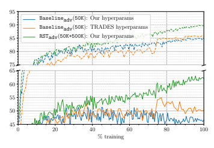

Figure 3: Comparison of training traces for different hyperpameters of adversarial training. Dashed lines show standard accuracy on the entire CIFAR-10 test set, and whole lines show robust accuracy against PGTRADES evaluated on the first 500 images in the CIFAR-10 test set.
Fine-tuning for different . Figure 15 reports the accuracies for different . A smaller  would typically require a smaller step-size. We fine-tune the step-size for each  separately, by fixing the number of restarts to 5 and number of steps to 40.

- For  = 0.008, we span η ∈ {0.001, 0.002, 0.005}. - For  = 0.016, we span η ∈ {0.002, 0.005, 0.01}.

- For  = 0.024, we span η ∈ {0.005, 0.01, 0.02}. - For  = 0.039, we span η ∈ {0.005, 0.01, 0.02}.

## B.4 Comparison With Hyperparameters In [56]

As a baseline for adversarial robust self-training, we attempted to reproduce the results of [56],
whose publicly-released model has 56.6% robust accuracy against PGTRADES, 55.3% robust accuracy against PGOurs, and 84.9% standard accuracy. However, performing adversarial training with the hyper-parameters described in Appendix B.1 produces a poor result: the resulting model has only 50.8% robust accuracy against PGOurs, and slightly better 85.8% standard accuracy. We then changed all the hyper-parameters to be the same as in [56], with the exception of the model architecture, which we kept at Wide ResNet 28-10. The resulting model performed somewhat better, but still not on par with the numbers reported in [56].

Examining the training traces (Figure 3) reveals that without unlabeled data, both hyperparameter configurations suffer from overfitting. More precisely, the robust accuracy degrades towards the end of the training, while standard accuracy gradually improves. In contrast, we see no such overfitting with RSTadv(50K+500K), directly showing how unlabeled data aids generalization.

Finally, we perform "early-stopping" with the model trained according to [56], selecting the model with highest validation robust accuracy. This model has 55.5% robust accuracy against PGTRADES,
54.1% robust accuracy against PGOurs, and 84.5% standard accuracy. This is reasonably close to the result of [56], considering we used a slightly lower-capacity model.

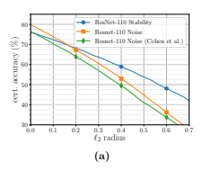

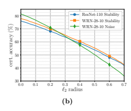

Figure 4: Certified accuracy as a function of `2 perturbation radius, comparing two architectures, two hyperparameter sets and two training objectives. (a) Both stability training and our hyperparameter choice improve performance. (b) Increasing model capacity improves performance further, and stability training remains beneficial.

## B.5 Comparison Between Stability And Noise Training

As we report in Section 5.1.2, our fully supervised baseline for stability training, i.e. Baselinestab(50K),
significantly outperforms the model trained in [9] and available online. There are three a-priori reasons for that: (i) our Wide ResNet 28-10 has higher capacity than the ResNet-110 used in [9],
(ii) we employ a different training configuration (e.g. a cosine instead of step learning rate schedule)
and (iii) we use stability training while Cohen et al. [9] use a different training objective. Namely, Cohen et al. [9] add N (0, σ2I) to the input during training, but treat the noise as data augmentation, minimizing the loss

$$\mathbb{E}_{x^{\prime}\sim{\mathcal{N}}(x,\sigma^{2}I)}L_{\mathrm{standard}}(\theta,x^{\prime},y).$$

We refer to the training method of [9] as *noise training*.

To test which of these three differences causes the gap in performance we train the following additional models. First, we perform noise training with ResNet-110, but otherwise use the same configuration used to train Baselinestab(50K). Second, we keep the ResNet-110 architecture and our training configuration, and use stability training instead. Finally, we perform noise training on Wide ResNet 28-10 with all other parameters the same as Baselinestab(50K). As our goal in this section is to compare supervised training techniques for randomized smoothing, these experiments only use the CIFAR-10 training set (and no unlabeled data).

We plot the performance of all of these models, as well as the model of [9] and Baselinestab(50K),
in Figure 4. Starting with the model of [9] and using our training configuration increases accuracy by 2–3% across most perturbation radii. Switching to stability training reduces clean accuracy by roughly 3%, but dramatically increases robustness at large radii, with a 13% improvement at radius 0.5. Using the larger Wide ResNet 28-10 model further improves performance by roughly 2%. We also see that noise training on Wide ResNet 28-10 performs better at radii below 0.25, and worse on larger radii. With stability training it is possible to further explore the tradeoff between accuracy at low and high radii by tuning the parameter β in (6), but we did not pursue this (all of our experiments are with β = 6).

## B.6 Sourcing Unlabeled Data For Cifar-10

Here we provide a detailed description of the sourcing process we describe in Section 5.1.1. To obtain unlabeled data distributed similarly to the CIFAR-10 images, we use the 80 Million Tiny Images (80M-TI) dataset [46]. This dataset contains 79,302,017 color images that were obtained via querying various keywords in a number of image search engines, and resizing the results to a 32x32 resolution. CIFAR-10 is a manually-labeled subset of 80M-TI. However, most of the 80M-TI
do not fall into any of the CIFAR-10 categories (see Figure 5a) and the query keywords constitute very weak labels (Figure 5b). To select relevant images, we train a classifier to classify TI data as relevant or not, in the following steps.

Training data for selection model. We create an 11-class training set consisting of the CIFAR10 training set and 1M images sampled at random from the 78,712,306 images in 80M-TI with keywords that did not appear in CIFAR-10. We similarly sample an additional 10K images for validation.

Training the selection model. We train an 11-way classifier on this dataset, with the same Wide ResNet 28-10 architecture employed in the rest of our experiments. We use the hyperparmeters described in Appendix B.1, except we run for 117K gadient steps. We use batch size 256 and comprise each batch from 128 CIFAR-10 images and 128 80M-TI images, and we also weight the loss of the "80M-TI" class by 0.1 to balance its higher number of examples. During training we evaluate the model on its accuracy of discriminating between CIFAR-10 and 80M-TI on a combination of the CIFAR-10 test and the 10K 80M-TI validation images, and show the training trace in Figure 7.

Towards the end of the training, the CIFAR-10 vs. 80M-TI accuracy started to degrade, and we therefore chose and earlier checkpoint (marked in the figure) to use as the data selection model. This model achieves 93.8% CIFAR-10 vs. 80M-TI test accuracy. Removing CIFAR-10 test set. To ensure that there is no leakage of the CIFAR-10 test set to the unlabeled data we source, we remove from 80M-TI all near-duplicates of the CIFAR-10 test set.

Following [39], we define a near-duplicate as an image with `2 distance below 2000/255 to any of the CIFAR-10 test images. We visually confirm that images with distance greater than 2000/255 are substantially different. Our near-duplicate removal procedure leaves 65,807,640 valid candidates.

Selecting the unlabeled data. We apply our classifier on 80M-TI, with all images close to the CIFAR-10 test set excluded as described above. For each CIFAR-10 class, we select the 50,000 images which our classifier predicts with the highest confidence as belonging to that class. This is our unlabeled dataset, depicted in Figure 6, which is 10x the original CIFAR-10 training set and approximately class balanced.

Examining Figure 6, it is clear that our unlabeled dataset is not entirely relevant to the CIFAR-10 classification task. In particular, many of the "frog" and "deer" images are not actually frogs and deer. It is likely possible to obtain higher quality data by tuning the selection model (and particularly its training) more carefully. We chose not to do so for two reasons. First, allowing some amount of irrelevant unlabeled data more realistically simulates robust self-training in other contexts. Second, for a totally fair comparison against [56], we chose not to use state-of-the-art architectures or training techniques for the data selection model, and instead make it as close as possible to the final robust model.

## C Additional Cifar-10 Experiments C.1 Alternative Semisupervised Training Method

In this section, we consider the straightforward adaptation of *virtual adversarial training* (VAT) to the (real) adversarial robustness setting of interest in this paper.

(a) (b)

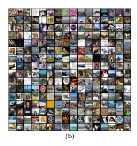

Figure 5: Random images from the 80 Million Tiny Images data. (a) Images drawn from the entire

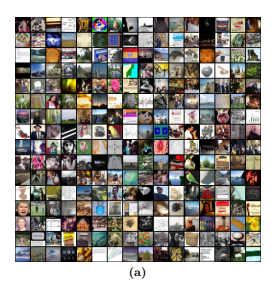

dataset. (b) Images drawn for the subset with keywords that appeared in CIFAR-10; matching keywords correlate only weakly with membership in one of the CIFAR-10 classes.
Training objective. Recall that we consider robust losses on the following form.

$$\begin{array}{r l}{L_{\mathrm{robust}}(\theta,x,y)=L_{\mathrm{standard}}(\theta,x,y)+\beta L_{\mathrm{reg}}(\theta,x),}\\ {{\mathrm{~where~}}\ L_{\mathrm{reg}}(\theta,x):=\operatorname*{max}_{x^{\prime}\in B_{c}^{\theta}(x)}D_{\mathrm{KL}}(p_{\theta}(\cdot\mid x)\parallel p_{\theta}(\cdot\mid x^{\prime})).}\end{array}$$

The Lreg term does not require labels, and hence could be evaluated on the unlabeled data directly—exactly as done in Virtual Adversarial Training. As is commonly done in standard semisupervised learning, we also consider an additional entropy regularization term, to discourage the model from reaching the degenerate solution of mapping unlabeled inputs to uniform distributions.

The total training objective is

$$\sum_{i=1}^{n}L_{\text{standard}}(\theta,x_{i},y_{i})+\beta\Big{(}\sum_{i=1}^{n}L_{\text{reg}}(\theta,x_{i})+w\sum_{i=1}^{n}L_{\text{reg}}(\theta,\bar{x}_{i})\Big{)}+\lambda_{\text{em}}\sum_{i=1}^{n}h(p_{\theta}(\cdot\mid\bar{x}_{i})),\tag{18}$$  where $h(p_{\theta}(\cdot\mid\bar{x}_{i}))=-\sum_{y\in\mathcal{Y}}p_{\theta}(y\mid\bar{x}_{i})\log p_{\theta}(y\mid\bar{x}_{i})$ is the entropy of the probability distribution over the class labels. We denote models trained according to this objective by **rValT**.  
There are two differences between VAT and (18). First, to minimize the loss, VAT takes gradients of DKL(pθ(· | x) k pθ(· | x 0)) w.r.t. θ only through pθ(· | x 0), treating pθ(· | x) as a constant. Second, VAT computes perturbations x 0 ∈ B2

(x) that are somewhere between random and adversarial, using a small number of (approximate) power iterations on ∇2x0DKL(pθ(· | x) k pθ(· | x 0)).

We experiment with both the adversarial training based regularization (7) and stability training based regularizer (8).

Training details. We consider the alternative semisupervised objetive (18) and compare with robust self-training. We use the same hyperparmeters as the rest of the main experiments, described in Appendix B.1, and tune the additional hyperparameter λent. Setting λent = β = 6 would correspond to the entropy weight suggested in VAT [30], since they use a logarithmic loss and not KL-divergence. We experiment with λent between 0 and 6. Due to computational constraints, we

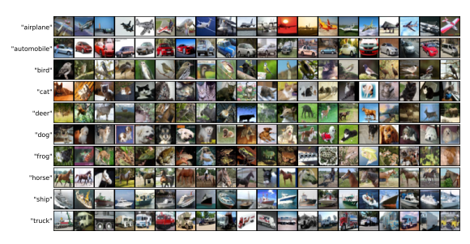 
Figure 6: A random sample of our approximately class-balanced 500K auxiliary images, rows correspond to class predictions made by our data selection model. Note the multiple errors on "frog" and "deer."

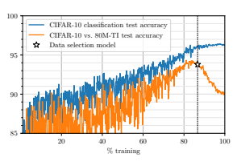

Figure 7: Test accuracy through training for the unlabeled data selection model.
use the smaller model Wide ResNet 40-2 for tuning this hyperparameter in the adversarially trained models. We also perform certification via randomized smoothing on 1000 random examples from the test set, rather than the entire test set.

Results. Figures 8 and 9 summarize the results for stability training. We see that the alternative approach also yields gains (albeit much smaller than robust self-training) over the baseline supervised setting, due to the additional unlabeled data.

Table 4 presents the accuracies against PGOurs for the smaller Wide ResNet 40-2 models with different settings of λent. We see a steady degradation in the performance with increasing λent. For λent = 0, we also train a large Wide ResNet 28-10 to compare to our state-of-the-art self-trained RSTadv(50K+500K) that has the same architecture.

We see that in both adversarial training (heuristic defense) and stability training (certified defense), robust self-training significantly outperforms the alternative approach suggesting that
"locking in" the pseudo-labels is important. This is possibly due to the fact that we are in a regime where the pseudo-labels are quite accurate and hence provide good direct signal to the

| Model architecture   | Training algorithm            | PGOurs   | No attack   |
|----------------------|-------------------------------|----------|-------------|
| Wide ResNet 40-2     | Baselineadv(50K)              | 52.1     | 81.3        |
| Wide ResNet 40-2     | rVATadv(50K+500K), λent = 0   | 53.6     | 81.5        |
| Wide ResNet 40-2     | rVATadv(50K+500K), λent = 0.1 | 52.9     | 77.9        |
| Wide ResNet 40-2     | rVATadv(50K+500K), λent = 0.6 | 43.4     | 60.0        |
| Wide ResNet 40-2     | rVATadv(50K+500K), λent = 3.0 | 15.4     | 19.1        |
| Wide ResNet 28-10    | TRADES [56]                   | 55.4     | 84.9        |
| Wide ResNet 28-10    | rVATadv(50K+500K), λent = 0   | 56.5     | 83.2        |
| Wide ResNet 28-10    | RSTadv(50K+500K)              | 62.5     | 89.7        |

Table 4: Accuracy of adversarially trained models against our PG attack. We see that VAT-like consistency-based regularization produces only minor gains over a baseline without unlabeled data, significantly underperforming robust self-training.

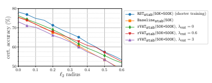

Figure 8: Certified `2 accuracy as a function of the radius, for Wide ResNet 28-10 trained using different semisupervised approaches on the augmented CIFAR10 dataset.
model. Another possible explanation for the comparative weak performance of rVAT is that since the robustly-trained never reaches good clean accuracy, it cannot effectively bootstrap the model's own prediction as training progresses.

Additional experiments. VAT combined with entropy minimization is one of the most succesful semisupervised learning algorithm for standard accuracy [33]. As we mentioned earlier, the objective in (18) differs from VAT by not treating pθ(· | x˜) as a constant. From the open source implementation3, we also note that batch normalization parameters are not updated on the "adversarial" perturbations during training. We tried both variants on the smaller model Wide ResNet 40-2 and observed that neither modification affected final performance in our setting. Further, we also experimented with different values of the unlabeled data weighting parameter w. We observed no noticeable improvement in final performance by changing this parameter.

## C.2 Comparison With Data Augmentation

Advanced data augmentation techniques such as cutout [13] and AutoAugment policies [10] provide additional inductive bias about the task at hand. Can data augmentation provide gains in CIFAR10 robust training, similar to those we observe by augmenting the CIFAR-10 dataset with extra unlabeled images?

3https://github.com/lyakaap/VAT-pytorch

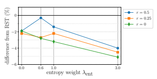

Figure 9: Effect of entropy weight on performance of stability training with alternate semisupervised approach. Larger entropy weight leads to gains in robustness at larger radii at a cost in robustness at smaller radii. However, robust self-training outperforms the alternative semisupervised approach over all radii, for all settings of the entropy weight hyperparameter.

| Model              | PGOurs   | No attack   |
|--------------------|----------|-------------|
| TRADES [56]        | 55.4     | 84.9        |
| Baselineadv(50K)   | 47.5     | 84.8        |
| + Cutout [13]      | 51.2     | 85.8        |
| + AutoAugment [10] | 47.4     | 84.5        |
| RSTadv(50K+500K)   | 62.5     | 89.7        |

Table 5: Accuracy of adversarially trained models against PGOurs. We see that cutout provides marginal gains and AutoAugment leads to slightly worse performance than our baseline that only uses the standard crops and flips.
Implementation details. We use open source implementations for cutout4 and AutoAugment5, and use the same training hyperparameters from the papers introducing these techniques. We first train Wide ResNet 28-10 via standard training and reproduce the test accuracies reported in the papers [13, 10].

Training details. We perform robust supervised training, where the each batch contains *augmented*
(cutout/autoaugment in additional to random crops and flips) of the CIFAR10 training set.

We use the same training setup with which we performed robust self-training, as described in Appendix B.1, except we applied augmentation instead of adding unlabeled data, and that we perform stability training for only 39K steps. Note that this model and optimization configuration are identical to those used in the AutoAugment paper [10], except increasing batch size to 256.

Results. Table 5 presents the results on accuracy of the heuristic adversarially trained models against our PG variant PGOurs for  = 8/255. We also tabulate the performance of Baselineadv(50K),
which doesn't use any unlabeled data or augmentation—as we show in Appendix B.4, this configuration produces poor results due to overfitting. We see that AutoAugment offers no improvement over Baselineadv(50K), while cutout ofer a 4% improvement that is still far from the performance [56]
attains with just early stopping. In Figure 11 we plot training training traces, and show that AutoAugment fails to prevent overffiting, while cutout provides some improvement, but is till far away from the effect of robust self-training.

We also perform certification using randomized smoothing on the stability trained models. We use 4https://github.com/uoguelph-mlrg/Cutout 5https://github.com/DeepVoltaire/AutoAugment

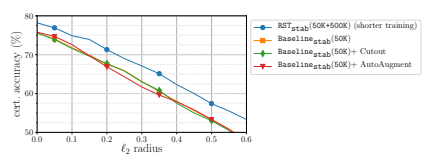

Figure 10: Comparing certified `2 accuracy as a function of certified radius, computed via randomized smoothing for different data augmentation methods.

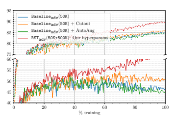

Figure 11: Training traces adversarial training with robust self-training and various forms of data augmentation. Dashed lines show standard accuracy on the entire CIFAR-10 test set, and whole lines show robust accuracy against PGTRADES evaluated on the first 500 images in the CIFAR-10 test set. AutoAugment shows the same overfitting as standard augmentation, while cutout mitigates overfitting, but does not provide the gains of self-training.
the same certification parameters as our main experiments (N0 = 100, N = 104, α = 10−3, σ = 0.25)
and compute the certificate over every 10th image in the CIFAR-10 test set (1000 images in all)
for all the models. As we only train for 31K steps, we compare the results to an RSTstab(50K+500K)
model trained for the same amount of steps (and evaluated on the same subset of images). We plot the results to obtain Figure 10. As can be seen, data augmentation provides performance essentially identical to that of a baseline without augmentation. Overall, it is interesting to note that the gains provided by data augmentation for standard training do not manifest in robust training (both adversarial and stability training).

## C.3 Effect Of Unlabeled Data Relevance

Semisupervised learning algorithms are often sensitive to the relevance of the unlabeled data. That is, if too much of the unlabeled data does not correspond to any label, the learning algorithm might fail to benefit from the unlabeled dataset, and may even produce worse results simply using labeled data only. This sensitivity was recently demonstrated in a number of semisupervised neural network training techniques [33]. In the simple Gaussian model of Section 3, our analysis in Appendix A.5

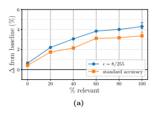

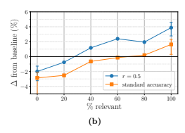

Figure 12: Performance improvement as a function of unlabeled data relevance, for Wide ResNet 40-2 models, relative to training without unlabeled data. When present, error bars indicate the range of variation (minimum to maximum) over 5 independent runs. (a) Difference in standard accuracy and in accuracy under the `∞ attack PGOurs, for adversarially-trained models. (b) Difference in standard accuracy and in certified `2 accuracy for smoothed stability-trained models.
shows that any fixed fraction of relevant unlabeled data will allow self-training to attain robustness, but that the overall sample complexity grows inversely with the square of the relevant fraction.

To test the practical effect of data relevance on robust self-training, we conduct the following experiment. We draw 500K random images from the 80M-TI with CIFAR-10 test set near-duplicates removed (see Appendix B.6), which rarely portray one of the CIFAR-10 classes (see Figure 5a); this is our proxy for irrelevant data. We mix the irrelevant dataset and our main unlabeled image dataset with different proportions, creating a sequence of unlabeled datasets with a growing degree of image relevance, each with 500K images.

We then perform adversarial- and stability- robust self-training on each of those datasets as described in Section 5 and Appendix B.1, except here we use a smaller Wide ResNet 40-2 model to conserve computation resources. We evaluate each of those models as in Section 5.1.2, and compare them to a fully supervised baseline. For stability training we train the baseline as in Section 5.1.2, except with Wide ResNet 40-2. For adversarial training, in view of our findings in Appendix B.4, we train our baseline with Wide ResNet 40-2 and the training hyperparameters of [56] (β is still 6).

Here, we did not observe overfitting in the training trace, and therefore used the model from the final epoch of training. This baseline achieves 81.3% standard accuracy and 52.1% robust accuracy against PGOurs.

In Figure 12 we plot the difference in PGOurs/certified accuracy as a function of the relevant data fraction. We see the performance grows essentially monotonically with data relevance, as expected. We also observe that smoothing seems to be more sensitive to data relevance, and we see performance degradation for completely irrelevant and 20% relevant data. For adversarial training we see no performance degradation, but the gain with completely irrelevant data is negligible as can be expected. Finally, at around 80% relevant data performance seems close to that of 100%
relevant data. This is perhaps not too surprising, considering that even our "100% relevant" data is likely somewhere between 90-95% relevant (see Appendix B.6). This is also roughly in line with our theoretical model, where there is a small degradation in performance for relevant fraction α = 0.8.

## C.4 Effect Of Unlabeled Data Amount

We have conducted all of our previous experiments on an unlabeled dataset of fixed size (500K images).

Here we test the effect of the size of the unlabeled dataset on robust self-training performance. The main question we would like to answer here is how much further performance gain can we expect from further increasing the data set: should we expect another 7% improvement over [56] by adding 500K more images (of similar relevance), or perhaps we would need to add 5M images, or is it the case that the benefit plateaus after a certain amount of unlabeled data?

There is a number of complicating factors in answering this question. First, 80M-TI does not provide us much more than 500K relevant unlabeled images, certainly not if we wish it to be approximately class-balanced; the more images we take from 80M-TI the lower their relevance.

Second, as the amount of data changes, some training hyperparameters might have to change as well. In particular, with more unlabeled data, we expect to require more gradient steps before achieving convergence. Even for 500K images we haven't completely exhausted the possible gains from longer training. Finally, it might be the case that higher capacity models are crucial for extracting benefit from larger amounts of unlabeled data. For these reasons, and considering our computational constraints, we decided that attempting to rerun our experiment with more unlabeled data will likely yield inconclusive results, and did not attempt it.

Instead, we sub-sampled our 500K images set randomly into nested subsets of varying size, and repeated our experiment of Section 5.1.2 with these smaller datasets. With this experiment we hope to get some understanding of the trend with which performance improves. Since we expect model capacity to be very important for leveraging more data, we perform this experiment using the same high-capacity Wide ResNet 28-10 used in our main experiment. For adversarial training, we use exactly the same training configuration for all unlabeled dataset sizes. For stability training, we also use the same configuration except we attempted to tune the number of gradient steps. For each dataset size, we started by running 19.5K gradient steps, and doubled the number of gradient steps until we no longer saw improvement in performance. For 40K extra data, we saw the best results with 39K gradient steps, and for 100K and 240K extra data we saw the best result with 78K gradient steps. Similarly to the data relevance experiment in Appendix C.3, we compare each training result with a baseline. Here the baselines are the same as those reported in Section 5.1.2:
for adversarial training we compare to the publicly available model of [56], and for stability training we use Baselinestab(50K).

We plot the results in Figure 13. As the figure shows, accuracy always grows with the data size, except for one errant data point at 40K unlabeled data with adversarial training, which performs worse than the baseline. While we haven't seen overfitting in this setting as we have when attempting to reproduce [56], we suspect that the reason for the apparent drop in performance is that our training configuration was not well suited to so few unlabeled data. We also see in the plot that the higher the robustness, the larger the benefit from additional data.

The experiment shows that 100K unlabeled data come about halfway to achieving the gain of 500K unlabeled data. Moreover, for the most part the plots appear to be concave, suggesting that increase in data amount provides diminishing returns—even on a logarithmic scale. Extrapolating this trend to higher amounts of data would suggest we are likely to require very large amount of data to see another 7% improvement. However, the negative value at 40K unlabeled data hints at the danger of trying to extrapolate this figure—since we haven't carefully tuned the training at each data amount (including the one at 500K), we cannot describe any trend with confidence. At most, we can say that under our computation budget, model architecture and training configuration, it seems likely the benefit of unlabeled data plateaus at around 500K examples. It also seems likely that as computation capabilities increase and robust training improves, the point of diminishing returns will move towards higher data amounts.

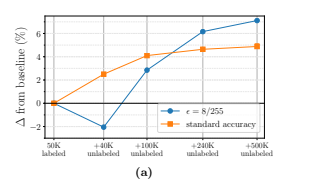

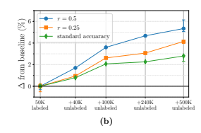

Figure 13: Performance improvement as a function of unlabeled data amount, relative to training without unlabeled data. When present, error bars indicate the range of variation (minimum to maximum) over 3 independent runs. (a) Difference in standard accuracy and in accuracy under the `∞ attack PGOurs, for adversarially-trained models. (b) Difference in standard accuracy and in certified `2 accuracy for smoothed stability-trained models, at different radii.

## C.5 Effect Of Label Amount

To complement the unlabeled data amount experiment of Appendix C.4, we study the effect of the *labeled* data amount. Here too, we only consider smaller amounts of labeled data than in our main experiment, since no additional CIFAR-10 labels are readily available. The main effect of removing some of the labels is that the accuracy of pseudo-labels decreases. However, since the main motivation behind robust self-training is that the pseudo-labels only need to be "good enough," we expect fewer labels to still allow significant gains from unlabeled data.

To test this prediction, we repeat the experiments of Section 5.1.2 with the following modification.

For each desired label amount n0 ∈ {2, 4, 8, 16, 32}K, we pick the first n0 images from a random permutation of CIFAR-10 to be our labeled data, and consider an unlabeled dataset of 50K−n0+500K
images comprised of the remaining CIFAR-10 images and our 500K unlabeled images. We train a classification model on only the labeled subset, using the same configuration as in the "pseudolabel generation" paragraph of Appendix B.1, and apply that model on the unlabeled data to form pseudo-labels. We then repeat the final step of robust self-training using these pseudo-labels, with parameters as in Appendix B.1. Adding the remainder of CIFAR-10 without labels to our unlabeled data keeps the total dataset fixed. This allows us to isolate the effect of the quality of the pseudo-labels and hence the label amount on robust self-training.

Figure 14 summarizes the results of this experiment, which are consistent with our expectation that robust self-training remains effective even with a much smaller number of labels. In particular, for both adversarial robust self-training (Figure 14a) and stability-based certified robust self-training
(Figure 14b), 8K labels combined with the unlabeled data allow us to obtain comparable robust accuracy to that of the state-of-the-art fully supervised method. Moreover, for adversarial-training we obtain robust accuracy only 2% lower than the supervised state-of-the-art with as few as 2K
labels. In this small labeled data regime, we also see that the standard accuracy of the resulting robust model is slightly higher than the pseudo-label generator accuracy (the dotted black line in Figure 14a).

Two remarks are in order. First, in the low-label regime we can likely attain significantly better results by improving the accuracy of the pseudo-labels using standard semisupervised learning. The results in Figure 14 therefore constitute only a crude lower bound on the benefit of unlabeled data when fewer labels are available. Second, we note that the creation of our 500K unlabeled dataset

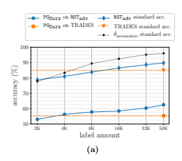

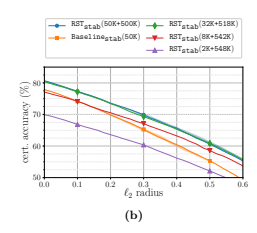

Figure 14: Performance for varying labeled data amount, compared to the fully supervised setting.

(a) Standard accuracy and accuracy under the `∞ attack PGOurs, for adversarially-trained models, as a function of label amount. The dotted line indicates the accuracy of the pseudo-label generation model, which we train with the labeled data only. (b) Certified robust accuracy as a function of
`2 radius for different label amounts, and our fully supervised baseline; RSTstab(a+b) denotes the stability trained model with a labeled data and b unlabeled data, which consists of the 50K − a de-labeled CIFAR-10 images and our 500K unlabeled dataset.
involved a "data selection" classifier trained on all of the CIFAR-10 labels, and we did not account for that in the experiment above. Nevertheless, as the data selection model essentially simulates a situation where unlabeled data is generally relevant, we believe that our experiment faithfully represents the effect of label amount (mediated through pseudo-label quality) on robust self-training. Further, our experiments on the effect of the relevance of unlabeled data (described in Appendix C.3)
suggest that using a slightly worse data selection model by training only on a subset of CIFAR-10 labels should not change results much.

## C.6 Standard Self-Training

We also test whether our unlabeled data can improve standard accuracy. We perform standard self-training to obtain the model SST(50K+500K); all training parameters are identical to RSTstab(50K+500K), except we do not add noise. SST(50K+500K) attains test accuracy 96.4%, a 0.4%
improvement over standard supervised learning with identical training parameters on 50K labeled dataset. This difference is above the training variability of around 0.1% [54, 10], but approaches like aggressive data augmentation [10] provide much larger gains for the same model (to 97.4%).

## C.7 Performance Against Different Pg Attack Radii

In Figure 15, we evaluate robustness of our state-of-the-art RSTadv(50K+500K) on a range of different values of  and compare to TRADES [56], where we fine-tune attacks for each value of  separately for each model (see Appendix B.3). We see a consistent gain in robustness across the different values of .

## D Svhn Experiment Details

Here we give a detailed description on our SVHN experiments reported in Section 5.2.

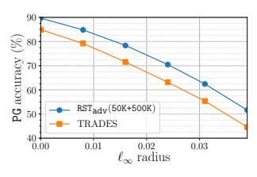

Figure 15: Comparing `∞ accuracy to tuned PG for various . RSTadv(50K+500K) has higher accuracy than a state-of-the-art supervised model, across the range of .

## D.1 Experimental Setup

Most of our experimental setup for SVHN is the same as in CIFAR-10, except for the following differences.

- Architecture. Throughout the SVHN experiments we use a slightly smaller Wide ResNet 16-8 model.

- Robust self-training. Since here the unlabeled data is 100% relevant, we set w = 1 by sampling every batch from a single pool containing the labeled and unlabeled data. We still use β = 6 throughout; we performed brief tuning over β to make sure that 6 is a reasonable value for SVHN.

- Adversarial training. We perform adversarial training with the same parameters as before and as in [56], with one exception: we set the perturbation magnitude  = 4/255 (we use step size 0.007 and 10 steps as in CIFAR-10). As we discuss below, adversarial training with the current configuration and  = 8/255 produced weak and inconsistent results.

- Stability training. No change. - Input normalization. No change.

- Data augmentation. Following [54] we do not perform any data augmentation.

- Optimizer configuration. We use the same parameters as before, except here we use batch size 128.

- Number of gradient steps. We run 98K gradient steps in every SVHN experiment. For stability training we attempted to double the number of gradient steps and did not observe improved results.

## D.2 Pseudo-Label Generation And Standard Self-Training.

To generate pseudo-labels we perform standard training of an Wide ResNet 16-8 model as described above on the core SVHN training set only. This model attains 96.6% test accuracy, and we use it to generate all the pseudo-labels in our SVHN experiments.

| `2 radius:               | 0    | 0.22   | 0.435   | 0.555   |
|--------------------------|------|--------|---------|---------|
| Enclosed `∞ radius:      | 0    | 1/255  | 2/255   | 0.01    |
| Model Baselinestab(604K) | 93.6 | 84.9   | 70.0    | 59.8    |
| RSTstab(73K+531K)        | 93.2 | 84.5   | 69.7    | 59.5    |
| Baselinestab(73K)        | 90.1 | 80.2   | 65.0    | 55.0    |

Table 6: SVHN certified test accuracy (%) for different `2 perturbations radii, and the `∞ certified robustness they imply.

For comparison we repeat this procedure on the entire SVHN data (with all the labels). The resulting model has 98.2% test accuracy. Finally, we apply standard self-training using the configuration described above, i.e. we replace the SVHN extra labels with the pseudo-labels—this corrupts 1.6% of the extra labels (the extra data is easier to classify than the test set). Self-training produces a model with 97.1% accuracy, similar to the 0.4% improvement we observed on CIFAR-10, and 1.1% short of using true labels.

## D.3 Evaluation And Attack Details

We perform randomizes smoothing certification exactly as in the CIFAR-10 experiments in Section 5.1.2. For evaluating heuristic defenses, we fine-tune the PG attack to maximally break RSTadv(73K+531K) to obtain PGOurs with the following parameters: step-size η = 0.005, number of steps τ = 100 and number of restarts ρ = 10. We evaluate models at  = 4/255, which is the same as the value we used during training.

Compared to CIFAR-10, we find that we require larger number of steps for SVHN attacks.

Interestingly, for  = 8/255 (which is what we evaluate our CIFAR-10 models on), we find that even after 1000 steps, we see a steady decrease in accuracy (when evaluated over a small random subset of the test set). However, for a smaller value of ε = 4/255 (which is what we finally report on), we see that the accuracies seem to saturate after 100 steps of the attack.

## D.4 Comparison With Results In The Literature

In the context of adversarial robustness, SVHN was not studied extensively in the literature, and in most cases there are no clear benchmarks to compare to. Unlike CIFAR-10, there is no agreed-upon benchmark perturbation radius for heuristic `∞ defenses. Moreover, we are not aware of a heuristic SVHN defense that withstood significant scrutiny. A previous heuristic defense [20] against attacks with  = 12/255 was subsequently broken [14]. In [41], the authors study SVHN attacks with
 = 4/255 but do not tabulate their results. Visual inspection of their figures indicates that we get better robust accuracies than [41] by over 7%, likely due to using a higher capacity model, better training objectives and better hyperparameters.

Two recent works constitute the state-of-the-art for certified robustness in SVHN. Cohen et al.

[9] study randomized smoothing certification of `2 robustness and report some results for SVHN,
but do not tabulate them and did not release a model. Their figure shows a sharp cutoff at radius 0.3, suggesting a different input normalization than the one we used. In view of our comparison in Appendix B.5, it seems likely that our model attains higher certified accuracy. Gowal et al. [17]
propose interval bound propagation for certified `∞ robustness. They report a model with 85.2%
standard accuracy and 62.4% certified robust accuracy against `∞ attacks with  = 0.01.

In Table 6 we list selected point from Figure 2, showing certified accuracy as a function of `2 perturbation radius. For each `2 radius we also list the radius of the largest `∞ ball contained within in it, allowing comparison between our results and [17]. At the `2 radius that contains an `∞ ball of radius 0.01 we certify accuracy of 59.8%, less than 3% below than the result of Gowal et al. [17].

This number is likely easy to improve by tuning σ and β used in stability training, situating it as a viable alternative to interval bound propagation in SVHN as well as CIFAR-10.

## E Comparison To Uesato Et Al. [48]

Independently from our work, Uesato et al. [48] also study semisupervised adversarial learning theoretically in the Gaussian model of [41] and empirically via experiments on CIFAR-10, Tiny Images, and SVHN. Overall, Uesato et al. [48] reach conclusions similar to ours. Here, we summarize the main differences between our works.

We can understand the algorithms that [48] propose as instances of Meta-Algorithm 1 with different choices of Lrobust. In particular, their most successful algorithm (UAT++) corresponds to

$$L_{\mathrm{robust}}^{\mathrm{UAT}++}(\theta,x,y)=\operatorname*{max}_{x^{\prime}\in{\mathcal{B}}_{e}^{\theta}(x)}L_{\mathrm{standard}}(\theta,x^{\prime},y)+\lambda L_{\mathrm{reg}}(\theta,x),$$

where Lreg(*θ, x*) = maxx0∈Bp
 (x) DKL(pθ(· | x) k pθ(· | x 0)) as in (6). In contrast, we do not maximize over Lstandard, i.e. we use

$$L_{\mathrm{robust}}(\theta,x,y)=L_{\mathrm{standard}}(\theta,x,y)+\lambda L_{\mathrm{reg}}(\theta,x).$$

Both this work and [48] perform adversarial training on CIFAR-10 with additional unlabeled data from Tiny Images. Both works consider the benchmark of `∞ perturbations with radius  = 8/255 and report results against a range of attacks, which in both papers includes PGTRADES [56]. For this attack, our best-performing models have robust accuracies within 1% of each other (their WRN-106-8 is 1.1% higher than our WRN-28-10, and their WRN-34-8 is 1% lower), and we obtain about 3%
higher standard accuracy.

Beyond the algorithmic and model size difference, Uesato et al. [48] use different training hyperparameters, most notably larger batch sizes. Additionally, to source unlabeled data from 80 Million Tiny images they use a combination of keyword filtering and predictions from a standard CIFAR-10 model. In contrast, we do not use keywords at all and train a classifier to distinguish CIFAR-10 from Tiny Images. Both works remove the CIFAR-10 dataset prior to selecting images from TI; we also remove an `2 ball around the CIFAR-10 test set. Due to these multiple differences and similar final accuracies, we cannot determine which robust loss provides better performance.

Uesato et al. [48] perform a number of experiments that complement ours. First, they show strong improvements in the low labeled data regimes by removing most labels from CIFAR-10 and SVHN
(similar findings appear also in [55, 32]). Second, they demonstrate that their method is tolerant to inaccurate pseudo-labels via a controlled study. Finally, they propose a new "MultiTargeted" attack that reduces the reported accuracies of the state-of-the-art robust models by 3-8%. Contributions unique to our work include showing that unlabeled data improves certified robustness via randomized smoothing and studying the effect of irrelevant data theoretically and experimentally.