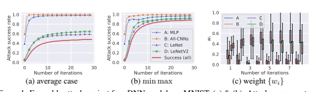
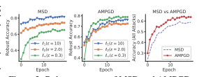
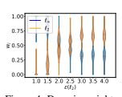
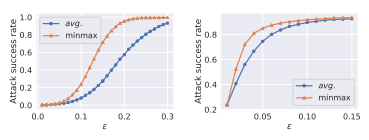

# Adversarial Attack Generation Empowered By Min-Max Optimization

Jingkang Wang1,2∗ Tianyun Zhang3∗ **Sijia Liu**4,5 Pin-Yu Chen5 Jiacen Xu6 Makan Fardad7 **Bo Li**8 University of Toronto1, Vector Institute2, Cleveland State University3 Michigan State University4, MIT-IBM Watson AI Lab, IBM Research5 University of California, Irvine6, Syracuse University7 University of Illinois at Urbana-Champaign8

## Abstract

The worst-case training principle that minimizes the maximal adversarial loss, also known as adversarial training (AT), has shown to be a state-of-the-art approach for enhancing adversarial robustness. Nevertheless, min-max optimization beyond the purpose of AT has not been rigorously explored in the adversarial context. In this paper, we show how a general framework of min-max optimization over multiple domains can be leveraged to advance the design of different types of adversarial attacks. In particular, given a set of risk sources, minimizing the worst-case attack loss can be reformulated as a min-max problem by introducing domain weights that are maximized over the probability simplex of the domain set. We showcase this unified framework in three attack generation problems - attacking model ensembles, devising universal perturbation under multiple inputs, and crafting attacks resilient to data transformations. Extensive experiments demonstrate that our approach leads to substantial attack improvement over the existing heuristic strategies as well as robustness improvement over state-of-the-art defense methods trained to be robust against multiple perturbation types. Furthermore, we find that the self-adjusted domain weights learned from our min-max framework can provide a holistic tool to explain the difficulty level of attack across domains. Code is available at https://github.com/wangjksjtu/minmax-adv.

## 1 Introduction

Training a machine learning model that is capable of assuring its worst-case performance against possible adversaries given a specified threat model is a fundamental and challenging problem, especially for deep neural networks (DNNs) [64, 22, 13, 69, 70]. A common practice to train an adversarially robust model is based on a specific form of min-max training, known as adversarial training (AT) [22, 40], where the minimization step learns model weights under the adversarial loss constructed at the maximization step in an alternative training fashion. In practice, AT has achieved the state-of-the-art defense performance against `p-norm-ball input perturbations [3].

Although the min-max principle is widely used in AT and its variants [40, 59, 76, 65], few work has studied its power in attack generation. Thus, we ask: *Beyond AT, can other types of min-max* formulation and optimization techniques advance the research in adversarial attack generation? In this paper, we give an affirmative answer corroborated by the substantial performance gain and the ability of self-learned risk interpretation using our proposed min-max framework on several tasks for adversarial attack.

∗Equal contributions.

35th Conference on Neural Information Processing Systems (NeurIPS 2021), Sydney, Australia.
We demonstrate the utility of a general formulation for minimizing the maximal loss induced from a set of risk sources (domains). Our considered min-max formulation is fundamentally different from AT, as our maximization step is taken over the probability simplex of the set of domains. Moreover, we show that many problem setups in adversarial attacks can in fact be reformulated under this general min-max framework, including attacking model ensembles [66, 34], devising universal perturbation to input samples [44] and data transformations [6, 10]. However, current methods for solving these tasks often rely on simple heuristics (e.g., uniform averaging), resulting in significant performance drops when comparing to our proposed min-max optimization framework.

Contributions ① With the aid of min-max optimization, we propose a unified alternating onestep projected gradient descent-ascent (APGDA) attack method, which can readily be specified to generate model ensemble attack, universal attack over multiple images, and robust attack over data transformations. ② In theory, we show that APGDA has an O(1/T) convergence rate, where T is the number of iterations. In practice, we show that APGDA obtains 17.48%, 35.21% and 9.39%
improvement on average compared with conventional min-only PGD attack methods on CIFAR-10.

③ More importantly, we demonstrate that by tracking the learnable weighting factors associated with multiple domains, our method can provide tools for self-adjusted importance assessment on the mixed learning tasks. ④ Finally, we adapt the idea of the domain weights into a defense setting [65],
where multiple `p-norm perturbations are generated, and achieve superior performance as well as intepretability.

## 1.1 Related Work

Recent studies have identified that DNNs are highly vulnerable to adversarial manipulations in various applications [64, 12, 27, 33, 26, 14, 77, 20, 15, 31], thus leading to an arms race between adversarial attacks [13, 3, 23, 48, 45, 72, 1, 18] and defenses [40, 59, 76, 65, 42, 71, 74, 68, 53, 16]. One intriguing property of adversarial examples is the transferability across multiple domains [36, 67, 47, 62], which indicates a more challenging yet promising research direction - devising universal adversarial perturbations over model ensembles [66, 34], input samples [44, 43, 56] and data transformations [3, 6, 10].

Besides, many recent works started to produce physical realizable perturbations that expose real world threats. The most popular approach [4, 21], as known as Expectation Over Transformation (EOT),
is to train the attack under different data transformation (e.g., different view angles and distances). However, current approaches suffer from a significant performance loss for resting on the uniform averaging strategy or heuristic weighting schemes [34, 56]. We will compare these works with our min-max method in Sec. 4. As a natural extension following min-max attack, we study the generalized AT under multiple perturbations [65, 2, 28, 17]. Finally, our min-max framework is adapted and inspired by previous literature on robust optimization over multiple domains [50, 51, 38, 37].

To our best knowledge, only few works leverage min-max principle for adversarial attack generation while the idea of producing the worst-case example across multiple domains is quite natural. Specifically, [7] considered the non-interactive blackbox adversary setting and proposed a framework that models the crafting of adversarial examples as a min-max game between a generator of attacks and a classifier. [57] introduced a min-max based adaptive attacker's objective to craft perturbation so that it simultaneously evades detection and causes misclassification. Inspired by our work, the min-max formulation has also been extended to zero-order blackbox attacks [35] and physically realizable attacks [73, Adversarial T-shirt]. We hope our unified formulation can stimulate further research on applying min-max principle and interpretable domain weights in more attack generation tasks that involve in evading multiple systems.

## 2 Min-Max Across Domains

Consider K loss functions {Fi(v)} (each of which is defined on a learning domain), the problem of robust learning over K domains can be formulated as [50, 51, 38]

$$\begin{array}{r l}{{\underset{\mathbf{v}\in{\cal V}}{\mathrm{minimize~maximize}}}}&{{}\sum_{i=1}^{K}w_{i}F_{i}(\mathbf{v}),}\\ {\underset{\mathbf{v}\in{\cal V}}{\mathrm{minimize~maximize}}}&{{}\sum_{i=1}^{K}w_{i}F_{i}(\mathbf{v}),}\end{array}$$

where v and w are optimization variables, V is a constraint set, and P denotes the probability simplex P = {w | 1 T w = 1, wi ∈ [0, 1], ∀i}. Since the inner maximization problem in (1) is a linear function

$$(1)$$
$\tau_{\mu}$). 
$\eqref{eq:walpha}$. 
of w over the probabilistic simplex, problem (1) is thus equivalent to minimize v∈Vmaximize i∈[K]
Fi(v),(2)
where [K] denotes the integer set {1, 2*, . . . , K*}.

Benefit and Challenge from (1). Compared to multi-task learning in a finite-sum formulation which minimizes K losses on *average*, problem (1) provides consistently robust *worst-case* performance across all domains. This can be explained from the epigraph form of (2),
minimize v∈V,tt, subject to Fi(v) ≤ *t, i* ∈ [K],(3)
where t is an epigraph variable [8] that provides the t-level robustness at each domain.

In computation, the inner maximization problem of (1) always returns the one-hot value of w, namely, w = ei, where eiis the ith standard basis vector, and i = arg maxi{Fi(v)}. However, this one-hot coding reduces the generalizability to other domains and induces instability of the learning procedure in practice. Such an issue is often mitigated by introducing a *strongly concave regularizer* in the inner maximization step to strike a balance between the average and the worst-case performance [38, 50].

$$(4)$$

Regularized Formulation. Following [50], we penalize the distance between the *worst-case* loss and the *average* loss over K domains. This yields minimize v∈Vmaximize w∈P
PK
i=1 wiFi(v) −
γ 2 kw − 1/Kk 2 2
, (4)
where γ > 0 is a regularization parameter. As γ → 0, problem (4) is equivalent to (1). By contrast, it becomes the finite-sum problem when γ → ∞ since w → 1/K. *In this sense, the trainable* w provides an essential indicator on the importance level of each domain. The larger the weight is, the more important the domain is. We call w *domain weights* in this paper.

## 3 Min-Max Power In Attack Design

To the best of our knowledge, few work has studied the power of min-max in attack generation. In this section, we demonstrate how the unified min-max framework (4) fits into various attack settings.

With the help of domain weights, our solution yields better empirical performance and explainability.

Finally, we present the min-max algorithm with convergence analysis to craft robust perturbations against multiple domains.

## 3.1 A Unified Framework For Robust Adversarial Attacks

The general goal of adversarial attack is to craft an adversarial example x 0 = x0 + δ ∈ R
dto mislead the prediction of machine learning (ML) or deep learning (DL) systems, where x0 denotes the natural example with the true label t0, and δ is known as *adversarial perturbation*, commonly subject to
`p-norm (p ∈ {0, 1, 2, ∞}) constraint X := {δ | kδkp ≤ , x0 + δ ∈ [0, 1]d} for a given small number . Here the `p norm enforces the similarity between x 0and x0, and the input space of ML/DL
systems is normalized to [0, 1]d.

Ensemble Attack over Multiple Models. Consider K ML/DL models {Mi}
K
i=1, the goal is to find robust adversarial examples that can fool all K models *simultaneously*. In this case, the notion of 'domain' in (4) is specified as 'model', and the objective function Fiin (4) signifies the attack loss f(δ; x0, y0,Mi) given the natural input (x0, y0) and the model Mi. Thus, problem (4) becomes minimize δ∈Xmaximize w∈P
PK
i=1 wif(δ; x0, y0,Mi) −
γ 2 kw − 1/Kk 2 2
, (5)
where w encodes the difficulty level of attacking each model.

Universal Perturbation over Multiple Examples. Consider K natural examples {(xi, yi)}
K i=1
and a single model M, our goal is to find the universal perturbation δ so that all the corrupted K
examples can fool M. In this case, the notion of 'domain' in (4) is specified as 'example', and
problem (4) becomes
minimize
δ∈Xmaximize
w∈P
$$\sum_{i=1}^{K}w_{i}f(\delta;\mathbf{x}_{i},y_{i},{\mathcal{M}})-{\frac{\gamma}{2}}\|\mathbf{w}-\mathbf{1}/K\|_{2}^{2},$$
, (6)
where different from (5), w encodes the difficulty level of attacking each example.
$$(6)$$
Adversarial Attack over Data Transformations. Consider K categories of data transformation
{pi}, e.g., rotation, lightening, and translation, our goal is to find the adversarial attack that is robust to data transformations. Such an attack setting is commonly applied to generate physical adversarial examples [5, 20]. Here the notion of 'domain' in (4) is specified as 'data transformer', and problem
(4) becomes minimize δ∈Xmaximize w∈P
PK
i=1 wiEt∼pi
[f(t(x0 + δ); y0,M)] −
γ 2 kw − 1/Kk 2 2
, (7)
where Et∼pi
[f(t(x0+δ); y0,M)] denotes the attack loss under the distribution of data transformation pi, and w encodes the difficulty level of attacking each type of transformed example x0. We remark that if w = 1/K, then problem (7) reduces to the existing expectation of transformation (EOT) setup used for physical attack generation [5].

Benefits of Min-Max Attack Generation with Learnable Domain Weights w: We can interpret
(5)-(7) as finding the *robust* adversarial attack against the *worst-case environment* that an adversary encounters, e.g., multiple victim models, data samples, and input transformations. The proposed min-max design of adversarial attacks leads to two main benefits. First, compared to the heuristic weighting strategy (e.g., clipping thresholds on the importance of individual attack losses [56]), our proposal is free of supervised manual adjustment on domain weights. Even by carefully tuning the heuristic weighting strategy, we find that our approach with self-adjusted w consistently outperforms the clipping strategy in [56] (see Table 2). Second, the learned domain weights can be used to assess the model robustness when facing different types of adversary. We refer readers to Figure 1c and Figure 6 for more details.

## 3.2 Min-Max Algorithm For Adversarial Attack Generation

We propose the alternating projected gradient descent-ascent (APGDA) method (Algorithm 1) to solve problem (4). For ease of presentation, we write problems (5), (6), (7) into the general form minimize δ∈Xmaximize w∈PPK
i=1 wiFi(δ) −
γ 2 kw − 1/Kk 2 2, where Fi denotes the ith individual attack loss. We show that at each iteration, APGDA takes only one-step PGD for outer minimization and one-step projected gradient ascent for inner maximization.

| Algorithm 1 APGDA to solve problem (4) 1: Input: given w(0) and δ (0) . 2: for t = 1, 2, . . . , T do 3: outer min.: fixing w = w(t−1), call   |                                                                               |
|------------------------------------------------------------------------------------------------------------------------------------------------|-------------------------------------------------------------------------------|
|                                                                                                                                                | (t)                                                                           |
| PGD (8) to update δ                                                                                                                            |                                                                               |
| 4:                                                                                                                                             | inner max.: fixing δ = δ (t) , update w(t) with projected gradient ascent (9) |
| 5: end for                                                                                                                                     |                                                                               |

Outer Minimization Considering w = w(t−1) and F(δ) :=PK
i=1 w
(t−1)
i Fi(δ) in (4), we perform one-step PGD to update δ at iteration t, δ
(t) = projX
δ
(t−1) − α∇δF(δ
(t−1)), (8)
where proj(·) denotes the Euclidean projection operator, i.e., projX (a) = arg minx∈X kx − ak 2 2 at the point a, α > 0 is a given learning rate, and ∇δ denotes the first-order gradient w.r.t. δ. If p = ∞,
then the projection function becomes the clip function. In Proposition 1, we derive the solution of projX (a) under different `p norms for p ∈ {0, 1, 2}.

Proposition 1. *Given a point* a ∈ R
d and a constraint set X = {δ|kδkp ≤ , cˇ ≤ δ ≤ cˆ}*, the* Euclidean projection δ
∗ = projX (a) has a closed-form solution when p ∈ {0, 1, 2}*, where the* specific form is given by Appendix A.

  **Inner Maximization** By fixing $\delta=\delta^{(t)}$ and letting $\psi(\mathbf{w}):=\sum_{i=1}^{K}w_{i}F_{i}(\delta^{(t)})-\frac{\gamma}{2}\left\|\mathbf{w}-\mathbf{1}/K\right\|_{2}^{2}$ in problem (4), we then perform one-step PGD (w.r.t. $-\psi$) to update $\mathbf{w}$,  $$\mathbf{w}^{(t)}=\mathrm{proj}_{\mathcal{P}}\left(\mathbf{w}^{(t-1)}+\beta\nabla_{\mathbf{w}}\psi(\mathbf{w}^{(t-1)})\right)=(\mathbf{b}-\mu\mathbf{1})_{+}\,,\tag{9}$$  where $\beta$ is a $0$-dimensional matrix $\mathbf{\nabla}_{\mathbf{w}}\psi(\mathbf{w})=\left(\begin{array}{cc}\mathbf{1}&\mathbf{1}&\mathbf{1}&\mathbf{1}&\mathbf{1}&\mathbf{1}&\mathbf{1}&\mathbf{1}&\mathbf{1}\\ \end{array}\right)$.  
where β > 0 is a given learning rate, ∇wψ(w) = φ
(t) − γ(w − 1/K), and φ
(t):=
[F1(δ
(t))*, . . . , F*K(δ
(t))]T. In (9), the second equality holds due to the closed-form of projection operation onto the probabilistic simplex P [49], where (x)+ = max{0, x}, and µ is the root of the equation 1 T(b − µ1)+ = 1. Since 1 T(b − mini{bi}1 + 1/K)+ ≥ 1 T 1/K = 1, and 1 T(b − maxi{bi}1 + 1/K)+ ≤ 1 T 1/K = 1, the root µ exists within the interval
[mini{bi} − 1/K, maxi{bi} − 1/K] and can be found via the bisection method [8].

Figure 1: Ensemble attack against four DNN models on MNIST. (a) & (b): Attack success rate of adversarial examples generated by average PGD or min-max (APGDA) attack method. (c): Boxplot of weight w in min-max adversarial loss. Here we adopt the same `∞-attack as Table 1.
Convergence Analysis We remark that APGDA follows the gradient primal-dual optimization framework [37], and thus enjoys the same optimization guarantees.

Theorem 1. Suppose that in problem (4) Fi(δ) has L-Lipschitz continuous gradients, and X *is a* convex compact set. Given learning rates α ≤
1 L
and β < 1 γ
, then the sequence {δ
(t), w(t)}
T t=1 generated by Algorithm 1 converges to a first-order stationary point2*in rate* O1 T
.

Proof : Note that the objective function of problem (4) is strongly concave w.r.t. w with parameter γ, and has γ-Lipschitz continuous gradients. Moreover, we have kwk2 ≤ 1 due to w ∈ P. Using these facts and Theorem 1 in [37] or [39] completes the proof. 

## 4 Experiments On Adversarial Exploration

In this section, we first evaluate the proposed min-max optimization strategy on three attack tasks. We show that our approach leads to substantial improvement compared with state-of-the-art attack methods such as average ensemble PGD [34] and EOT [3, 10, 5]. We also demonstrate the effectiveness of learnable domain weights in guiding the adversary's exploration over multiple domains.

## 4.1 Experimental Setup

We thoroughly evaluate our algorithm on MNIST and CIFAR-10. A set of diverse image classifiers (denoted from Model A to Model H) are trained, including multi-layer perceptron (MLP),
All-CNNs [61], LeNet [30], LeNetV2, VGG16 [58], ResNet50 [24], Wide-ResNet [40, 75] and GoogLeNet [63]. The details about model architectures and training process are provided in Appendix D.1. Note that problem formulations (5)-(7) are applicable to both *untargeted* and *targeted* attack. Here we focus on the former setting and use C&W loss function [13, 40] with a confidence parameter κ = 50. The adversarial examples are generated by 20-step PGD/APGDA unless otherwise stated (e.g., 50 steps for ensemble attacks). APGDA algorithm is relatively robust and will not be affected largely by the choices of hyperparameters (*α, β, γ*). Apart from absolute attack success rate
(ASR), we also report the relative improvement or degradationon the worse-case performance in experiments: Lift(↑). The details of crafting adversarial examples are available in Appendix D.2.

## 4.2 Ensemble Attack Over Multiple Models

We craft adversarial examples against an ensemble of known classifiers. Recent work [34] proposed an average ensemble PGD attack, which assumed equal importance among different models, namely, wi = 1/K in problem (5). Throughout this task, we measure the attack performance via ASRall - the attack success rate (ASR) of fooling model ensembles simultaneously. Compared to the average PGD
attack, our approach results in 40.79% and 17.48% ASRall improvement averaged over different
`p-norm constraints on MNIST and CIFAR-10, respectively. In what follows, we provide more detailed results and analysis.

In Table 1 and Table 3, we show that AMGDA significantly outperforms average PGD in ASRall.

Taking `∞-attack on MNIST as an example, our min-max attack leads to a 90.16% ASRall, which 2The stationarity is measured by the `2 norm of gradient of the objective in (4) w.r.t. (δ, w).

| Box constraint   | Opt.       | AccA AccB AccC AccD ASRall   | Lift (↑)   | Opt.   | AccA AccB AccC AccD ASRavg   | ASRall   | Lift (↑)    |         |      |       |       |         |        |
|------------------|------------|------------------------------|------------|--------|------------------------------|----------|-------------|---------|------|-------|-------|---------|--------|
| `0 ( = 50)                  | avg.       | 27.86                        | 3.15       | 5.16   | 6.17                         | 65.16    | -           |         |      |       |       |         |        |
| min max 18.74    | 8.66       | 9.64                         | 9.70       | 71.44  | 9.64%                        | avg.     | 19.69       | 1.55    | 5.61 | 4.26  | 92.22 | 73.29   | -      |
|                  | wb+c+d     | 42.12                        | 1.63       | 5.93   | 4.42                         | 75.78    | 51.63       | -29.55% |      |       |       |         |        |
| `1 ( = 30)                  | avg.       | 32.92                        | 2.07       | 5.55   | 6.36                         | 59.74    | -           |         |      |       |       |         |        |
| min max 12.46    | 3.74       | 5.62                         | 5.86       | 78.65  | 31.65%                       | wa+c+d   | 13.33 32.41 | 4.83    | 5.44 | 84.69 | 56.89 | -22.38% |        |
|                  | wclip [56] | 11.13                        | 3.75       | 6.66   | 6.02                         | 90.66    | 77.82       | 6.18%   |      |       |       |         |        |
| `2 ( = 2.0)                  | avg.       | 24.3                         | 1.51       | 4.59   | 4.20                         | 69.55    | -           |         |      |       |       |         |        |
| min max 7.17     | 3.03       | 4.65                         | 5.14       | 83.95  | 20.70%                       | wprior   | 19.72       | 2.30    | 4.38 | 4.29  | 91.70 | 73.45   | 0.22%  |
|                  | wstatic    | 7.36                         | 4.48       | 5.03   | 6.70                         | 92.43    | 81.04       | 10.57%  |      |       |       |         |        |
| `∞ ( = 0.05)                  | avg.       | 19.69                        | 1.55       | 5.61   | 4.26                         | 73.29    | -           |         |      |       |       |         |        |
| min max 7.21     | 2.68       | 4.74                         | 4.59       | 84.36  | 15.10%                       | min max  | 7.21        | 2.68    | 4.74 | 4.59  | 95.20 | 84.36   | 15.10% |

| (APGDA) ensemble attack on MNIST. Box constraint Opt. AccA AccB AccC AccD ASRall   |      |       | Lift (↑)   |       |        |       |    |
|------------------------------------------------------------------------------------|------|-------|------------|-------|--------|-------|----|
| `0 ( = 30)                                                                                    | avg. | 7.03  | 1.51       | 11.27 | 2.48   | 84.03 | -  |
| min max 3.65                                                                       | 2.36 | 4.99  | 3.11       | 91.97 | 9.45%  |       |    |
| `1 ( = 20)                                                                                    | avg. | 20.79 | 0.15       | 21.48 | 6.70   | 69.31 | -  |
| min max 6.12                                                                       | 2.53 | 8.43  | 5.11       | 89.16 | 28.64% | schemes on MNIST (`∞-attack,  = 0.2). Opt. AccA AccB AccC AccD ASRavg ASRall Lift (↑) avg. 1.05 0.07 41.10 35.03 80.69 48.17 - wc+d 60.37 19.55 15.10 1.87 75.78 29.32 -39.13% wa+c+d 0.46 21.57 25.36 13.84 84.69 53.39 10.84% wclip [56] 0.66 0.03 23.43 13.23 90.66 71.54 48.52% wprior 1.57 0.24 17.67 13.74 91.70 74.34 54.33% wstatic 10.58 0.39 9.28 10.05 92.43 77.84 61.59% min max 2.47 0.37 7.39 5.81 95.99 90.16 87.17%       |    |
| `2 ( = 3.0)                                                                                    | avg. | 6.88  | 0.03       | 26.28 | 14.50  | 69.12 | -  |
| min max 1.51                                                                       | 0.89 | 3.50  | 2.06       | 95.31 | 37.89% |       |    |
| `∞ ( = 0.2)                                                                                    | avg. | 1.05  | 0.07       | 41.10 | 35.03  | 48.17 | -  |
| min max 2.47                                                                       | 0.37 | 7.39  | 5.81       | 90.16 | 87.17% |       |    |

largely outperforms 48.17%. The reason is that Model C, D are more difficult to attack, which can be observed from their higher test accuracy on adversarial examples. As a result, although the adversarial examples crafted by assigning equal weights over multiple models are able to attack {A, B} well, they achieve a much lower ASR in {C, D}. By contrast, APGDA automatically handles the worst case {C, D} by slightly sacrificing the performance on {A, B}: 31.47% averaged ASR improvement on {C, D} versus 0.86% degradation on {A, B}. The choices of *α, β, γ* for all experiments and more results on CIFAR-10 are provided in Appendix D.2 and Appendix E. Effectiveness of learnable domain weights: Figure 1 depicts the ASR of four models under average/min-max attacks as well as the distribution of domain weights during attack generation.

For average PGD (Figure 1a), Model C and D
are attacked insufficiently, leading to relatively low ASR and thus weak ensemble performance.

By contrast, APGDA (Figure 1b) will encode the difficulty level to attack different models based on the current attack loss. It dynamically adjusts the weight wi as shown in Figure 1c. For instance, the weight for Model D is first raised to 0.45 because D is difficult to attack initially. Then it decreases to 0.3 once Model D encounters the sufficient attack power and the corresponding attack performance is no longer improved. It is worth noticing that APGDA is highly efficient because wi converges after a small number of iterations. Figure 1c also shows wc > wd > wa > wb - indicating a decrease in model robustness for C, D, A and B, which is exactly verified by AccC > AccD >
AccA > AccB in the last row of Table 1 (`∞-norm). As the perturbation radius  varies, we also observe that the ASR of min-max strategy is consistently better or on part with the average strategy
(see Figure 2).

0.0 0.1 0.2 0.3 0.0 0.2 0.4 0.6 0.8 1.0 Attack success rate avg. minmax Attack success rate 0.02 0.04 0.06 0.08 0.10 0.2 0.4 0.6 0.8 avg. minmax Figure 2: ASR of average and min-max `∞ ensemble attack versus maximum perturbation magnitude . Left (MNIST), Right (CIFAR-10).

Comparison with stronger heuristic baselines Apart from *average* strategy, we compare minmax framework with stronger heuristic weighting scheme in Table 2 (MNIST) and Table 4 (CIFAR10). Specifically, with the prior knowledge of robustness of given models (*C > D > A > B*), we devised several heuristic baselines including: (a) wc+d: average PGD on models C and D only; (b)
wa+c+d: average PGD on models A, C and D only; (c) w*clip*: clipped version of C&W loss (threshold β = 40) to balance model weights in optimization as suggested in [56]; (d) w*prior*: larger weights on the more robust models, w*prior* = [wA, wB, wC , wD] = [0.2, 0.1, 0.4, 0.3]; (e) w*static*: the converged mean weights of min-max (APGDA) ensemble attack. For `2 ( = 3.0) and `∞ ( = 0.2) attacks, w*static* = [wA, wB, wC , wD] are [0.209, 0.046, 0.495, 0.250] and [0.080, 0.076, 0.541, 0.303],
respectively. Table 2 shows that our approach achieve substantial improvement over baselines consistently. Moreover, we highlight that the use of learnable w avoids supervised manual adjustment on

Table 5: Comparison of average and minmax optimization on universal perturbation over multiple input examples. K represents the number of images in each group. ASRavg and ASRall mean attack success rate (%) of all images and success rate of attacking all the images in each group, respectively.

The adversarial examples are generated by 20-step `∞-APGDA with α =
1 6
, β =
1 50 and γ = 4.

Setting K = 2 K = 4 K = 5 K = 10 Dataset Model Opt. ASRavg ASRall Lift (↑) ASRavg ASRall Lift (↑) ASRavg ASRall Lift (↑) ASRavg ASRall Lift (↑)

|               |                   |                    |                                                                                             |             | 6                  |              |        |       |       |    |       |       |    |
|---------------|-------------------|--------------------|---------------------------------------------------------------------------------------------|-------------|--------------------|--------------|--------|-------|-------|----|-------|-------|----|
| Setting       | K = 2             | K = 4              |                                                                                             | K = 5       |                    | K = 10       |        |       |       |    |       |       |    |
| Dataset       | Model             | Opt.               | ASRavg ASRall Lift (↑) ASRavg ASRall Lift (↑) ASRavg ASRall Lift (↑) ASRavg ASRall Lift (↑) |             |                    |              |        |       |       |    |       |       |    |
| All-CNNs      | avg.              | 91.09              | 83.08                                                                                       | -           | 85.66              | 54.72        | -      | 82.76 | 40.20 | -  | 71.22 | 4.50  | -  |
| min max 92.22 | 85.98 3.49% 87.63 | 65.80 20.25% 85.02 |                                                                                             |             | 55.74 38.66% 65.64 | 11.80 162.2% |        |       |       |    |       |       |    |
| LeNetV2       | avg.              | 93.26              | 86.90                                                                                       | -           | 90.04              | 66.12        | -      | 88.28 | 55.00 | -  | 72.02 | 8.90  | -  |
| CIFAR-10      | min max 93.34     | 87.08 0.21% 91.91  | 71.64                                                                                       | 8.35% 91.21 | 63.55 15.55% 82.85 | 25.10 182.0% |        |       |       |    |       |       |    |
| VGG16         | avg.              | 90.76              | 82.56                                                                                       | -           | 89.36              | 63.92        | -      | 88.74 | 55.20 | -  | 85.86 | 22.40 | -  |
| min max 92.40 | 85.92 4.07% 90.04 | 70.40 10.14% 88.97 |                                                                                             |             | 63.30 14.67% 79.07 | 30.80 37.50% |        |       |       |    |       |       |    |
| GoogLeNet     | avg.              | 85.02              | 72.48                                                                                       | -           | 75.20              | 32.68        | -      | 71.82 | 19.60 | -  | 59.01 | 0.40  | -  |
| min max 87.08 | 77.82 7.37% 77.05 | 46.20 41.37% 71.20 |                                                                                             |             | 33.70 71.94% 45.46 | 2.40         | 600.0% |       |       |    |       |       |    |

| Image `0                   | 0.    | 0.    | 0.                | 0.                | 1.000             | 0.                | 0.                | 0.909   | 0.    | 0.091       | 0.    | 0.    | 0.753   | 0.    | 0.247   |       |
|----------------------------|-------|-------|-------------------|-------------------|-------------------|-------------------|-------------------|---------|-------|-------------|-------|-------|---------|-------|---------|-------|
| `1                         | 0.    | 0.    | 0.                | 0.                | 1.000             | 0.                | 0.                | 0.843   | 0.    | 0.157 0.018 | 0.    | 0.567 | 0.      | 0.416 |         |       |
| Weight                     | `2    | 0.    | 0.                | 0.                | 0.                | 1.000             | 0.                | 0.      | 0.788 | 0.          | 0.112 | 0.    | 0.      | 0.595 | 0.      | 0.405 |
| `∞                         | 0.    | 0.    | 0.                | 0.                | 1.000             | 0.                | 0.                | 0.850   | 0.    | 0.150       | 0.    | 0.    | 0.651   | 0.    | 0.349   |       |
| Metric dist.(C&W `2) 1.839 | 1.954 | 1.347 | 1.698 3.041 1.928 | 1.439             | 2.312             | 1.521 2.356 1.558 | 1.229 1.939 0.297 | 1.303   |       |             |       |       |         |       |         |       |
| min (`∞)                            | 0.113 | 0.167 | 0.073             | 0.121 0.199 0.082 | 0.106 0.176 0.072 | 0.171 0.084       | 0.088 0.122 0.060 | 0.094   |       |             |       |       |         |       |         |       |

Table 6: Interpretability of domain weight w for universal perturbation to multiple inputs on MNIST
(*Digit 0, 2, 4*). Domain weight w for different images under `p-norm (p = 0, 1, 2, ∞).

the heuristic weights or the choice of clipping threshold. Also, we show that even adopting converged min-max weights statically leads to a huge performance drop on attacking model ensembles, which again verifies the power of dynamically optimizing domain weights during attack generation process.

## 4.3 Multi-Image Universal Perturbation

We evaluate APGDA in universal perturbation on MNIST and CIFAR-10, where 10,000 test images are randomly divided into equal-size groups (K images per group) for universal perturbation. We measure two types of ASR (%), ASRavg and ASRall. Here the former represents the ASR averaged over all images in all groups, and the latter signifies the ASR averaged over all groups but a successful attack is counted under a more restricted condition: images within each group must be successfully attacked simultaneously by universal perturbation. In Table 5, we compare the proposed min-max strategy with the averaging strategy on the attack performance of generated universal perturbations.

APGDA always achieves higher ASRall for different values of K. When K = 5, our approach achieves 42.63% and 35.21% improvement over the averaging strategy under MNIST and CIFAR-10.

The universal perturbation generated from APGDA can successfully attack 'hard' images (on which the average-based PGD attack fails) by self-adjusting domain weights, and thus leads to a higher ASRall.

Interpreting "*image robustness***" with domain weights** w: The min-max universal perturbation also offers interpretability of "*image robustness*" by associating domain weights with image visualization. Figure 6 shows an example in which the large domain weight corresponds to the MNIST
letter with clear appearance (e.g., bold letter). To empirically verify the robustness of image, we report two metrics to measure the difficulty of attacking single image: dist. (C&W `2) denotes the the minimum distortion of successfully attacking images using C&W (`2) attack; min (`∞) denotes the minimum perturbation magnitude for `∞-PGD attack.

## 4.4 Robust Attack Over Data Transformations

EOT [5] achieves state-of-the-art performance in producing adversarial examples robust to data transformations. From (7), we could derive EOT as a special case when the weights satisfy wi = 1/K
(average case). For each input sample (ori), we transform the image under a series of functions, e.g.,
flipping horizontally (flh) or vertically (flv), adjusting brightness (bri), performing gamma correction

Table 7: Comparison of average and min-max optimization on robust attack over multiple data transformations on CIFAR-10. Acc (%) represents the test accuracy of classifiers on adversarial examples (20-step `∞-APGD ( = 0.03) with α =
1 2
, β =1 100 and γ = 10) under different transformations.

| Model         | Opt.   | Accori Accf lh Accf lv Accbri Accgam Acccrop ASRall Lift (↑)   |       |       |       |       |              |       |    |
|---------------|--------|----------------------------------------------------------------|-------|-------|-------|-------|--------------|-------|----|
| A             | avg.   | 10.80                                                          | 21.93 | 14.75 | 11.52 | 10.66 | 20.03        | 55.88 | -  |
| min max 12.14 | 18.05  | 13.61                                                          | 13.52 | 11.99 | 16.78 | 60.03 | 7.43%        |       |    |
| B             | avg.   | 5.49                                                           | 11.56 | 9.51  | 5.43  | 5.75  | 15.89        | 72.21 | -  |
| min max       | 6.22   | 8.61                                                           | 9.74  | 6.35  | 6.42  | 11.99 | 77.43        | 7.23% |    |
| C             | avg.   | 7.66                                                           | 21.88 | 15.50 | 8.15  | 7.87  | 15.36        | 56.51 | -  |
| min max       | 8.51   | 14.75                                                          | 13.88 | 9.16  | 8.58  | 13.35 | 63.58 12.51% |       |    |
| D             | avg.   | 8.00                                                           | 20.47 | 13.46 | 7.73  | 8.52  | 15.90        | 61.13 | -  |
| min max       | 9.19   | 13.18                                                          | 12.72 | 8.79  | 9.18  | 13.11 | 67.49 10.40% |       |    |

(gam) and cropping (*crop*), and group each image with its transformed variants. Similar to universal perturbation, ASRall is reported to measure the ASR over groups of transformed images (each group is successfully attacked signifies successfully attacking an example under all transformers). In Table 7, compared to EOT, our approach leads to 9.39% averaged lift in ASRall over given models on CIFAR-10 by optimizing the weights for various transformations. We leave the the results under randomness (e.g., flipping images randomly *w.p.* 0.8; randomly clipping the images at specific range)
in Appendix E

## 5 Extension: Understanding Defense Over Multiple Perturbation Domains

In this section, we show that the min-max principle can also be used to gain more insights in generalized adversarial training (AT) from a defender's perspective. Different from promoting robustness of adversarial examples against the *worst-case attacking environment* (Sec. 3), the generalized AT
promotes model's robustness against the *worst-case defending environment*, given by the existence of multiple `p attacks [65]. Our approach obtains better performance than prior works [65, 41] and interpretability by introducing the trainable domain weights.

## 5.1 Adversarial Training Under Mixed Types Of Adversarial Attacks

Conventional AT is restricted to a single type of norm-ball constrained adversarial attack [40]. For example, AT under `∞ attack yields:

$$\operatorname*{minimize}_{\boldsymbol{\theta}}\ \mathbb{E}_{(\mathbf{x},\mathbf{y})\in\mathcal{D}}\operatorname*{maximize}_{\|\boldsymbol{\delta}\|_{\infty}\leq\epsilon}\ f_{\mathrm{tr}}(\boldsymbol{\theta},\boldsymbol{\delta};\mathbf{x},y),$$

where θ ∈ R
n denotes model parameters, δ denotes -tolerant `∞ attack, and ftr(θ, δ; x, y) is the training loss under perturbed examples {(x + δ, y)}. However, there possibly exist blind attacking spots across multiple types of adversarial attacks so that AT under one attack would not be strong enough against another attack [2]. Thus, an interesting question is how to generalize AT under multiple types of adversarial attacks [65]. One possible way is to use the finite-sum formulation in the inner maximization problem of (10), namely, maximize{δi∈Xi}
1 K
PK
i=1 ftr(θ, δi; x, y), where δi ∈ Xiis the ith type of adversarial perturbation defined on Xi, e.g., different `p attacks.

Since we can map 'attack type' to 'domain' considered in (1), AT can be generalized against the strongest adversarial attack across K attack types in order to avoid blind attacking spots:

$${\underset{\boldsymbol{\theta}}{\operatorname*{minimize}}}\ \mathbb{E}_{(\mathbf{x},\mathbf{y})\in\mathcal{D}}\operatorname*{maximize}_{i\in[K]}{\underset{\boldsymbol{\delta}_{i}\in\mathcal{X}_{i}}{\operatorname*{maximize}}}\ f_{\mathrm{tr}}(\boldsymbol{\theta},\boldsymbol{\delta}_{i};\mathbf{x},y).$$

In Lemma 1, we show that problem (11) can be equivalently transformed into the min-max form.

Lemma 1. *Problem (11) is equivalent to:*

$${\underset{\boldsymbol{\theta}}{\operatorname*{minimize}}}\ \mathbb{E}_{(\mathbf{x},\mathbf{y})\in\mathcal{D}}\ {\underset{\mathbf{w}\in\mathcal{P},\{\delta_{i}\in\mathcal{X}_{i}\}}{\operatorname*{maximize}}}\ \sum_{i=1}^{K}w_{i}f_{\mathrm{tr}}(\boldsymbol{\theta},\delta_{i};\mathbf{x},y),$$
$$(10)$$
$$(111)$$
$$(12)$$

where w ∈ R
K represent domain weights, and P has been defined in (1).

MAX [3] AVG [3] MSD [2] AMPGD

Clean Accuracy 98.6% 99.1% 98.3% 98.3%

`∞ Attacks [65] ( = 0.3) 51.0% 65.2% 62.7% 76.1% `2 Attacks [65] ( = 2.0) 61.9% 60.1% 67.9% 70.2% `1 Attacks [65] ( = 10) 52.6% 39.2% 65.0% 67.2%

All Attacks [65] 42.1% 34.9% 58.4% **64.1%**

AA (all attacks) [18] 36.9% 30.5% 55.9% 59.3%

AA+ (all attacks) [18] 34.3% 28.8% 54.8% **58.3%**

Table 8: Adversarial robustness on MNIST.

Figure 3: Robust accuracy of MSD and AMPGD.

|                       | L∞-AT L2-AT L1-AT MAX [65] AVG [66] MSD [41] AMPGD   |       |       |       |       |
|-----------------------|------------------------------------------------------|-------|-------|-------|-------|
| Clean Accuracy        | 83.3% 90.2% 73.3%                                    | 81.0% | 84.6% | 81.1% | 81.5% |
| `∞ Attacks ( = 0.03) [41] 50.7% 28.3% 0.2%                       |                                                      | 44.9% | 42.5% | 48.0% | 49.2% |
| `2 Attacks ( = 0.5) [41]                       | 57.3% 61.6% 0.0%                                     | 61.7% | 65.0% | 64.3% | 68.0% |
| `1 Attacks ( = 12) [41]                       | 16.0% 46.6% 7.9%                                     | 39.4% | 54.0% | 53.0% | 50.0% |
| All Attacks [41]      | 15.6% 27.5% 0.0%                                     | 34.9% | 40.6% | 47.0% | 48.7% |
| AA (`∞,  = 0.03) [18]                       | 47.8% 22.7% 0.0%                                     | 39.2% | 40.7% | 44.4% | 46.9% |
| AA (`2,  = 0.5) [18]                       | 57.5% 63.1% 0.1%                                     | 62.0% | 65.5% | 64.9% | 64.4% |
| AA (`1,  = 12) [18]                       | 13.7% 23.6% 1.4%                                     | 36.0% | 58.8% | 52.4% | 52.3% |
| AA (all attacks) [18] | 12.8% 18.4% 0.0%                                     | 30.8% | 40.4% | 44.1% | 46.2% |

Figure 4: Domain weights.
The proof of Lemma 1 is provided in AppendixB. Similar to (4), a strongly concave regularizer
−γ/2kw − 1/Kk 2 2 can be added into the inner maximization problem of (12) for boosting the stability of the learning procedure and striking a balance between the max and the average attack performance:

$$\begin{array}{r l}{{\operatorname*{minimize}_{\boldsymbol{\theta}}\mathbb{E}_{(\mathbf{x},\mathbf{y})\in\mathcal{D}}\operatorname*{maximize}_{\mathbf{w}\in\mathcal{P};\{\boldsymbol{\delta}_{i}\in\mathcal{X}_{i}\}}\psi(\boldsymbol{\theta},\mathbf{w},\{\boldsymbol{\delta}_{i}\})}}\\ {{\psi(\boldsymbol{\theta},\mathbf{w},\{\boldsymbol{\delta}_{i}\}):=\sum_{i=1}^{K}w_{i}f_{\mathrm{tr}}(\boldsymbol{\theta},\boldsymbol{\delta}_{i};\mathbf{x},y)-{\frac{\gamma}{2}}\|\mathbf{w}-\mathbf{1}/K\|_{2}^{2}}}\end{array}$$
$$(13)$$

We propose the alternating multi-step projected gradient descent (AMPGD) method (Algorithm 2)
to solve problem (13). Since AMPGD also follows the min-max principles, we defer more details of this algorithm in Appendix C. We finally remark that our formulation of generalized AT under multiple perturbations covers prior work [65] as special cases (γ = 0 for max case and γ = ∞ for average case).

| Algorithm 2 AMPGD to solve problem (13) 1: Input: given θ (0) , w(0) , δ (0) and K > 0. 2: for t = 1, 2, . . . , T do 3: given w(t−1) and δ (t−1), perform SGD to   |                                                           |
|---------------------------------------------------------------------------------------------------------------------------------------------------------------------|-----------------------------------------------------------|
| update θ (t)                                                                                                                                                        |                                                           |
| 4:                                                                                                                                                                  | given θ (t) , perform R-step PGD to update w(t) and δ (t) |
| 5: end for                                                                                                                                                          |                                                           |

## 5.2 Generalized At Vs. Multiple `P **Attacks**

Compared to vanilla AT, we show the generalized AT scheme produces model robust to multiple types of perturbation, thus leads to stronger "overall robustness". We present experimental results of generalized AT following [41] to achieve simultaneous robustness to `∞, `2, and `1 perturbations on the MNIST and CIFAR-10 datasets. To the best of our knowledge, MSD proposed in [41] is the state-of-the-art defense against multiple types of `p attacks. Specifically, we adopted the same architectures as [41] four layer convolutional networks on MNIST and the pre-activation version of the ResNet18 [24]. The perturbation radius  for (`∞, `2, `1) balls is set as (0.3, 2.0, 10) and
(0.03, 0.5, 12) on MNIST and CIFAR-10 following [41]. Apart from the evaluation `p PGD attacks, we also incorporate the state-of-the-art AutoAttack [18] for a more comprehensive evaluation under mixed `p perturbations.

The adversarial accuracy results are reported (higher the better). As shown in Table 8 and 9, our approach outperforms the state-of-the-art defense MSD consistently (4∼6% and 2% improvements on MNIST and CIFAR-10). Compared to MSD that deploys an approximate arg max operation to select the steepest-descent (worst-case) universal perturbation, we leverage the domain weights to self-adjust the strengthens of diverse `p attacks. Thus, we believe that this helps gain supplementary robustness from individual attacks.

Effectiveness of Domain Weights: Figure 3 shows the robust accuracy curves of MSD and AMPGD on MNIST. As we can see, the proposed AMPGD can quickly adjust the defense strengths to focus on more difficult adversaries - the gap of robust accuracy between three attacks is much smaller.

Therefore, it achieves better results by avoiding the trade-off that biases one particular perturbation model at the cost of the others. In Figure 4, we offer deeper insights on how the domain weights work as the strengths of adversary vary. Specifically, we consider two perturbation models on MNIST: `2 and `∞. During the training, we fix the  for `∞ attack during training as 0.2, and change the  for `2 from 1.0 to 4.0. As shown in Figure 4, the domain weight w increases when the `2-attack becomes stronger i.e., (`2) increases, which is consistent with min-max spirit - defending the strongest attack.

## 5.3 Additional Discussions

More parameters to tune for min-max? Our min-max approaches (APGDA and AMPGD) introduce two more hyperparameters - β and γ. However, our proposal performs reasonably well by choosing the learning rate α same as standard PGD and using a large range of regularization coefficient γ ∈ [0, 10]; see Fig. A5 in Appendix. For the learning rate β to update domain weights, we found 1/T is usually a very good practice, where T is the total number of attack iterations.

Time complexity of inner maximization? Our proposal achieves significant improvements at a low cost of extra computation. Specifically, (1) our APGDA attack is 1.31× slower than the average PGD; (2) our AMPGD defense is 1.15× slower than average or max AT [65].

How efficient is the APGDA (Algorithm **1) for solving problem (4)?** We remark that the minmax attack generation setup obeys the nonconvex + strongly concave optimization form. Our proposed APGDA is a single-loop algorithm, which is known to achieve a nearly optimal convergence rate for nonconvex-strongly concave min-max optimization [32, Table 1]. Furthermore, as our solution gives a natural extension from the commonly-used PGD attack algorithm by incorporating the inner maximization step (9), it is easy to implement based on existing frameworks.

Clarification on contributions: Our contribution is not to propose a new or more efficient optimization approach for solving min-max optimization problems. Instead, we focus on introducing this formulation to the attack design domain, which has not been studied systematically before. We believe this work is the first solid step to explore the power of min-max principle in the attack design and achieve superior performance on multiple attack tasks.

## 6 Conclusion

In this paper, we revisit the strength of min-max optimization in the context of adversarial attack generation. Beyond adversarial training (AT), we show that many attack generation problems can be re-formulated in our unified min-max framework, where the maximization is taken over the probability simplex of the set of domains. Experiments show our min-max attack leads to significant improvements on three tasks. Importantly, we demonstrate the self-adjusted domain weights not only stabilize the training procedure but also provides a holistic tool to interpret the risk of different domain sources. Our min-max principle also helps understand the generalized AT against multiple adversarial attacks. Our approach results in superior performance as well as intepretability.

## Broader Impacts

Our work provides a unified framework in design of adversarial examples and robust defenses. The generated adversarial examples can be used to evaluate the robustness of state-of-the-art deep learning vision systems. In spite of different kinds of adversaries, the proposed defense solves one for all by taking into account adversaries' diversity. Our work is a beneficial supplement to building trustworthy AI systems, in particular for safety-critical AI applications, such as autonomous vehicles and camera surveillance. We do not see negative impacts of our work on its ethical aspects and future societal consequences.

## Acknowledgement

We sincerely thank the anonymous reviewers for their insightful suggestions and feedback. This work is partially supported by the NSF grant No.1910100, NSF CNS 20-46726 CAR, NSF CAREER
CMMI-1750531, NSF ECCS-1609916, and the Amazon Research Award. Resources used in preparing this research were provided, in part, by the Province of Ontario, the Government of Canada through CIFAR, and companies sponsoring the Vector Institute.

## References

[1] M. Andriushchenko, F. Croce, N. Flammarion, and M. Hein. Square attack: A query-efficient black-box adversarial attack via random search. In *ECCV (23)*, volume 12368 of Lecture Notes in Computer Science, pages 484–501. Springer, 2020.

[2] A. Araujo, R. Pinot, B. Negrevergne, L. Meunier, Y. Chevaleyre, F. Yger, and J. Atif. Robust neural networks using randomized adversarial training. *arXiv preprint arXiv:1903.10219*, 2019.

[3] A. Athalye, N. Carlini, and D. Wagner. Obfuscated gradients give a false sense of security:
Circumventing defenses to adversarial examples. *arXiv preprint arXiv:1802.00420*, 2018.

[4] A. Athalye, L. Engstrom, A. Ilyas, and K. Kwok. Synthesizing robust adversarial examples. In ICML, volume 80 of *Proceedings of Machine Learning Research*, pages 284–293. PMLR, 2018.

[5] A. Athalye, L. Engstrom, A. Ilyas, and K. Kwok. Synthesizing robust adversarial examples. In J. Dy and A. Krause, editors, *Proceedings of the 35th International Conference on Machine* Learning, volume 80, pages 284–293, 10–15 Jul 2018.

[6] A. Athalye and I. Sutskever. Synthesizing robust adversarial examples. *ICML*, 2018.

[7] A. J. Bose, G. Gidel, H. Berard, A. Cianflone, P. Vincent, S. Lacoste-Julien, and W. L. Hamilton.

Adversarial example games. In *NeurIPS*, 2020.

[8] S. Boyd and L. Vandenberghe. *Convex optimization*. Cambridge university press, 2004.

[9] W. Brendel, J. Rauber, and M. Bethge. Decision-based adversarial attacks: Reliable attacks against black-box machine learning models. *arXiv preprint arXiv:1712.04248*, 2017.

[10] T. B. Brown, D. Mané, A. Roy, M. Abadi, and J. Gilmer. Adversarial patch. *CoRR*,
abs/1712.09665, 2017.

[11] N. Carlini, A. Athalye, N. Papernot, W. Brendel, J. Rauber, D. Tsipras, I. J. Goodfellow, A. Madry, and A. Kurakin. On evaluating adversarial robustness. *CoRR*, abs/1902.06705, 2019.

[12] N. Carlini, P. Mishra, T. Vaidya, Y. Zhang, M. Sherr, C. Shields, D. Wagner, and W. Zhou.

Hidden voice commands. In *USENIX Security Symposium*, pages 513–530, 2016.

[13] N. Carlini and D. Wagner. Towards evaluating the robustness of neural networks. In Security and Privacy (SP), 2017 IEEE Symposium on, pages 39–57. IEEE, 2017.

[14] N. Carlini and D. A. Wagner. Audio adversarial examples: Targeted attacks on speech-to-text.

In *IEEE Symposium on Security and Privacy Workshops*, pages 1–7. IEEE Computer Society, 2018.

[15] H. Chen, H. Zhang, P.-Y. Chen, J. Yi, and C.-J. Hsieh. Attacking visual language grounding with adversarial examples: A case study on neural image captioning. In *Proceedings of the 56th* Annual Meeting of the Association for Computational Linguistics, volume 1, pages 2587–2597, 2018.

[16] J. M. Cohen, E. Rosenfeld, and J. Z. Kolter. Certified adversarial robustness via randomized smoothing. In *ICML*, volume 97 of *Proceedings of Machine Learning Research*, pages 1310–
1320. PMLR, 2019.

[17] F. Croce and M. Hein. Provable robustness against all adversarial lp-perturbations for p ≥ 1.

arXiv preprint arXiv:1905.11213, 2019.

[18] F. Croce and M. Hein. Reliable evaluation of adversarial robustness with an ensemble of diverse parameter-free attacks. In *ICML*, volume 119 of *Proceedings of Machine Learning Research*,
pages 2206–2216. PMLR, 2020.

[19] Y. Dong, F. Liao, T. Pang, H. Su, J. Zhu, X. Hu, and J. Li. Boosting adversarial attacks with momentum. In *CVPR*, pages 9185–9193. IEEE Computer Society, 2018.

[20] K. Eykholt, I. Evtimov, E. Fernandes, B. Li, A. Rahmati, C. Xiao, A. Prakash, T. Kohno, and D. Song. Robust physical-world attacks on deep learning visual classification. In *Proceedings* of the IEEE Conference on Computer Vision and Pattern Recognition, pages 1625–1634, 2018.

[21] K. Eykholt, I. Evtimov, E. Fernandes, B. Li, A. Rahmati, C. Xiao, A. Prakash, T. Kohno, and D. Song. Robust physical-world attacks on deep learning visual classification. In *CVPR*, pages 1625–1634. IEEE Computer Society, 2018.

[22] I. Goodfellow, J. Shlens, and C. Szegedy. Explaining and harnessing adversarial examples.

2015 ICLR, arXiv preprint arXiv:1412.6572, 2015.

[23] I. J. Goodfellow, J. Shlens, and C. Szegedy. Explaining and harnessing adversarial examples.

arXiv preprint arXiv:1412.6572, 2014.

[24] K. He, X. Zhang, S. Ren, and J. Sun. Deep residual learning for image recognition. In Proceedings of the IEEE conference on computer vision and pattern recognition, pages 770–
778, 2016.

[25] M. Hein and M. Andriushchenko. Formal guarantees on the robustness of a classifier against adversarial manipulation. In *Advances in Neural Information Processing Systems*, pages 2266–
2276, 2017.

[26] S. Huang, N. Papernot, I. J. Goodfellow, Y. Duan, and P. Abbeel. Adversarial attacks on neural network policies. In *ICLR (Workshop)*. OpenReview.net, 2017.

[27] R. Jia and P. Liang. Adversarial examples for evaluating reading comprehension systems. In EMNLP, pages 2021–2031. Association for Computational Linguistics, 2017.

[28] D. Kang, Y. Sun, D. Hendrycks, T. Brown, and J. Steinhardt. Testing robustness against unforeseen adversaries. *arXiv preprint arXiv:1908.08016*, 2019.

[29] H. Karimi, J. Nutini, and M. Schmidt. Linear convergence of gradient and proximal-gradient methods under the polyak-łojasiewicz condition. In Joint European Conference on Machine Learning and Knowledge Discovery in Databases, pages 795–811. Springer, 2016.

[30] Y. Lecun, L. Bottou, Y. Bengio, and P. Haffner. Gradient-based learning applied to document recognition. *Proceedings of the IEEE*, 86(11):2278–2324, Nov 1998.

[31] Q. Lei, L. Wu, P.-Y. Chen, A. G. Dimakis, I. S. Dhillon, and M. Witbrock. Discrete adversarial attacks and submodular optimization with applications to text classification. *SysML*, 2019.

[32] T. Lin, C. Jin, and M. I. Jordan. On gradient descent ascent for nonconvex-concave minimax problems. In *ICML*, volume 119 of *Proceedings of Machine Learning Research*, pages 6083–
6093. PMLR, 2020.

[33] Y. Lin, Z. Hong, Y. Liao, M. Shih, M. Liu, and M. Sun. Tactics of adversarial attack on deep reinforcement learning agents. In *IJCAI*, pages 3756–3762. ijcai.org, 2017.

[34] J. Liu, W. Zhang, and N. Yu. CAAD 2018: Iterative ensemble adversarial attack. *CoRR*,
abs/1811.03456, 2018.

[35] S. Liu, S. Lu, X. Chen, Y. Feng, K. Xu, A. Al-Dujaili, M. Hong, and U. Obelilly. Min-max optimization without gradients: Convergence and applications to adversarial ML. *CoRR*,
abs/1909.13806, 2019.

[36] Y. Liu, X. Chen, C. Liu, and D. Song. Delving into transferable adversarial examples and black-box attacks. In *ICLR*. OpenReview.net, 2017.

[37] S. Lu, R. Singh, X. Chen, Y. Chen, and M. Hong. Understand the dynamics of GANs via primal-dual optimization, 2019.

[38] S. Lu, I. Tsaknakis, and M. Hong. Block alternating optimization for non-convex min-max problems: Algorithms and applications in signal processing and communications. 2018.

[39] S. Lu, I. Tsaknakis, and M. Hong. Block alternating optimization for non-convex min-max problems: algorithms and applications in signal processing and communications. In Proceedings of IEEE International Conference on Acoustics, Speech and Signal Processing (ICASSP), 2019.

[40] A. Madry, A. Makelov, L. Schmidt, D. Tsipras, and A. Vladu. Towards deep learning models resistant to adversarial attacks. *arXiv preprint arXiv:1706.06083*, 2017.

[41] P. Maini, E. Wong, and J. Z. Kolter. Adversarial robustness against the union of multiple perturbation models. In *ICML*, volume 119 of *Proceedings of Machine Learning Research*,
pages 6640–6650. PMLR, 2020.

[42] D. Meng and H. Chen. Magnet: a two-pronged defense against adversarial examples. In Proceedings of the 2017 ACM SIGSAC Conference on Computer and Communications Security, pages 135–147. ACM, 2017.

[43] J. H. Metzen, M. C. Kumar, T. Brox, and V. Fischer. Universal adversarial perturbations against semantic image segmentation. In *ICCV*, pages 2774–2783. IEEE Computer Society, 2017.

[44] S.-M. Moosavi-Dezfooli, A. Fawzi, O. Fawzi, and P. Frossard. Universal adversarial perturbations. In *IEEE Conference on Computer Vision and Pattern Recognition (CVPR)*, pages 86–94, 2017.

[45] S. M. Moosavi Dezfooli, A. Fawzi, and P. Frossard. Deepfool: a simple and accurate method to fool deep neural networks. In Proceedings of 2016 IEEE Conference on Computer Vision and Pattern Recognition (CVPR), number EPFL-CONF-218057, 2016.

[46] M. Nouiehed, M. Sanjabi, J. D. Lee, and M. Razaviyayn. Solving a class of non-convex min-max games using iterative first order methods. *arXiv preprint arXiv:1902.08297*, 2019.

[47] N. Papernot, P. McDaniel, I. Goodfellow, S. Jha, Z. B. Celik, and A. Swami. Practical black-box attacks against machine learning. In Proceedings of the 2017 ACM on Asia Conference on Computer and Communications Security, pages 506–519. ACM, 2017.

[48] N. Papernot, P. McDaniel, S. Jha, M. Fredrikson, Z. B. Celik, and A. Swami. The limitations of deep learning in adversarial settings. In Security and Privacy (EuroS&P), 2016 IEEE European Symposium on, pages 372–387. IEEE, 2016.

[49] N. Parikh, S. Boyd, et al. Proximal algorithms. Foundations and Trends® *in Optimization*,
1(3):127–239, 2014.

[50] Q. Qian, S. Zhu, J. Tang, R. Jin, B. Sun, and H. Li. Robust optimization over multiple domains.

CoRR, abs/1805.07588, 2018.

[51] H. Rafique, M. Liu, Q. Lin, and T. Yang. Non-convex min-max optimization: Provable algorithms and applications in machine learning. *arXiv preprint arXiv:1810.02060*, 2018.

[52] J. Rauber, W. Brendel, and M. Bethge. Foolbox v0.8.0: A python toolbox to benchmark the robustness of machine learning models. *CoRR*, abs/1707.04131, 2017.

[53] L. Rice, E. Wong, and J. Z. Kolter. Overfitting in adversarially robust deep learning. In *ICML*,
volume 119 of *Proceedings of Machine Learning Research*, pages 8093–8104. PMLR, 2020.

[54] J. Rony, L. G. Hafemann, L. S. Oliveira, I. B. Ayed, R. Sabourin, and E. Granger. Decoupling direction and norm for efficient gradient-based L2 adversarial attacks and defenses. In *CVPR*,
pages 4322–4330. Computer Vision Foundation / IEEE, 2019.

[55] L. Schott, J. Rauber, M. Bethge, and W. Brendel. Towards the first adversarially robust neural network model on MNIST. In *ICLR (Poster)*. OpenReview.net, 2019.

[56] A. Shafahi, M. Najibi, Z. Xu, J. P. Dickerson, L. S. Davis, and T. Goldstein. Universal adversarial training. *CoRR*, abs/1811.11304, 2018.

[57] F. Sheikholeslami, A. Lotfi, and J. Z. Kolter. Provably robust classification of adversarial examples with detection. In *ICLR*. OpenReview.net, 2021.

[58] K. Simonyan and A. Zisserman. Very deep convolutional networks for large-scale image recognition. In *ICLR*, 2015.

[59] A. Sinha, H. Namkoong, and J. Duchi. Certifying some distributional robustness with principled adversarial training. 2018.

[60] L. N. Smith. A disciplined approach to neural network hyper-parameters: Part 1 - learning rate, batch size, momentum, and weight decay. *CoRR*, abs/1803.09820, 2018.

[61] J. T. Springenberg, A. Dosovitskiy, T. Brox, and M. A. Riedmiller. Striving for simplicity: The all convolutional net. In *ICLR (Workshop)*, 2015.

[62] D. Su, H. Zhang, H. Chen, J. Yi, P.-Y. Chen, and Y. Gao. Is robustness the cost of accuracy?–a comprehensive study on the robustness of 18 deep image classification models. In *Proceedings* of the European Conference on Computer Vision (ECCV), pages 631–648, 2018.

[63] C. Szegedy, W. Liu, Y. Jia, P. Sermanet, S. E. Reed, D. Anguelov, D. Erhan, V. Vanhoucke, and A. Rabinovich. Going deeper with convolutions. In *CVPR*, pages 1–9. IEEE Computer Society, 2015.

[64] C. Szegedy, W. Zaremba, I. Sutskever, J. Bruna, D. Erhan, I. Goodfellow, and R. Fergus.

Intriguing properties of neural networks. *arXiv preprint arXiv:1312.6199*, 2013.

[65] F. Tramèr and D. Boneh. Adversarial training and robustness for multiple perturbations. *arXiv* preprint arXiv:1904.13000, 2019.

[66] F. Tramèr, A. Kurakin, N. Papernot, I. Goodfellow, D. Boneh, and P. McDaniel. Ensemble adversarial training: Attacks and defenses. *2018 ICLR*, arXiv preprint arXiv:1705.07204, 2018.

[67] F. Tramèr, N. Papernot, I. Goodfellow, D. Boneh, and P. McDaniel. The space of transferable adversarial examples. *arXiv preprint arXiv:1704.03453*, 2017.

[68] E. Wong, L. Rice, and J. Z. Kolter. Fast is better than free: Revisiting adversarial training. In ICLR. OpenReview.net, 2020.

[69] C. Xiao, B. Li, J.-Y. Zhu, W. He, M. Liu, and D. Song. Generating adversarial examples with adversarial networks. *arXiv preprint arXiv:1801.02610*, 2018.

[70] C. Xiao, J.-Y. Zhu, B. Li, W. He, M. Liu, and D. Song. Spatially transformed adversarial examples. In *International Conference on Learning Representations*, 2018.

[71] C. Xie, J. Wang, Z. Zhang, Z. Ren, and A. Yuille. Mitigating adversarial effects through randomization. *arXiv preprint arXiv:1711.01991*, 2017.

[72] K. Xu, S. Liu, P. Zhao, P.-Y. Chen, H. Zhang, Q. Fan, D. Erdogmus, Y. Wang, and X. Lin.

Structured adversarial attack: Towards general implementation and better interpretability. In International Conference on Learning Representations, 2019.

[73] K. Xu, G. Zhang, S. Liu, Q. Fan, M. Sun, H. Chen, P. Chen, Y. Wang, and X. Lin. Adversarial t-shirt! evading person detectors in a physical world. In *ECCV (5)*, volume 12350 of *Lecture* Notes in Computer Science, pages 665–681. Springer, 2020.

[74] W. Xu, D. Evans, and Y. Qi. Feature squeezing: Detecting adversarial examples in deep neural networks. In *NDSS*. The Internet Society, 2018.

[75] S. Zagoruyko and N. Komodakis. Wide residual networks. In *BMVC*. BMVA Press, 2016.

[76] H. Zhang, Y. Yu, J. Jiao, E. P. Xing, L. E. Ghaoui, and M. I. Jordan. Theoretically principled trade-off between robustness and accuracy. *arXiv preprint arXiv:1901.08573*, 2019.

[77] Z. Zhao, D. Dua, and S. Singh. Generating natural adversarial examples. In *ICLR*. OpenReview.net, 2018.

# Supplementary Material Adversarial Attack Generation Empowered By Min-Max Optimization

## Abstract

In this supplementary material, we first provide technical proofs of Proposition 1 and Lemma 1 in Sec A and B. We then discuss the proposed AMPGD algorithm in Sec C. In the next section, we show the details of experimental setup including the model architectures and training details in Sec D.1, the hyperparameters to craft the adversarial examples (Sec D.2), the details of data transformations (Sec D.3).

Then we show additional experiments results for robust adversarial attacks (Sec E)
and generalized adversarial training (Sec F). Finally, we provide more visualizations to show that domain weights w provide a holistic tool to interpret "image robustness" in Sec G. The summary of contents in the supplementary is provided in the following.

## Contents

A Proof of Proposition 1 16 B Proof of Lemma 1 18 C Alternating Multi-step PGD (AMPGD) for Generalized AT 19

D Experiment Setup 20

| D.1   | Model Architectures and Training Details   |     | 20   |
|-------|--------------------------------------------|-----|------|
| D.2   | Crafting Adversarial Examples              | 20  |      |

D.3 Details of Conducted Data Transformations . . . . . . . . . . . . . . . . . . . . . 21 E Additional Experiment Results - Robust adversarial attacks 22 E.1 Ensemble Attack over Multiple Models . . . . . . . . . . . . . . . . . . . . . . . 22 E.2 Robust Adversarial Attack over Data Transformations . . . . . . . . . . . . . . . . 22 E.3 Analysis of Regularization on Probability Simplex . . . . . . . . . . . . . . . . . 22 F Additional Experiment Results - Adversarial training against multiple types of adversarial attacks 23 G Interpreting "Image Robustness" with Domain Weights w 25

## A Proof Of Proposition 1

Proposition 1. *Given a point* a ∈ R
d and a constraint set X = {δ|kδkp ≤ , cˇ ≤ δ ≤ cˆ}*, the*
Euclidean projection δ
∗ = projX (a) has the closed-form solution when p ∈ {0, 1, 2}.
1) If $p=1$, then $\sigma^{*}$ is given by_ $$\delta_{i}^{*}=\left\{\begin{array}{ll}P_{[\varepsilon_{i},\varepsilon_{i}]}(a_{i})&\sum_{i=1}^{d}|P_{[\varepsilon_{i},\varepsilon_{i}]}(a_{i})|\leq\epsilon\\ P_{[\varepsilon_{i},\varepsilon_{i}]}(\operatorname{sign}(a_{i})\max\left\{|a_{i}|-\lambda_{1},0\right\})&\text{otherwise},\end{array}\right.$$ (14) where $\mathbf{x}_{i}$ denotes the _ith element of a vector_$\mathbf{x}$: $P_{[\varepsilon_{i},\varepsilon_{i}]}(\cdot)$_denotes the clip function over the in 
∗*is given by*
where xi denotes the ith element of a vector x; P[ˇci,cˆi](·) *denotes the clip function over the interval* [ˇci, cˆi]; sign(x) = 1 if x ≥ 0*, otherwise* 0; λ1 ∈ (0, maxi|ai| − /d] *is the root of*
Pd
i=1 |P[ˇci,cˆi](sign(ai) max {|ai| − λ1, 0})| = .
∗*is given by*
_2) If $p=2$, then $\sigma^{*}$ is given by_  $$\delta_{i}^{*}=\left\{\begin{array}{ll}P_{[c_{i},c_{i}]}(a_{i})&\sum_{i=1}^{d}(P_{[c_{i},c_{i}]}(a_{i}))^{2}\leq\epsilon^{2}\\ P_{[c_{i},c_{i}]}(a_{i}/(\lambda_{2}+1))&\mbox{otherwise,}\end{array}\right.$$  _where $\lambda_{2}\in(0,\|\mathbf{\lambda}\|_{2}/\epsilon-1]$ is the root of $\sum_{i=1}^{d}(P_{[c_{i},c_{i}]}(a_{i}/(\lambda_{2}+1)))^{2}=\epsilon^{2}$._  _If $\lambda_{2}\in(0,\|\mathbf{\lambda}\|_{2}/\epsilon-1]$ is the $\sigma^{*}$-function._
3) If p = 0 and  ∈ N+*, then* δ
∗*is given by*

δ ∗ i = δ 0 iηi ≥ [η] 0 otherwise,ηi =   p2aicˇi − cˇ 2 i p ai < cˇi 2aicˆi − cˆ 2 iai > cˆi |ai| otherwise.
$$(14)$$
$$(15)$$
$$\quad(18)$$  $$\quad(19)$$
$$(16)$$
where [η] denotes the -th largest element of η*, and* δ 0 i = P[ˇci,cˆi](ai).

## Proof Of Proposition 1:

`1 **norm** When we find the Euclidean projection of a onto the set X , we solve

minimize $\frac{1}{2}\|\delta-\mathbf{a}\|_{2}^{2}+I_{[\epsilon,\epsilon]}(\delta)$ subject to $\|\delta\|_{1}\leq\epsilon$,
$$(17)^{\frac{1}{2}}$$
where I[cˇ,cˆ](·) is the indicator function of the set [cˇ, cˆ]. The Langragian of this problem is

$$L=\frac{1}{2}\|\boldsymbol{\delta}-\mathbf{a}\|_{2}^{2}+I_{[\hat{\mathbf{e}},\hat{\mathbf{e}}]}(\boldsymbol{\delta})+\lambda_{1}(\|\boldsymbol{\delta}\|_{1}-\epsilon)$$ $$=\sum_{i=1}^{d}(\frac{1}{2}(\delta_{i}-a_{i})^{2}+\lambda_{1}|\delta_{i}|+I_{[\hat{\mathbf{e}}_{i},\hat{\mathbf{e}}_{i}]}(\delta_{i}))-\lambda_{1}\epsilon.$$

The minimizer δ
∗ minimizes the Lagrangian, it is obtained by elementwise soft-thresholding δ
∗
i = P[ˇci,cˆi](sign(ai) max {|ai| − λ1, 0}).

where xiis the ith element of a vector x, P[ˇci,cˆi](·) is the clip function over the interval [ˇci, cˆi].

The primal, dual feasibility and complementary slackness are

$$\lambda_{1}=0,\|\boldsymbol{\delta}\|_{1}=\sum_{i=1}^{d}|\delta_{i}|=\sum_{i=1}^{d}|P_{[\hat{e}_{i},\hat{e}_{i}]}(a_{i})|\leq\epsilon$$  **or $\lambda_{1}>0,\|\boldsymbol{\delta}\|_{1}=\sum_{i=1}^{d}|\delta_{i}|=\sum_{i=1}^{d}|P_{[\hat{e}_{i},\hat{e}_{i}]}(\operatorname{sign}(a_{i})\max\left\{|a_{i}|-\lambda_{1},0\right\})|=\epsilon$.**
(20)  $\binom{21}{2}$  . 
If Pd i=1 |P[ˇci,cˆi](ai)| ≤ , δ
∗
i = P[ˇci,cˆi](ai). Otherwise δ
∗
i = P[ˇci,cˆi](sign(ai) max {|ai| − λ1, 0}),
where λ1 is given by the root of the equation Pd i=1 |P[ˇci,cˆi](sign(ai) max {|ai| − λ1, 0})| = .

Bisection method can be used to solve the above equation for λ1, starting with the initial interval
(0, maxi|ai| − /d]. Since Pd i=1 |P[ˇci,cˆi](sign(ai) max {|ai| − 0, 0})| =Pd i=1 |P[ˇci,cˆi](ai)| >
 in this case, and Pd i=1 |P[ˇci,cˆi](sign(ai) max {|ai| − maxi|ai| + /d, 0})| ≤
Pd i=1 |P[ˇci,cˆi](sign(ai)(/d))| ≤ Pd i=1(/d) = .

When we find the Euclidean projection of a onto the set $\mathcal{X}$, we solve  $$\begin{array}{ll}\underset{\delta}{\text{minimize}}&\|\mathbf{\delta}-\mathbf{a}\|_{2}^{2}+I_{[\mathbf{e},\mathbf{e}]}(\mathbf{\delta})\\ \text{subject to}&\|\mathbf{\delta}\|_{2}^{2}\leq\epsilon^{2},\end{array}$$  $\varepsilon|(\cdot)$ is the indicator function of the set $[\mathbf{e},\mathbf{\hat{e}}]$. The Langragian of this problem is  $$L=\|\mathbf{\delta}-\mathbf{a}\|_{2}^{2}+I_{[\mathbf{e},\mathbf{e}]}(\mathbf{\delta})+\lambda_{2}(\|\mathbf{\delta}\|_{2}^{2}-\epsilon^{2})$$
$$L=\|\boldsymbol{\delta}-\mathbf{a}\|_{2}^{2}+I_{[\mathsf{E},\bar{\epsilon}]}(\boldsymbol{\delta})+\lambda_{2}(\|\boldsymbol{\delta}\|_{2}^{2}-\epsilon^{2})$$ $$=\sum_{i=1}^{d}((\delta_{i}-a_{i})^{2}+\lambda_{2}\delta_{i}^{2}+I_{[\bar{\epsilon}_{i},\hat{\epsilon}_{i}]}(\delta_{i}))-\lambda_{2}\epsilon^{2}.$$  In the following we have 
The minimizer δ
∗ minimizes the Lagrangian, it is

$$\delta_{i}^{*}=P_{[\hat{c}_{i},\hat{c}_{i}]}(\frac{1}{\lambda_{2}+1}a_{i}).$$  elementary slackness are 
The primal, dual feasibility and complementary slackness are

  **Remark and complementary mechanics are**  $$\lambda_{2}=0,\|\boldsymbol{\delta}\|_{2}^{2}=\sum_{i=1}^{d}\delta_{i}^{2}=\sum_{i=1}^{d}(P_{[\hat{e}_{i},\hat{e}_{i}]}(a_{i}))^{2}\leq\epsilon^{2}$$  **or $\lambda_{2}>0,\|\boldsymbol{\delta}\|_{2}^{2}=\sum_{i=1}^{d}\delta_{i}^{2}=(P_{[\hat{e}_{i},\hat{e}_{i}]}(\frac{1}{\lambda_{2}+1}a_{i}))^{2}=\epsilon^{2}$.**
$$(22)$$
$$(23)$$
$$(24)$$
(25)  $\binom{26}{25}$  . 
 If $\sum_{i=1}^d(P_{[\hat{c}_i,\hat{c}_i]}(a_i))^2\,\le\,\epsilon^2$, $\delta_i^*\,=\,P_{[\hat{c}_i,\hat{c}_i]}(a_i)$  given by the root of the equation $\sum_{i=1}^d(P_{[\hat{c}_i,\hat{c}_i]})$. 
i = P[ˇci,cˆi](ai). Otherwise δ
∗
i = P[ˇci,cˆi]
1 λ2+1 ai
, where λ2 is i=1(P[ˇci,cˆi](1 λ2+1 ai))2 = 
2. Bisection method can be used to

solve the above equation for λ2, starting with the initial interval (0, qPd i=1(ai) Pd i=1(P[ˇci,cˆi]( 1 0+1 ai))2 =Pd i=1(P[ˇci,cˆi](ai))2 > 2in this case, and Pd i=1(P[ˇci,cˆi](1 Pd i=1(P[ˇci,cˆi](ai/ qPd i=1(ai) 2))2 ≤  2 Pd i=1(ai) 2/( qPd i=1(ai) 2) 2 =  2.
2/ − 1]. Since
λ2+1 ai))2 =
`0 **norm** For `0 norm in X , it is independent to the box constraint. So we can clip a to the box constraint first, which is δ 0 i = P[ˇci,cˆi](ai), and then project it onto `0 norm.

We find the additional Euclidean distance of every element in a and zero after they are clipped to the box constraint, which is

$$\eta_{i}=\left\{\begin{array}{ll}\sqrt{a_{i}^{2}-(a_{i}-\hat{c}_{i})^{2}}&a_{i}<\hat{c}_{i}\\ \sqrt{a_{i}^{2}-(a_{i}-\hat{c}_{i})^{2}}&a_{i}>\hat{c}_{i}\\ |a_{i}|&\mbox{otherwise.}\end{array}\right.\tag{27}$$

It can be equivalently written as

$$\eta_{i}=\left\{\begin{array}{ll}\sqrt{2a_{i}\tilde{c}_{i}-\tilde{c}_{i}^{2}}&a_{i}<\tilde{c}_{i}\\ \sqrt{2a_{i}\tilde{c}_{i}-\tilde{c}_{i}^{2}}&a_{i}>\tilde{c}_{i}\\ |a_{i}|&\mbox{otherwise.}\end{array}\right.\tag{28}$$  tion onto $\ell_{0}$ norm, we find the $\epsilon$-th largest element in $\mathbf{n}$ and call it $[\mathbf{n}]$
To derive the Euclidean projection onto `0 norm, we find the -th largest element in η and call it [η].

We keep the elements whose corresponding ηiis above or equals to -th, and set rest to zeros. The closed-form solution is given by

$$\delta_{i}^{*}=\left\{\begin{array}{ll}\delta_{i}^{\prime}&\eta_{i}\geq[\mathbf{\eta}]_{e}\\ 0&\mbox{otherwise.}\end{array}\right.\tag{29}$$

Difference with [25, Proposition 4.1]. We remark that [25] discussed a relevant problem of generating `p-norm based adversarial examples under box and linearized classification constraints. The key difference between our proof and that of [25, Proposition 4.1] is summarized below. First, we place `p norm as a hard constraint rather than minimizing it in the objective function. This difference will make our Lagrangian function more involved with a newly introduced non-negative Lagrangian multiplier. Second, the problem of our interest is projection onto the intersection of box and `p constraints. Such a projection step can then be combined with an attack loss (no need of linearization)
for generating adversarial examples. Third, we cover the case of `0 norm.

## B Proof Of Lemma 1

Lemma 1. *Problem (11) is equivalent to*

_option ( 17) is equivalent to_
_in (11) is equivalent to_  $$\underset{\boldsymbol{\theta}}{\text{minimize}}\ \mathbb{E}_{(\mathbf{x},\mathbf{y})\in\mathcal{D}}\ \underset{\mathbf{w}\in\mathcal{P},\{\delta_{i}\in\mathcal{X}_{i}\}}{\text{maximize}}\ \sum_{i=1}^{K}w_{i}f_{\text{tr}}(\boldsymbol{\theta},\delta_{i};\mathbf{x},y),$$  _present domain weights, and $\mathcal{P}$ has been defined in (1)._
where w ∈ R
K represent domain weights, and P *has been defined in (1).*
Proof of Lemma 1:
Similar to (1), problem (11) is equivalent to

minimize $\mathbb{E}_{(\mathbf{x},\mathbf{y})\in\mathcal{D}}$ maximize $\sum_{i=1}^{K}w_{i}F_{i}(\boldsymbol{\theta})$.  
$$(30)$$
Recall that Fi(θ) := maximizeδi∈Xi ftr(θ, δi; x, y), problem can then be written as

$${\underset{\boldsymbol{\theta}}{\operatorname*{minimize}}}\ \mathbb{E}_{(\mathbf{x},\mathbf{y})\in\mathcal{D}}\operatorname*{maximize}_{\mathbf{w}\in\mathcal{P}}\sum_{i=1}^{K}[w_{i}\operatorname*{maximize}_{\boldsymbol{\delta}_{i}\in\mathcal{X}_{i}}f_{\mathrm{tr}}(\boldsymbol{\theta},\delta_{i};\mathbf{x},y)].$$

According to proof by contradiction, it is clear that problem (31) is equivalent to

$\text{contradiction}$, it
$${\underset{\boldsymbol{\theta}}{\operatorname*{minimize}}}\ \mathbb{E}_{(\mathbf{x},\mathbf{y})\in\mathcal{D}}\ {\underset{\mathbf{w}\in\mathcal{P},\,\{\boldsymbol{\delta}_{i}\in\mathcal{X}_{i}\}}{\operatorname*{maximize}}}\ \sum_{i=1}^{K}w_{i}f_{\mathrm{tr}}(\boldsymbol{\theta},\boldsymbol{\delta}_{i};\mathbf{x},y).$$
$$(31)$$
$$(32)$$

$\square$

## C Alternating Multi-Step Pgd (Ampgd) For Generalized At

In this section, we present the full alternating multi-step projected gradient descent (AMPGD)
algorithm to solve the problem (13), which is repeated as follows

minimize
 $\lim\limits_{\theta}\mathbb{Z}\ \mathbb{E}(\mathbf{x,y})\in$  $\mathbf{w}\ \left[\left(\delta,\mathbb{I}\right),-\right.$
$\frac{\sqrt{2}}{\theta}$ 3. 
E(x,y)∈D maximize
w∈P,{δi∈Xi}
ψ(θ, w, {δi})

ψ(θ, w, {δi}) :=PK
i=1 wiftr(θ, δi; x, y) −
γ
2
kw − 1/Kk
2
2
Algorithm 3 AMPGD to solve problem (13)
1: Input: given θ
(0), w(0), δ
(0) and K > 0.

2: for t = 1, 2*, . . . , T* do 3: given w(t−1) and δ
(t−1), perform SGD to update θ
(t)
4: given θ
(t), perform R-step PGD to update w(t)and δ
(t)
5: **end for**
Problem (13) is in a more general non-convex non-concave min-max setting, where the inner maximization involves both domain weights w and adversarial perturbations {δi}. It was shown in [46] that the multi-step PGD is required for inner maximization in order to approximate the near-optimal solution. This is also in the similar spirit of AT [40], which executed multi-step PGD
attack during inner maximization. We summarize AMPGD in Algorithm 3. At step 4 of Algorithm 3, each PGD step to update w and δ can be decomposed as

$$\mathbf{w}_{r}^{(t)}=\mathrm{proj}_{\mathcal{P}}\left(\mathbf{w}_{r-1}^{(t)}+\beta\nabla_{\mathbf{w}}\psi(\boldsymbol{\theta}^{(t)},\mathbf{w}_{r-1}^{(t)},\{\boldsymbol{\delta}_{i,r-1}^{(t)}\})\right),\forall r\in[R],$$ $$\boldsymbol{\delta}_{i,r}^{(t)}=\mathrm{proj}_{\mathcal{X}_{i}}\left(\boldsymbol{\delta}_{i,r-1}^{(t)}+\beta\nabla_{\boldsymbol{\delta}}\psi(\boldsymbol{\theta}^{(t)},\mathbf{w}_{r-1}^{(t)},\{\boldsymbol{\delta}_{i,r-1}^{(t)}\})\right),\forall r,i\in[R],[K]\.$$

where let w
(t)
1:= w(t−1) and δ
(t)
i,1
:= δ
(t−1)
i. Here the superscript t represents the iteration index of AMPGD, and the subscript r denotes the iteration index of R-step PGD. Clearly, the above projection operations can be derived for closed-form expressions through (9) and Lemma 1. To the best of our knowledge, it is still an open question to build theoretical convergence guarantees for solving the general non-convex non-concave min-max problem like (13), except the work [46] which proposed O(1/T) convergence rate if the objective function satisfies a strict Polyak-Łojasiewicz condition
[29].

## D Experiment Setup D.1 Model Architectures And Training Details

For a comprehensive evaluation of proposed algorithms, we adopt a set of diverse DNN models
(Model A to H), including multi-layer perceptrons (MLP), All-CNNs [61], LeNet [30], LeNetV23, VGG16 [58], ResNet50 [24], Wide-ResNet [40] and GoogLeNet [63]. For the last four models, we use the exact same architecture as original papers and evaluate them only on CIFAR-10 dataset. The details for model architectures are provided in Table A1. For compatibility with our framework, we implement and train these models based on the strategies adopted in pytorch-cifar4and achieve comparable performance on clean images; see Table A2. To foster reproducibility, all the trained models are publicly accessible in the anonymous link. Specifically, we trained MNIST classifiers for 50 epochs with Adam and a constant learning rate of 0.001. For CIFAR-10 classifers, the models are trained for 250 epochs with SGD (using 0.8 nesterov momentum, weight decay 5e
−4). The learning rate is reduced at epoch 100 and 175 with a decay rate of 0.1. The initial learning rate is set as 0.01 for models {A, B, C, D, H} and 0.1 for {E, F, G}. Note that no data augmentation is employed in the training.

Table A1: Neural network architectures used on the MNIST and CIFAR-10 dataset. Conv: convolutional layer, FC: fully connected layer, Globalpool: global average pooling layer.

| A (MLP)                     | B (All-CNNs [61])              | C (LeNet [30])        | D (LeNetV2)           |
|-----------------------------|--------------------------------|-----------------------|-----------------------|
| FC(128) + Relu              | Conv([32, 64], 3, 3) + Relu    | Conv(6, 5, 5) + Relu  | Conv(32, 3, 3) + Relu |
| FC(128) + Relu              | Conv(128, 3, 3) + Dropout(0.5) | Maxpool(2, 2)         | Maxpool(2, 2)         |
| FC(64) + Relu               | Conv([128, 128], 3, 3) + Relu  | Conv(16, 5, 5) + Relu | Conv(64, 3, 3) + Relu |
| FC(10)                      | Conv(128, 3, 3) + Dropout(0.5) | Maxpool(2, 2)         | Maxpool(2, 2)         |
| Softmax                     | Conv(128, 3, 3) + Relu         | FC(120) + Relu        | FC(128) + Relu        |
|                             | Conv(128, 1, 1) + Relu         | FC(84) + Relu         | Dropout(0.25)         |
| Conv(10, 1, 1) + Globalpool |                                | FC(10)                | FC(10)                |
|                             | Softmax                        | Softmax               | Softmax               |
| E (VGG16 [58])              | F (ResNet50 [24])              | G (Wide-ResNet [40])  | H (GoogLeNet [63])    |

| MNIST       |        | CIFAR-10   |             |        |        |                |        |        |
|-------------|--------|------------|-------------|--------|--------|----------------|--------|--------|
| Model       | Acc.   | FGSM       | Model       | Acc.   | FGSM   | Model          | Acc.   | FGSM   |
| A: MLP      | 98.20% | 18.92%     | A: MLP      | 55.36% | 11.25% | E: VGG16       | 87.57% | 10.83% |
| B: All-CNNs | 99.49% | 50.95%     | B: All-CNNs | 84.18% | 9.89%  | F: ResNet50    | 88.11% | 10.73% |
| C: LeNet    | 99.25% | 63.23%     | C: LeNet    | 64.95% | 14.45% | G: Wide-ResNet | 91.67% | 15.78% |
| D: LeNetV2  | 99.33% | 56.36%     | D: LeNetV2  | 74.89% | 9.77%  | H: GoogLeNet   | 90.92% | 9.91%  |

Table A2: Clean test accuracy of DNN models on MNIST and CIFAR-10. We roughly derive the model robustness by attacking models separately using FGSM [23]. The adversarial examples are generated by FGSM `∞-attack ( = 0.2).

## D.2 Crafting Adversarial Examples

We adopt variant C&W loss in APGDA/PGD as suggested in [40, 13] with a confidence parameter κ = 50. Cross-entropy loss is also supported in our implementation. The adversarial examples are generated by 20-step PGD/APGDA unless otherwise stated (e.g., 50 steps for ensemble attacks). Note that proposed algorithms are robust and will not be affected largely by the choices of hyperparameters
(*α, β, γ*). In consequence, we do not finely tune the parameters on the validation set. Specifically, The learning rates *α, β* and regularization factor γ for Table 1 are set as - `0 : α = 1, β =1 100 , γ = 7,
`1 : α =
1 4
, β =1 100 , γ = 5, `2 : α =1 10 , β =1 100 , γ = 3; `∞ : α =
1 4
, β =1 50 , γ = 3. For Table 3, the hyper-parameters are set as `0 : α = 1, β =1 150 , γ = 1, `1 : α =
1 4
, β =1 100 , γ = 5,
`2 : α =
1 8
, β =1 100 , γ = 3; `∞ : α =
1 5
, β =
1 50 , γ = 6.

3An enhanced version of original LeNet with more layers and units (see Table A1 Model D).

4https://github.com/kuangliu/pytorch-cifar Due to varying model robustness on different datasets, the perturbation magnitudes  are set separately [11]. For universal perturbation experiments, the  are set as 0.2 (A, B), 0.3 (C) and 0.25 (D) on MNIST; 0.02 (B, H), 0.35 (E) and 0.05 (D) on CIFAR-10. For generalized AT, the models on MNIST are trained following the same rules in last section, except that training epochs are prolonged to 350 and adversarial examples are crafted for assisting the training with a ratio of 0.5. Our experiment setup is based on CleverHans package5and Carlini and Wagner's framework6.

## D.3 Details Of Conducted Data Transformations

To demonstrate the effectiveness of APGDA in generating robust adversarial examples against multiple transformations, we adopt a series of common transformations, including a&b) flipping images horizontally (flh) and vertically (flv); c) adjusting image brightness (bri); d) performing gamma correction (gam), e) cropping and re-sizing images (*crop*); f) rotating images (rot).

Moreover, both deterministic and stochastic transformations are considered in our experiments. In particular, Table 7 and Table A5 are deterministic settings - rot: rotating images 30 degree clockwise; crop: cropping images in the center (0.8 × 0.8) and resizing them to 32 × 32; bri: adjusting the brightness of images with a scale of 0.1; gam: performing gamma correction with a value of 1.3.

Differently, in Table A4, we introduce randomness for drawing samples from the distribution - rot:
rotating images randomly from -10 to 10 degree; *crop*: cropping images in the center randomly
(from 0.6 to 1.0); other transformations are done with a probability of 0.8. In experiments, we adopt tf.image API 7for processing the images.

5https://github.com/tensorflow/cleverhans 6https://github.com/carlini/nn_robust_attacks 7https://www.tensorflow.org/api_docs/python/tf/image

## E Additional Experiment Results - Robust Adversarial Attacks E.1 Ensemble Attack Over Multiple Models

Table 3 and A3 shows the performance of average (ensemble PGD [34]) and min-max (APGDA)
strategies for attacking model ensembles. Our min-max approach results in 19.27% and 15.69%
averaged improvement on ASRall over models {A, B, C, D} and {A, E, F, H} on CIFAR-10.

Table A3: Comparison of average and min-max (APGDA) ensemble attack over models {A, E,
F, H} on CIFAR-10. Acc (%) represents the test accuracy of classifiers on adversarial examples.

The learning rates *α, β* and regularization factor γ are set as - `0 : α = 1, β =1 150 , γ = 1,
`1 : α =
1 4
, β =1 100 , γ = 5, `2 : α =
1 8
, β =1 100 , γ = 3; `∞ : α =
1 5
, β =
1 50 , γ = 6. The attack iteration for APGDA is set as 50.

Box constraint Opt. AccA AccE AccF AccH ASRall Lift (↑)

`0 ( = 70)*avg.* 27.38 6.33 7.18 6.99 66.56 -

min max 19.38 8.72 9.48 8.94 **73.83 10.92%**

`1 ( = 30)*avg.* 30.90 2.06 1.85 1.84 66.23 -

min max 12.56 3.21 2.70 2.72 **83.13 25.52%**

`2 ( = 1.5)*avg.* 20.87 1.75 1.21 1.54 76.41 -

min max 10.26 3.15 2.24 2.37 **84.99 11.23%**

`∞ ( = 0.03)*avg.* 25.75 2.59 1.66 2.27 70.54 -

min max 13.47 3.79 3.15 3.48 **81.17 15.07%**

To perform a boarder evaluation, we repeat the above experiments (`∞ norm) under different  in Figure A1. The ASR of min-max strategy is consistently better or on part with the average strategy.

Moreover, APGDA achieves more significant improvement when moderate  is chosen: MNIST
( ∈ [0.15, 0.25]) and CIFAR-10 ( ∈ [0.03, 0.05]).

(a) MNIST {A, B, C} (b) CIFAR-10 {A, B, C}
Figure A1: ASR of average and min-max `∞ ensemble attack versus maximum perturbation magnitude .

## E.2 Robust Adversarial Attack Over Data Transformations

Table A4 compare the performance of average (EOT [5]) and min-max (APGDA) strategies. Our approach results in 4.31% averaged lift over four models {A, B, C, D} on CIFAR-10 under given stochastic and deterministic transformation sets.

## E.3 Analysis Of Regularization On Probability Simplex

To further explore the utility of quadratic regularizer on the probability simplex in proposed min-max framework, we conducted sensitivity analysis on γ and show how the proposed regularization affects the eventual performance (Figure A2a) taking ensemble attack as an example. The experimental setting is the same as Table 1 except for altering the value of γ from 0 to 10. Figure A2a shows that too small or too large γ leads to relative weak performance due to the unstable convergence and penalizing too much for average case. When γ is around 4, APGDA will achieve the best performance so we adopted this value in the experiments (Table 1). Moreover, when γ → ∞, the regularizer term dominates the optimization objective and it becomes the average case.

Table A4: Comparison of average and min-max optimization on robust attack over multiple data transformations on CIFAR-10. Note that all data transformations are conducted stochastically with a probability of 0.8, except for *crop* which randomly crops a central area from original image and re-size it into 32 × 32. The adversarial examples are generated by 20-step `∞-APGDA ( = 0.03)
with α =
1 2
, β =1 100 and γ = 10. 

| Model   | Opt.   | Accori   | Accf lh   | Accf lv   | Accbri   | Acccrop   | ASRavg   | ASRgp   | Lift (↑)   |
|---------|--------|----------|-----------|-----------|----------|-----------|----------|---------|------------|
| A       | avg.   | 11.55    | 21.60     | 13.64     | 12.30    | 22.37     | 83.71    | 55.97   | -          |
| min max | 13.06  | 18.90    | 13.43     | 13.90     | 20.27    | 84.09     | 59.17    | 5.72%   |            |
| B       | avg.   | 6.74     | 11.55     | 10.33     | 6.59     | 18.21     | 89.32    | 69.52   | -          |
| min max | 8.19   | 11.13    | 10.31     | 8.31      | 16.29    | 89.15     | 71.18    | 2.39%   |            |
| C       | avg.   | 8.23     | 17.47     | 13.93     | 8.54     | 18.83     | 86.60    | 58.85   | -          |
| min max | 9.68   | 13.45    | 13.41     | 9.95      | 18.23    | 87.06     | 61.63    | 4.72%   |            |
| D       | avg.   | 8.67     | 19.75     | 11.60     | 8.46     | 19.35     | 86.43    | 60.96   | -          |
| min max | 10.43  | 16.41    | 12.14     | 10.15     | 17.64    | 86.65     | 63.64    | 4.40%   |            |

Table A5: Comparison of average and min-max optimization on robust attack over multiple data transformations on CIFAR-10. Here a new rotation (rot) transformation is introduced, where images are rotated 30 degrees clockwise. Note that all data transformations are conducted with a probability of 1.0. The adversarial examples are generated by 20-step `∞-APGDA ( = 0.03) with α =
1 2
, β =1 100 and γ = 10.

Model Opt. Accori Acc*f lh* Acc*f lv* Accbri Accgam Acc*crop* Accrot ASRavg ASRgp Lift (↑)

A*avg.* 11.06 22.37 14.81 12.32 10.92 20.40 15.89 84.60 49.24 -

min max 13.51 18.84 14.03 15.20 13.00 18.03 14.79 84.66 52.31 **6.23%**

B*avg.* 5.55 11.96 9.97 5.63 5.94 16.42 11.47 90.44 65.18 -

min max 6.75 9.13 10.56 6.72 7.11 12.23 10.80 90.96 70.38 **7.98%**

C*avg.* 7.65 22.30 15.82 8.17 8.07 15.44 15.09 86.78 49.67 -

min max 9.05 15.10 14.57 9.57 9.31 14.11 14.23 87.72 55.37 **11.48%**

D*avg.* 8.22 20.88 13.49 7.91 8.71 16.33 14.98 87.07 53.52 -

min max 10.17 14.65 13.62 10.03 10.35 14.36 13.82 87.57 57.36 **7.17%**

## F Additional Experiment Results - Adversarial Training Against Multiple Types Of Adversarial Attacks

Adversarial Training Details: Following the state-of-the-art approach MSD [41], we present experimental results of generalized AT to achieve simultaneous robustness to `∞, `2, and `1 perturbations on the MNIST and CIFAR-10 datasets. Specifically, we adopted the same architectures as [41] four layer convolutional networks on MNIST and the pre-activation version of the ResNet18 [24]. The perturbation radius for (`∞, `2, `1) balls is set as (0.3, 2.0, 10) and
(0.03, 0.5, 12) on MNIST and CIFAR-10 following [41]. For MNIST models, all models are trained 15 epochs with the Adam optimizer. We used a variation of the learning rate schedule from [60] - piecewise linear schedule from 0 to 10−3 over the first 6 epochs, and down to 0 over the last 9 epochs. For CIFAR-10 models, we trained all the models for 50 epochs and used the SGD optimizer with momentum 0.9 and weight decay 5 × 10−4. The learning rate schedule rate is piecewise linear from 0 to 0.1 over the first 20 epochs, down to 0.005 over the next 20 epochs, and finally back down to 0 in the last 10 epochs.

0 2 4 6 8 10 0.860 0.865 0.870 0.875 0.880 Attack success rate Figure A2: Sensitivity analysis of the regularizer γ 2 kw − 1/Kk 2 2 on the probability simplex. The experimental setting is the same as Table 1 except for altering the value of γ.

23 Evaluation Setup: To make fair comparisons with MSD [41], we implemented AMPGD based on the public codebase8and followed the exact evaluation settings. Specifically, for `∞ attacks, we use FGSM [22], PGD attack [40] and Momentum Iterative Method [19]. For `2 attacks, we use PGD
attack, the Gaussian noise attack [52], the boundary attack [9] (Brendel et al., 2017), DeepFool [45],
the pointwise attack [55], DDN-based attack [54] and C&W attack [13]. For `1 attacks, we use the `1 PGD attack, the salt & pepper attack [52] and the pointwise attack [55]. Moreover, we also incorporate the state-of-the-art AutoAttack [18] for a more comprehensive evaluation under mixed `p perturbations.

Experimental Results: The complete adversarial accuracy results on `p attacks and the union of them are shown in Table A6. As we can see, our AMPGD approach leads to a consistent and significant improvement on MNIST. Compared to MSD, we found that our AMPGD emphasize more on defending the strongest adversary - `∞ PGD thus avoiding biased by one particular perturbation model. This observation is also consistent to the learning curves in Figure 3.

Table A6: Summary of adversarial robustness on MNIST.

| L∞-AT                  | L2-AT   | L1-AT   | MAX [65]   | AVG [65]   | MSD [41]   | AMPGD   |       |
|------------------------|---------|---------|------------|------------|------------|---------|-------|
| Clean Accuracy         | 99.1%   | 99.2%   | 99.3%      | 98.6%      | 99.1%      | 98.3%   | 98.3% |
| `∞ Attacks ( = 0.3) [41]                        | 90.3%   | 0.4%    | 0.0%       | 51.0%      | 65.2%      | 62.7%   | 76.1% |
| `2 Attacks ( = 2.0) [41]                        | 13.6%   | 69.2%   | 38.5%      | 61.9%      | 60.1%      | 67.9%   | 70.2% |
| `1 Attacks ( = 10) [41]                        | 4.2%    | 43.4%   | 70.0%      | 52.6%      | 39.2%      | 65.0%   | 67.2% |
| All Attacks [41]       | 3.7%    | 0.4%    | 0.0%       | 42.1%      | 34.9%      | 58.4%   | 64.1% |
| AA (`∞,  = 0.3) [18]                        | 89.5%   | 0.0%    | 0.0%       | 55.0%      | 52.8%      | 56.6%   | 74.4% |
| AA (`2,  = 2.0) [18]                        | 3.5%    | 67.6%   | 37.3%      | 56.9%      | 55.8%      | 68.1%   | 63.8% |
| AA (`1,  = 10) [18]                        | 2.4%    | 60.1%   | 71.9%      | 46.5%      | 40.7%      | 70.0%   | 60.5% |
| AA (all attacks) [18]  | 1.7%    | 0.0%    | 0.0%       | 36.9%      | 30.5%      | 55.9%   | 59.3% |
| AA+ (`∞,  = 0.3) [18]                        | 89.6%   | 0.0%    | 0.0%       | 54.4%      | 52.4%      | 55.7%   | 74.3% |
| AA+ (`2,  = 2.0) [18]                        | 2.1%    | 67.4%   | 36.8%      | 55.9%      | 53.8%      | 67.3%   | 61.9% |
| AA+ (`1,  = 10) [18]                        | 1.8%    | 60.4%   | 71.4%      | 42.3%      | 36.7%      | 68.6%   | 59.8% |
| AA+ (all attacks) [18] | 1.2%    | 0.0%    | 0.0%       | 34.3%      | 28.8%      | 54.8%   | 58.3% |

8https://github.com/locuslab/robust_union

## G Interpreting "Image Robustness" With Domain Weights W

Tracking *domain weight* w of the probability simplex from our algorithms is an exclusive feature of solving problem 1. In Sec. 4, we show the strength of w in understanding the procedure of optimization and interpreting the adversarial robustness. Here we would like to show the usage of w in measuring "image robustness" on devising universal perturbation to multiple input samples.

Table A7 and A8 show the image groups on MNIST with weight w in APGDA and two metrics
(distortion of `2-C&W, minimum  for `∞-PGD) of measuring the difficulty of attacking single images. The binary search is utilized to searching for the minimum perturbation.

Although adversaries need to consider a trade-off between multiple images while devising universal perturbation, we find that weighting factor w in APGDA is highly correlated under different `p norms.

Furthermore, w is also highly related to minimum distortion required for attacking a single image successfully. It means the inherent "image robustness" exists and effects the behavior of generating universal perturbation. Larger weight w usually indicates an image with higher robustness (e.g.,
fifth 'zero' in the first row of Table A7), which usually corresponds to the MNIST letter with clear appearance (e.g., bold letter).

Table A7: Interpretability of domain weight w for universal perturbation to multiple inputs on MNIST (*Digit 0 to 4*). Domain weight w for different images under `p-norm (p = 0, 1, 2, ∞) and two metrics measuring the difficulty of attacking single image are recorded, where dist. (`2) denotes the the minimum distortion of successfully attacking images using C&W (`2) attack; min (`∞) denotes the minimum perturbation magnitude for `∞-PGD attack.

| the minimum perturbation magnitude for `∞-PGD attack. Image `0 0. 0. 0. 0. 1.000   | 0.248   | 0.655   | 0.097   | 0.    | 0.    |       |       |       |       |       |       |
|------------------------------------------------------------------------------------|---------|---------|---------|-------|-------|-------|-------|-------|-------|-------|-------|
| `1                                                                                 | 0.      | 0.      | 0.      | 0.    | 1.000 | 0.07  | 0.922 | 0.    | 0.    | 0.    |       |
| Weight                                                                             | `2      | 0.      | 0.      | 0.    | 0.    | 1.000 | 0.441 | 0.248 | 0.156 | 0.155 | 0.    |
| `∞                                                                                 | 0.      | 0.      | 0.      | 0.    | 1.000 | 0.479 | 0.208 | 0.145 | 0.168 | 0.    |       |
| Metric dist.(C&W `2)                                                               | 1.839   | 1.954   | 1.347   | 1.698 | 3.041 | 1.545 | 1.982 | 2.178 | 2.349 | 1.050 |       |
| min (`∞)                                                                                    | 0.113   | 0.167   | 0.073   | 0.121 | 0.199 | 0.167 | 0.157 | 0.113 | 0.114 | 0.093 |       |
| Image `0                                                                           | 0.      | 0.      | 0.613   | 0.180 | 0.206 | 0.    | 0.    | 0.223 | 0.440 | 0.337 |       |
| `1                                                                                 | 0.      | 0.      | 0.298   | 0.376 | 0.327 | 0.    | 0.    | 0.397 | 0.433 | 0.169 |       |
| Weight                                                                             | `2      | 0.      | 0.      | 0.387 | 0.367 | 0.246 | 0.    | 0.242 | 0.310 | 0.195 | 0.253 |
| `∞                                                                                 | 0.087   | 0.142   | 0.277   | 0.247 | 0.246 | 0.    | 0.342 | 0.001 | 0.144 | 0.514 |       |
| Metric dist.(C&W `2)                                                               | 1.090   | 1.182   | 1.327   | 1.458 | 0.943 | 0.113 | 1.113 | 1.357 | 1.474 | 1.197 |       |
| min (`∞)                                                                                    | 0.075   | 0.068   | 0.091   | 0.105 | 0.096 | 0.015 | 0.090 | 0.076 | 0.095 | 0.106 |       |
| Image `0                                                                           | 0.      | 1.000   | 0.      | 0.    | 0.    | 0.    | 0.    | 0.909 | 0.    | 0.091 |       |
| `1                                                                                 | 0.      | 1.000   | 0.      | 0.    | 0.    | 0.    | 0.    | 0.843 | 0.    | 0.157 |       |
| Weight                                                                             | `2      | 0.      | 0.892   | 0.    | 0.    | 0.108 | 0.    | 0.    | 0.788 | 0.    | 0.112 |
| `∞                                                                                 | 0.      | 0.938   | 0.      | 0.    | 0.062 | 0.    | 0.    | 0.850 | 0.    | 0.150 |       |
| Metric dist.(C&W `2)                                                               | 1.335   | 2.552   | 2.282   | 1.229 | 1.884 | 1.928 | 1.439 | 2.312 | 1.521 | 2.356 |       |
| min (`∞)                                                                                    | 0.050   | 0.165   | 0.110   | 0.083 | 0.162 | 0.082 | 0.106 | 0.176 | 0.072 | 0.171 |       |
| Image `0                                                                           | 0.481   | 0.      | 0.378   | 0.    | 0.    | 0.    | 0.352 | 0.    | 0.    | 0.648 |       |
| `1                                                                                 | 0.690   | 0.      | 0.310   | 0.    | 0.    | 0.    | 0.093 | 0.205 | 0.    | 0.701 |       |
| Weight                                                                             | `2      | 0.589   | 0.069   | 0.208 | 0.    | 0.134 | 0.064 | 0.260 | 0.077 | 0.    | 0.600 |
| `∞                                                                                 | 0.864   | 0.      | 0.084   | 0.    | 0.052 | 0.079 | 0.251 | 0.156 | 0.    | 0.514 |       |
| Metric dist.(C&W `2)                                                               | 2.267   | 1.656   | 2.053   | 1.359 | 0.861 | 1.733 | 1.967 | 1.741 | 1.031 | 2.413 |       |
| min (`∞)                                                                                    | 0.171   | 0.088   | 0.143   | 0.117 | 0.086 | 0.100 | 0.097 | 0.096 | 0.038 | 0.132 |       |
| Image `0                                                                           | 0.      | 0.      | 0.753   | 0.    | 0.247 | 0.    | 0.    | 0.    | 1.000 | 0.    |       |
| `1                                                                                 | 0.018   | 0.      | 0.567   | 0.    | 0.416 | 0.347 | 0.    | 0.    | 0.589 | 0.063 |       |
| Weight                                                                             | `2      | 0.      | 0.      | 0.595 | 0.    | 0.405 | 0.346 | 0.    | 0.    | 0.654 | 0.    |
| `∞                                                                                 | 0.      | 0.      | 0.651   | 0.    | 0.349 | 0.239 | 0.    | 0.    | 0.761 | 0.    |       |
| Metric dist.(C&W `2)                                                               | 1.558   | 1.229   | 1.939   | 0.297 | 1.303 | 0.940 | 1.836 | 1.384 | 1.079 | 2.027 |       |
| min (`∞)                                                                                    | 0.084   | 0.088   | 0.122   | 0.060 | 0.094 | 0.115 | 0.103 | 0.047 | 0.125 | 0.100 |       |

Table A8: Interpretability of domain weight w for universal perturbation to multiple inputs on MNIST
(*Digit 5 to 9*). Domain weight w for different images under `p-norm (p = 0, 1, 2, ∞) and two metrics measuring the difficulty of attacking single image are recorded, where dist. (`2) denotes the the minimum distortion of successfully attacking images using C&W (`2) attack; min (`∞) denotes the minimum perturbation magnitude for `∞-PGD attack.

| minimum perturbation magnitude for `∞-PGD attack. Image `0 0. 0.062 0.254 0. 0.684   | 0.457      | 0.    | 0.    | 0.542   | 0.    |       |       |        |       |       |       |
|--------------------------------------------------------------------------------------|------------|-------|-------|---------|-------|-------|-------|--------|-------|-------|-------|
| `1                                                                                   | 0.131      | 0.250 | 0.    | 0.      | 0.619 | 0.033 | 0.157 | 0.005  | 0.647 | 0.158 |       |
| Weight                                                                               | `2         | 0.012 | 0.164 | 0.121   | 0.    | 0.703 | 0.161 | 0.194  | 0.    | 0.508 | 0.136 |
| `∞                                                                                   | 0.158      | 0.008 | 0.258 | 0.      | 0.576 | 0.229 | 0.179 | 0.     | 0.401 | 0.191 |       |
| Metric                                                                               | dist. (`2) | 1.024 | 1.532 | 1.511   | 1.351 | 1.584 | 1.319 | 1.908  | 1.020 | 1.402 | 1.372 |
| min (`∞)                                                                                      | 0.090      | 0.106 | 0.085 | 0.069   | 0.144 | 0.106 | 0.099 | 0.0748 | 0.131 | 0.071 |       |
| Image `0                                                                             | 0.215      | 0.    | 0.    | 0.194   | 0.590 | 0.805 | 0.    | 0.     | 0.195 | 0.    |       |
| `1                                                                                   | 0.013      | 0.    | 0.    | 0.441   | 0.546 | 0.775 | 0.    | 0.     | 0.225 | 0.    |       |
| Weight                                                                               | `2         | 0.031 | 0.    | 0.      | 0.410 | 0.560 | 0.767 | 0.     | 0.    | 0.233 | 0.    |
| `∞                                                                                   | 0.         | 0.    | 0.    | 0.459   | 0.541 | 0.854 | 0.    | 0.     | 0.146 | 0.    |       |
| Metric                                                                               | dist. (`2) | 1.199 | 0.653 | 1.654   | 1.156 | 1.612 | 2.158 | 0.     | 1.063 | 1.545 | 0.147 |
| min (`∞)                                                                                      | 0.090      | 0.017 | 0.053 | 0.112   | 0.158 | 0.159 | 0.020 | 0.069  | 0.145 | 0.134 |       |
| Image `0                                                                             | 0.489      | 0.    | 0.    | 0.212   | 0.298 | 0.007 | 0.258 | 0.117  | 0.482 | 0.136 |       |
| `1                                                                                   | 0.525      | 0.190 | 0.    | 0.215   | 0.070 | 0.470 | 0.050 | 0.100  | 0.343 | 0.038 |       |
| Weight                                                                               | `2         | 0.488 | 0.165 | 0.      | 0.175 | 0.172 | 0.200 | 0.175  | 0.233 | 0.378 | 0.014 |
| `∞                                                                                   | 0.178      | 0.263 | 0.    | 0.354   | 0.205 | 0.258 | 0.207 | 0.109  | 0.426 | 0.    |       |
| Metric                                                                               | dist. (`2) | 1.508 | 1.731 | 1.291   | 1.874 | 1.536 | 1.719 | 2.038  | 1.417 | 2.169 | 0.848 |
| min (`∞)                                                                                      | 0.110      | 0.125 | 0.089 | 0.126   | 0.095 | 0.087 | 0.097 | 0.084  | 0.135 | 0.077 |       |
| Image `0                                                                             | 0.         | 0.    | 1.000 | 0.      | 0.    | 0.246 | 0.    | 0.     | 0.    | 0.754 |       |
| `1                                                                                   | 0.         | 0.180 | 0.442 | 0.378   | 0.    | 0.171 | 0.    | 0.     | 0.    | 0.829 |       |
| Weight                                                                               | `2         | 0.    | 0.298 | 0.593   | 0.109 | 0.    | 0.330 | 0.     | 0.    | 0.    | 0.670 |
| `∞                                                                                   | 0.         | 0.377 | 0.595 | 0.028   | 0.    | 0.407 | 0.    | 0.     | 0.    | 0.593 |       |
| Metric                                                                               | dist. (`2) | 1.626 | 1.497 | 1.501   | 1.824 | 0.728 | 1.928 | 1.014  | 1.500 | 1.991 | 1.400 |
| min (`∞)                                                                                      | 0.070      | 0.153 | 0.156 | 0.156   | 0.055 | 0.171 | 0.035 | 0.090  | 0.170 | 0.161 |       |
| Image `0                                                                             | 1.         | 0.    | 0.    | 0.      | 0.    | 0.    | 0.665 | 0.331  | 0.    | 0.004 |       |
| `1                                                                                   | 0.918      | 0.    | 0.012 | 0.      | 0.070 | 0.    | 0.510 | 0.490  | 0.    | 0.    |       |
| Weight                                                                               | `2         | 0.911 | 0.    | 0.089   | 0.    | 0.    | 0.    | 0.510  | 0.490 | 0.    | 0.    |
| `∞                                                                                   | 0.935      | 0.    | 0.065 | 0.      | 0.    | 0.    | 0.665 | 0.331  | 0.    | 0.004 |       |
| Metric                                                                               | dist. (`2) | 1.961 | 1.113 | 1.132   | 1.802 | 0.939 | 1.132 | 1.508  | 1.335 | 1.033 | 1.110 |
| min (`∞)                                                                                      | 0.144      | 0.108 | 0.083 | 0.103   | 0.079 | 0.041 | 0.090 | 0.103  | 0.083 | 0.044 |       |
