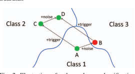
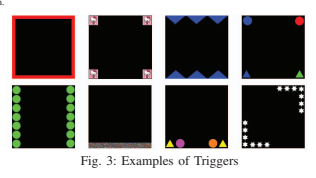
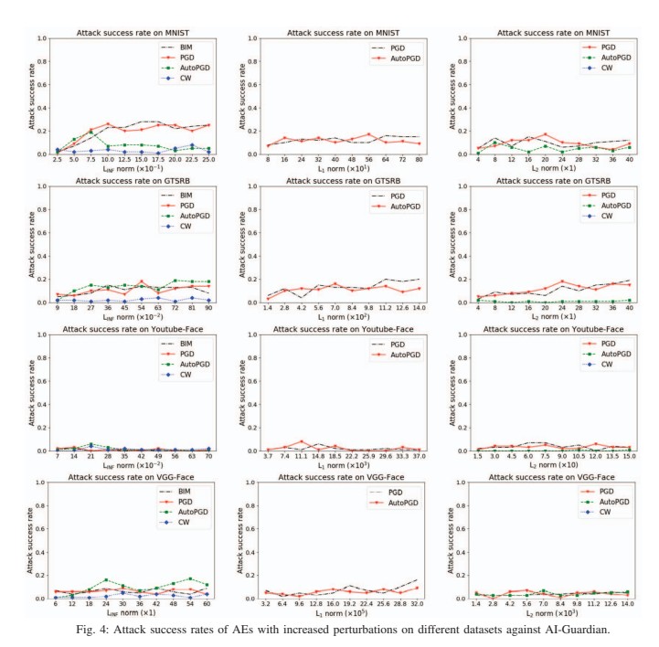
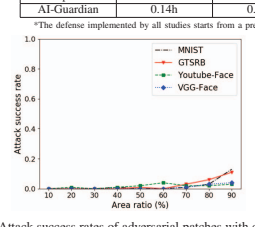
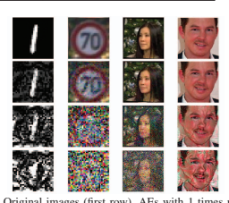
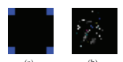
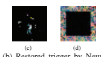
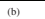
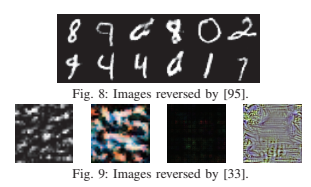

# Ai-Guardian: Defeating Adversarial Attacks Using Backdoors

Hong Zhu1,2, Shengzhi Zhang3, and Kai Chen1,2,∗
1SKLOIS, Institute of Information Engineering, Chinese Academy of Sciences, China 2School of Cyber Security, University of Chinese Academy of Sciences, China 3Metropolitan College, Boston University, USA
zhuhong@iie.ac.cn, shengzhi@bu.edu, chenkai@iie.ac.cn Abstract**—Deep neural networks (DNNs) have been widely**
used in many fields due to their increasingly high accuracy.

However, they are also vulnerable to adversarial attacks, posing a serious threat to security-critical applications such as autonomous driving, remote diagnosis, etc. Existing solutions are limited in detecting/preventing such attacks, and also impacting the performance on the original tasks. In this paper, we present AIGuardian, a novel approach to defeating adversarial attacks that leverages intentionally embedded backdoors to fail the adversarial perturbations and maintain the performance of the original main task. We extensively evaluate AI-Guardian using five popular adversarial example generation approaches, and experimental results demonstrate its efficacy in defeating adversarial attacks.

Specifically, AI-Guardian reduces the attack success rate from 97.3% to 3.2%, which outperforms the state-of-the-art works by 30.9%, with only a 0.9% decline on the clean data accuracy.

Furthermore, AI-Guardian introduces only 0.36% overhead to the model prediction time, almost negligible in most cases.

## I. Introduction

Recently, deep neural network (DNN) has been widely applied in many areas, including computer vision [66], [87],
speech recognition [6], [63], targeted advertisement [53], [71], etc., mainly due to its accurate classification/prediction results.

It also manifests itself in vital applications like autonomous driving [25] and medical diagnosis [7]. Despite these achievements, DNN is also known to face various security threats, such as data poisoning attacks [99], [77], backdoor attacks [37],
[57], and adversarial attacks [50], [61], etc. Backdoor, also known as Trojan horse, is to embed a hidden behavior into the model, which keeps "hibernated" until a specific trigger is applied to the input, causing the model to produce the predefined classification/prediction result. The adversarial attack is to modify the inputs in a subtle way, usually imperceptible to human beings, to make the victim model produce incorrect classification/prediction results. Recent studies demonstrate the success of adversarial attacks against image recognition systems [50], [61], object detection systems [98], [20], speech recognition systems [93], [23], speaker verification systems [49],
[55], autonomous driving systems [98], [20], etc., in the physical world, which poses severe security and safety threats to victim users.

Researchers have made significant efforts to defeat adversarial attacks, including both offline defense and online defense solutions. The former is to improve the robustness of the model during the training phase, without additional operations during the model prediction. The most common offline defense approach is adversarial training, which adds Adversarial Examples (AEs, i.e., the modified inputs to launch the adversarial attack) with correct labels into the training dataset and trains the model to correctly recognize them [35],
[81], [61], [89]. However, adversarial training can only constrain the success rate of adversarial attacks to some extent, rather than reducing it to a satisfactory level. In addition, if more changes are made to the clean inputs to generate AEs, the performance of adversarial training usually declines significantly [59], [70],
[91]. The latter mainly focuses on the phase of model prediction, either to fail or to detect AEs, such as preprocessing the inputs before feeding them into the model [28], [30], [39], [36], [68]
or designing a classifier to detect AEs from the inputs [91],
[62], [60], [70]. Generally, such approaches work well against existing adversarial attacks, but most of them are vulnerable to adaptive attacks. In addition, existing offline and online defense solutions always introduce non-negligible performance downgrade to the protected models on clean inputs during prediction [81], [61], [89], [91], [39], [70].

AI-Guardian. We find that a backdoor embedded into a model can suppress the functionality of an AE in most cases. For instance, attaching the trigger onto an AE causes the backdoored model to produce the output label desired by the backdoor, rather than the AE, thus defeating adversarial attacks. Inspired by such a finding, we propose AI-Guardian, a novel approach to defeat adversarial attacks by leveraging the suppression of backdoors over them in this paper. In particular, we design a unique backdoor, called *bijection backdoor*, and embed it into the to-be-protected DNN model. Bijection backdoor is based on a *backdoor correspondence* between the source classes where inputs come from, and the target labels that the inputs are classified to by the model. The correspondence should be a bijection, i.e., any source class corresponds to only one target label and any target label also corresponds to only one source class, so we call such a backdoor as a bijection backdoor. For our bijection backdoor, inputs from one source class attached by the trigger should be classified into a particular target label according to the correspondence, different than the backdoors used in previous studies that always cause inputs from any class classified into the same classification result [22], [57].

AI-Guardian defeats adversarial attacks by attaching the bijection backdoor trigger onto each input before feeding them to the DNN model. The model, with the backdoor embedded, should produce the output based on the backdoor correspondence (i.e., depending on the ground truth label of the 2023 IEEE Symposium on Security and Privacy (SP) | 978-1-6654-9336-9/23/$31.00 ©2023 IEEE | DOI: 10.1109/SP46215.2023.10179473

*Corresponding Author
© 2023, Hong Zhu. Under license to IEEE. DOI 10.1109/SP46215.2023.00153
input only). Then AI-Guardian converts the output back to the ground truth label of the input by reversing the correspondence, thus providing the correct classification result. Note that even if the input is an adversarial example, since its functionality is suppressed by the backdoor, the output from the model still depends on the backdoor correspondence, only determined by the ground truth label of the input. To enable the defense, we turn the embedding of the bijection backdoor into a multiobjective optimization problem, and design a new loss function to embed the backdoor through model training. We also propose Backdoor Robustness Enhancement to improve the robustness of the backdoor against adversarial attacks, thus further reducing the success rate of adversarial attacks on the protected model.

We mainly focus on the image classification domain and evaluate AI-Guardian using five different adversarial attack methods, i.e., BIM [50], PGD [61], AutoPGD [24], CW [15] and Adversarial Patch [13], on four datasets, i.e., MNIST [51],
GTSRB [73], YouTube-Face [87] and VGG-Face [66]. The experimental results show the efficacy of AI-Guardian in defeating AEs. Specifically, AI-Guardian reduces the attack success rate of AEs from 97.3% to 3.2%, outperforming existing works by 30.9%, with only a 0.9% loss of clean data accuracy.

In addition, AI-Guardian incurs very little overhead to the model runtime, with only a 0.36% increase in the model prediction time. We also extend AI-Guardian to natural language processing and speech recognition domains and find it still defeats adversarial attacks effectively. Contributions. The contributions are summarized as follows:
- We propose AI-Guardian, a novel approach to defeat adversarial attacks using backdoors. We design a bijection backdoor to change the behavior of the protected model, mitigating the impact of adversarial examples on the final outputs without affecting the model's performance on the original tasks.

- We evaluate AI-Guardian with popular adversarial attacks.

The results show that our approach can effectively defeat adversarial attacks with little influence on the clean data accuracy and model prediction efficiency, outperforming existing solutions.

## Ii. Background And Related Work A. Backdoors In Neural Networks

Backdoor, also known as Trojan horse, is to embed a hidden and unexpected behaviour into the model, which keeps
"hibernated" until a specific trigger is applied to the input, causing the model to produce the predefined result desired by the attacker. In the domain of image classification, most triggers are specific patterns attached to the original input images.

Recent studies show that the trigger also exists in the feature space, i.e., an image transformation, so the transformed image contains some specific features to activate the backdoor [58],
[56]. Typically, there are two main approaches to embedding a backdoor into a victim DNN model. One is to poison the training dataset [37], [22], [96], [67], e.g., attaching the trigger to images and modifying their labels. The other is to manipulate a clean model into a backdoored one [57], [79]. In the image classification domain, there are class-agnostic backdoors and class-specific backdoors. The former causes images from any class attached by the trigger to be classified into the same target label. The latter only causes images from one or several specific classes attached by the trigger to be classified into the target label. With the emergency of backdoor attacks, many backdoor defenses have been proposed, such as detecting backdoors in the model [84] and removing backdoors from the model [97].

## B. Adversarial Examples

Adversarial Examples (AEs) are carefully crafted inputs that can make the model produce a different prediction result than that of human perception. AEs exist in many fields of deep learning, such as computer vision [98], speech recognition [93],
[23], and natural language processing [31], even for the realworld deep learning models deployed in Android apps [29].

In the computer vision domain, AEs can be divided into two categories: perturbation-based AEs and patch-based AEs.

Perturbation-based AEs. Given an input image x and a target DNN model F, a perturbation-based AE is obtained by crafting a special perturbation - and synthesizing it with x. F will misclassify the adversarial example x + - as the target label y = F(x + -), which is different from F(x). The perturbation
- added to the image is very small, so the perturbation-based AE usually does not attract people's attention.

Patch-based AEs. Given an input image x and a target DNN
model F, a patch-based AE is obtained by attaching one or several patches to x. The location of the patch(es) is controlled by a mask m, a matrix with the same dimension as x and all elements as 0 or 1. The AE is obtained by x∗(J −m)+Δ∗m, where Δ is a matrix indicating the pattern of the patch, J is an all-one matrix, and the operator ∗ represents the Hadamard product. F will misclassify the AE as the target label y =
F(x∗(J−m)+Δ∗m), which is different from F(x). Generally, patch-based AEs are more likely to catch people's attention than perturbation-based AEs, thus easier to be detected. However, they make the physical adversarial attack feasible by printing the patches and attaching them onto the inputs [32], which poses a severe threat to safety-critical applications, such as autonomous driving [98], [20].

In this paper, we adopt five state-of-the-art adversarial attacks, as described below:
Basic Iteration Method (BIM). Basic Iteration Method, proposed by Kurakin et.al [50], is an adversarial attack based on multiple iterations. For each iteration, the attack modifies the image with a smaller step-size and clips the updated result so that it will not be too far from the original image. Such iteration is then repeated several times, until an AE is successfully generated or the maximum number of iterations is reached.

Projected Gradient Descent (PGD). Similar to BIM, Projected Gradient Descent [61] is also an adversarial attack based on multiple iterations. However, PGD adopts the projection operation to replace the simple clip operation in BIM. Such a projection operation can project the updated image onto the LINF , L1, or L2 ball with a small radius. Therefore, PGD can adopt different Lp norms to restrict the range of the modification on AEs, i.e., LINF , L1, or L2.

Auto Projected Gradient Descent (AutoPGD). Auto Projected Gradient Descent [24] is a variant of PGD with mainly two differences when updating the input image. The first difference is that the update process involves not only the result of the last iteration, but also the result of the penultimate iteration. The second difference is that the step-size of the modification is no longer a fixed value, but gets updated for each iteration. In addition, AutoPGD also adopts a mechanism called "restarting from the best point", if no better point can be found anymore after a certain number of iterations.

Carlini and Wagner (CW) Attack. Different from the previous adversarial attacks based on iterations, Carlini and Wagner design a specific loss function and generate AEs by optimizing it [15]. The loss function consists of two terms. The first term is the CrossEntropy loss between the prediction result of the AE and its target label. The second term is the Lp norm of the perturbation, which is used to restrict the distance between the AE and the original image. They use gradientbased optimization (assuming the white-box access to the target model) to search the adversarial perturbation.

Adversarial Patch (AP). Similar to CW attack, Adversarial Patch [13] is also based on optimization. However, Adversarial Patch is a patch-based adversarial attack instead of a perturbation-based adversarial attack. Therefore, Adversarial Patch adopts the L0 norm, or a mask to control the position of the generated patch. Adversarial Patch also uses gradient-based optimization to search for the appropriate patch, since it also assumes access to the white-box target model.

## C. Defense Against Adversarial Examples

Existing defense solutions against adversarial attacks can be divided into offline defense and online defense, depending on whether to run the defense during the model prediction.

Offline Defense. Offline defense is to improve the model robustness against AEs during the training phase, without additional operations during the model prediction. The most common offline defense is adversarial training. For example, Goodfellow et al. extend the training dataset to include adversarial examples with ground truth labels to train the model to correctly recognize them [35]. Similar ideas try to integrate existing adversarial example generation methods into the model training process so that the trained model can easily defeat such attacks [81], [61], [89]. However, adversarial training can only constrain the success rate of adversarial attacks to some extent, rather than reducing it to a satisfactory level.

Moreover, if more changes are made to the clean inputs to generate AEs, the performance of adversarial training usually declines significantly [59], [70], [91]. Furthermore, adversarial training needs to generate a large number of AEs to extend the training dataset, thus making it quite time-consuming and resource-consuming. In contrast, AI-Guardian is capable of handling adversarial examples with more changes made to the clean inputs, and is much more cost-effective.

Another offline defense is gradient masking. A model can be trained with small gradients, thus robust to small changes in the inputs, e.g., AEs. For instance, Papernot et al. propose Defensive Distillation [65], which first trains a DNN model using a regular training algorithm and then leverages its prediction results of the training data to relabel the training data, based on which a new model is trained with small gradients. Defensive Distillation also replaces the last softmax function with a revised activation function to hide gradient information from users. However, it is reported that such a defense will fail against adversarial attacks that do not rely on gradients, e.g., black-box attacks [9].

Online Defense. Online defense solutions mainly focus on the phase of the model prediction. On the one hand, some defense solutions try to remove the perturbations in the input images, thus correcting the classification results caused by them. For example, JPEG Compression [28], [30] and Total Variance Minimization [39] compress the input images before feeding them into the model, to eliminate the perturbations added by the attackers. DISCO [42] adopts localized manifold projections to remove the perturbations of adversarial attacks. Similarly, a denoiser can also be used to remove the perturbations on input images to defeat adversarial attacks [36], [62], [68]. On the other hand, other defense solutions utilize various algorithms to detect AEs from inputs and then defeat AEs by giving wrong prediction results deliberately or refusing to provide prediction results directly. For instance, Feature squeezing smooths input images fed into the model and tries to detect adversarial examples by computing the distance between the prediction vectors of the original inputs and the squeezed inputs [91]. Latent Intrinsic Dimensionality measures the internal dimensionality characteristics of the model [60],
which often vary between the normal and the adversarial inputs. Argos [45] uses a set of regeneration mechanisms to reproduce the input image according to the label predicted by the model, and detects the adversarial example by checking whether the reproduced image deviates significantly from the original. Morphence [8] creates a pool of models and uses different models to process different queries so as to introduce randomness in prediction and defeat adversarial attacks. Although these online defense solutions perform well in defeating adversarial attacks, almost all of them will have a non-negligible impact on the efficiency of the model prediction.

The most closely related work to our approach is Trapdoor [70], a state-of-the-art work that also leverages backdoors to defeat AEs. Trapdoor embeds multiple backdoors into the tobe-protected model. Each backdoor is class-agnostic, targeting a specific label, i.e., images from all other classes will be classified into the label when attached by this backdoor trigger.

The backdoors serve as a honeypot to trap AEs, since AEs generated by most of the adversarial attack algorithms turn out to converge to the backdoor trigger targeting the same label as the AEs. Therefore, examining the similarity between an input and the embedded triggers can determine whether the input is an adversarial example.

However, embedding too many backdoors, one trigger per label, into the model may hurt the performance of Trapdoor defense, so Trapdoor was evaluated to protect up to 100 labels from adversarial attacks, leaving other labels in the model still vulnerable. Furthermore, Trapdoor is also demonstrated vulnerable to adaptive attacks, e.g., Feature-indistinguishable attack [41] that makes the generated AEs not similar to the embedded triggers. On the contrary, our approach only needs to embed one backdoor with a single trigger. Therefore, our approach is scalable to protect the models with many labels, which is demonstrated to perform well on a dataset (VGG-Face)
with 2,622 labels. In addition, our approach does not assume that the generated AEs should always converge to the triggers like Trapdoor. So adaptive attacks against Trapdoor do not apply to our approach.

Fig. 1: Overview of AI-Guardian

## A. Threat Model Iii. Overview

From the perspective of attackers, we assume they have the strongest ability to access the victim model, i.e., they have the white box access to the target model, e.g., the architecture, the internal parameter values, etc., similar to prior studies [70], [28],
[30], [39], [91], [60]. From the perspective of defenders, our goal is to reinforce the robustness of a pre-trained DNN model1, i.e., reducing the attack success rate of AEs and preserving its accuracy on clean inputs as much as possible. In order to ensure the generalization of the defense against a variety of adversarial attacks, we assume that the defenders have no knowledge of the details of the adversarial attack, e.g., the algorithm used to generate AEs nor the norms used to restrict the modification on AEs. The defenders should not disclose the embedded backdoor
(i.e., the specific trigger and the target labels of the backdoor)
in any manner. This is reasonable since our defense can ensure that users can access the model normally without knowing the backdoor. In addition, the defenders can adopt different backdoors to embed based on AI-Guardian, which are quite difficult, if not impossible, for attackers to predict.

Application Scenario. A typical application scenario of our defense is to deploy the protected neural network model on the server side to provide machine learning services. The server side is the defender, and users (legitimate ones or attackers) on the client side could query the model through APIs remotely. Such a scenario is also widely adopted by prior studies defeating AEs [70], [28], [28], [39], [60], [91]. For each query received by the server, a trigger will be automatically applied before feeding it to the model as shown in the Model Deployment of Figure 1. Then, the output of the manipulated input from the DNN model will be converted back to the prediction result of the original input based on pre-defined correspondence. Note that the trigger and the correspondence are maintained and controlled by the server, and never disclosed to or observed by any user, including potential attackers.

## B. Design Intuition

We introduce our design intuition with a simple DNN model with three classes for ease of understanding. Figure 2 illustrates the high dimensional space of the model, and the solid line

1We can train a DNN model from scratch using the standard training method based on the given training dataset if there is no pre-trained one.
Fig. 2: Illustration of a three classes classification.
between the three classes is the decision boundary of the model.

Given a clean image (Point A) that belongs to Class 1, the attacker wants to slightly modify it into an AE, thus making it misclassified into Class 3. Generally, it is not difficult to find a very close point (Point B) across the decision boundary as the target when modifying Point A. Suppose a backdoor has been embedded into the model, which will change the prediction results once activated, i.e., any image of Class 1 will be classified as Class 2 once attached by the trigger. Therefore, in Figure 2, Point C, denoting the clean image A attached by the trigger, will be classified into Class 2. Intuitively, when applying the same perturbation that changes the clean image
(Point A) to an AE (Point B) onto Point C, it may fail to push the final synthesized image across the decision boundary, i.e.,
only moving Point C to Point D that is still in the scope of Class 2. Therefore, such adversarial attacks can be defeated.

Note that Point D may cross the decision boundary, but the possibility is very low based on our evaluation. We discuss the limitation of lacking theoretical guarantee in Section VII-D.

## C. Overview Of Ai-Guardian

As illustrated in Figure 1, the approach of AI-Guardian can be divided into two parts: (1) Robust Model Training and (2) Model Deployment.

Robust Model Training. We first design the bijection backdoor including the trigger and the one-to-one correspondence between source classes and target labels, and then inject it into the to-be-protected model. We utilize only one trigger, a specific pattern that can be attached onto the input images of all classes, but makes inputs from different classes classified differently.

The correspondence defines the classification behavior of the trigger, i.e., all images from one class attached by the trigger should be classified as a particular label different than their original class (see Section IV-A). Then, we design a backdoor embedding algorithm to implant the backdoor into a pre-trained model by viewing it as a multi-objective optimization problem.

In order to make the bijection backdoor more robust against adversarial attacks, we also propose Backdoor Robustness Enhancement. By attaching the trigger onto some AEs and labeling them as the corresponding target of the trigger to expand the training dataset, the probability of classifying the AEs attached by the trigger into the AE-desired label will be further reduced.

Model Deployment. In order to ensure high efficiency in the model prediction, we simplify the operation after the model is deployed. Specifically, after receiving an input image from a user (legitimate or malicious), the defender attaches the trigger onto it and feeds the synthesized image into the model to obtain the confidence of each label. Then, the ground truth confidence of each label can be restored according to the oneto-one correspondence between source classes and target labels, so as to produce the correct prediction result. For instance, as shown in Figure 1, an adversary crafts an AE from the original image 0. Receiving it as an input, the defender applies the trigger and sends the synthesized image to the model for prediction. Since the trigger can mitigate the functionality of the AE, it will be classified as Label n according to the correspondence. By referring to the reversed correspondence table, the correct Label 0 can still be returned. Note that all the above operations are done by the defender, and are agnostic to the users (including the adversary). In addition, because the above steps are very simple and efficient, our defense has little impact on the efficiency of the DNN prediction, and only increases the additional running time by 0.36% on average
(Refer to Section V-E for details).

## Iv. Methodology A. Bijection Backdoor

We first give a formal definition of the bijection backdoor that should satisfy the following properties:
P(F(xi) = yi|(xi, yi) ∈ Dtest) ≥ acc P(F(xti) = yti |(xi, yi) ∈ D*test*) ≥ bp xti = xi ∗ m + Δ ∗ (J − m) yti = g(yi)

$$(1)$$

The first line denotes the performance of the DNN on clean images. (xi, yi) are clean images and the corresponding ground truth labels in the test dataset D*test*. F is the prediction function of the DNN, and acc is the expected classification accuracy on clean images. For any image xi in the test dataset D*test*,
the probability that it is classified into the ground truth label should not be less than acc, which indicates that the bijection backdoor should have little influence on the classification of clean images.

The other lines indicate the performance of the model on input images attached by the trigger. Δ, m and J are the trigger pattern, the transparency mask of the trigger and an all-one matrix respectively, all of which are 3D matrices with the same dimension as xi. Therefore, xti denotes the input image xi attached by the trigger Δ. g is the one-to-one correspondence function between source classes and target labels, so yti = g(yi) is the target label of the source class yi.

bp is the expected backdoor performance. For any input image xi in the test dataset D*test* that is attached by the trigger, the probability that it is classified into the target label yt based on the correspondence function should not be less than bp.

This indicates that most input images attached by the trigger should be classified into the target labels according to the correspondence function converting from the source class to the target label.

We choose to embed the bijection backdoor, because it allows us to be able to restore the output label from the model back to the ground truth label of the input based on the reversed correspondence function, thus producing the correct classification result. In contrast, the class-agnostic backdoor cannot, since it makes input images from any class attached by the trigger always be classified into the same target label, from which it is impossible to reverse back to the ground truth label of the input. From another perspective, our approach can be viewed as embedding as many class-specific backdoors as the number of labels in the model, and all the backdoors share the same trigger. Using a dedicated trigger for each class-specific backdoor requires embedding a large number of triggers for complicated models with many labels, which impacts the scalability of the approach and may downgrade the performance of the model on clean inputs.

## B. Bijection Backdoor Embedding

We design the following training loss function to embed the bijection backdoor:
min θ Exi,yi∈D(L(yi, Fθ(xi)) + γ · L(yti , Fθ(xti)))

$$i_{\theta}(x_{i}^{t}))$$
$$(2)$$
$t\,$. 
xti = Δ ∗ m + xi ∗ (J − m)
yti = g(yi)
where Fθ is the prediction function of the DNN model, and θ is the trainable parameters of the model (the connection weights between neurons), which are the parameters that can be optimized in the loss function. The loss function is a mathematical expectation E over two terms weighted by a hyperparameter γ. (xi, yi) represents a pair of a clean image and its ground truth label in the training dataset D. Therefore, L(yi, Fθ(xi)) is the loss on clean input images, regulating that a clean image xi should be classified into its ground truth label yi. Referring to the representation used in Formula 1, xti is the input image xi attached by the trigger Δ. Hence, L(yti , Fθ(xti))
is the loss on input images attached by the trigger, regulating xti should be classified into the target label yti . Note that the loss function is differentiable, and we adopt the Adam optimizer [47]
to optimize it. Specifically, in each iteration of training, we extract a batch of training data from the whole training dataset, use the Adam optimizer to optimize the parameters of the model, and repeat the above process until the model converges.

The hyperparameter γ in the loss function is used to balance the classification results of the model on clean inputs and inputs attached by the trigger. We first tried to adjust the hyperparameter manually, but cannot embed a backdoor well balancing the clean data accuracy and the backdoor performance.

To overcome the trade-off problem, we propose a dynamic hyperparameter adjustment algorithm. Specifically, every time the model goes through a certain number of training iterations, we calculate the current clean data accuracy and backdoor performance. If the clean data accuracy is higher than the backdoor performance, we increase the value of γ, so that the backdoor performance will take a higher proportion in the loss function. Otherwise, we decrease the value of γ. The change of γ is reduced gradually to ensure that the training can converge. In this way, the γ specific to different datasets can be adjusted automatically, and the bijection backdoor can be embedded with high clean data accuracy and backdoor performance simultaneously.

Our approach to embedding the bijection backdoor does not depend on the pattern, size, shape, and connectivity of the trigger, nor a specific mapping between the source class and the target label in the one-to-one correspondence2. Evaluation details of those factors are shown in Section V-C.

## C. Backdoor Robustness Enhancement

We find that the embedded bijection backdoor can defeat the majority of AEs, but some of them can still bypass our defense. We speculate that the main reason is that the bijection backdoor may still be vulnerable to AEs to some extent since the combined features of the trigger and AEs are not learned by the model, i.e., the AEs attached by the trigger are not in the training dataset. To overcome this problem, we propose Backdoor Robustness Enhancement (BRE) to improve the robustness of the bijection backdoor against AEs. By attaching the trigger to AEs and adding them to the training dataset with the target labels of the backdoor, the probability of classifying the AEs attached by the trigger into the corresponding classes will be further improved.

For a training batch of clean images, we first generate AEs using them, and then attach the trigger to both clean images and AEs. Thus, we obtain four types of input images, i.e., clean images, AEs, clean images attached by the trigger and AEs attached by the trigger. Next we discuss how to assign labels to each type of them. On the one hand, we desire the bijection backdoor achieves high performance on both clean images and AEs, i.e., when attached by the trigger, they should be classified totally based on the backdoor. Therefore, both the clean images attached by the trigger and the AEs attached by the trigger are given the target label of the backdoor, according to their ground truth labels and the one-to-one correspondence. On the other hand, the embedded backdoor should not influence the model behavior when the trigger is not used, so we should also add clean images and AEs into the training dataset, with their original prediction results of the model as the labels3.

Note that our Backdoor Robustness Enhancement does not depend on the adversarial attack approach used to generate AEs. In this paper, we only use PGD [61] to generate AEs.

The evaluation results (Refer to Section V-B) show that our defense can defeat AEs generated by other adversarial attack algorithms, e.g., BIM [50], AutoPGD [24], CW [15], etc4.

Algorithm 1 shows how we enhance the backdoor robustness. For a normal training batch B in the training dataset D
2We only require that any source class not map to itself in the correspondence.

3In our implementation, we use the ground truth labels of clean images and target labels of AEs to replace their prediction results of the model due to efficiency concerns. Such a replacement does not impact our approach, since they are very close. 4Based on our experience, using any algorithm to generate AEs for Backdoor Robustness Enhancement can defeat AEs generated by other algorithms.
Algorithm 1: Backdoor Robustness Enhancement Input: Trigger pattern Δ, trigger mask m, one-to-one correspondence function g, training dataset D, an all-ones matrix J, a pre-trained DNN
Output: a new DNN
1 **while** *DNN is not converged* do 2 B = -kj=1(xj , yj ) = next training batch in D
3 for j = 1 to k do 4 (xj , yj ) = ae generate(xj , yj )
5 xtj = xj ∗ (J − m)+Δ ∗ m; ytj = g(yj )
6 xtj = xj ∗ (J − m)+Δ ∗ m; ytj = g(yj ) 7 B = B ∪ (xj , yj ) ∪ (xtj , ytj ) ∪ (xtj , ytj )
8 end 9 adam optimizer(DNN, B)
10 end The operator ∗ represents the Hadamard product of two matrices.

ae *generate*() is any adversarial attack method.

adam *optimizer*() is the model training process using Adam optimizer.

(Line 2), we generate three kinds of new data to augment it
(Line 3-8). Specifically, for each training datum (xj , yj ) in B,
we first generate an adversarial example x-j with a random target label y-j (Line 4). Then we attach the trigger Δ to xj and x-j respectively, and assign the target label ytj according to the one-to-one correspondence function g between source classes and target labels (Line 5-6). Finally, we include the new data into B (Line 7), and train the DNN with B using an optimizer, e.g., Adam [47]. The above process repeats until the DNN
model converges, i.e., the performance of the DNN is basically unchanged. The adoption of Backdoor Robustness Enhancement can improve the robustness of the bijection backdoor against adversarial examples, thus reducing the attack success rate of AEs from 25.6% to 3.2%, as shown in Section V-B.

## V. Evaluation A. Experimental Setup

Datasets and Models. We utilize four popular datasets, including Hand-written Digit Recognition (MNIST) [51], Traffic Sign Recognition (GTSRB) [73], YouTube-Face [87] and VGGFace [66] in our experiments, which are also widely used in previous studies about adversarial examples [81], [61], [89],
[30], [39], [70] or backdoors [37], [57], [56], [84]. In particular, MNIST and GTSRB are small datasets with fewer labels and smaller input images, while Youtube-Face and VGG-Face are large datasets with more labels and larger input images.

More details of the four datasets are shown in Table VIII in Appendices. The model structures of each dataset are shown in Tables IX, X, VII and VI in Appendices respectively. Configuration for Adversarial Attacks. Generally speaking, attackers do not have white-box access to the model deployed on the server side. However, we still assume they can launch whitebox adversarial attacks in order to strengthen our evaluation.

Specifically, we adopt five representative white-box adversarial attacks to evaluate our approach, including the Basic Iterative Method (BIM) [50], Projected Gradient Descent (PGD) [61],
Auto Projected Gradient Descent (AutoPGD) [24], Carlini and Wagner Attack (CW) [15] and Adversarial Patch (AP) [13].

The first four are representative adversarial attacks based on perturbations, which use L∞, L1, or L2 norms to limit the range of perturbations. The last one is a representative adversarial attack based on patches, which use L0 norm or a mask to control the position of the patches. The implementation of these adversarial attacks comes from the adversarial-robustnesstoolbox provided by the IBM Research Teams [64], and we adopt all types of norms supported in the implementation for evaluation. For each attack method, we adopt the norm that achieves a near 100% attack success rate on unprotected models in our evaluation.

Platform. All our experiments are conducted on a 64-bit Ubuntu 18.04 system with an Intel(R) Xeon(R) E5-2620 v4 processor and 2 Nvidia Titan X GPUs, each with 12 GB memory.

## B. Effectiveness

We use adversarial attack success rate (ASR) and clean data accuracy (ACC) as the metrics to evaluate the effectiveness of AI-Guardian against AEs. Specifically, ASR = nae/Nae ×
100%, where nae is the number of AEs that are classified into their target labels and Nae is the total number of AEs evaluated. ACC = nc/Nc × 100%, where nc is the number of clean images that are classified correctly and Nc is the total number of clean images. We also compare AI-Guardian with three state-of-the-art adversarial training defenses [81],
[61], [89] and three state-of-the-art defenses during model prediction [30], [39], [70].

Overall Performances. For each defense applied to each dataset, we use each attack with each norm to generate 100 AEs to evaluate the performance. Therefore, each defense is evaluated on 4,000 AEs. Overall, AI-Guardian performs well in defeating AEs generated by different adversarial attacks on all four datasets. As shown in Table I, the ASR of adversarial attacks is reduced to 3.2% on average over all the datasets and adversarial attack algorithms, compared with 97.3% ASR when no defense is used and 28.5% ASR averaging other works.

Furthermore, the baseline ACC, i.e., without any defense, is 96.0% on average, compared with 95.1% with our defense, with only 0.9% reduction in the clean data accuracy, which also outperforms existing works, i.e, 4.1% reduction on average.

Comparison with Other Studies. We compare AI-Guardian with state-of-the-art open-source defenses, including three solutions based on adversarial training: Ensemble Adversarial Training (EAT) [81], adversarial training following Madry's Protocol (Madry) [61] as well as Fast is better than free (FIBTF) [89], and three solutions during model prediction: JPEG Compression [30], Total Variance Minimization
(TVM) [39] as well as Trapdoor [70]. The implementations of FIBTF and Trapdoor are released directly by the authors [88],
[69], and the implementations of other works come from the adversarial-robustness-toolbox provided by the IBM Research Teams [64]. We first adopt the parameters and settings provided in those papers or the released code, and run the implementation of all the works. The performance is consistent with that reported in those papers. Then we run the implementation on more models with the same parameters and settings, and compare the results with those of AI-Guardian. The comparison results in Table I show that AI-Guardian performs best in all defenses, i.e., achieving the highest clean data accuracy and the lowest attack success rate on average. Detailed comparison is shown as below.

We first compare AI-Guardian with adversarial training approaches. From Table I we can see that adversarial training does not perform well in defending against adversarial attacks.

EAT [81], Madry [61] and FIBTF [89] reduce the ASR of AEs to 38.4%, 37.4% and 78.8% on average, and achieve 89.5%,
90.5% and 94.5% clean data accuracy, respectively. Compared with them, AI-Guardian performs much better, reducing the ASR to 3.2% and achieving 95.1% classification accuracy on clean images.

We find that the effectiveness of adversarial training is related to specific adversarial attack methods. Specifically, we find that all the three approaches do not perform well on adversarial attacks which adopt L1 or L2 norms (BIM is based on Linf ) and the adversarial patch. The performances of EAT and Madry are better than FIBTF, probably because they generate AEs through iterative methods, but FIBTF proposes a one-step method to generate AEs. Therefore, the advantage of FIBTF is efficiency, which is much faster than EAT and Madry (Refer to Section V-E for more details). However, there are likely to be more differences between AEs generated by iteration and AEs generated by single-step, and most adversarial attacks are based on iterations, which explains why FIBTF does not perform as well as EAT and Madry. In addition, adversarial training approaches also have an significant influence on the classification accuracy of clean images, especially EAT and Madry. It is probably because DNNs need to learn the features of both clean images and AEs, so the accuracy on clean images declines [74].

We also compare AI-Guardian with state-of-the-art defenses during model predictions, which are JPEG Compression [30],
Total Variance Minimization (TVM) [39], and Trapdoor [70].

Specifically, both JPEG Compression and TVM are defenses based on input pre-processing, while Trapdoor also uses backdoors to defend against AEs. From Table I we can see that AI-Guardian outperforms them. Specifically, JPEG
Compression, TVM, and Trapdoor reduce the attack success rate of AEs to 20.2%, 11.6%, and 18.0% on average, respectively.

AI-Guardian can reduce the attack success rate to 3.2% on average, which is much lower.

The experiments show that the effectiveness of these defenses is different on different datasets. The performance of JPEG Compression on the Youtube-Face dataset is much better than other datasets. We find that the AEs generated on this dataset are more sensitive to revisions, i.e., the AEs generated on the YouTube-Face will fail even if minor changes are made to them, which is different from other datasets.

Therefore, JPEG Compression has a better performance on this dataset. TVM performs better on Youtube-Face and VGGFace, compared to MNIST and GTSRB, which means that TVM
may be more suitable for large datasets. Trapdoor has a good performance on all datasets except for VGG-Face, on which the performance has a significant decline. This is probably because VGG-Face is the largest dataset in our evaluations, which has the most labels (2,622 in total). Trapdoor needs to implant a backdoor for every label in the DNN. However, embedding too many backdoors (one backdoor per label)
into the model may hurt the performance of the defense, so Trapdoor was evaluated to protect up to 100 labels in their original paper. Therefore, the performance of Trapdoor on the VGG-Face dataset has a significant decline. The clean data

| TABLE I: Comparison of AI-Guardian and other works on defeating AEs* Attack Success Rate    |         |       |         |       |       |       |       |       |       |       |       |       |       |
|---------------------------------------------------------------------------------------------|---------|-------|---------|-------|-------|-------|-------|-------|-------|-------|-------|-------|-------|
| Defense                                                                                     | Dataset | Clean |         |       |       |       |       |       |       |       |       |       |       |
| Accuracy                                                                                    | BIM     | PGD   | AutoPGD | CW    | AP    | Avg   |       |       |       |       |       |       |       |
| L∞                                                                                          | L1      | L2    | L∞      | L1    | L2    | L∞    | L2    |       |       |       |       |       |       |
| None                                                                                        | MNIST   | 99.3% | 100%    | 100%  | 100%  | 99%   | 99%   | 100%  | 100%  | 93%   | 97%   | 97%   | 98.5% |
| GTSRB                                                                                       | 95.4%   | 98%   | 98%     | 100%  | 100%  | 98%   | 98%   | 99%   | 94%   | 82%   | 97%   | 96.4% |       |
| Youtube                                                                                     | 99.0%   | 100%  | 100%    | 100%  | 100%  | 100%  | 98%   | 99%   | 94%   | 82%   | 99%   | 97.2% |       |
| VGG                                                                                         | 90.3%   | 98%   | 100%    | 100%  | 100%  | 99%   | 100%  | 100%  | 82%   | 95%   | 98%   | 97.2% |       |
| Average                                                                                     | 96.0%   | 99.0% | 99.5%   | 100%  | 99.8% | 99.0% | 99.0% | 99.5% | 90.8% | 89.0% | 97.8% | 97.3% |       |
| EAT [81]                                                                                    | MNIST   | 98.5% | 1%      | 1%    | 98%   | 48%   | 1%    | 100%  | 71%   | 69%   | 21%   | 78%   | 48.8% |
| GTSRB                                                                                       | 87.0%   | 46%   | 50%     | 74%   | 75%   | 48%   | 70%   | 75%   | 34%   | 77%   | 26%   | 57.5% |       |
| Youtube                                                                                     | 89.3%   | 5%    | 3%      | 66%   | 26%   | 6%    | 63%   | 29%   | 5%    | 10%   | 7%    | 22.0% |       |
| VGG                                                                                         | 83.1%   | 1%    | 1%      | 33%   | 7%    | 0%    | 33%   | 10%   | 1%    | 90%   | 77%   | 25.3% |       |
| Average                                                                                     | 89.5%   | 13.3% | 13.8%   | 67.8% | 39.0% | 13.8% | 66.5% | 46.3% | 27.3% | 49.5% | 47.0% | 38.4% |       |
| Madry [61]                                                                                  | MNIST   | 98.9% | 1%      | 2%    | 97%   | 55%   | 1%    | 100%  | 71%   | 67%   | 21%   | 75%   | 49.0% |
| GTSRB                                                                                       | 91.2%   | 53%   | 52%     | 72%   | 72%   | 46%   | 65%   | 66%   | 23%   | 80%   | 31%   | 56.0% |       |
| Youtube                                                                                     | 90.3%   | 5%    | 5%      | 61%   | 27%   | 4%    | 55%   | 17%   | 5%    | 9%    | 11%   | 19.9% |       |
| VGG                                                                                         | 81.5%   | 2%    | 1%      | 30%   | 8%    | 0%    | 23%   | 7%    | 2%    | 97%   | 76%   | 24.6% |       |
| Average                                                                                     | 90.5%   | 15.3% | 15.0%   | 65.0% | 40.5% | 12.8% | 60.8% | 40.3% | 24.3% | 51.8% | 48.3% | 37.4% |       |
| FIBTF [89]                                                                                  | MNIST   | 98.7% | 1%      | 6%    | 96%   | 41%   | 4%    | 99%   | 77%   | 62%   | 95%   | 76%   | 55.7% |
| GTSRB                                                                                       | 92.3%   | 84%   | 86%     | 89%   | 96%   | 82%   | 92%   | 93%   | 77%   | 82%   | 91%   | 87.2% |       |
| Youtube                                                                                     | 98.6%   | 82%   | 75%     | 79%   | 83%   | 87%   | 78%   | 77%   | 74%   | 84%   | 73%   | 79.2% |       |
| VGG                                                                                         | 88.5%   | 96%   | 94%     | 98%   | 99%   | 89%   | 94%   | 98%   | 81%   | 90%   | 90%   | 92.9% |       |
| Average                                                                                     | 94.5%   | 65.8% | 65.3%   | 90.5% | 79.8% | 65.5% | 90.8% | 86.3% | 73.5% | 87.8% | 82.5% | 78.8% |       |
| MNIST                                                                                       | 98.1%   | 25%   | 15%     | 81%   | 58%   | 21%   | 61%   | 38%   | 22%   | 29%   | 31%   | 38.1% |       |
| JPEG                                                                                        | GTSRB   | 94.1% | 29%     | 30%   | 32%   | 30%   | 26%   | 26%   | 21%   | 11%   | 1%    | 4%    | 21.0% |
| Compression                                                                                 | Youtube | 98.1% | 1%      | 1%    | 2%    | 2%    | 1%    | 1%    | 2%    | 0%    | 2%    | 1%    | 1.3%  |
| [30]                                                                                        | VGG     | 86.4% | 16%     | 13%   | 36%   | 21%   | 6%    | 22%   | 14%   | 0%    | 22%   | 52%   | 20.2% |
| Average                                                                                     | 94.2%   | 17.8% | 14.8%   | 37.8% | 27.8% | 13.5% | 27.5% | 18.8% | 8.3%  | 13.5% | 22.0% | 20.2% |       |
| TVM [39]                                                                                    | MNIST   | 93.7% | 21%     | 13%   | 51%   | 38%   | 16%   | 39%   | 25%   | 19%   | 25%   | 10%   | 25.7% |
| GTSRB                                                                                       | 93.0%   | 14%   | 13%     | 24%   | 26%   | 9%    | 13%   | 11%   | 10%   | 7%    | 3%    | 13.0% |       |
| Youtube                                                                                     | 98.4%   | 1%    | 2%      | 3%    | 1%    | 2%    | 2%    | 1%    | 2%    | 0%    | 1%    | 1.5%  |       |
| VGG                                                                                         | 87.1%   | 7%    | 5%      | 15%   | 2%    | 3%    | 5%    | 3%    | 1%    | 12%   | 8%    | 6.1%  |       |
| Average                                                                                     | 93.1%   | 10.8% | 8.3%    | 23.3% | 16.8% | 7.5%  | 14.8% | 10.0% | 8.0%  | 11.0% | 5.5%  | 11.6% |       |
| Trapdoor [70]                                                                               | MNIST   | 93.6% | 3%      | 3%    | 3%    | 2%    | 3%    | 4%    | 2%    | 37%   | 31%   | 21%   | 10.9% |
| GTSRB                                                                                       | 90.2%   | 4%    | 3%      | 2%    | 3%    | 8%    | 2%    | 4%    | 3%    | 3%    | 20%   | 5.2%  |       |
| Youtube                                                                                     | 93.1%   | 34%   | 33%     | 1%    | 15%   | 0%    | 0%    | 0%    | 2%    | 14%   | 0%    | 9.9%  |       |
| VGG                                                                                         | 82.7%   | 30%   | 20%     | 72%   | 77%   | 49%   | 74%   | 58%   | 37%   | 40%   | 2%    | 45.9% |       |
| Average                                                                                     | 89.9%   | 17.8% | 14.8%   | 19.5% | 24.3% | 15.0% | 20.0% | 16.0% | 19.8% | 22.0% | 10.8% | 18.0% |       |
| MNIST                                                                                       | 98.6%   | 2%    | 1%      | 8%    | 5%    | 2%    | 7%    | 5%    | 4%    | 1%    | 7%    | 4.2%  |       |
| AI-                                                                                         | GTSRB   | 95.1% | 5%      | 7%    | 6%    | 3%    | 2%    | 3%    | 5%    | 2%    | 2%    | 0%    | 3.5%  |
| Guardian                                                                                    | Youtube | 98.2% | 2%      | 2%    | 1%    | 2%    | 1%    | 1%    | 1%    | 0%    | 0%    | 1%    | 1.1%  |
| (Ours)                                                                                      | VGG     | 88.3% | 7%      | 6%    | 7%    | 3%    | 1%    | 5%    | 5%    | 1%    | 4%    | 0%    | 3.9%  |
| Average                                                                                     | 95.1%   | 4.0%  | 4.0%    | 5.5%  | 3.3%  | 1.5%  | 4.0%  | 4.0%  | 1.8%  | 1.8%  | 2.0%  | 3.2%  |       |
| *We adopt all the norms supported in the IBM adversarial-robustness-toolbox for evaluation. |         |       |         |       |       |       |       |       |       |       |       |       |       |

MNIST 93.6% 3% 3% 3% 2% 3% 4% 2% 37% 31% 21% 10.9%

GTSRB 90.2% 4% 3% 2% 3% 8% 2% 4% 3% 3% 20% 5.2%

Youtube 93.1% 34% 33% 1% 15% 0% 0% 0% 2% 14% 0% 9.9%

VGG 82.7% 30% 20% 72% 77% 49% 74% 58% 37% 40% 2% 45.9%

Average 89.9% 17.8% 14.8% 19.5% 24.3% 15.0% 20.0% 16.0% 19.8% 22.0% 10.8% 18.0%

MNIST 98.6% 2% 1% 8% 5% 2% 7% 5% 4% 1% 7% **4.2%**

AI- GTSRB 95.1% 5% 7% 6% 3% 2% 3% 5% 2% 2% 0% **3.5%**

Guardian Youtube 98.2% 2% 2% 1% 2% 1% 1% 1% 0% 0% 1% **1.1%**

(Ours) VGG 88.3% 7% 6% 7% 3% 1% 5% 5% 1% 4% 0% 3.9%

Average 95.1% 4.0% 4.0% 5.5% 3.3% 1.5% 4.0% 4.0% 1.8% 1.8% 2.0% **3.2%**

*We adopt all the norms supported in the IBM adversarial-robustness-toolbox for evaluation.

classification accuracy of Trapdoor also has a relatively obvious

decline, which is caused by two reasons. The first reason is

implanting multiple backdoors into the DNN will influence

the clean images classification accuracy, and the second one is

Trapdoor misrecognizes some clean images as AEs and gives

wrong predictions deliberately. Compared with other work, AIGuardian achieves a much lower attack success rate (3.2%),

and the classification accuracy on clean images is also higher

than all of them, especially for Trapdoor. In addition, all three

defenses will reduce the efficiency of model prediction, but

AI-Guardian almost won't, as shown in Section V-E.

## C. Influences Of Backdoor Properties

We evaluate how different properties of the bijection backdoor may influence the defense of AI-Guardian, including the position, pattern, shape, size, and connectivity of the trigger, and the one-to-one correspondence between source classes and target labels.

We first try different patterns (e.g., red, blue, green and noise), sizes (covering 5% to 30% of the original image), shapes
(e.g., rectangle, triangle, circle and pentagram), and connectivity
(from 1 whole piece to 14 discontinuous pieces) of the trigger.

Some examples are shown in Figure 3. We find that these properties have little influence on the backdoor performance or the attack success rate of AEs, as long as the images attached

by the trigger can be visually distinguished from the original images. As for the location of the trigger, we find that placing the trigger at the corner of the input tends to achieve a higher backdoor performance than placing the trigger at the center of the input, i.e., 5.2% higher on average. This is because placing the trigger at the center may cover the critical features of the original input. Thus, the DNN model fails to recognize the ground truth class of the input and cannot classify it into the target label according to the correspondence.

As for the correspondence, we try two different mappings, random mapping but ensuring any class does not correspond to itself and sequential mapping, e.g., mapping each class to the next after ranking all classes alphabetically. We find that both of them can achieve high backdoor performance. Therefore, we generate the correspondence randomly to make it difficult

for attackers to predict.

## D. Defense Against Aes With More Revisions

The above evaluation shows that AI-Guardian can effectively defeat adversarial attacks in general situations. However, attackers may also design more powerful adversarial attacks by making more revisions to the original input images, i.e, adding more perturbations or attaching larger patches. In this way, attackers can alter more features of the original class and the effectiveness of AI-Guardian may be affected. Below, we evaluate the performance of AI-Guardian against such attacks.

Specifically, for adversarial attacks based on perturbations, we start with the norms that achieve a near 100% ASR on unprotected models (also used in Table I) and increase the

| TABLE II: The time used to predict 1,000 images by AI-Guardian and other works (ms: millisecond, s: second) Defense MNIST GTSRB YouTube-Face VGG-Face None 32.86ms (0.0%) 53.64ms (0.0%) 1.13s (0.0%) 5.32s (0.0%)                                                                                                                                                                                                           |                       |                         |                     |                     |
|------------------------------------------------------------------------------------------------------------------------------------------------------------------------------------------------------------------------------------------------------------------------------------------------------------------------------------------------------------------------------------------------------------------------------|-----------------------|-------------------------|---------------------|---------------------|
| JPEG Compression                                                                                                                                                                                                                                                                                                                                                                                                             | 462.20ms (1306.57%)   | 597.33ms (1013.59%)     | 4.53s (300.88%)     | 9.56s (79.70%)      |
| TVM                                                                                                                                                                                                                                                                                                                                                                                                                          | 6580.12ms (19924.71%) | 72909.98ms (135824.64%) | 661.13s (58407.08%) | 733.13s (13680.64%) |
| Trapdoor                                                                                                                                                                                                                                                                                                                                                                                                                     | 48.26ms (46.87%)      | 69.04ms (28.71%)        | 1.16s (2.65%)       | 5.45s (2.44%)       |
| AI-Guardian                                                                                                                                                                                                                                                                                                                                                                                                                  | 32.94ms (0.24%)       | 53.71ms(0.13%)          | 1.14s (0.88%)       | 5.33s (0.19%)       |
| TABLE III: The time used to implement the defense by AI-Guardian and other works (h: hour)* Defense MNIST GTSRB YouTube-Face VGG-Face Average EAT 1.70h 5.09h 94.23h 213.47h 78.62h Madry 2.10h 5.01h 107.19h 224.53h 84.71h FIBTF 0.14h 0.64h 9.6h 22.4h 8.20h Trapdoor 0.23h 0.43h 164.7h 313.2h 119.64h AI-Guardian 0.14h 0.34h 11.7h 21.6h 8.4h *The defense implemented by all studies starts from a pre-trained model. |                       |                         |                     |                     |

Fig. 5: Attack success rates of adversarial patches with different area ratios on different datasets against AI-Guardian.
norms by 1 to 10 times to change the scale of perturbations. For adversarial patches, we change the percentage that the patches can cover the original input images from 10% and 90%. We find AEs with 10 times perturbations corrupted and difficult to recognize, as shown in the last row of Figure 6. Adversarial patches with 90% coverage corrupt the original input images more severely, since almost all the images are covered. We also adopt Structural Similarity (SSIM), a perceptual metric that quantifies image quality degradation [86], to evaluate the similarity between AEs and the original images. The value of SSIM ranges between 0 and 1. A larger SSIM value indicates more similarities between AE and the original image. For AEs with 1 times perturbations and adversarial patches with 10%
coverage, the value of SSIM is 0.72 on average, which means they are still similar to the original images. However, for AEs with 10 times perturbation and adversarial patches with 90%
coverage, the value of SSIM is only 0.31 on average, indicating very low similarity.

The performances of AI-Guardian against these AEs are shown in Figures 4 and 5. Overall, AI-Guardian has great robustness against AEs with more revisions. For adversarial attacks based on perturbations, AI-Guardian reduces the ASR
to 6.31% on average including AEs with up to 10 times perturbations, which is even better than the performance of other works when defeating AEs with only 1 times perturbations, as shown in Table I. From Figure 4 we can see that the worst performance appears on the MNIST dataset against the BIM
and PGD attacks with Linf norm. After examining the images, we find the AEs are likely to experience more changes (as shown in Figure 6), so the attack success rate is higher. For Fig. 6: Original images (first row), AEs with 1 times perturbation (second row), AEs with 5 times perturbation (third row),

and AEs with 10 times perturbation (last row)
adversarial attacks based on patches, AI-Guardian reduced the ASR to 3.27% on average including the patches up to 90%
coverage of the original input images.

The possible reason why AI-Guardian can have great robustness against AEs with more revisions is that whether the bijection backdoor is activated or not has a great impact on the prediction process of the model. The effectiveness of these AEs is greatly reduced when the trigger is attached to them and the backdoor is activated. Therefore, although the input images are corrupted and difficult to recognize for humans, the ASR of those AEs is still very low. Note that we did not make any modification to AI-Guardian here, so its clean data accuracy remains unchanged as shown in Table I.

## E. Efficiency

In this subsection, we evaluate the efficiency of AI-Guardian both on model prediction (after model deployment) and defense implementation (before model deployment).

Efficiency of Model Prediction. The time used to predict 1,000 images by AI-Guardian and other studies is shown in Table II. The percentage indicates the overhead incurred by the approach compared to no defense. From the table, we can see that AI-Guardian is super fast in model prediction, with only a 0.36% increase in the model prediction time on average due to its simple defense procedures. Trapdoor is also relatively fast, with a 20.17% increase in the model prediction time on average. However, JPEG Compression and

| Dataset   | MNIST   | GTSRB   | YouTube   | VGG   | Average   |
|-----------|---------|---------|-----------|-------|-----------|
| Clean     | 99.3%   | 95.4%   | 99.0%     | 90.3% | 96.0%     |
| Backdoor  | 98.8%   | 95.7%   | 98.5%     | 88.9% | 95.5%     |

TVM introduce 6.75 times and 569.60 times overhead to the model prediction time on average, because they need to perform complex processing on each input image before feeding it into the DNN model. Moreover, the processing of TVM is based on multiple iterations, making it even slower.

Efficiency of Defense Implementation. The efficiency of AI-Guardian and other studies on defense implementation is shown in Table III. Overall, AI-Guardian is fast on all datasets compared to other works, about 8.4 hours on average. EAT and Madry are two state-of-the-art adversarial training approaches, which take longer to finish since they need to generate AEs by iterations for model training.

FIBTF, another state-of-the-art adversarial training approach, is much faster, even a bit faster than our approach, since the AEs used in model training are generated by one step only. However, FIBTF performs poorly when defeating AEs generated by iterations, compared to EAT and Madry, as shown in Table I.

Trapdoor is relatively fast on small datasets such as MNIST and GTSRB, but much slower on larger datasets such as YoutubeFace and VGG-Face. The reason could be that there are much more labels in Youtube-Face and VGG-Face, which means more backdoors need to be embedded into the DNN model by Trapdoor, thus more model training time.

## F. Consistency Of Clean And Backdoored Models

In practice, the DNN model protected by AI-Guardian will always process inputs attached by our trigger, rather than clean inputs without the trigger. However, since we assumed attackers could have white-box access to the backdoored model in our evaluation, they can simply analyze the model performance on clean inputs. If the performance of our backdoored model on clean inputs diverts significantly from the clean model, attackers could be alerted and suspect the existence of our defense in the model. Therefore, we also evaluate the consistency of clean models and backdoored models. Specifically, we compare the clean data accuracy (ACC) of the clean models and backdoored models, which can be an indicator of their consistency. As shown in Table IV, the ACC of the clean models and backdoored models are quite close. The backdoored models achieve 95.5% ACC on average, only 0.5% lower than the clean models, which indicates the consistency of clean models and backdoored models.

## G. Alternatives To Backdoor Robustness Enhancement

In Section IV-C, we propose Backdoor Robustness Enhancement (BRE) to increase the suppression of the bijection backdoor over AEs by including AEs into the training process.

Besides BRE, we consider other approaches, such as compression and denoising to pre-process inputs before attaching the trigger on them. Specifically, we try the standard denoising algorithms provided in the scikit-image [83] and OpenCV [2]
libraries, and three compression and denoising approaches designed to defeat AEs like Feature Squeezing [91], JPEG

TABLE V: Performance of AI-Guardian in NLP
Compression [30] and Total Variance Minimization [39]. Such alternative approaches are evaluated on the four datasets against the five adversarial attacks, the same as in Section V-B. On the default setting, they achieve 93.9%, 94.3%, 94.9%, 93.7% and 92.8% clean data accuracy, and 10.2%, 10.8%, 18.0%, 15.1% and 5.9% attack success rates respectively, not as good as the performance of using BRE (95.1% clean data accuracy and 3.2% attack success rate).

We also try to adjust the level of compression or denoising for the five approaches to achieve a similar clean data accuracy or attack success rate as BRE so as to compare the one. When the five approaches achieve a similar clean data accuracy as BRE, they achieve 12.9%, 13.2%, 18.3%, 17.4% and 10.3%
attack success rates respectively, worse than that of BRE (3.2%). Even if we set the compression level to the maximum, Feature Squeezing and JPEG Compression fail to achieve a similar attack success rate as BRE. When achieving a similar attack success rate as BRE, the denoising algorithms provided in the scikit-image and OpenCV libraries, and Total Variance Minimization achieve 58.3%, 56.7% and 72.6% clean data accuracy, much worse than that of BRE (95.1%). Therefore, we adopt BRE in AI-Guardian.

| TABLE V: Performance of AI-Guardian in NLP   |                     |         |      |         |      |      |
|----------------------------------------------|---------------------|---------|------|---------|------|------|
| Dataset                                      | Attack Success Rate |         |      |         |      |      |
| BIM                                          | PGD                 | AutoPGD | CW   | HotFlip | Avg  |      |
| USCFC                                        | 5.3%                | 6.8%    | 7.2% | 8.6%    | 6.7% | 6.9% |
| SFCC                                         | 1.1%                | 1.3%    | 1.5% | 5.2%    | 7.2% | 3.3% |
| THUCNews                                     | 4.5%                | 6.3%    | 6.5% | 5.1%    | 8.2% | 6.1% |

## Vi. Extension Of Ai-Guardian

Since backdoor also exists beyond the vision domain, we extended AI-Guardian to other domains, i.e., Natural Language Processing (NLP) and speech recognition in this section.

## A. Extension To Nlp

In the field of NLP, we test AI-Guardian using three datasets, the CFPB Consumer Complaint Database [1], San Francisco Crime Classification [4] and THUCNews datasets [76], which are also widely used in previous studies [11], [44], [80], [26],
[52], [27]. Similar to most NLP models, the input text is first converted into word embedding (i.e., each word in the text is converted into a vector), which is used to train a TextCNN [46],
a popular model structure widely used in previous works [94], [90], [38], [43]. We embed the trigger into the word embedding by placing particular values at several specific positions of the embedding, and keep other steps of AI-Guardian unchanged.

After applying AI-Guardian to the models, the accuracy on clean data reaches 85.9%, 99.5% and 94.4% on the three datasets respectively, with only 0.7%, 0.2% and 0.4% decline compared with the clean models. We then run the Basic Iterative Method
(BIM), Projected Gradient Descent (PGD), Auto Projected Gradient Descent (AutoPGD), Carlini and Wagner attack (CW)
and an adversarial attack specific to NLP models, i.e., HotFlip attack [31]. Their attack success rates are higher than 90% in most cases without the protection of AI-Guardian. The performance of AI-Guardian against these attacks is shown in Table V. Overall, AI-Guardian reduces the attack success rate to 5.1% on average, which indicates the potential of using AI-Guardian to defeat adversarial attacks in NLP.

## B. Extension To Speech Recognition

We apply AI-Guardian to the speech recognition model provided in [5], which is trained on the Pannous Speech Recognition dataset [3] to recognize numbers read in English.

Similar to most speech recognition models, this model is trained on the spectrum (a matrix extracted by MFCC), so we also apply the trigger on it, i.e., modify specific positions of the spectrum to specific values. Other steps of AI-Guardian remain unchanged basically. We adopt two adversarial attacks to evaluate the effectiveness of AI-Guardian, which are the Basic Iterative Method (BIM) and the Carlini and Wagner attack
(CW). The DNN achieves 93.2% accuracy on clean inputs with AI-Guardian, with only a 1.5% decline. BIM and CW achieve 98.2% and 95.1% attack success rates without the defense, but only achieve 10.4% and 8.7% attack success rates against the defense of AI-Guardian, which shows the feasibility of defending against adversarial attacks in the speech recognition domain with AI-Guardian.

## Vii. Discussion

In this section, we will first discuss potential adaptive attacks against AI-Guardian and the corresponding defenses, followed by defeating adversarial attacks in the black-box setting. Finally, we discuss the alternative implementation of BRE and limitations of AI-Guardian.

## A. Defending Against Adaptive Attacks

Since AI-Guardian is based on the bijection backdoor, it is possible to bypass our defense if the attackers can obtain the trigger to activate the embedded backdoor. For instance, they can place the trigger onto the original input, craft the synthesized input into an AE, and remove the trigger from the crafted AE to finally obtain a malicious input. Since the trigger will be added onto the input by the defender, the attackers' AE
is restored, which can induce our protected model into making the wrong decision. Assuming the trigger will not be disclosed by the defender as in Section III-A, attackers can only try to reconstruct it from the DNN model to launch the above attack.

Utilizing Existing Backdoor Detection. Recently, a number of backdoor detection studies have been proposed [82], [16], [72], [34], [17], [84], [56], [48], [92], [97], but most of them cannot reconstruct the trigger, which means that they cannot be used to bypass our defense. Other studies, like SCan [78], detecting inputs attached by the trigger during model prediction, cannot be leveraged by the adversary against our defense as well. Such solutions need to examine the backdoored inputs generated by AI-Guardian, which conflicts with our threat model that the adversary cannot intervene in the defense deployed on the server side.

To the best of our knowledge, DeepInspect [17], TABOR [40], Neural Cleanse [84] and ABS [56] are the four state-of-the-art studies that can reconstruct the triggers in DNN models without requiring access to the training dataset containing triggers. However, DeepInspect, TABOR and ABS
can only reconstruct the trigger used in the class-agnostic backdoor, while the bijection backdoor can be viewed as multiple class-specific backdoors that share the same trigger as discussed in Section IV-A. Finally, only Neural Cleanse
(a) (b) (c) (d)

Fig. 7: (a) Original trigger; (b) Restored trigger by Neural Cleanse; (c) Restored trigger by TABOR; (d) Restored trigger by Location.

could be used to reconstruct the trigger used by the classspecific backdoor, e.g., AI-Guardian. Therefore, we adopt the open-source implementation released by Neural Cleanse to test if it can reconstruct the trigger used in AI-Guardian. In addition, since TABOR is very similar to Neural Cleanse, with a different trigger reconstruction approach, we also extend TABOR to detect class-specific backdoors referring to Neural Cleanse.

To reconstruct the class-specific trigger without the knowledge of its source class and target label, Neural Cleanse utilizes the brute-force approach, i.e., traversing each possible pair of source class and target label. For each possible pair, Neural Cleanse samples the images from the source class as the background images, and attempts to reconstruct a potential trigger that makes the images attached by the trigger classified into the corresponding target label. We apply Neural Cleanse to all the four datasets used in our evaluation, but find that it is impractical for Neural Cleanse to work on YoutubeFace and VGG-Face due to the efficiency issue. For YoutubeFace and VGG-Face with 1,595 and 2,622 labels, Neural Cleanse needs to traverse 1595 × 1594 = 2, 542, 430 and 2622 × 2621 = 6, 872, 262 pairs respectively. On average, it takes Neural Cleanse 5.3 minutes and 13.7 minutes to process one pair for Youtube-Face and VGG-Face respectively. Thus, Neural Cleanse needs about 26 years and 179 years for all possible pairs on Youtube-Face and VGG-Face, respectively.

Even on MNIST and GTSRB with much fewer labels, it takes Neural Cleanse 3.1 hours and 26.3 hours to finish respectively.

TABOR is designed to detect the class-agnostic backdoor.

For each label in the model, TABOR samples some images from all classes as the background images, and attempts to reconstruct a small pattern that makes the images attached by the pattern classified into this label. Referring to Neural Cleanse, we extend TABOR to detect class-specific backdoors, i.e., traversing each possible pair of source class and target label. For each possible pair, we make TABOR only sample the images from the source class as the background images to reconstruct the pattern for the target label. It takes the revised TABOR about twice the time of Neural Cleanse to explore all the possible pairs, so it also cannot be applied to Youtube-Face and VGG-Face like Neural Cleanse.

We apply Neural Cleanse and TABOR to examine the backdoored DNN models trained using MNIST and GTSRB
datasets. It turns out that both Neural Cleanse and TABOR
fail to detect our bijection backdoor, and falsely determine some clean pairs of source class and target label are used by our backdoor. We then manually compare the reconstructed trigger against the original trigger, and find they are totally different. Figure 7 shows such an example. Figure 7 (a) is the original trigger; Figure 7 (b) is the pattern reconstructed by Neural Cleanse and Figure 7 (c) is the pattern reconstructed by TABOR. It can be seen that the reconstructed triggers are quite different from the original trigger in terms of pattern, shape, location, etc. We also try to generate AEs on the images attached by the triggers reconstructed by Neural Cleanse and TABOR, and remove the reconstructed triggers before sending them to the models. It turns out that the ASRs of such AEs are only 4.54% and 3.92% respectively with AI-Guardian, very close to the ASR evaluated above without trigger reconstruction
(3.2%). Therefore, we believe both Neural Cleanse and TABOR
fail to reconstruct the trigger of the bijection backdoor.

There are two reasons why Neural Cleanse fails to reconstruct the trigger of the bijection backdoor. On the one hand, Neural Cleanse needs to minimize the size of the patterns when reconstructing them, so it can only detect smaller triggers as admitted by the authors. The experiments of Neural Cleanse only show that it can detect triggers of class-specific backdoors smaller than 2% of the original image, but our triggers cover 5% to 30% of the original image. Note that our backdoor is not used to attack the DNN model, so we do not need to consider whether the trigger is too obvious when attached onto the input images. On the other hand, the performance of Neural Cleanse also depends on the number of labels infected by the backdoor. This is because Neural Cleanse detects real triggers by comparing the size of the patterns reconstructed from all labels, i.e., a pattern is identified as the real trigger if it is much smaller than other patterns. If more labels have backdoors, the patterns reconstructed from these infected labels may have a similar size. In this situation, Neural Cleanse cannot identify real triggers by comparing the size, so the backdoors cannot be detected, which is also admitted by the authors. The evaluation in Neural Cleanse shows that it fails to detect the backdoor if more than 30% and 18.6% of labels are infected on MNIST and GTSRB, respectively. In AI-Guardian however, all the labels in the DNN model are infected, which further fails Neural Cleanse detection. The reasons why TABOR fails to reconstruct the trigger are similar to Neural Cleanse, because TABOR also needs to minimize the size of the patterns when reconstructing them, and also identifies real triggers by comparing the patterns reconstructed from all labels.

Utilizing Existing Model Inversion Attacks. In order to embed a backdoor into a DNN model, we need to attach the trigger to the input images in the training dataset. Therefore, attackers may try to infer the trigger from the training dataset. Such attacks can be divided into membership inference attacks and model inversion attacks. The former is to infer whether a given data belongs to the training dataset of the DNN model, which cannot be utilized by attackers to bypass AI-Guardian since the trigger is not available to them. In contrast, the latter is to reverse the training data from the model, which might be utilized by attackers to recover the trigger.

We tried four state-of-the-art model inversion attacks [33],
[95], [10], [85], but none of them succeed in inversing images attached by the trigger. The attack proposed in [10] assumes the attackers obtain the whole training dataset except one data point, and the target of the attack is to reconstruct the data point. It is obvious that this attack is impractical in our situation since the training dataset with the trigger will not be disclosed.

The attack proposed in [85] requires the attackers to obtain a set of models trained on datasets with similar distributions.

This attack is also impractical in our situation since there is

only one model to attack.

The attack proposed in [95] reverses the training images by training a generative adversarial network (GAN). The GAN
needs to be trained with a substitute dataset that has a similar data distribution to the dataset that wants to reverse. We find that this attack may reverse some images that look similar to the clean images in the training dataset, but cannot reverse images attached by the trigger, as shown in Figure 8. It is reasonable since the images that GAN can generate highly depend on the substitute training dataset. However, attackers can only establish a substitute dataset containing clean images since the trigger and the correspondence between the source classes and the target classes are not available to them. Therefore, the GAN
can only learn the features of clean images, and cannot generate images attached by the trigger. The attack proposed in [33]
reverses the training images by maximizing the activation of the class. However, we find that it can only reverse some images without semantics, as shown in Figure 9. No pattern similar to the trigger can be found in these images. This is because the attack is designed against shallow neural networks such as multilayer perceptron networks and autoencoder networks.

Deep neuron networks have much more complicated structures, which makes it more difficult to reverse training images.

Aware of the Location of the Trigger. Although the attackers do not know the concrete trigger, they may be aware of the rough location of the trigger, i.e., at the corner of the input image instead of the center. This is reasonable since most of the triggers will not cover the critical part of the original input, as described in Section V-C. Below, we discuss two potential adaptive attacks based on the rough location of the trigger, which can be leveraged by attackers.

The first adaptive attack is to reconstruct the trigger based on the rough location, i.e., restricting the trigger at the corner of the input during reconstruction. We resort to Neural Cleanse, i.e., traversing each possible pair of source class and target label, but limiting the trigger reconstruction at the corner of the input image. We find that the reconstructed trigger and the original trigger are still different. Figure 7 shows an example, where Figure 7 (a) is the original trigger and Figure 7 (d) is the reconstructed pattern. We also try to generate AEs based on the images attached by the reconstructed triggers, remove the reconstructed trigger before sending it to AI-Guardian, and find that the ASR of such AEs given AI-Guardian exists is only 3.84% on average, very close to the ASR evaluated above not aware of the rough location (3.2%). Therefore, this kind of adaptive attack fails to bypass the defense of AI-Guardian.

The second adaptive attack is to generate AEs by only manipulating the regions where the trigger does not occupy.

The perturbations or patches generated in this way may not be covered by the trigger, so they may have higher ASR. We implement such kind of adaptive attack on all the four datasets.

The ASR of the generated AEs is only 4.33% on average, compared to the ASR evaluated above not limiting the regions of AEs (3.2%). The reason why AI-Guardian can defeat such kind of adaptive attack is that its defense does not rely on covering any part of AEs.

Attacks Against the Correspondence. In AI-Guardian, the prediction result of the model is the target class of the bijection backdoor, and the real prediction result is obtained according to the reversed correspondence. Therefore, attackers may try to attack the correspondence. Taking MNIST as an example, suppose attackers want to perform an adversarial attack targeting class 5, and our defense will first classify images of class 5 into class 6 and then map them back to class 5 according to the reversed correspondence. In this situation, performing an adversarial attack targeting class 6 may help to improve the attack success rate. However, they may need to try all possible source-target pairs and adopt the pair that can achieve the highest attack success rate to perform the attack (assuming attackers can query the model deployed on the server side to measure the attack success rate), since the correspondence is unknown to attackers. We implement this attack using all the five adversarial attacks on all the four datasets in our evaluation, but only achieve a 9.8% attack success rate even using the source-target pair with the highest attack success rate. One possible reason is that the backdoor is activated after the trigger is attached to the AEs, making the AEs no longer effective.

We also find that the source-target pair that can achieve the highest attack success rate has some randomness and may not belong to the correspondence, which means attackers cannot use this method to speculate the correspondence.

## B. Defending Against Black-Box Attacks

In this paper, AI-Guardian is designed to defeat white-box adversarial attacks, i.e., attackers having direct access to the DNN model, its architecture, and its internal parameter values.

Aware of AI-Guardian protection, attackers can also launch black-box adversarial attacks against the entire prediction system deployed on the server side (including the process of attaching the trigger to the input, feeding the synthesized input to the DNN, and converting the DNN output to the prediction result of original input). For instance, attackers can continuously make minor revisions to the original input based on its prediction result from the server, until the server returns the prediction result desired by the attackers. We adopt three state-of-the-art black-box adversarial attacks, i.e., Boundary Attack [12], Pixel Attack [75], and HopSkipJumpAttack [19]
to evaluate AI-Guardian. The implementations of Boundary Attack and Pixel Attack come from the adversarial-robustnesstoolbox provided by the IBM Research Teams [64], and the implementation of HopSkipJumpAttack is provided by the original authors [18].

Compared to white-box adversarial attacks, We find that these black-box attacks are much more difficult to generate AEs.

White-box adversarial attacks (e.g., BIM [50] and PGD [61])
only need about 100 iterations to generate an AE, but these black-box attacks usually need more than 10,000 iterations.

This leads to the cost of black-box attacks being significantly high, since they need to query the server every iteration. We also find that the attack success rates of black-box attacks are relatively low. For example, the three black-box adversarial attacks achieve about 40.7% attack success rates on MNIST
and GTSRB datasets. On Youtube-Face and VGG-Face datasets, they only achieve 2.1% attack success rates, probably because the two datasets are much more complicated. This means the algorithms of black-box adversarial attacks have to explore larger input space and more labels on complicated datasets, which increases the difficulty of generating AEs. In addition, the adoption of Backdoor Robustness Enhancement can also improve the robustness of our defense against black-box adversarial attacks, which contributes to the low attack success rates of black-box attacks.

Although black-box attacks are difficult to succeed in practice, they can produce a small number of AEs, especially on the small MNIST and GTSRB datasets. We guess the reason may be that the trigger is always attached to the inputs, which keeps the same bijection backdoor always activated. In this case, the prediction process of the model also remains unchanged basically, which makes the adversarial attacks possible to succeed. Previous work has shown that by introducing some randomness to the prediction process of the model, the algorithms of black-box adversarial attacks are likely to fail [8], [14]. To introduce randomness, our solution is to implant two different bijection backdoors into a DNN,
which have different triggers and one-to-one correspondences between source classes and target classes. When a user (no matter a legitimate user or an attacker) queries the server, we select a backdoor randomly for the prediction. The queries from legitimate users will not be affected, but the generation of AEs will be much more difficult. We implant two bijection backdoors into the DNN on MNIST and GTSRB datasets and find that an additional backdoor has no effect on the classification accuracy when the trigger is not attached, but will reduce the backdoor performance of each backdoor by about 0.5%. We think such a little reduction is acceptable. Boundary Attack, Pixel Attack, and HopSkipJumpAttack all fail to generate AEs in most cases, whose attack success rates are reduced from 40.7% to 5.4%.

In fact, defending against adversarial attacks in the blackbox setting is much easier than in the while-box setting, since the gradients are not available to the attackers. AI-Guardian can be integrated with existing defenses against black-box adversarial attacks. A simple and straightforward approach is to deploy different backdoored DNNs in the server and randomly select a DNN to predict a given input. In addition, some studies defeat black-box adversarial attacks by measuring whether there is a relationship between a series of queries, since these attacks usually need to query with similar inputs [21], [54]. Other work introduces small noise to the input images to enhance the randomness of the prediction results [14]. By integrating AIGuardian with existing defenses, black-box adversarial attacks can also be defeated.

## C. Alternative Implementation Of Bre

After embedding the bijection backdoor into the DNN
model, we propose Backdoor Robustness Enhancement (BRE)
to further improve the robustness of the bijection backdoor against AEs. The current implementation is to extend the training dataset by including AEs generated by existing adversarial attacks. We are aware that it is possible to anchor the generation of AEs in the training loss function, like stateof-the-art adversarial training approaches [81], [61], [89]. For example, we can optimize the training data and the weights of the DNN at the same time during the training process.

For the training data, the goal of optimization is to make the DNN fail to recognize it correctly, so as to imitate the process of adversarial attacks. For the weights of the DNN, the goal of optimization is to classify the training data attached by the trigger to the corresponding target class of the bijection backdoor, so as to improve the performance against adversarial attacks. We initially implemented such a design on the MNIST dataset and find that its performance is very similar to the current implementation. Therefore, we adopt the current implementation due to simplicity.

## D. Limitations Of Ai-Guardian

Leakage of the Backdoor Trigger. AI-Guardian can be bypassed if the backdoor trigger is leaked. For example, attackers can attach the trigger to the inputs, and use such inputs as the starting point to generate AEs, while making sure no perturbation overlaps with the trigger. Obviously, AEs generated in this way can bypass the defense of AI-Guardian.

However, the trigger is only stored and applied at the server side, which means attackers need to hack the server to obtain it. Therefore, it is not easy to launch such an attack in practice.

Lack of Theoretical Guarantee. In this paper, we propose AI-Guardian and examine its performance on four popular datasets against five representative adversarial attack methods.

We also discuss and evaluate potential adaptive attacks against AI-Guardian. However, there is no theoretical guarantee on the performance of AI-Guardian. We will explore the feasibility of providing the theoretical guarantee for AI-Guardian in the future work.

## Viii. Conclusions

In this paper, we propose AI-Guardian, a novel approach to defend against adversarial attacks by exploiting neural backdoors. The backdoor can change the behaviors of the model, completely predictable by the defender. In order to further improve the performance of our defense, we propose Backdoor Robustness Enhancement to improve the robustness of the bijection backdoor against AEs. Evaluation results demonstrate that AI-Guardian can reduce the attack success rate of AEs from 97.3% to 3.2%, with only a 0.9% decline in clean data accuracy. In addition, AI-Guardian incurs almost negligible overhead to the model runtime performance, with only a 0.36%
increase in the model prediction time.

## Ix. Acknowledgments

We thank all the anonymous reviewers for their valuable comments. The IIE authors are supported in part by National Key R&D Program of China (2020AAA0140001), NSFC
(92270204), Beijing Natural Science Foundation (No.M22004),
Youth Innovation Promotion Association CAS and a research grant from Huawei.

## References

[1] CFPB consumer complaint database. https://www.consumerfinance.gov/
data-research/consumer-complaints/.

[2] Open source computer vision library. https://github.com/opencv/opencv.

[3] Pannous speech recognition. https://github.com/pannous/tensorflowspeech-recognition.

[4] San francisco crime classification. https://www.kaggle.com/competitions/
sf-crime.

[5] Speech recognition with the caffe deep learning framework. https:
//github.com/pannous/caffe-speech-recognition.

[6] Ossama Abdel-Hamid, Abdel-rahman Mohamed, Hui Jiang, Li Deng, Gerald Penn, and Dong Yu. Convolutional neural networks for speech recognition. *Proceedings of the IEEE ACM Trans. Audio Speech Lang.*
Process, 2014.

[7] Qeethara Kadhim Al-Shayea. Artificial neural networks in medical diagnosis. *International Journal of Computer Science Issues*, 8(2):150–
154, 2011.

[8] Abderrahmen Amich and Birhanu Eshete. Morphence: Moving target defense against adversarial examples. In Proceedings of the Annual Computer Security Applications Conference, 2021.

[9] Anish Athalye, Nicholas Carlini, and David A. Wagner. Obfuscated gradients give a false sense of security: Circumventing defenses to adversarial examples. In *Proceedings of the International Conference* on Machine Learning, 2018.

[10] Borja Balle, Giovanni Cherubin, and Jamie Hayes. Reconstructing training data with informed adversaries. In *Proceedings of the IEEE*
Symposium on Security and Privacy, 2022.

[11] Kaveh Bastani, Hamed Namavari, and Jeffrey Shaffer. Latent dirichlet allocation (LDA) for topic modeling of the CFPB consumer complaints.

Expert Syst. Appl, 127:256–271, 2019.

[12] Wieland Brendel, Jonas Rauber, and Matthias Bethge. Decision-based adversarial attacks: Reliable attacks against black-box machine learning models. In *Proceedings of the International Conference on Learning* Representations, 2018.

[13] Tom B. Brown, Dandelion Mane, Aurko Roy, Mart ´ ´ın Abadi, and Justin Gilmer. Adversarial patch. *CoRR*, abs/1712.09665, 2017.

[14] Junyoung Byun, Hyojun Go, and Changick Kim. On the effectiveness of small input noise for defending against query-based black-box attacks.

In *Proceedings of the IEEE/CVF Winter Conference on Applications of* Computer Vision, 2022.

[15] Nicholas Carlini and David A. Wagner. Towards evaluating the robustness of neural networks. In *Proceedings of the IEEE Symposium on Security* and Privacy, 2017.

[16] B. Chen, W. Carvalho, N. Baracaldo, H. Ludwig, B. Edwards, T. Lee, I. Molloy, and B. Srivastava. Detecting backdoor attacks on deep neural networks by activation clustering. In *Proceedings of the AAAI Conference* on Artificial Intelligence Workshop, 2019.

[17] Huili Chen, Cheng Fu, Jishen Zhao, and Farinaz Koushanfar. Deepinspect: A black-box trojan detection and mitigation framework for deep neural networks. In Proceedings of the Twenty-Eighth International Joint Conference on Artificial Intelligence, 2019.

[18] Jianbo Chen, Michael I. Jordan, and Martin J. Wainwright. HopSkipJumpAttack open source implementation. https://github.com/
locuslab/fast adversarial.

[19] Jianbo Chen, Michael I. Jordan, and Martin J. Wainwright. Hopskipjumpattack: A query-efficient decision-based attack. In *Proceedings* of the IEEE Symposium on Security and Privacy, 2020.

[20] Shang-Tse Chen, Cory Cornelius, Jason Martin, and Duen Horng (Polo)
Chau. Shapeshifter: Robust physical adversarial attack on faster R-CNN
object detector. In *Proceedings of the Machine Learning and Knowledge* Discovery in Databases - European Conference, 2018.

[21] Steven Chen, Nicholas Carlini, and David A. Wagner. Stateful detection of black-box adversarial attacks. In *Proceedings of the ACM Workshop* on Security and Privacy on Artificial Intelligence, 2020.

[22] Xinyun Chen, Chang Liu, Bo Li, Kimberly Lu, and Dawn Song. Targeted backdoor attacks on deep learning systems using data poisoning. *CoRR*,
abs/1712.05526, 2017.

[23] Yuxuan Chen, Xuejing Yuan, Jiangshan Zhang, Yue Zhao, Shengzhi Zhang, Kai Chen, and XiaoFeng Wang. Devil's whisper: A general approach for physical adversarial attacks against commercial blackbox speech recognition devices. In Proceedings of USENIX Security Symposium, 2020.

[24] Francesco Croce and Matthias Hein. Reliable evaluation of adversarial robustness with an ensemble of diverse parameter-free attacks. In Proceedings of the International Conference on Machine Learning, 2020.

[25] H. Cui, V. Radosavljevic, F. Chou, T. Lin, T. Nguyen, T. Huang, J. Schneider, and N. Djuric. Multimodal trajectory predictions for autonomous driving using deep convolutional networks. In *Proceedings* of the International Conference on Robotics and Automation, 2019.

[26] Yiming Cui, Wanxiang Che, Ting Liu, Bing Qin, Shijin Wang, and Guoping Hu. Revisiting pre-trained models for chinese natural language processing. In Findings of the Association for Computational Linguistics:
EMNLP, 2020.

[27] Yiming Cui, Wanxiang Che, Ting Liu, Bing Qin, and Ziqing Yang.

Pre-training with whole word masking for chinese BERT. IEEE ACM
Trans. Audio Speech Lang. Process, 29:3504–3514, 2021.

[28] Nilaksh Das, Madhuri Shanbhogue, Shang-Tse Chen, Fred Hohman, Li Chen, Michael E. Kounavis, and Duen Horng Chau. Keeping the bad guys out: Protecting and vaccinating deep learning with JPEG
compression. *CoRR*, abs/1705.02900, 2017.

[29] Zizhuang Deng, Kai Chen, Guozhu Meng, Xiaodong Zhang, Ke Xu, and Yao Cheng. Understanding real-world threats to deep learning models in android apps. In Proceedings of the 2022 ACM SIGSAC Conference on Computer and Communications Security, 2022.

[30] Gintare Karolina Dziugaite, Zoubin Ghahramani, and Daniel M. Roy.

A study of the effect of JPG compression on adversarial images. *CoRR*,
abs/1608.00853, 2016.

[31] Javid Ebrahimi, Anyi Rao, Daniel Lowd, and Dejing Dou. Hotflip:
White-box adversarial examples for text classification. In Proceedings of the Annual Meeting of the Association for Computational Linguistics, 2018.

[32] Kevin Eykholt, Ivan Evtimov, Earlence Fernandes, Bo Li, Amir Rahmati, Chaowei Xiao, Atul Prakash, Tadayoshi Kohno, and Dawn Song.

Robust physical-world attacks on deep learning visual classification.

In *Proceedings of the IEEE Conference on Computer Vision and Pattern* Recognition, 2018.

[33] Matt Fredrikson, Somesh Jha, and Thomas Ristenpart. Model inversion attacks that exploit confidence information and basic countermeasures.

In Proceedings of the ACM SIGSAC Conference on Computer and Communications Security, 2015.

[34] Yansong Gao, Chang Xu, Derui Wang, Shiping Chen, Damith Chinthana Ranasinghe, and Surya Nepal. STRIP: a defence against trojan attacks on deep neural networks. In Proceedings of the 35th Annual Computer Security Applications Conference, 2019.

[35] Ian J. Goodfellow, Jonathon Shlens, and Christian Szegedy. Explaining and harnessing adversarial examples. In *Proceedings of the International* Conference on Learning Representations, 2015.

[36] Shixiang Gu and Luca Rigazio. Towards deep neural network architectures robust to adversarial examples. In Proceedings of the International Conference on Learning Representations, 2015.

[37] Tianyu Gu, Kang Liu, Brendan Dolan-Gavitt, and Siddharth Garg.

Badnets: Evaluating backdooring attacks on deep neural networks. IEEE
Access, 7:47230–47244, 2019.

[38] Bao Guo, Chunxia Zhang, Junmin Liu, and Xiaoyi Ma. Improving text classification with weighted word embeddings via a multi-channel textcnn model. *Neurocomputing*, 363:366–374, 2019.

[39] Chuan Guo, Mayank Rana, Moustapha Cisse, and Laurens van der ´
Maaten. Countering adversarial images using input transformations. In Proceedings of the International Conference on Learning Representations, 2018.

[40] Wenbo Guo, Lun Wang, Yan Xu, Xinyu Xing, Min Du, and Dawn Song.

Towards inspecting and eliminating trojan backdoors in deep neural networks. In Proceedings of the IEEE International Conference on Data Mining, 2020.

[41] Chaoxiang He, Bin Benjamin Zhu, Xiaojing Ma, Hai Jin, and Shengshan Hu. Feature-indistinguishable attack to circumvent trapdoor-enabled defense. In Proceedings of the ACM SIGSAC Conference on Computer and Communications Security, 2021.

[42] Chih-Hui Ho and Nuno Vasconcelos. DISCO: Adversarial defense with local implicit functions. In Advances in Neural Information Processing Systems, 2022.

[43] Weixiong Hu, Zhaoquan Gu, Yushun Xie, Le Wang, and Keke Tang.

Chinese text classification based on neural networks and word2vec.

In Proceedings of the Fourth IEEE International Conference on Data Science in Cyberspace, 2019.

[44] Muzammil Khan, Azmat Ali, and Yasser Alharbi. Predicting and preventing crime: A crime prediction model using san francisco crime data by classification techniques. *Complex*, 2022:4830411:1–4830411:13, 2022.

[45] Sohaib Kiani, Sana Awan, Chao Lan, Fengjun Li, and Bo Luo. Two souls in an adversarial image: Towards universal adversarial example detection using multi-view inconsistency. In *ACSAC '21: Annual Computer* Security Applications Conference, 2021.

[46] Yoon Kim. Convolutional neural networks for sentence classification.

In Proceedings of the Conference on Empirical Methods in Natural Language Processing, 2014.

[47] Diederik P. Kingma and Jimmy Ba. Adam: A method for stochastic optimization. In Proceedings of the International Conference on Learning Representations, 2015.

[48] Soheil Kolouri, Aniruddha Saha, Hamed Pirsiavash, and Heiko Hoffmann.

Universal litmus patterns: Revealing backdoor attacks in cnns. In Proceedings of the IEEE/CVF Conference on Computer Vision and Pattern Recognition, 2020.

[49] Felix Kreuk, Yossi Adi, Moustapha Cisse, and Joseph Keshet. Fooling ´
end-to-end speaker verification with adversarial examples. In Proceedings of the IEEE International Conference on Acoustics, Speech and Signal Processing, 2018.

[50] Alexey Kurakin, Ian J. Goodfellow, and Samy Bengio. Adversarial examples in the physical world. In Proceedings of the International Conference on Learning Representations, 2017.

[51] Yann LeCun, LD Jackel, Leon Bottou, Corinna Cortes, John S Denker, ´
Harris Drucker, Isabelle Guyon, Urs A Muller, Eduard Sackinger, Patrice Simard, et al. Learning algorithms for classification: A comparison on handwritten digit recognition. *Neural networks: the statistical mechanics* perspective, 261:276, 1995.

[52] Chenbin Li, Guohua Zhan, and Zhihua Li. News text classification based on improved bi-lstm-cnn. In *Proceedings of the 9th International* Conference on Information Technology in Medicine and Education
(ITME), 2018.

[53] Chunshan Li, Yaning Kong, Xuequan Zhou, Hua Zhang, Xiaodong Zhang, Chuhui Geng, Dianhui Chu, and Xiaolin Wu. An effective deep learning approach for personalized advertisement service recommend. In Proceedings of the International Conference on Service Science, 2021.

[54] Huiying Li, Shawn Shan, Emily Wenger, Jiayun Zhang, Haitao Zheng, and Ben Y. Zhao. Blacklight: Scalable defense for neural networks against query-based black-box attacks. In Proceedings of the 31st USENIX Security Symposium, 2022.

[55] Songxiang Liu, Haibin Wu, Hung-yi Lee, and Helen Meng. Adversarial attacks on spoofing countermeasures of automatic speaker verification.

In *Proceedings of the IEEE Automatic Speech Recognition and Understanding Workshop*, 2019.

[56] Yingqi Liu, Wen-Chuan Lee, Guanhong Tao, Shiqing Ma, Yousra Aafer, and Xiangyu Zhang. ABS: Scanning neural networks for back-doors by artificial brain stimulation. In Proceedings of the ACM SIGSAC
Conference on Computer and Communications Security, 2019.

[57] Yingqi Liu, Shiqing Ma, Yousra Aafer, Wen-Chuan Lee, Juan Zhai, Weihang Wang, and Xiangyu Zhang. Trojaning attack on neural networks.

In *Proceedings of the Network and Distributed System Symposium*, 2017.

[58] Yunfei Liu, Xingjun Ma, James Bailey, and Feng Lu. Reflection backdoor:
A natural backdoor attack on deep neural networks. In Proceedings of the European Conference on Computer Vision, 2020.

[59] Shiqing Ma, Yingqi Liu, Guanhong Tao, Wen-Chuan Lee, and Xiangyu Zhang. NIC: detecting adversarial samples with neural network invariant checking. In *Proceedings of the Annual Network and Distributed System* Security Symposium, 2019.

[60] Xingjun Ma, Bo Li, Yisen Wang, Sarah M. Erfani, Sudanthi N. R.

Wijewickrema, Grant Schoenebeck, Dawn Song, Michael E. Houle, and James Bailey. Characterizing adversarial subspaces using local intrinsic dimensionality. In *Proceedings of the International Conference* on Learning Representations, 2018.

[61] Aleksander Madry, Aleksandar Makelov, Ludwig Schmidt, Dimitris Tsipras, and Adrian Vladu. Towards deep learning models resistant to adversarial attacks. In *Proceedings of the International Conference on* Learning Representations, 2018.

[62] Dongyu Meng and Hao Chen. Magnet: A two-pronged defense against adversarial examples. In Proceedings of the ACM SIGSAC Conference on Computer and Communications Security, 2017.

[63] Ali Bou Nassif, Ismail Shahin, Imtinan Basem Attili, Mohammad Azzeh, and Khaled Shaalan. Speech recognition using deep neural networks: A
systematic review. *IEEE Access*, 7:19143–19165, 2019.

[64] Maria-Irina Nicolae, Mathieu Sinn, Minh Ngoc Tran, Beat Buesser, Ambrish Rawat, Martin Wistuba, Valentina Zantedeschi, Nathalie Baracaldo, Bryant Chen, Heiko Ludwig, Ian Molloy, and Ben Edwards.

Adversarial robustness toolbox v1.2.0. *CoRR*, 1807.01069, 2018.

[65] Nicolas Papernot, Patrick D. McDaniel, Xi Wu, Somesh Jha, and Ananthram Swami. Distillation as a defense to adversarial perturbations against deep neural networks. In *Proceedings of the IEEE Symposium* on Security and Privacy, 2016.

[66] Omkar M Parkhi, Andrea Vedaldi, and Andrew Zisserman. Deep face recognition. 2015.

[67] A. Saha, A. Subramanya, and H. Pirsiavash. Hidden trigger backdoor attacks. In *Proceedings of the AAAI Conference on Artificial Intelligence*,
2020.

[68] Pouya Samangouei, Maya Kabkab, and Rama Chellappa. Defensegan: Protecting classifiers against adversarial attacks using generative models. In *Proceedings of the International Conference on Learning* Representations, 2018.

[69] Shawn Shan, Emily Wenger, Bolun Wang, Bo Li, Haitao Zheng, and Ben Y. Zhao. Trapdoor open source implementation. https://github.com/
Shawn-Shan/trapdoor.

[70] Shawn Shan, Emily Wenger, Bolun Wang, Bo Li, Haitao Zheng, and Ben Y. Zhao. Gotta catch'em all: Using honeypots to catch adversarial attacks on neural networks. In *Proceedings of the ACM SIGSAC*
Conference on Computer and Communications Security, 2020.

[71] Zhang Shufan. Design of optimizing system for advertisement on vertical types based on neural network. In Proceedings of the IEEE International Conference on Software Engineering and Service Science, 2020.

[72] Ezekiel O. Soremekun, Sakshi Udeshi, Sudipta Chattopadhyay, and Andreas Zeller. Towards backdoor attacks and defense in robust machine learning models. *Computers & Security*, 103101, 2023.

[73] Johannes Stallkamp, Marc Schlipsing, Jan Salmen, and Christian Igel.

Man vs. computer: Benchmarking machine learning algorithms for traffic sign recognition. *Neural networks*, 32:323–332, 2012.

[74] Dong Su, Huan Zhang, Hongge Chen, Jinfeng Yi, Pin-Yu Chen, and Yupeng Gao. Is robustness the cost of accuracy? - A comprehensive study on the robustness of 18 deep image classification models. In Proceedings of the European Conference on Computer Vision, 2018.

[75] Jiawei Su, Danilo Vasconcellos Vargas, and Kouichi Sakurai. One pixel attack for fooling deep neural networks. *IEEE Trans. Evol. Comput*,
23(5):828–841, 2019.

[76] Maosong Sun, Jingyang Li, Zhipeng Guo, Yu Zhao, Yabin Zheng, Xiance Si, and Zhiyuan Liu. THUCTC: An efficient chinese text classifier. 2016.

[77] Fnu Suya, Saeed Mahloujifar, Anshuman Suri, David Evans, and Yuan Tian. Model-targeted poisoning attacks with provable convergence. In Proceedings of the International Conference on Machine Learning, 2021.

[78] Di Tang, XiaoFeng Wang, Haixu Tang, and Kehuan Zhang. Demon in the variant: Statistical analysis of dnns for robust backdoor contamination detection. In *Proceedings of the USENIX Security Symposium*, 2021.

[79] R. Tang, M. Du, N. Liu, F. Yang, and X. Hu. An embarrassingly simple approach for trojan attack in deep neural networks. In *Proceedings* of the ACM SIGKDD Conference on Knowledge Discovery and Data Mining, 2020.

[80] Ang Shen Ting, Weichen Wang, and Silvia Chyou. San francisco crime classification. *University of California San Diego*, 2015.

[81] Florian Tramer, Alexey Kurakin, Nicolas Papernot, Ian J. Goodfellow, `
Dan Boneh, and Patrick D. McDaniel. Ensemble adversarial training:
Attacks and defenses. In *Proceedings of the International Conference* on Learning Representations, 2018.

[82] Brandon Tran, Jerry Li, and Aleksander Madry. Spectral signatures in backdoor attacks. In *Proceedings of the Annual Conference on Neural* Information Processing Systems, 2018.

[83] Stefan van der Walt, Johannes L. Sch ´ onberger, Juan Nunez-Iglesias, ¨
Franc¸ois Boulogne, Joshua D. Warner, Neil Yager, Emmanuelle Gouillart, and Tony Yu. scikit-image: Image processing in python. *CoRR*,
abs/1407.6245, 2014.

[84] Bolun Wang, Yuanshun Yao, Shawn Shan, Huiying Li, Bimal Viswanath, Haitao Zheng, and Ben Y Zhao. Neural cleanse: Identifying and mitigating backdoor attacks in neural networks. In Proceedings of the IEEE Symposium on Security and Privacy, 2019.

[85] Qian Wang and Daniel Kurz. Reconstructing training data from diverse ML models by ensemble inversion. In *Proceedings of the IEEE/CVF*
Winter Conference on Applications of Computer Vision, 2022.

[86] Zhou Wang, Alan C. Bovik, Hamid R. Sheikh, and Eero P. Simoncelli.

Image quality assessment: from error visibility to structural similarity.

IEEE Trans. Image Process, 13(4):600–612, 2004.

[87] Lior Wolf, Tal Hassner, and Itay Maoz. Face recognition in unconstrained videos with matched background similarity. In *Proceedings of the IEEE*
Conference on Computer Vision and Pattern Recognition, 2011.

[88] Eric Wong, Leslie Rice, and J. Zico Kolter. Fast is better than free open source implementation. https://github.com/locuslab/fast adversarial.

[89] Eric Wong, Leslie Rice, and J. Zico Kolter. Fast is better than free:
Revisiting adversarial training. In Proceedings of the International Conference on Learning Representations, 2020.

[90] Xiaohan Wu, Zejun Wu, and Yuqi Feng. A text category detection and information extraction algorithm with deep learning. *Journal of Physics:*
Conference Series, 1982(1):012047, 2021.

[91] Weilin Xu, David Evans, and Yanjun Qi. Feature squeezing: Detecting adversarial examples in deep neural networks. In Proceedings of the Annual Network and Distributed System Security Symposium, 2018.

[92] Xiaojun Xu, Qi Wang, Huichen Li, Nikita Borisov, Carl A. Gunter, and Bo Li. Detecting ai trojans using meta neural analysis. In Proceedings of the IEEE Symposium on Security and Privacy, 2021.

[93] Xuejing Yuan, Yuxuan Chen, Yue Zhao, Yunhui Long, Xiaokang Liu, Kai Chen, Shengzhi Zhang, Heqing Huang, Xiaofeng Wang, and Carl A. Gunter. Commandersong: A systematic approach for practical adversarial voice recognition. In *Proceedings of USENIX Security Symposium*, 2018.

[94] Tianyu Zhang and Fucheng You. Research on short text classification based on textcnn. *Journal of Physics: Conference Series*, 1757(1):012092, 2021.

[95] Yuheng Zhang, Ruoxi Jia, Hengzhi Pei, Wenxiao Wang, Bo Li, and Dawn Song. The secret revealer: Generative model-inversion attacks against deep neural networks. In *Proceedings of the IEEE/CVF Conference on* Computer Vision and Pattern Recognition, 2020.

[96] S. Zhao, X. Ma, X.and Zheng, J. Bailey, J. Chen, and Y. G. Jiang. Clean label backdoor attacks on video recognition models. In Proceedings of the IEEE Conference on Computer Vision and Pattern Recognition, 2020.

[97] Yue Zhao, Hong Zhu, Kai Chen, and Shengzhi Zhang. AI-Lancet:
Locating error-inducing neurons to optimize neural networks. In Proceedings of the 2021 ACM SIGSAC Conference on Computer and Communications Security, 2021.

[98] Yue Zhao, Hong Zhu, Ruigang Liang, Qintao Shen, Shengzhi Zhang, and Kai Chen. Seeing isn't believing: Towards more robust adversarial attack against real world object detectors. In *Proceedings of the ACM*
SIGSAC Conference on Computer and Communications Security, 2019.

[99] Chen Zhu, W. Ronny Huang, Hengduo Li, Gavin Taylor, Christoph Studer, and Tom Goldstein. Transferable clean-label poisoning attacks on deep neural nets. In Proceedings of the International Conference on Machine Learning, 2019.

| TABLE VIII: Datasets in our evaluation   |        |               |              |
|------------------------------------------|--------|---------------|--------------|
| Dataset                                  | Labels | Image Size    | Image Number |
| MNIST                                    | 10     | 28 × 28 × 1   | 60000        |
| GTSRB                                    | 43     | 32 × 32 × 3   | 35288        |
| YouTube-Face                             | 1595   | 224 × 224 × 3 | 621126       |
| VGG-Face                                 | 2622   | 224 × 224 × 3 | 2622000      |

## X. Appendices

| TABLE VII: Model Architecture of YouTube-Face   |            |             |          |        |             |         |
|-------------------------------------------------|------------|-------------|----------|--------|-------------|---------|
| Layer name                                      | Layer type | Filter size | Channels | Stride | Activations | Link to |
| conv1                                           | Conv       | 4 × 4       | 20       | 2      | ReLU        | INPUT   |
| pool1                                           | MaxPool    | 2 × 2       | 20       | 2      | -           | conv1   |
| conv2                                           | Conv       | 3 × 3       | 40       | 2      | ReLU        | pool1   |
| pool2                                           | MaxPool    | 2 × 2       | 40       | 2      | -           | conv2   |
| conv3                                           | Conv       | 3 × 3       | 60       | 2      | ReLU        | pool2   |
| pool3                                           | MaxPool    | 2 × 2       | 60       | 2      | -           | conv3   |
| conv4                                           | Conv       | 2 × 2       | 80       | 1      | ReLU        | pool3   |
| fc1                                             | FC         | -           | 160      | -      | -           | pool3   |
| fc2                                             | FC         | -           | 160      | -      | -           | conv4   |
| add1                                            | ADD        | -           | -        | -      | ReLU        | fc1,fc2 |
| fc3                                             | FC         | -           | 1595     | -      | Softmax     | add1    |

| TABLE VI: Model Architecture of VGG-Face   |             |          |        |             |
|--------------------------------------------|-------------|----------|--------|-------------|
| Layer type                                 | Filter size | Channels | Stride | Activations |
| Conv                                       | 3 × 3       | 64       | 1      | ReLU        |
| Conv                                       | 3 × 3       | 64       | 1      | ReLU        |
| MaxPool                                    | 2 × 2       | 64       | 2      | -           |
| Conv                                       | 3 × 3       | 128      | 1      | ReLU        |
| Conv                                       | 3 × 3       | 128      | 1      | ReLU        |
| MaxPool                                    | 2 × 2       | 128      | 2      | -           |
| Conv                                       | 3 × 3       | 256      | 1      | ReLU        |
| Conv                                       | 3 × 3       | 256      | 1      | ReLU        |
| Conv                                       | 3 × 3       | 256      | 1      | ReLU        |
| MaxPool                                    | 2 × 2       | 256      | 2      | -           |
| Conv                                       | 3 × 3       | 512      | 1      | ReLU        |
| Conv                                       | 3 × 3       | 512      | 1      | ReLU        |
| Conv                                       | 3 × 3       | 512      | 1      | ReLU        |
| MaxPool                                    | 2 × 2       | 512      | 2      | -           |
| Conv                                       | 3 × 3       | 512      | 1      | ReLU        |
| Conv                                       | 3 × 3       | 512      | 1      | ReLU        |
| Conv                                       | 3 × 3       | 512      | 1      | ReLU        |
| MaxPool                                    | 2 × 2       | 512      | 2      | -           |
| FC                                         | -           | 4096     | -      | ReLU        |
| FC                                         | -           | 4096     | -      | ReLU        |
| FC                                         | -           | 2622     | -      | Softmax     |

Details of the MNIST, GTSRB, Youtube-Face and VGGFace datasets are shown in Table VIII. The detailed model structures of MNIST, GTSRB, Youtube-Face, and VGG-Face datasets are shown in Table IX X VII VI respectively.

| TABLE X: Model Architecture of GTSRB   |             |          |        |             |
|----------------------------------------|-------------|----------|--------|-------------|
| Layer type                             | Filter size | Channels | Stride | Activations |
| Conv                                   | 3 × 3       | 32       | 1      | ReLU        |
| Conv                                   | 3 × 3       | 32       | 1      | ReLU        |
| MaxPool                                | 2 × 2       | 32       | 2      | -           |
| Conv                                   | 3 × 3       | 64       | 1      | ReLU        |
| Conv                                   | 3 × 3       | 64       | 1      | ReLU        |
| MaxPool                                | 2 × 2       | 64       | 2      | -           |
| Conv                                   | 3 × 3       | 128      | 1      | ReLU        |
| Conv                                   | 3 × 3       | 128      | 1      | ReLU        |
| MaxPool                                | 2 × 2       | 128      | 2      | -           |
| FC                                     | -           | 512      | -      | ReLU        |
| FC                                     | -           | 43       | -      | Softmax     |

| TABLE IX: Model Architecture of MNIST   |             |          |        |             |
|-----------------------------------------|-------------|----------|--------|-------------|
| Layer type                              | Filter size | Channels | Stride | Activations |
| Conv                                    | 3 × 3       | 32       | 1      | ReLU        |
| Conv                                    | 3 × 3       | 32       | 1      | ReLU        |
| MaxPool                                 | 2 × 2       | 32       | 2      | -           |
| Conv                                    | 3 × 3       | 64       | 1      | ReLU        |
| Conv                                    | 3 × 3       | 64       | 1      | ReLU        |
| MaxPool                                 | 2 × 2       | 64       | 2      | -           |
| FC                                      | -           | 512      | -      | ReLU        |
| FC                                      | -           | 10       | -      | Softmax     |
