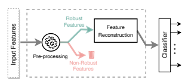
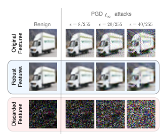
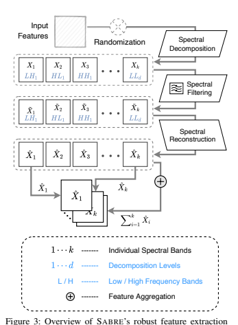
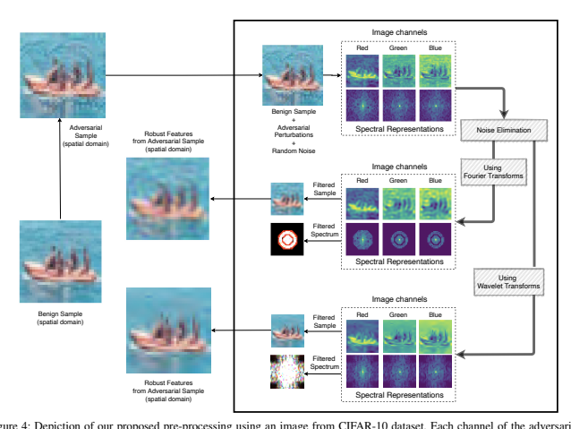
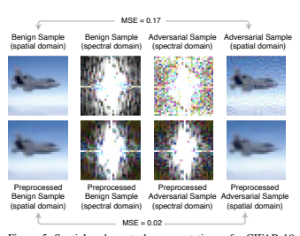
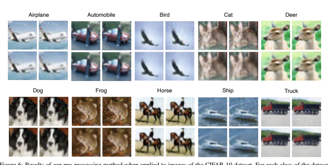
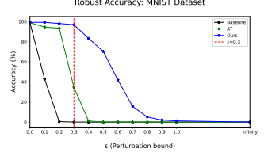

# Sabre: Cutting Through Adversarial Noise With Adaptive Spectral Filtering And Input Reconstruction

Alec F. Diallo School of Informatics The University of Edinburgh Edinburgh, Scotland, UK
Paul Patras School of Informatics The University of Edinburgh Edinburgh, Scotland, UK
Abstract**—The adoption of neural networks (NNs) across critical**
sectors including transportation, medicine, communications infrastructure, etc. is inexorable. However, NNs remain highly susceptible to adversarial perturbations, whereby seemingly minimal or imperceptible changes to their inputs cause gross misclassifications, which questions their practical use. Although a growing body of work focuses on defending against such attacks, adversarial robustness remains an open challenge, especially as the effectiveness of existing solutions against increasingly sophisticated input manipulations comes at the cost of degrading ability to recognize benign samples, as we reveal. In this work we introduce SABRE**, an adversarial** defense framework that closes the gap between benign and robust accuracy in NN classification tasks, without sacrificing benign sample recognition performance. In particular, through spectral decomposition of the input and selective energy-based filtering, SABRE **extracts robust features that serve in input**
reconstruction prior to feeding existing NN architectures. We demonstrate the performance of our approach across multiple domains, by evaluating it on image classification, network intrusion detection, and speech command recognition tasks, showing that SABRE **not only outperforms existing defense**
mechanisms, but also behaves consistently with different neural architectures, data types, (un)known attacks, and adversarial perturbation strengths. Through these extensive experiments, we make the case for SABRE**'s adoption in deploying robust**
and reliable neural classifiers.

## 1. **Introduction**

Recent advances in Deep Learning (DL) have sparked the use of Deep Neural Networks (DNNs) in many applications, ranging from virtual and medical assistants[31], [38], facerecognition systems [26], to safety-critical tasks such as image recognition for self-driving vehicles [34] and cyberthreat detection in computer networks [18]. Notwithstanding their excellent performance compared to traditional tools, it is undeniable that current DL approaches have several shortcomings, the most concerning being their *vulnerability to adversarial attacks*, whereby small, imperceptible perturbations are applied to otherwise correctly classified natural inputs, to trigger erroneous predictions in DNN
classifiers [22], [40], [54].

Significant research has been devoted to finding strategies of generating effective perturbations that compromise DNN architectures. Among these, gradient-based approaches were proven most successful, including the Fast Gradient Signed Method (FGSM) [22], Projected Gradient Descent
(PGD) [37], DeepFool [39], the Carlini & Wagner (CW)
algorithm [12], and Patch attacks [10]. Follow on work aims to enhance the robustness of DNNs against such adversarial examples, e.g., by training neural models with the most effective adversarial samples (often obtained via iterative optimizations) [37]. However, the performance gap between robust and 'clean sample' classification accuracy remains significant [51].

In this work, we take a holistic approach to thwarting adversarial attacks, considering not only the features learned by DNNs that are targets of manipulations as pursued by existing approaches, but also identifying robust and consistent features from which the network should learn, regardless of the type or strength of perturbations applied to input samples.

This approach provides an intuitive and much constrained learning space to DNNs, as we seek to largely suppress nonrobust features of inputs, before being fed to the networks.

Figure 1 gives a high-level overview of our approach.

Figure 1: High-level overview of our SABRE approach to adversarial robustness. Samples are initially pre-processed such that robust features are effectively isolated and extracted, discarding non-robust features. Subsequently, the robust features are reconstructed, preserving salient features essential for accurate classification while purging any residual perturbations that could potentially induce misclassification.

Our SABRE design builds on earlier observations suggesting that (i) adversarial features are inherent characteristics of the datasets used for model training, meaning that samples contain both robust and non-robust features, and the existence of adversarial samples is explained by the presence of these non-robust features, upon which the classifier relies to improve its generalization ability [27];
and (ii) adversarially trained models limit the impact of nonrobust features up to a degree, i.e., eliminating non-robust features could significantly improve the robustness of the network [6]. At the same time, we depart from domainspecific defense strategies (e.g., for image recognition) and introduce a *universal defense mechanism* that closes the gap between benign and adversarial accuracy via a twostep approach: (1) a *pre-processing step*, which extracts robust features that are consistent across different types and strengths of attacks, and (2) a *training/inference phase*, which is akin to adversarial training (AT) in the learning process, but only uses the output of our pre-processing module, forcing the network to only learn from salient features useful for identifying class samples.

In a nutshell, our pre-processing step first introduces small random perturbations to generate different variants of the input, after which the most adequate variant is projected onto a spectral domain. With this spectral representation, we decompose the features and only retain the main principal components, such that the essence of the information is preserved before finally projecting back to the original space and reconstructing the salient features. Unlike existing spectral filtering approaches such as low-pass, high-pass, or band-pass filters, *ours selectively extracts the most prominent* components of samples, regardless of their location in the spectrum, thus resulting in features that are robust across variations of the samples. Through extensive experiments, we show that SABRE is highly effective against known and unknown attacks, and automatically adapts its robust feature selection filter based on the strength of perturbations. Figure 2 illustrates a comparison between original and robust features using the same input image from the CIFAR-10 dataset [32] subject to PGD attacks with different perturbation strengths.

Contributions: Overall, our work presents a major advancement in the field of machine learning security, providing robust and reliable protection against adversarial attacks. We make the following key contributions, each of which is perhaps the first of its kind:
- We provide an intuitive robust feature extraction approach to close the gap between benign and robust accuracy of DNN-based classifiers facing adversarial attacks, and possibly improve on the benign accuracy.

By performing a multi-resolution spectral analysis of samples to filter out perturbations, our approach consistently achieves new state-of-the-art performance under various adversarial regimes.

- We propose a novel spectral filtering technique that enables our defense method to seamlessly adapt to different attack types and perturbation strengths, without the need for model fine-tuning. Deriving from our theoretical approach to energy-based spectral filtering,

Figure 2: CIFAR-10 sample image, with different levels of adversarial perturbations applied to the original features (top); corresponding robust features extracted from these samples
(middle) and features discarded (bottom) with our approach. The classifier is to be trained with robust features, which are considered to be features correlated with the true label, i.e., they are immutable across different adversarial perturbations; all other features that improve the classification accuracy in the standard setting but can be harmful in the adversarial setting are considered non-robust and removed.

our proposed technique, without domain specific assumptions about the underlying structure, exploits shifts in the energy distribution of a sample to approximate the level of detail that exclusively preserves the sample's most important components.

- We introduce a fast and effective methodology, leveraging robust features obtained from our adaptive spectral filtering algorithm, to train classifiers that will exhibit unprecedented resilience against both known and unforeseen adversarial attacks.

- We demonstrate that SABRE is both general and lightweight, as it is incrementally deployable with any classifier. Our defense adds negligible training/inference overheads and can handle different types of data (images, audio, network traffic, etc.), while being able to accommodate existing optimizations and data augmentation methods.

The rest of the paper is organized as follows. We summarise similar work in Section 2, then discuss the threat model in Section 3, and detail our pre-processing and training methods in Section 4. Section 5 presents the experimental results obtained and highlights gains over benchmark defenses. Section 6 discusses practical aspects relevant to deploying SABRE. Section 7 concludes our work.

## 2. **Related Work**

As the interest in research on adversarial attacks and defenses continues to grow, we will limit the scope of this section to work very closely related to ours and refer the interested reader to work by Silva et al. [44] for a comprehensive review.

Preprocessing-based defenses: Several defenses exist that aim to sanitize the input of adversarial noise before the inference step by a classifier, which is an intuitive approach to adversarial robustness. However, most if not all of the existing processing-based defenses such as pixel dropping and estimation [52], feature discretization [13], feature randomization [48], feature encoding [11], neural network based denoising [45], and so on, are either specifically designed for the imaging domain or rely on methods like gradient masking or obfuscation, which are easily compromised by sophisticated attacks [4]. In contrast to these approaches, we proposed a defense framework which is suitable for datasets of all types and automatically adapts its response depending on the type and strength of the perturbations applied to the input samples.

Spectral feature analysis: It was recently shown that neural networks typically learn low frequency components of the data at first [49]. This behavior, also supported by a study showing that commonly used convolutional filters fit low-frequency components much faster than high frequency ones [25], was further studied and analyzed in detail by work on the Fourier transform of ReLU networks [42], which highlights the same observation and shows that learning higher frequencies gets easier with increasing manifold complexity. Training dynamics and frequency biases have been also analyzed [8]. These studies have led to optimizing neural network training schemes by including normalization processes based on spectral features. In that regard, our work can very easily be used to verify these aforementioned assumptions and provide better support for the analysis of spectral components related to the optimality of neural networks' training. Additionally, it can also help find optimal normalization values that maximise the generalization capabilities of neural networks, since the spectral features generated by our approach have been proven to be the most useful features of data samples. Therefore, using our proposed approach to support the normalization of neural networks can be especially beneficial in the context of adversarial robustness [20].

Work by Harder et al. [23] has highlighted the effect of different adversarial attacks on the Fourier spectrum, showing that adversarial perturbations represented in the Fourier domain provide better discriminative information when detecting adversarial examples. This work, while limited to the detection of adversarial samples, supports the notion of selectively filtering spectral components rather than performing low-pass, high-pass, or band-pass filtering to mitigate the effects of adversarial manipulations. By investigating adversarial perturbations in the frequency domain, Yin et al [53] establish connections between the frequency components of perturbations and model performance under data augmentation, and show that approaches such as adversarial training result in improved robustness to high concentration perturbations in the high frequencies at the cost of reduced robustness to low frequency perturbations and clean test error, suggesting the use of a more diverse set of augmentations as a way to mitigate this trade-off. In contrast to this approach, our proposed solution offers a more general framework based on the idea of learning domain invariant or "robust" features, rather than simply robustifying models against a specific set of corruptions. Further, SABRE provides a simple and intuitive way for finding robust features that not only improve robustness to any type of adversarial perturbation, but also retains the clean test error of benign models.

Representations disentanglement: This is a process aimed at modeling the static and variable features from any given sample. A recent study [19] has performed transformations on datasets, including image smoothing and saturation, to evaluate the performance of models trained on these transformed inputs under natural and adversarial regimes. This work shows that adversarially trained models are sensitive to semantics-preserving transformations of samples. Geirhos et al. attempt to quantify the dependence of standard trained models on the shape and texture information of samples [21]. Their results indicate that image classifiers have a tendency to rely on object textures rather than global object shapes. To the best of our knowledge, our approach is the first to show that robust features underlying data samples can be used to make classifiers learn to rely on semantically meaningful aspects of the data, instead of superficial, brittle features, without loss of generality.

## 3. **Threat Model**

In this paper, we consider scenarios that render neural networks most vulnerable, whereby attackers possess full knowledge of both the neural architecture and the defenses that are in place for counteracting adversarial attacks (also known as white-box attacks). A simple approach to generating adversarial samples in such settings is by solving a constrained optimization problem. Given a discriminative classifier F(y | x), an input sample x ∈ R
n, a target class y, a perturbation budget ϵ, and some distance metric D,
an attacker seeks to find a modified input x
′ ∈ R
n with some adversarial noise δ to increase the likelihood of the target class y such that F (x) ̸= F (x
′). The search for this adversarial input x
′can be framed as:

$$\begin{array}{c}\max\limits_{x^{\prime}}\;\;\mathcal{F}\left(y=\overline{y}\;|\;x^{\prime}\right)\\ \mbox{subject to:}\;D\left(x,\;x^{\prime}\right)\leq\epsilon,\\ \mbox{where}\;\;\;x^{\prime}=x+\delta.\end{array}\tag{1}$$

While y can be defined to be a specific target label (commonly referred to as *targeted attack*), it is also possible to define it to be any label different from the original, which maximizes the classifier's predictive confidence (*untargeted attack*).

We consider an attacker who can employ white-box methods (i.e., with full access to model architectures and parameters, as well as the pre-processing method). Namely, the attacks used to evaluate our proposed defense are: the Fast Gradient Signed Method (FGSM) [22], the Projected Gradient Descent (PGD) [33], the Carlini & Wagner (CW) [12]
attack, and the AutoAttack [16].

FGSM: This straightforward attack computes adversarial samples by performing a single-step gradient descent on the classifier, which is then used to find the direction in which the perturbation should be applied. Let y be the true class of x and J (F*, x, y*) be the cost function used to train the classifier F. Formally, the perturbation is computed based on the sign of the gradient of the loss function as follows:

$$\Delta x=\epsilon\;\cdot\;\mathrm{sign}\big(\nabla_{x}J\left(x,y,\theta\right)\big),$$

where the perturbation strength ϵ is set to be small enough such that ∆x remains imperceptible.

PGD: An iterative variant of FGSM, where for each iteration, adversarial samples are obtained by the update rule:

$$x^{\prime}_{t+1}=\Pi\left(x^{\prime}_{t}+\alpha\ \cdot\ \mbox{sign}\big{(}\nabla_{x}J\left(x,y,\theta\right)\big{)}\right),\tag{3}$$

in which Π constrains the adversarial sample to the desired perturbation range, and α represents the perturbation step taken at each iteration. In our implementation, we use the ℓ∞ variant of the PGD attack and enhance its performance against randomized defenses with the Expectation over Transformation (EoT) approach [5].

CW: The CW attack, named after its authors, employs an optimization algorithm to seek as small as possible perturbations. Its general methodology is formulated as:

$$\begin{array}{r l}{{\mathrm{minimize}}}&{{}\|\eta\|_{p}+c\cdot g({\bar{x}}),}\\ {{\mathrm{such~that}}}&{{}{\bar{x}}\ \in\ [0,1]^{n}.}\end{array}$$

Here g(·) denotes the objective function:

$$\mathbf{i}\mathrm{{\omn}}\mathbf{j}$$
$$g(\tilde{x})=\Big[Z(\tilde{x})_{t}-\operatorname*{max}_{j\neq t}\left(Z(\tilde{x})_{j}\right)+\gamma\Big]_{+},$$
$$(S)$$
, (5)
where n is the dimensionality of the samples, Z(·) is a vector containing the posterior probability of all classes, t denotes the node of the true class y, γ is the confidence parameter, and [x]+ represents the positive part of x. We also consider situations where this attack is implemented as an iterative procedure with the norm of the optimization (p) set to two.

AutoAttack: as a parameter-free ensemble of diverse attacks, this approach has shown outstanding performance in identifying vulnerabilities in adversarial robustness defenses.

As such, it is considered one of the most reliable assessment methods for adversarial robustness. The ensemble is composed of: AutoPGD [16] - optimizes adversarial samples using a Cross Entropy loss (APGD-CE) or a Differenceof-Logits-Ratio (APGD-DLR); Fast Adaptive Boundary
(FAB) [15] - an effective approach against gradient-masking focused on perturbation minimization; and Square Attack [3] - a norm-bounded score-based query-efficient black-box attack
(not relying on gradient information).

For assessing the performance of SABRE vis-a-vis that of existing defenses, we use for all attacks considered a perturbation bound of 8/255 for the CIFAR-10 dataset (RGB
images), 40/255 for the CIC-IDS-2017 dataset (network traffic), 80/255 for the MNIST dataset (gray-scale images), and 2/255 for the SpeechCommands dataset (audio). While our proposed defense uses randomness as a means to explore the input space rather than obfuscate gradients, we still include the randomized version of AutoAttack for thorough evaluations. All results of AutoAttack we report correspond to the worst robust accuracy across all attacks of the ensemble.

The results we present later in Section 5 will reveal that our SABRE is consistently highly-effective against both seen and unseen adversarial attacks, on datasets representative of these multiple domains.

$\eqref{eq:walpha}$. 

## 4. Proposed Method: S**Abre**

$$(4)$$

Our aim is to design a universal defense method against adversarial attacks, which not only retains the classification accuracy on benign samples, but also closes the gap between benign and robust accuracy. To this end, our SABRE solution entails a pre-processing module that extracts robust features that not only contain enough information for DNNs to effectively learn their tasks, but also provide very similar features from both benign and adversarial samples (see Figure 2).

Let us define our pre-processing function z(·), which transforms an input x ∈ X into a reconstructed version based on its robust features xˆ ∈ X. Given our classifier F,
the inference result by the DNN is given by y = F(z(x)).

Following our threat model described above, F(·) and z(·)
are both end-to-end differentiable to avoid gradient masking and therefore grant white-box attacks full access to the preprocessing module as well as the classifier when constructing adversarial samples. While F can itself be augmented with existing approaches to further robustify the model, we design our pre-processing function z(·) to eliminate adversarial noises, such that the classifier only learns from relevant features, which intuitively should also improve the model's interpretability. Therefore, we define some key properties that our pre-processing module should have, including being independent of the class distributions in a target dataset, and returning similar robust features for the same input regardless of the attack method used or its strength.

While our pre-processing method aims to removes most of the adversarial noise, the perturbations existing on the same frequency components as those of the robust features could remain, thereby potentially causing misclassifications.

To overcome this issue, the second element of SABRE
concerns the robust training of classifiers following feature extraction, to ensure high inference accuracy and robustness against any known and unknown adversarial attacks.

We delve into the details of these two aspects next.

## 4.1. **Robust Feature Extraction**

To remove the adversarial noise from the inputs, we define our pre-processing function z(·) as a succession of transformations and filtering operations as illustrated in Figure 3.

Randomization: Starting from the raw input, we add different levels of noise drawn from a random uniform distribution, producing multiple variants of the observed input. Using a uniform distribution for this task ensures equal

process. Randomized samples are projected onto the spectral domain to undergo spectral decomposition and filtering. The filtered components are then projected back onto the original domain such that individual spectral bands, as well as their aggregate, constitute distinct channels of the filtered sample.
exploration of the entire space of adversarial perturbations, so that no specific region of the perturbation space is preferentially checked, thereby enhancing robustness against wider ranges of adversarial manipulations. Given that the additive noises have the same degrees of freedom as the input and are re-sampled at every iteration (resulting in a slightly different outputs each time), finding a deterministic differentiable function to estimate the variants becomes a difficult task. To defend against advanced techniques such as Expectation over Transformation (EoT) [5] and Backward Pass Differentiable Approximation (BPDA) [4] used to overcome randomized defenses and estimate gradients for defenses based on gradient obfuscation respectively, our proposed first step of defense *only* harnesses randomization as a mean to accentuate and remove adversarial perturbations while preserving the main features of the original inputs, i.e. noise-invariant representations. In practice, to preserve the integrity of the robust features, these random perturbations have their magnitude set to be equivalent to that of perturbations crafted during the adversarial training stage, thereby achieving a careful balance between noise disruption and feature preservation. Further, despite the innate differentiability of our defense mechanism, we employ BPDA to guarantee seamless end-to-end differentiability. Out of all the variants produced by the randomization process, the one with the least total variation is chosen to represent the input. Adding this randomization at the initial step of our defense allows classifiers to learn to better generalize for any given sample, as each iteration would create a sightly different input for the subsequent modules, thereby changing the deterministic nature of the inputs. While this would traditionally also render the learning task more difficult, the operations that follow in our pre-processing function ensure only a marginal variation in the robust features generated, making the learning process more robust and less prone to over-fitting.

Feature reshaping: We reshape any given input x ∈ X,
containing N features, into a square matrix using a transformation function T (·), with optional zero-padding when necessary. This step is essentially performed to facilitate the visualization and subsequent operations on the input, such that the proposed defense remains agnostic to the nature of the data. More precisely, by transforming the inputs into 2-dimensional samples, we create a common platform that allows for the seamless application of the same spectral filtering algorithm (specifically 2D wavelet transforms), to the extraction of robust features. Moreover, any additional zero-padding introduced during the reshaping process is removed during the inverse reshaping, thereby ensuring the integrity of the original input data.

Spectral projection: Aiming to build a universal defense method, we perform our pre-processing operations in the spectral domain, which offers vast options for data analysis as well as attractive mathematical properties we will take advantage of. First, let Tj,k(x) denote the feature indexed at row j and column k after our reshaping transformation. One simple approach to project our inputs onto a spectral domain is by using Fourier Transforms [9], where each spectral component is given by:

component is given by:  $$\xi(u,v)=\frac{1}{l^{2}}\sum_{j=0}^{l-1}\sum_{k=0}^{l-1}\mathcal{T}_{j,k}(x)\exp\left[-i2\pi\left(\frac{j\times u}{l}+\frac{k\times v}{l}\right)\right],$$ $$\forall\ u,\ v\in\{0,\ldots,l-1\},\tag{6}$$

$\huge\frown\;\;$? 
where l =
l√N
m, i is the imaginary number, j and k are the spatial coordinates, and u and v are the coordinates in the spectral domain. From this transformation, the set of all features obtained can be combined to constitute our spectral features, i.e.,

$$\xi=\{\ \xi(u,v)\ |\ \ u,v\in\{0,\ldots,l-1\}\ \}\,.$$

This approach, while efficient, is however unable to capture essential information for non-stationary data, as it does not capture temporal resolution and therefore provides very limited information about the localization of features. To overcome these limitations, a multi-resolution analysis encompassing both time and frequency domain, for stationary and non-stationary data f(x), can be obtained using Wavelet Transforms [17], formally defined as:

$$\mathcal{W}(a,b)=\int_{-\infty}^{\infty}f(x)\ \psi_{a,b}(x)\,dx,\tag{8}$$  $\mathbb{R}$ and $b\in\mathbb{R}$ represent the ceiling and 
where a ∈ R̸=0 and b ∈ R represent the scaling and translation parameters, respectively. From the mother/basis wavelet ψ, the different versions of wavelets ψa,b(x) are given by:

$$\psi_{a,b}(x)=\frac{1}{\sqrt{|a|}}\psi\biggl{(}\frac{x-b}{a}\biggr{)},\tag{9}$$

where p|a| is a normalization factor that allows the energy of the wavelet to remain independent of the scaling parameter a.

With small values of a allowing the analysis of low-frequency components of f(x) by shrinking the basis function in time, large values of a allow the analysis of high-frequency components of f(x) by stretching the basis function in time.

Any mother wavelet is defined to have finite energy, and a total area under curve equalling zero:

$$\int_{-\infty}^{\infty}\psi_{(}x)=0,\qquad\mbox{and}\qquad\int_{-\infty}^{\infty}|\psi_{(}x)|^{2}<\infty.\tag{10}$$

Using a discrete set of wavelet scales and translations, this transformation decomposes the input into mutually orthogonal sets of wavelets. Given the 2-dimensional nature of our reshaped inputs, we define and use the following scaled and translated basis elements [1] for any pair of coordinates (*u, v*):

$$\begin{array}{ll}{\cal L}=&\phi(u,v)\ =\phi(u)\ \phi(v),\\ {\cal L}{\cal H}=\psi^{H}(u,v)=\psi(u)\ \phi(v),\\ {\cal H}{\cal L}=\psi^{V}(u,v)=\phi(u)\ \psi(v),\\ {\cal H}{\cal H}=\psi^{D}(u,v)=\psi(u)\ \psi(v),\end{array}\tag{11}$$

where H, V , and D indicate the decomposition directions of the wavelet. The multi-resolution representation of the scaling and wavelet functions are given by:

$$\phi_{j,m,n}(u,v)=2^{j/2}\ \phi(2^{j}u-m,2^{j}v-n),\tag{12}$$ $$\psi^{d}_{j,m,n}(u,v)=2^{j/2}\ \psi^{d}(2^{j}u-m,2^{j}v-n),$$

with d ∈ {*H, V, D*}. The discrete scaling function Wϕ(*j, u, v*) (i.e., scale j approximation) of the wavelet representation, as well as the three sub-band representations Wdψ
(*j, u, v*) (i.e., detail coefficient) are then obtained with:

$$\mathcal{W}_{\phi}(j,u,v)=\frac{1}{l}\sum_{m=0}^{l-1}\sum_{n=0}^{l-1}\mathcal{T}_{m,n}(x)\phi_{j,u,v}(m,n),\tag{13}$$ $$\mathcal{W}_{\psi}^{d}(j,u,v)=\frac{1}{l}\sum_{m=0}^{l-1}\sum_{n=0}^{l-1}\mathcal{T}_{m,n}(x)\psi_{j,u,v}^{d}(m,n).$$
The set of all features obtained from this operation then
constitute our spectral features, i.e.,  $$\beta_{j}={\cal W}_{\phi}(j,u,v)\ \cup\ \left\{\ {\cal W}_{\psi}^{d}(j,u,v)\ |\ d\in\{H,V,D\}\ \right\}.\tag{14}$$

It is important to note that the steps in our proposed framework remain the same even when the spectral projection approach is substituted with any others, such as Spectrograms, Discrete Cosine Transforms, or Short-Time Fourier Transforms [28].

Spectral decomposition: Given the spectral representations obtained, we split the data into multiple bands that will be used to compute a selective filtering threshold. For this task, we choose κ = ⌈plog(1 + N)⌉ to be the level of decomposition to perform, and consider each item in the set of features to be contained in its own band, giving us a total of 1 + 3κ bands:

$$\beta={\cal W}_{\phi}(\kappa-1,u,v)\ \cup\ \ \left\{{\cal W}_{\psi}^{d}(j,u,v)\ |\ d\in\{H,V,D\},\right.$$ $$\left.j\in\{0,\cdots,\kappa-1\}\ \right\}.\tag{15}$$

When using spectral projection methods that do not split the frequency components into multiple bands (e.g., Fourier Transforms), we can manually set the number of bands to 1 + 3κ and split the spectrum into disjoint bands, such that the union of all bands covers the entire spectrum. In such scenarios, the set of spectral features can be split into multiple bands by defining each as the collection of spectral features falling within a specific region of the representation domain:

$$\beta_{j}=\left\{\begin{array}{l}{{\xi(u,v)\mid u,v\in\left\{\frac{l}{\kappa}\times(j-1),\ \ldots\,\frac{l}{\kappa}\times j-1\right\}\right\},}}\\ {{\mathrm{(16)}}}\end{array}\right.\tag{16}$$

where l =
l√N
m, and ξ is the spectral projection function.

Based on the different bands obtained, we can define our selective filtering threshold and filter the frequency components.

Spectral filtering: Drawing from Parseval's theorem, we lean towards the idea and hypothesize that frequency components with little to negligible energy can be removed without losing the essence of the data. In other words, our assumption is that the robust features of any sample would remain when its frequency components with the lowest energies are removed. Therefore, our filtering consists of removing all frequency components (by multiplying them with a coefficient very close to zero) when their added value to the total energy can pass unnoticed.

To compute the threshold value, let us first define the energy contained within each frequency band as:

$$\begin{array}{c}\mathcal{E}_{j}=\frac{1}{|\beta_{j}|}\sum_{\zeta\in\beta_{j}}|\zeta|^{2},\\ \forall j\in\{0,\cdots,\kappa-1\}.\end{array}\tag{17}$$

where |βj | is the number of components in βj . Upon normalization of these values between the range [0..1] (using min-max normalization), the aforementioned threshold can then be computed as:

$$\tau=\frac{1}{\kappa}\times\exp\left(-\lambda_{r}\times\frac{\mu\varepsilon}{\sigma\varepsilon}\right),\tag{18}$$

where µE and σE are the mean and standard deviations of the energies computed for the input sample, and λr ∈ R is a hyper-parameter that can be set to adjust this threshold based on the nature of the data. However, we choose to learn λr incrementally during training in our implementation.

While this formulation of threshold value makes it adaptive to the energy distribution of samples, enabling the removal of more features as the amount of noise increases, its value can be set manually if desired, in order to explicitly control the trade-off between our defense's effectiveness and its impact on clean accuracy. The filtered spectral components can then be obtained by applying this threshold value to the features generated via spectral projection, such that those not belonging to the corresponding ratio of components with highest energies are removed:

$$\mathcal{W}_{\phi}(j,u,v)=\begin{cases}\mathcal{W}_{\phi}(j,u,v),&\text{if}\ \ |\mathcal{W}_{\phi}(j,u,v)|\in\mathcal{S},\\ 0,&\text{otherwise};\end{cases}\tag{19}$$ $$\mathcal{W}_{\psi}^{d}(j,u,v)=\begin{cases}\mathcal{W}_{\psi}^{d}(j,u,v),&\text{if}\ \ |\mathcal{W}_{\psi}^{d}(j,u,v)|\in\mathcal{S},\\ 0,&\text{otherwise};\end{cases}$$

where S denotes the set containing the fraction τ of all components with highest energies and is obtained by:

$$\mathcal{S}=\big{\{}\langle|\mathcal{S}^{*}|\rangle_{k}\ \mid\ k\in\mathbb{N},\ \ k<\lfloor\tau\times|\mathcal{S}^{*}|\rceil\big{\}},\tag{20}$$  with $\mathcal{S}^{*}=\mathcal{W}_{\phi}(\kappa-1,u,v)\ \bigcup_{j,d}\mathcal{W}_{\psi}^{d}(j,u,v),$
Here, ⟨|S∗|⟩ represents the absolute values of all elements of the set S
∗, sorted in decreasing ordered of their energies.

To ensure end-to-end differentiability, components to be removed (Eq. 19) are multiplied by a coefficient of 10−12 in our implementation, rather than setting them to zero. (The absence of gradient obfuscation is verified and corroborated by the findings presented in Appendix B.1). Our proposed heuristic, while simple, automatically selects fewer frequency components when samples with high amounts of noise are encountered and more when given natural samples.

This is particularly effective when extracting features from adversarial samples with strong perturbations.

Sample reconstruction: Upon completion of the spectral filtering step, the filtered sample is obtained by projecting the retained components back onto the original domain using the inverse of the projection approach used. To facilitate accurate reconstruction of unperturbed features, we construct a set of inverse spectral projections derived from individual spectral bands, and incorporate them as supplementary channels in the filtered sample. The wavelet transform being a linear operation by definition, i.e.,

$${\cal W}_{(a,b)}[f+\delta;\psi]={\cal W}_{(a,b)}[f;\psi]\ +\ {\cal W}_{(a,b)}[\delta;\psi],\tag{21}$$

the filtered sample can be viewed as a perturbation series ˆf(*x, y*) = a0 +Pk≥1 ak, where a0 is the approximation term and a1, a2, *· · ·* are the first-order, second-order, and higher-order correction terms controlled by the threshold τ .

While our spectral filtering removes most of the noise, the perturbations present on the same frequency components as those of the robust features remain, and therefore could potentially cause misclassifications. To overcome this issue, a neural network is used to reconstruct benign features based on the filtered sample and individual band representations. The output of this neural network (having the same dimensions as the input after feature reshaping), is used to obtain the final representation of the sample's robust features by transforming the sample back to the original dimension using T
−1(·), the inverse process of the reshaping function T (·).

Remark: Note that at no point during the feature extraction process was any property of the neural network classifier or attack used by this approach, and no assumptions were made with regard to the nature of the samples. These abstentions as well as the steps undertaken by the proposed pre-processing approach described here make this a universal robust feature extraction module for training adversarially robust classifiers.

We depict in Figure 4 the results of our spectral filtering algorithm by use of example from an image dataset, and in Figure 5 the effects of our proposed pre-processing approach on the spatial and spectral components of samples.

## 4.2. **Feature Reconstruction**

Given the intricate landscape of adversarial attacks, we observe that adversarial perturbations may infiltrate any spectral component of the inputs, regardless of their energy contribution. Guided by Parseval's theorem, our proposed spectral filtering approach strategically removes *low-energy* components so as to significantly reduce the amount of noise while preserving the most relevant frequency components.

Yet, the *higher-energy* components, potentially vulnerable to adversarial perturbations, require further refinement. This underlines the essence of our defense, which combines the spectral filtering of low-energy perturbations with a dedicated feature reconstruction network, aiming to remove any residual noise post spectral filtering. By doing so, we ensure comprehensive mitigation of both high and low-energy adversarial noise, maintaining the integrity and relevance of input features.

As depicted by Figures 4 and 5, the robust features extracted from benign and adversarial samples are nearly identical. However, the slight variations that remain could still allow some adversarial perturbations to succeed. To thwart this potential attack vector, a neural network is exploited to transform the robust features extracted from adversarial samples into benign features. This reconstruction network, R, is designed to optimize the following objective:

$$\begin{array}{c}\min\limits_{\theta}\ \mathbb{E}_{(x,y)\sim\mathcal{D}}\ \ \mathcal{L}_{\mathcal{R}_{\theta}}(x+\delta+\mu,\ y)=\\ \|\mathcal{R}_{\theta}(z(x+\delta+\mu)),\ x)\|_{2}\.\end{array}\tag{22}$$

where z(·) is our preprocessing function, δ is the adversarial perturbation, and µ ∼ U is the random noise applied.

As a result of this optimization, the reconstruction network learns to map different robust features extracted from a sample to its clean benign features. Thus, providing

Figure 4: Depiction of our proposed pre-processing using an image from CIFAR-10 dataset. Each channel of the adversarially perturbed sample is individually subjected to our pre-processing approach to obtain its robust features, and subsequently concatenated with the reconstructed robust features of other channels, thereby constructing the robust version of the adversarial sample. The grids of images show each channel of the samples (Red, Green, and Blue), as well as the spectral representations of each channel (bottom rows). These spectral representations are direct transformations of the corresponding images into the spectral domain using Fourier Transforms.
the classifier F with features depleted of adversarial manipulations. The robust feature reconstruction network described here is trained in conjunction with the classifier in order to simultaneously maximize both the classification accuracy and the quality of the robust features, thereby enabling the reconstructed robust features to possess the same defining characteristics as the original samples. This joint training is also the enabling factor for learning the parameter λr on the fly, which provides finer control over the thresholding value for the extraction of the robust features.

## 4.3. **Robust Training**

Following the set of transformations outlined in the previous section, SABRE trains classifiers by exclusively leveraging reconstructed robust features extracted from the dataset D, which are less susceptible to adversarial attacks.

This makes our approach stand in stark contrast to other methods relying on features that are highly susceptible to adversarial attacks. While our spectral filtering successfully removes most adversarial noise, perturbations present on the same frequency components as those of the robust features could potentially still lead to misclassification. Therefore, we further explicitly consider the impact of adversarial attacks by minimizing, during training, an adversarial loss function which ensures our network is resilient to any adversarial perturbations that have not been removed by the spectral filtering algorithm and the feature reconstruction network.

SABRE, by restricting the filtered samples to having very small perturbation bounds, overcomes the main limitations of traditional adversarial training, such as specificity to certain L-norm bounded attacks, thereby enabling the training of more robust classifiers. Furthermore, with our reconstructed robust features highly reducing the perturbation bounds, and our randomization step preventing overfitting on the same perturbations, SABRE completely averts the possibility of catastrophic overfitting [29]. For any appropriately defined set of allowed perturbations ∆ and a classifier parametrized by θ, adversarial training objectives are typically defined as:

$$\min_{\theta}\ \mathbb{E}_{(x,y)\sim\mathcal{D}}\left[\max_{\delta\in\Delta(x)}\mathcal{L}_{\theta}(x+\delta,\ y)\ \right].\tag{23}$$

Figure 5: Spatial and spectral representations of a CIFAR-10 sample, its adversarial counterpart, and their corresponding reconstructed robust features. The benign and its adversarial counterpart as shown in the top-left and top-right respectively, and their reconstructed robust features in the bottom-left and bottom-right of the figure. Using MSE as a comparative measure of divergence, the robust features reconstructed from the benign and adversarial samples are shown to be much closer than the samples themselves.

Compared to traditional adversarial training, we estimate the inner-maximization with a single step gradient-based attack having a perturbation magnitude amounting to 1.25 times the maximum perturbation allowed under the threat model considered. While this was previously considered an ineffective approach, it has been shown in [47] that with proper random initializations (multiple restarts) and an appropriate step-size for the attack used to train the classifier, this can prove to be just as effective as multi-step attack based training methods, without the computational and time overhead they induce. As these constraints were already satisfied by our approach, we take advantage of this single-step attack based procedure to speed up the training process by a factor of s compared to traditional AT, while achieving the same desired properties (s denoting the number of steps taken by traditional AT methods). In contrast to the aforementioned paper, our approach is not limited by a specific step-size to be taken in order for the training to be effective, as the robust features extracted would ideally eliminate all of the adversarial noise, making our training more flexible than those methods previously proposed in the literature. We find that training a DNN solely on the reconstructed robust features extracted by our pre-processing function not only improves the generalization capability of classifiers, but can also improve their benign accuracy.

Further, with our spectral filtering function being agnostic of the attack types, the filtered samples are restricted to very small perturbation bounds, enabling neural networks trained with this approach to overcome the limitations of traditional adversarial training methods, namely:
- **Overhead:** our approach is significantly faster as we only train with adversarial samples generated by single-step PGD attacks (which unlike FGSM, constrains the perturbed samples to a valid range);
- **Generalization:** SABRE is trained only using one method for generating adversarial samples and produces a single robust model agnostic to any adversarial attack method
(i.e., SABRE is not constrained by the distance metric used during training);
- **Performance:** unlike other adversarial training methods, both standard and robust accuracies match when using our proposed method, while also matching them to the standard accuracy of non-adversarially trained classifiers in non-adversarial settings.

While in principle our framework guarantees adaptive robust feature extraction for training DNN classifiers, custom objectives learned by the classifiers remain out of its scope.

It is therefore important that the loss function used during training is one that accounts for this. In addition, since combining our approach with existing optimization methods such as regularization techniques could potentially cover any blind-spots, we designed our SABRE framework to be compatible with existing data augmentation and learning optimization strategies, so as to maximize the quality and expressiveness of embeddings learned by DNN classifiers.

## 5. **Evaluation**

In this section, we validate our SABRE framework1 by comparing the proposed defense against best-in-class benchmarks evaluated on the same attacks, and subsequently demonstrate the generalization properties of our method using datasets from multiple domains and under different adversarial attacks and perturbation strengths. We train and evaluate our models on a parallel computing cluster equipped with one or multiple Nvidia TITAN X, Tesla M40 or/and Tesla P100 GPUs. We use the PyTorch [41], TorchAudio [50], and Pytorch-Wavelets [14] packages for our implementations.

## 5.1. **Datasets**

To evaluate our proposed approach, we used datasets from the imaging, network traffic, and audio domains:
- **CIFAR-10** [32] is used to visually support our assumptions about the robust features and compare our results against those obtained with different types of stateof-the-art defenses. This dataset, consisting of 60,000 3x32x32 (colour) images in 10 classes ('airplane',
'automobile', 'bird', 'cat', 'deer', 'dog', 'frog', 'horse',
'ship', 'truck') with 6,000 images per class, is separated into a training and testing set of 50,000 and 10,000 images, respectively. The random transformations applied to the dataset are well-established standards such as cropping, flipping, and translations. The images from the dataset are all valued within the 0 to 1 range, and the

1. Source code: https://github.com/Mobile-Intelligence-Lab/SABRE
normalization of all samples is held out until after the pre-processing, as explained in the previous sections.

- **CIC-IDS-2017** [43] is a network traffic dataset containing the most common cyber attacks known today and we use it to first validate the generalization ability of our approach. We group all samples of this dataset into 6 generic classes: 'botnets', 'brute-force', 'DoS/DDoS',
'infiltrations', 'web' attacks, as well as 'benign' traffic.

After pre-processing, the dataset consists of 80 network traffic features (see Appendix C.1) and 34,220 samples that we split into a training/testing set using a 70/30 ratio. The divergence of this dataset from the image domain makes this an ideal candidate for evaluating SABRE when handling samples of different nature.

- **MNIST** [36] is a well-known handwritten digit classification dataset, which we further employ to evaluate the performance of our feature extraction approach on single channel (gray-scale) images. This dataset of 70,000 samples (60,000 for training and 10,000 for testing)
composed of 28x28 size images representing all digits
(0 to 9) is widely used in the computer vision domain for quick validation of proof of concepts.

- **SpeechCommands** [46] consists of more than 105,000 WAV audio files that capture people saying 35 different words (such as 'yes', 'no', 'up', 'down', 'left', 'right',
'on', 'off', 'stop', 'go', and numerical digits 0–9),
each recording lasting about 1 second. Similarly to the CIC-IDS-2017 Intrusion Detection dataset, using the SpeechCommands dataset enables us to verify the universality of our method, and to observe its behavior on data of different nature.

Regardless of the dataset used, we shape samples to be 4 dimensional arrays with batch size x channels x *width* x height. For non-image datasets, the *channels* as well as the height dimensions are set to 1, and the *width* dimension will correspond to the number of features contained in each sample. For non-stationary datasets, it is possible to use channels to indicate the time dimension, as the proposed pre-processing method is individually applied on the last two dimensions of each sample, i.e., applied on each image channel separately in case of color images. Likewise, for multidimensional datasets like RGBA images or video data, we can adjust the *channels* dimension to accommodate these extra dimensions before preprocessing. The samples are then reshaped back to the original dimensions post-processing to preserve their interpretability.

## 5.2. **Neural Network Architectures**

When evaluating SABRE on the CIFAR-10 and the SpeechCommands datasets we employ a standard ResNet18 architecture [24] with changes to its first layer based on the dimensionality of the inputs. We use a simplified LeNet architecture [35] (two convolution and three fullyconnected layers) on both the CIC-IDS-2017 and the MNIST
datasets, as this offers good enough performance to evaluate the robustness of our approach on network traffic and single-channel image datasets, respectively. The feature reconstruction networks all consist of feed-forward denoising convolutional neural networks (DnCNNs) [56].

We train all neural networks using the Adam optimizer [30] for 100 epochs, with a learning rate starting at 0.1 and decaying at a rate of 0.1 at iterations 50 and 75.

## 5.3. **Defense Benchmarks**

We compare our proposed SABRE defense against three state-of-the-art approaches that each use different techniques to improve the robustness of classifiers against adversarial attacks. As such, these approaches have been chosen to cover the types of defenses widely used in the literature. Further, the three methods selected were chosen not only for their diversity, but also for their reported performance.

AT (Adversarial Training) [37]: One of the first defense methods proposed against adversarial attacks is Adversarial Training, which was cast as a robust optimization problem, where the classifier is trained using adversarial samples that have the highest probability of success. This is currently one of the most effective and intuitive ways of building robust DNNs and is sometimes considered as one of the only reliable defenses today. It is therefore widely used in the community as a baseline defense in evaluating stateof-the-art approaches. However, this approach still presents an important gap between benign and robust accuracy, and relies on the assumption that the parameters of the attacks are known.

TRADES [55]: Another successful defense method we consider is TRADES, which proposes a surrogate loss function to quantify the trade-off between robustness and accuracy. The objective function defined for this optimization problem is formulated as: min θ E(x,y)∼D max
∥η∥≤ϵ
(ℓ(Fθ(x), y) + L(Fθ(x), Fθ(x + η))/λ),
where Fθ(x) represents the classifier parametrized by θ, ℓ the loss function used to train the network, L(·, ·) the consistency loss, and λ the trade-off parameter. This defense also relies on an iterative attack to generate adversarial samples used to train the classifier and has shown better performance than previous models. However, it introduces a new hyperparameter (λ), which needs to be tuned depending on the classification task.

ME-NET [52]: Different to the previous two defenses discussed above, ME-NET, like SABRE, is based on a preprocessing approach optionally followed by AT. However, unlike our approach, this defense uses matrix reconstruction techniques on a partial sample where a large part is *randomly* discarded. With the aim of building classifiers less sensitive to small variations in features, the authors train the models using such preprocessed samples and offer a variant with Adversarial Training used in addition to the pre-processing approach. Our comparisons are made using the latter, as it yields superior results. While this approach presents several interesting characteristics as well as good performance, it appears to be limited to the image classification domain and

Figure 6: Results of our pre-processing method when applied to images of the CIFAR-10 dataset. For each class of the dataset, we visualize 4 variations of a randomly selected sample. The top-left, top-right, bottom-left, and bottom-right corners of the quadrants show: the original/benign samples, their adversarial counterparts generated under PGD-7 attacks, the reconstructed robust features from the original samples, and the reconstructed robust features from the adversarial counterparts, respectively. For each sample depicted, the key identifying features (robust features) remain intact after reconstruction.
presents a large gap between clean and robust accuracy when attacked with strong methods.

## 5.4. **Robustness Assessment**

We begin our experiments using the CIFAR-10 dataset to evaluate the proposed SABRE's performance in terms of the classification accuracy for clean and adversarial inputs, comparing the results obtained against the performance of existing adversarial defense approaches. For this comparison, we employ the FGSM and PGD attacks, since they have been widely used and are now established as standards for evaluating defenses against adversarial perturbations in white-box settings. The same ResNet-18 model architecture and same adversarial constraints are used for all benchmark defenses.

We implement standard adversarial training following the specifications provided by the authors in [37], and report the results obtained by TRADES [55] and ME-NET [52] under the same evaluation settings.

We summarize the results obtained in Table 1. Observe that SABRE brings significant improvements over existing methods, with performance gains ranging from 7.69% to 9.58% in terms of benign accuracy, and between 39.49% and 49.96% in terms of robust accuracy. Unlike existing defenses, we see that SABRE retains the accuracy on benign samples and closes the gap between benign and robust accuracy.

Further comparisons are provided in Appendix B.2.

With the robust accuracy of our model being maintained across different adversarial attacks, the adaptive property of our selective filtering approach under noisy regimes is experimentally validated. This simultaneously supports our

TABLE 1: CIFAR-10 classification accuracy (%) under different white-box attacks (perturbation bound ϵ = 8/255).

| PGD              |           |       |          |           |
|------------------|-----------|-------|----------|-----------|
| Attacks          |           |       |          |           |
| Defenses         | No Attack | FGSM  | 20 steps | 100 steps |
| No Defense       | 94.25     | 14.64 | 0.00     | 0.00      |
| Standard AT [37] | 83.03     | 54.17 | 45.14    | 43.25     |
| TRADES [55]      | 84.92     | 61.06 | 56.61    | 55.68     |
| ME-NET [52]      | 84.00     | 71.39 | 57.50    | 53.50     |
| SABRE (Ours)     | 92.61     | 93.66 | 93.18    | 93.21     |

thresholding heuristic proposed in Eq. 18, and our hypothesis that the robust features of the samples are contained within their most important spectral components. To that end, Figure 6 shows the results of our pre-processing method in terms of reconstructed robust features extracted from benign and adversarial samples taken from each class of the CIFAR-10 dataset. We can see that for each randomly selected sample, the most salient features extracted from the benign (original) and adversarial versions are very similar.

## 5.5. **Generalization**

To demonstrate the generalization ability of SABRE
across different domains, we apply our approach to multiple neural network architectures, multiple datasets, and multiple attack types with different perturbation strengths. We evaluate the performance obtained in terms of benign and robust accuracy and compare our results against those of the baseline

| datasets of different types and under different attacks. Attacks   |             | PGD   | - EoT-PGD     |               | CW            | AutoAttack    |               |       |       |
|--------------------------------------------------------------------|-------------|-------|---------------|---------------|---------------|---------------|---------------|-------|-------|
| Defenses                                                           | No Attack   | FGSM  | 7 steps       | 20 steps      | 100 steps     | 1000 steps    |               |       |       |
| No Defense                                                         | 94.25       | 14.64 | 0.07 - 0.05   | 0.00 - 0.00   | 0.00 - 0.00   | 0.00 - 0.00   | 1.13          | 0.11  |       |
| CIFAR-10 (ε=8/255)                                                 | Standard AT | 83.03 | 54.17         | 45.65 - 44.79 | 45.14 - 44.20 | 43.25 - 42.16 | 43.15 - 41.30 | 40.19 | 40.48 |
| SABRE (Ours)                                                       | 92.61       | 93.66 | 93.07 - 93.34 | 93.18 - 93.21 | 93.21 - 93.28 | 93.49 - 92.46 | 92.61         | 89.04 |       |
| No Defense                                                         | 98.67       | 22.88 | 9.54 - 1.69   | 0.00 - 0.00   | 0.00 - 0.00   | 0.00 - 0.00   | 10.79         | 0.00  |       |
| MNIST (ε=80/255)                                                   | Standard AT | 97.87 | 92.37         | 84.60 - 79.67 | 82.52 - 62.35 | 55.65 - 49.46 | 48.84 - 48.02 | 64.96 | 34.53 |
| SABRE (Ours)                                                       | 99.22       | 99.25 | 99.23 - 99.02 | 99.21 - 99.17 | 99.25 - 99.03 | 99.23 - 99.05 | 99.19         | 96.55 |       |
| No Defense                                                         | 99.70       | 16.33 | 2.07 - 3.82   | 1.54 - 2.76   | 1.06 - 1.58   | 1.06 - 1.44   | 12.48         | 0.19  |       |
| CIC-IDS 2017 (ε=40/255                                             | Standard AT | 91.75 | 78.56         | 76.44 - 65.29 | 66.16 - 65.16 | 65.00 - 63.21 | 61.00 - 60.22 | 70.61 | 57.13 |
| SABRE (Ours)                                                       | 99.43       | 99.19 | 99.64 - 99.72 | 99.69 - 99.75 | 99.73 - 99.72 | 99.72 - 99.73 | 99.40         | 96.01 |       |
| No Defense                                                         | 84.42       | 19.98 | 0.01 - 0.01   | 0.01 - 0.01   | 0.01 - 0.01   | 0.00 - 0.01   | 2.53          | 0.03  |       |
| SPEECHCOMMANDS (ε=2/255)                                                                    | Standard AT | 67.42 | 50.73         | 42.04 - 40.83 | 38.32 - 37.55 | 37.61 - 36.20 | 36.41 - 36.01 | 43.58 | 31.28 |
| SABRE (Ours)                                                       | 83.57       | 91.21 | 95.40 - 95.68 | 95.71 - 95.88 | 96.39 - 96.47 | 96.53 - 96.89 | 95.68         | 94.27 |       |

TABLE 2: Clean and robust accuracies of baseline models, Standard Adversarial Training, and our proposed defense on datasets of different types and under different attacks.
and adversarially trained models, all the while noting that our approach independently applies the pre-processing method on each sample, i.e., it is oblivious to the general distribution of the datasets used. For this experiment, we first use the CIFAR-10 dataset, and for a more complete evaluation, we extend our set of attacks to include: FGSM, PGD (with steps:
7, 20, 100, 1000), EoT-PGD (with steps: 7, 20, 100, 1000),
CW-ℓ2, and AutoAttack.

Subsequently, we apply the same attacks to the MNIST
handwritten digit recognition dataset, the CIC-IDS-2017 network intrusion detection dataset, and the SpeechCommands dataset, all defended with our proposed method. For our robust feature extraction process, we use a maximum perturbation of 1.25 × ϵ and a random noise u ∼ U(−*ϵ, ϵ*).

The results presented in Table 2 show a consistent accuracy across all evaluation scenarios, and a reproducible pattern across multiple types of data. Due to the marginal differences between the robust features extracted from all benign and adversarial inputs, we observe that when no attacks are applied, our approach produces minimal standard/robustness accuracy gaps across the evaluation scenarios considered, ranging from -1.64% to +0.55%, depending on the complexity/shape of the different datasets' samples.

This confirms that rather than attempting to learn from all possible variations of adversarially manipulated samples, simplifying the problem by constraining the input space
(by using the robust features alone) provides a significantly better opportunity to achieve robustness, without loss of generalization. Furthermore, the results show that SABRE
does not suffer from gradient obfuscation and is virtually as robust against adaptive attacks as it is against weak attacks.

For the MNIST dataset, we report gains of 1.35% and up to 62.02% over the Adversarial Training approach in terms of benign and robust accuracy, respectively. We note that using our proposed defense, very similar classification accuracies were obtained with and without adversarial attacks. Specifically, an accuracy of approximately 99% was obtained for benign and adversarial samples generated using eleven different adversarial attacks.

Similar performance is observed when dealing with network traffic classification on the CIC-IDS-2017 dataset, with gains of 7.68% and up to 38.88% over the Adversarial Training approach in terms of benign and robust accuracy, respectively. And when evaluating our approach on the SpeechCommands dataset, we observed a gain of 16.15% in terms of benign accuracy and up to 62.99% gain in terms of robust accuracy, compared to Adversarial Training. With 16,000 features per sample, downsampled to 8,000, we report for this dataset a benign classification accuracy of 83.57%
and a robust accuracy ranging from 91.21% to 96.89%.

Furthermore, we observe that not only the baseline accuracies are preserved but also that our pre-processing module potentially further improves the baseline accuracies, which indicates better learning through reconstructed robust features compared to the original (non-disentangled) features.

Based on all these results, and given the fact that our approach only uses the a single step gradient-based attack to find adversarial samples and train the classifiers with robust features extracted from them, we confirm that SABRE performs just as effectively on unseen attacks (PGD7/20/100/1000 steps, EoT-PGD-7/20/100/1000 steps, CW,
and AutoAttack) as it does on seen attacks (PGD-1 step
/ FGSM) and benign samples, attesting once again to its universal properties.

The impact of SABRE's individual modules on its overall robustness are analyzed and reported in the appendix (A.1).

Further, appendices B.3 and B.4 present a comparison of SABRE's generalization properties with existing defenses, and SABRE's robustness against transfer attacks.

TABLE 3: Runtime of our proposed pre-processing method for different datasets and batch sizes.

| Latency (ms)         |             |            |       |       |       |       |       |
|----------------------|-------------|------------|-------|-------|-------|-------|-------|
| Dataset              | Data shape  | Batch size |       |       |       |       |       |
| 1                    | 128         | 256        | 512   | 1,024 | 2,048 |       |       |
| CIFAR-10 [32]        | 3 × 32 × 32 | 7.49       | 8.61  | 10.47 | 16.32 | 21.84 | 34.82 |
| MNIST [36]           | 28 × 28     | 7.17       | 7.28  | 7.67  | 9.16  | 12.56 | 17.08 |
| CIC-IDS 2017 [43]    | 1 × 80      | 5.83       | 6.18  | 7.84  | 7.82  | 8.48  | 11.44 |
| SPEECH-COMMANDS [46] | 1 × 8, 000  | 10.09      | 10.94 | 17.20 | 22.44 | 31.87 | 54.70 |

## 5.6. **Computational Complexity**

As defenses based on pre-processing methods can potentially increase the response time in sample classification, here we assess the complexity of our SABRE defense in terms of latency introduced to the inference process, to verify its potential use for classification at the network edge. To this end, we measure the time taken by our preprocessing method when using different batch sizes and inputs of different dimensionality, accounting for all the steps a sample undergoes during pre-processing. The results obtained are reported in Table 3, where for each dataset we measure the time taken for pre-processing when using a batch size of 1, 128, 256, 512, 1024, and 2048 samples. We observe that the latency varies from ∼ 6ms (for a feature vector of size 80 and a batch size of 1) to a maximum of ∼ 55ms (for a feature vector of size 8,000 and a batch size of 2,048). While we note that these are the fastest pre-processing times observed out of 5 runs, we conclude that our proposed solution is fit for deployment at the edge.

Although our primary focus has been on latency, it is equally important to consider the memory overhead of our proposed defense, particularly for edge deployment. This overhead is directly proportional to the number of frequency bands used during spectral decomposition. Specifically, for a batch of n samples, where each sample has size s, the space complexity is given by O(n × s × (1 + 3κ)), where κ is the level of decomposition performed. Despite suggesting an important demand on resources, practical implications remain manageable, as the additional memory requirements can be easily addressed without incurring performance loss, either by expanding computational resources or by reducing the batch size. Thus, with careful resource management, our proposed defense maintains its feasibility for edge deployment without compromising its efficiency or efficacy.

## 6. **Discussion**

While our work highlights and confirms several empirical hypotheses related to building adversarially robust classifiers that retain benign accuracy and close the gap between that and robust accuracy, we note that from a systems perspective, pre-existing classifiers are required to be retrained exclusively with reconstructed robust features (following our methodology as described in Section 4). Their training and inference processes would therefore implement our proposed preprocessing method to feed the classifiers with reconstructed robust features, rather than the original samples. In addition, it is worth noting that different formulations of the threshold value, still based on individual bands from the spectral decomposition phase however, could also potentially further improve the quality of the robust features extracted. In other words, viewing adversarial robustness from a distribution standpoint, an adequate value of the selective threshold helps SABRE better mitigate the vulnerability of DNNs to adversarial inputs by better eliminating distribution shifts induced by such attacks.

As our aim is to produce very similar outputs for both benign inputs and their adversarial counterparts, our preprocessing module is designed to only keep the defining characteristics of samples (as shown in Figures 2, 4, 5, and 6). Considered in the context of our threat model (adversarial samples are required to preserve semantics), only features that remain useful under adversarial manipulation will remain after our preprocessing step, which is the definition of "robust features" according to Ilyas et al. [27]. While the authors [27] extract their robust features by leveraging a pre-trained robust classifier to explicitly remove non-robust features, ours does not rely on, nor assumes the existence of a pre-existing robust classifier. Despite this distinction, as well as the objectives of the two papers being very different, the notion of "robust features" remains the same.This provides SABRE with the ability to serve a much wider range of possible applications.

## 7. **Conclusion**

In this work, we introduced SABRE, a state-of-the-art adversarial robustness framework that leverages an advanced feature extraction method, combined with robust training, to significantly enhance the resilience of neural network classifiers against adversarial attacks. Through comprehensive evaluation on multiple datasets from diverse domains, various neural network architectures, and a range of adversarial attack types and perturbation bounds, we have demonstrated the outstanding effectiveness and universal robustness of our proposed defense. Our approach consistently closes the gap between clean/benign and robust accuracies, providing unprecedented levels of protection against even the most powerful and sophisticated attacks. Moreover, our supporting results offer compelling evidence for the transformative impact of SABRE on the learning and generalization capabilities of deep neural network classifiers.

# Acknowledgments

This research was partially supported by Arm Ltd.

## References

[1] Edward H Adelson, Eero Simoncelli, and Rajesh Hingorani. Orthogonal pyramid transforms for image coding. In Visual Communications and image processing II, volume 845, pages 50–58, Cambridge, MA,
1987. International Society for Optics and Photonics, SPIE.

[2] Akshay Agarwal, Richa Singh, Mayank Vatsa, and Nalini Ratha.

Image transformation-based defense against adversarial perturbation on deep learning models. IEEE Transactions on Dependable and Secure Computing, 18(5):2106–2121, 2020.

[3] Maksym Andriushchenko, Francesco Croce, Nicolas Flammarion, and Matthias Hein. Square attack: a query-efficient black-box adversarial attack via random search. In European Conference on Computer Vision, pages 484–501, Cham, 2020. Springer, Springer International Publishing.

[4] Anish Athalye, Nicholas Carlini, and David Wagner. Obfuscated gradients give a false sense of security: Circumventing defenses to adversarial examples. In *ICML*, pages 274–283, Stockholm, Sweden, 2018. PMLR, PMLR.

[5] Anish Athalye, Logan Engstrom, Andrew Ilyas, and Kevin Kwok.

Synthesizing robust adversarial examples. In *ICML*, pages 284–293, Stockholm, Sweden, 2018. PMLR, PMLR.

[6] Yang Bai, Yuyuan Zeng, Yong Jiang, Shu-Tao Xia, Xingjun Ma, and Yisen Wang. Improving adversarial robustness via channel-wise activation suppressing. In International Conference on Learning Representations, Austria, 2021. OpenReview.net.

[7] Yassine Bakhti, Sid Ahmed Fezza, Wassim Hamidouche, and Olivier Deforges. Ddsa: A defense against adversarial attacks using deep ´
denoising sparse autoencoder. *IEEE Access*, 7:160397–160407, 2019.

[8] Ronen Basri, Meirav Galun, Amnon Geifman, David Jacobs, Yoni Kasten, and Shira Kritchman. Frequency bias in neural networks for input of non-uniform density. In *ICML*, pages 685–694. PMLR, 2020.

[9] Ronald Newbold Bracewell and Ronald N Bracewell. The Fourier transform and its applications, volume 31999. McGraw-Hill New York, 1986.

[10] Tom B Brown, Dandelion Mane, Aurko Roy, Mart ´ ´ın Abadi, and Justin Gilmer. Adversarial patch. *arXiv preprint arXiv:1712.09665*, 2017.

[11] Jacob Buckman, Aurko Roy, Colin Raffel, and Ian Goodfellow.

Thermometer encoding: One hot way to resist adversarial examples.

In *International Conference on Learning Representations*, 2018.

[12] Nicholas Carlini and David Wagner. Towards evaluating the robustness of neural networks. In *2017 ieee symposium on security and privacy*
(sp), pages 39–57. IEEE, 2017.

[13] Jiefeng Chen, Xi Wu, Yingyu Liang, and Somesh Jha. Improving adversarial robustness by data-specific discretization. arXiv preprint arXiv:1805.07816, 2018.

[14] Fergal Cotter. *Uses of Complex Wavelets in Deep Convolutional* Neural Networks. PhD thesis, University of Cambridge, 08 2019.

[15] Francesco Croce and Matthias Hein. Minimally distorted adversarial examples with a fast adaptive boundary attack. In *ICML*, pages 2196–2205. PMLR, 2020.

[16] Francesco Croce and Matthias Hein. Reliable evaluation of adversarial robustness with an ensemble of diverse parameter-free attacks. In ICML, pages 2206–2216. PMLR, 2020.

[17] I. Daubechies. The wavelet transform, time-frequency localization and signal analysis. *IEEE Transactions on Information Theory*, 36(5):961–
1005, 1990.

[18] Alec F Diallo and Paul Patras. Adaptive clustering-based malicious traffic classification at the network edge. In 2021 IEEE International Conference on Computer Communications. Institute of Electrical and Electronics Engineers (IEEE), 2020.

[19] Gavin Weiguang Ding, Kry Yik Chau Lui, Xiaomeng Jin, Luyu Wang, and Ruitong Huang. On the sensitivity of adversarial robustness to input data distributions. In *ICLR (Poster)*, 2019.

[20] Farzan Farnia, Jesse M Zhang, and David Tse. Generalizable adversarial training via spectral normalization. arXiv preprint arXiv:1811.07457, 2018.

[21] Robert Geirhos, Patricia Rubisch, Claudio Michaelis, Matthias Bethge, Felix A Wichmann, and Wieland Brendel. Imagenet-trained cnns are biased towards texture; increasing shape bias improves accuracy and robustness. *arXiv preprint arXiv:1811.12231*, 2018.

[22] Ian J Goodfellow, Jonathon Shlens, and Christian Szegedy. Explaining and harnessing adversarial examples. *arXiv preprint arXiv:1412.6572*,
2014.

[23] Paula Harder, Franz-Josef Pfreundt, Margret Keuper, and Janis Keuper.

Spectraldefense: Detecting adversarial attacks on cnns in the fourier domain. 2021 International Joint Conference on Neural Networks
(IJCNN), pages 1–8, 2021.

[24] Kaiming He, Xiangyu Zhang, Shaoqing Ren, and Jian Sun. Deep residual learning for image recognition. In *Proceedings of the IEEE*
conference on computer vision and pattern recognition, pages 770–778, 2016.

[25] Reinhard Heckel and Mahdi Soltanolkotabi. Denoising and regularization via exploiting the structural bias of convolutional generators.

arXiv preprint arXiv:1910.14634, 2019.

[26] Guosheng Hu, Yongxin Yang, Dong Yi, Josef Kittler, William Christmas, Stan Z. Li, and Timothy Hospedales. When face recognition meets with deep learning: An evaluation of convolutional neural networks for face recognition. In *Proceedings of the IEEE International* Conference on Computer Vision (ICCV) Workshops, December 2015.

[27] Andrew Ilyas, Shibani Santurkar, Dimitris Tsipras, Logan Engstrom, Brandon Tran, and Aleksander Madry. Adversarial examples are not bugs, they are features. *arXiv preprint arXiv:1905.02175*, 2019.

[28] Gwilym M Jenkins. A survey of spectral analysis. Journal of the Royal Statistical Society. Series C (Applied Statistics), 14(1):2–32, 1965.

[29] Hoki Kim, Woojin Lee, and Jaewook Lee. Understanding catastrophic overfitting in single-step adversarial training. In *Proceedings of the* AAAI Conference on Artificial Intelligence, volume 35, pages 8119–
8127, 2021.

[30] Diederik P Kingma and Jimmy Ba. Adam: A method for stochastic optimization. *arXiv preprint arXiv:1412.6980*, 2014.

[31] Robin Knote, Andreas Janson, Matthias Sollner, and Jan Marco ¨
Leimeister. Classifying smart personal assistants: an empirical cluster analysis. In Proceedings of the 52nd Hawaii international conference on system sciences, 2019.

[32] Alex Krizhevsky and Geoffrey Hinton. Learning multiple layers of features from tiny images. Technical Report 0, University of Toronto, Toronto, Ontario, 2009.

[33] Alexey Kurakin, Ian Goodfellow, and Samy Bengio. Adversarial machine learning at scale. *arXiv preprint arXiv:1611.01236*, 2016.

[34] Sampo Kuutti, Richard Bowden, Yaochu Jin, Phil Barber, and Saber Fallah. A survey of deep learning applications to autonomous vehicle control. *IEEE Transactions on Intelligent Transportation Systems*,
22(2):712–733, 2020.

[35] Yann LeCun, Leon Bottou, Yoshua Bengio, and Patrick Haffner. ´
Gradient-based learning applied to document recognition. *Proceedings* of the IEEE, 86(11):2278–2324, 1998.

[36] Yann LeCun, Corinna Cortes, and CJ Burges. Mnist handwritten digit database. *ATT Labs [Online]. Available:*
http://yann.lecun.com/exdb/mnist, 2, 2010.

[37] Aleksander Madry, Aleksandar Makelov, Ludwig Schmidt, Dimitris Tsipras, and Adrian Vladu. Towards deep learning models resistant to adversarial attacks. *arXiv preprint arXiv:1706.06083*, 2017.

[38] Riccardo Miotto, Fei Wang, Shuang Wang, Xiaoqian Jiang, and Joel T
Dudley. Deep learning for healthcare: review, opportunities and challenges. *Briefings in bioinformatics*, 19(6):1236–1246, 2018.

[39] Seyed-Mohsen Moosavi-Dezfooli, Alhussein Fawzi, and Pascal Frossard. Deepfool: a simple and accurate method to fool deep neural networks. In Proceedings of the IEEE conference on computer vision and pattern recognition, pages 2574–2582, 2016.

[40] Anh Nguyen, Jason Yosinski, and Jeff Clune. Deep neural networks are easily fooled: High confidence predictions for unrecognizable images. In Proceedings of the IEEE conference on computer vision and pattern recognition, pages 427–436, 2015.

[41] Adam Paszke, Sam Gross, Francisco Massa, Adam Lerer, James Bradbury, Gregory Chanan, Trevor Killeen, Zeming Lin, Natalia Gimelshein, Luca Antiga, et al. Pytorch: An imperative style, highperformance deep learning library. Advances in neural information processing systems, 32:8026–8037, 2019.

[42] Nasim Rahaman, Aristide Baratin, Devansh Arpit, Felix Draxler, Min Lin, Fred Hamprecht, Yoshua Bengio, and Aaron Courville. On the spectral bias of neural networks. In *ICML*, pages 5301–5310. PMLR, 2019.

[43] Iman Sharafaldin, Arash Habibi Lashkari, and Ali A Ghorbani. Toward generating a new intrusion detection dataset and intrusion traffic characterization. *ICISSp*, 1:108–116, 2018.

[44] Samuel Henrique Silva and Peyman Najafirad. Opportunities and challenges in deep learning adversarial robustness: A survey. arXiv preprint arXiv:2007.00753, 2020.

[45] Yang Song, Taesup Kim, Sebastian Nowozin, Stefano Ermon, and Nate Kushman. Pixeldefend: Leveraging generative models to understand and defend against adversarial examples. *arXiv preprint* arXiv:1710.10766, 2017.

[46] Pete Warden. Speech commands: A dataset for limited-vocabulary speech recognition. *arXiv preprint arXiv:1804.03209*, 2018.

[47] Eric Wong, Leslie Rice, and J Zico Kolter. Fast is better than free:
Revisiting adversarial training. *arXiv preprint arXiv:2001.03994*, 2020.

[48] Cihang Xie, Jianyu Wang, Zhishuai Zhang, Zhou Ren, and Alan Yuille.

Mitigating adversarial effects through randomization. arXiv preprint arXiv:1711.01991, 2017.

[49] Zhi-Qin John Xu, Yaoyu Zhang, and Yanyang Xiao. Training behavior of deep neural network in frequency domain. In *International Conference on Neural Information Processing*, pages 264–274. Springer, 2019.

[50] Yao-Yuan Yang, Moto Hira, Zhaoheng Ni, Anjali Chourdia, Artyom Astafurov, Caroline Chen, Ching-Feng Yeh, Christian Puhrsch, David Pollack, Dmitriy Genzel, Donny Greenberg, Edward Z. Yang, Jason Lian, Jay Mahadeokar, Jeff Hwang, Ji Chen, Peter Goldsborough, Prabhat Roy, Sean Narenthiran, Shinji Watanabe, Soumith Chintala, Vincent Quenneville-Belair, and Yangyang Shi. Torchaudio: Building blocks ´
for audio and speech processing. *arXiv preprint arXiv:2110.15018*,
2021.

[51] Yao-Yuan Yang, Cyrus Rashtchian, Hongyang Zhang, Ruslan Salakhutdinov, and Kamalika Chaudhuri. A closer look at accuracy vs.

robustness. *arXiv preprint arXiv:2003.02460*, 2020.

[52] Yuzhe Yang, Guo Zhang, Dina Katabi, and Zhi Xu. Me-net: Towards effective adversarial robustness with matrix estimation. arXiv preprint arXiv:1905.11971, 2019.

[53] Dong Yin, Raphael Gontijo Lopes, Jon Shlens, Ekin Dogus Cubuk, and Justin Gilmer. A fourier perspective on model robustness in computer vision. *Advances in Neural Information Processing Systems*,
32, 2019.

[54] Chaoyun Zhang, Xavier Costa-Perez, and Paul Patras. Tiki-taka: ´
Attacking and defending deep learning-based intrusion detection systems. In Proceedings of the 2020 ACM SIGSAC Conference on Cloud Computing Security Workshop, pages 27–39, 2020.

[55] Hongyang Zhang, Yaodong Yu, Jiantao Jiao, Eric Xing, Laurent El Ghaoui, and Michael Jordan. Theoretically principled trade-off between robustness and accuracy. In *ICML*, pages 7472–7482. PMLR, 2019.

[56] Kai Zhang, Wangmeng Zuo, Yunjin Chen, Deyu Meng, and Lei Zhang.

Beyond a gaussian denoiser: Residual learning of deep cnn for image denoising. *IEEE transactions on image processing*, 26(7):3142–3155, 2017.

## Appendix A. Ablation Study A.1. Contribution Of Sabre**'S Individual Components To The Robustness**

Here, we empirically measure the impact of SABRE's individual modules on the overall robustness of our defense.

As previously discussed in the methodology section
(Section 4), SABRE is composed of several components, each contributing to its overall performance. Specifically, we evaluate our proposed defense against white-box adversaries, when SABRE is used with and without: (i) input randomization; and *(ii)* robust training. Table 4 below reports the results obtained.

As can be expected, all modules of our proposed design play a crucial role in robustifying machine learning classifiers against adversarial perturbations. Note that while adding random noise to inputs can disrupt adversarial perturbations, the disruption applied cannot provide consistent robustness across all types of adversarial perturbations. Further, as previously stated in Section 4.1-Randomization, specialized methods such as EoT-PGD can render simple randomization techniques virtually non-existent, which is confirmed by the results obtained. In contrast, features obtained from adversarial samples significantly improve the robustness of the classifiers. This is particularly the case when using our spectral filtering algorithm as a preprocessing-step, since it considerably reduces the perturbation space, allowing neural networks to more efficiently learn to classify adversarial samples. Compared to standard adversarial training, we see that learning from the reconstructed robust features obtained by SABRE provides classifiers with better robustness on both seen and unseen attacks.

However, for classifiers to learn optimal latent representations, they are required to identify and exploit the relationships between data distributions, latent representations, and robustness properties of classifiers. This is achievable by combining our robust training procedure with the input randomization step, enabling classifiers to observe slight variations of the same samples and learn to extrapolate relevant properties.

| Attacks       | Defense Properties   | No Attack       | FGSM    |               | PGD           | -             | EoT-PGD       | AutoAttack   |
|---------------|----------------------|-----------------|---------|---------------|---------------|---------------|---------------|--------------|
| Defenses      | Input                | Robust Training | 7 steps |               |               | 20 steps      | 100 steps     |              |
| Randomization |                      |                 |         |               |               |               |               |              |
| No Defense    | (No)                 | (No)            | 98.67   | 22.88         | 9.54 - 1.69   | 0.00 - 0.00   | 0.00 - 0.00   | 0.00         |
| SABRE (Ours)  | Yes                  | No              | 99.06   | 64.19         | 17.87 - 11.23 | 8.50 - 3.10   | 0.24 - 0.13   | 0.00         |
| Standard AT   | (No)                 | (Yes)           | 97.87   | 92.37         | 84.60 - 79.67 | 82.52 - 62.35 | 55.65 - 49.46 | 34.53        |
| SABRE (Ours)  | No                   | Yes             | 98.45   | 98.19         | 98.68 - 98.14 | 98.61 - 98.11 | 98.83 - 98.20 | 88.60        |
| Yes           | Yes                  | 99.22           | 99.25   | 99.23 - 99.02 | 99.21 - 99.17 | 99.25 - 99.03 | 96.55         |              |

TABLE 4: Importance of SABRE**'s modules to the overall robustness.** The defense is applied with and without specific modules while white-box attacks are performed on the MNIST dataset.

## Appendix B. Performance Validation B.1. **Robustness Against Adversarial Attacks With** Different Perturbation Bounds

To further substantiate the exceptional robustness of our SABRE method, we carry out comprehensive evaluations in comparison to both the baseline and adversarially trained models. These evaluations focus on how each model performs against adversarial attacks with varying perturbation magnitudes. Figure 7 illustrates the performance trends of the three evaluation scenarios as the maximum perturbation level allowed during the adversarial attack increases.

Figure 7: Performance comparison of SABRE, the baseline and the AT models against Auto-Attacks with different perturbation bounds, performed on the MNIST dataset.

Upon close examination, it becomes apparent that the performance of both the baseline and adversarially trained models deteriorates at an alarming rate in the face of adversarial perturbations. Conversely, our proposed solution demonstrates remarkable resilience, remaining virtually impervious to perturbations up to the magnitude delineated during the training process. Furthermore, our method consistently maintains a high degree of robustness even when subjected to perturbations exceeding the predefined bound, continuing to do so until the adversarial samples eventually lose their semantic integrity. This observation further corroborates the absence of gradient obfuscation by our defense. The results of this experiment highlight the remarkable ability of SABRE to overcome the limitations commonly faced by other methods when the attacks performed have unexpected perturbation magnitudes, thereby redefining the benchmark for effectiveness in the presence of unexpected adversarial challenges.

## B.2. **Comparison Against Other Combined Pipelines**

To further demonstrate that the performance improvements offered by SABRE are not merely a result of combining pre-processing and adversarial training, here we expand our robustness evaluation to include two additional combined pipelines. Through this we compare the performance of SABRE against three distinct combined pipelines, each with a unique pre-processing approach. Specifically, in addition to ME-NET, we compare our results against those of adversarial training combined with:
- **DDSA** [7] - The Deep Denoising Sparse Autoencoder
(DDSA) is designed to capture the significant features of input data while removing the noise or perturbations that might be introduced by adversarial manipulations. This method, acting as a filtering mechanism, attempts to diminish the effects of adversarial perturbations before the data undergoes classification. Using sparsity in the denoising network, this approach attempts to highlight and preserve only the most relevant features of the data. The robust accuracy of DDSA combined with adversarial training is compared against the performance of our proposed approach.

- **Spectral Denoising** [2]: Similar to SABRE, this approach aims to neutralize the impact of the adversarial perturbation by using a spectral decomposition-based filtering method for denoising. To this end, the inputs are decomposed into an approximation and three high-frequency sub-bands using Wavelet decomposition, where local regions of the input are thresholded and enhanced based on their first-order statistics. Subsequently, the reconstructed samples, derived through inversewavelet transforms, are smoothed using Gaussian and median filters. We compare the robustness performance of this approach, when combined with adversarial training, against the robust accuracy obtained by SABRE.

Table 5 reports the performances of the combinedpipeline approaches in terms of accuracy, setting rigorous benchmarks against which SABRE is evaluated. Experiments are performed on ResNet-18 architectures, using the CIFAR10 Dataset with adversarial perturbation magnitudes of ϵ = 8/255.

TABLE 5: Comparison of SABRE and different combinedpipelines under white-box attacks (CIFAR-10, ϵ = 8/255).

| ϵ = 8/255.                                                                                                                                                                         | Attacks                | No Attack FGSM     | PGD   |       |                        |       |       |       |       |
|------------------------------------------------------------------------------------------------------------------------------------------------------------------------------------|------------------------|--------------------|-------|-------|------------------------|-------|-------|-------|-------|
| Datasets                                                                                                                                                                           | Defenses               | 20 steps 100 steps |       |       |                        |       |       |       |       |
| TABLE 5: Comparison of SABRE and different combinedpipelines under white-box attacks (CIFAR-10, ϵ = 8/255).                                                                                                                                                                                    | No Defense             | 94.25              | 14.64 | 0.00  | 0.00                   |       |       |       |       |
|                                                                                                                                                                                    | Standard AT            | 83.03              | 54.17 | 45.14 | 43.25                  |       |       |       |       |
| CIFAR-10 (ε=8/255)                                                                                                                                                                 | Spectral Denoising [2] | 80.32              | 46.32 | 36.26 | 34.15                  |       |       |       |       |
|                                                                                                                                                                                    | SABRE (Ours)           | 92.61              | 93.66 | 93.18 | 93.21                  |       |       |       |       |
|                                                                                                                                                                                    | No Defense             | 99.70              | 16.33 | 1.54  | 1.06                   |       |       |       |       |
|                                                                                                                                                                                    | Standard AT            | 91.75              | 78.56 | 66.16 | 65.00                  |       |       |       |       |
| CIC-IDS 2017 (ε=40/255)                                                                                                                                                            |                        |                    |       |       |                        |       |       |       |       |
| Attacks                                                                                                                                                                            | No Attack FGSM         | PGD                |       |       |                        |       |       |       |       |
| Defenses                                                                                                                                                                           | 20 steps 100 steps     |                    |       |       |                        |       |       |       |       |
| No Defense                                                                                                                                                                         | 94.25                  | 14.64              | 0.00  | 0.00  |                        |       |       |       |       |
| Standard AT [37]                                                                                                                                                                   | 83.03                  | 54.17              | 45.14 | 43.25 |                        |       |       |       |       |
| ME-NET [52]                                                                                                                                                                        |                        |                    |       |       |                        |       |       |       |       |
| (Preprocessing + AT)                                                                                                                                                               | 84.00                  | 71.39              | 57.50 | 53.50 |                        |       |       |       |       |
| DDSA [7]                                                                                                                                                                           |                        |                    |       |       |                        |       |       |       |       |
| (Preprocessing + Adversarial Training)                                                                                                                                             | 76.53                  | 12.41              | 1.26  | 0.66  |                        |       |       |       |       |
| Spectral Denoising [2] (Preprocessing + AT)                                                                                                                                        | 80.32                  | 46.32              | 36.26 | 34.15 |                        |       |       |       |       |
| SABRE (Ours)                                                                                                                                                                       |                        |                    |       |       |                        |       |       |       |       |
| (Preprocessing + Robust Training)                                                                                                                                                  | 92.61                  | 93.66              | 93.18 | 93.21 | Spectral Denoising [2] | 96.10 | 77.68 | 64.95 | 59.34 |
|                                                                                                                                                                                    | SABRE (Ours)           | 99.43              | 99.19 | 99.69 | 99.73                  |       |       |       |       |
| Analyzing these results, we notice that despite the                                                                                                                                |                        |                    |       |       |                        |       |       |       |       |
| Spectral Denoising [2] method using a similar preprocessing approach as SABRE, its performance remains similar to that of Standard AT. This difference with SABRE can be explained |                        |                    |       |       |                        |       |       |       |       |

Despite using combined-pipelines, we observe a glaring performance gap between the robust accuracies of SABRE and those of other combined-pipelines such as ME-NET, DDSA, and Spectral Denoising. While these benchmark methods also integrate a preprocessing step prior to adversarial training, each presents significant weaknesses in the face of white-box adversaries. Specifically, a close examination reveals that the ME-NET [52] and Spectral Denoising [2] defenses, which anchor their strength on non-differentiable mechanisms, become susceptible to adversarial perturbations and easily lose their effectiveness in white-box settings [4]. Further, while both SABRE and the Spectral Denoising [2] approach use spectral filtering, the latter smoothes the filtered samples, which potentially degrades some relevant features. On the other hand, while adversarially trained, as the DDSA [7]
approach still solely relies on a denoising neural network as a defense, it easily allows white-box adversaries to craft successful perturbations. These results confirm that the robustness achieved by SABRE does not simply result from the combination of pre-processing and adversarial training methods.

## B.3. **Domain Generalization Of Spectral Denoisingbased Defenses**

Given the domain generalization ability of SABRE, we also study the applicability of existing spectral/frequency domain pre-processing methods to datasets from different domains. To this end, we conduct an evaluation of the Image Transformation-Based Defense (Spectral Denoising)
approach [2] on a non-image dataset to explore its potential for generalization beyond image classification tasks. The results presented in Table 6 show how this benchmark defense performs in terms of classification accuracy on an image and respectively a network traffic dataset, as well as how it compares against SABRE in adversarial settings.

TABLE 6: Domain generalization of SABRE and spectral denoising-based defense under white-box attacks.
Analyzing these results, we notice that despite the Spectral Denoising [2] method using a similar preprocessing approach as SABRE, its performance remains similar to that of Standard AT. This difference with SABRE can be explained by the spectral denoising's 1) limited adaptability across varied adversarial attack landscapes, and 2) lack of ability to reconstruct key identifying features of the filtered samples.

Overall, we note that in contrast to SABRE, while spectral denoising can offer some level of robustness, it is unable to close the benign/robustness gap or provide a consistent level of robustness against both known and unknown attacks.

## B.4. **Robustness Against Transfer Attacks**

In the realm of adversarial robustness, transfer attacks have emerged as a sophisticated adversarial strategy. These attacks capitalize on the inherent transferability of adversarial perturbations where adversaries craft adversarial examples on one model (source) and subsequently deploy them against another, distinct model (target). Here, we assess SABRE's resilience against such transfer attacks. Our experimental framework involves generating adversarial samples on an unsecured baseline model and subsequently evaluating their adversarial potency on a model secured by SABRE. A simple VGG-like architecture consisting of six convolutional layers and three fully-connected layer is used as the baseline

| Attacks No Attack FGSM        | PGD                |       |       |       |       |
|-------------------------------|--------------------|-------|-------|-------|-------|
| Attack models Defenses        | 20 steps 100 steps |       |       |       |       |
| Unsecure Model Unsecure Model | 85.46              | 15.87 | 0.57  | 0.20  |       |
| Unsecure Model                | SABRE              | 92.50 | 93.29 | 93.41 | 93.58 |
| SABRE                         | SABRE              | 92.61 | 93.66 | 93.18 | 93.21 |

TABLE 7: Robustness of SABRE against transfer attacks under white-box settings (CIFAR-10, ϵ = 8/255).

| No.   | Feature                 | No.   | Feature           | No.   | Feature              | No.   | Feature              |
|-------|-------------------------|-------|-------------------|-------|----------------------|-------|----------------------|
| 1     | Source Port             | 21    | Flow IAT Max      | 41    | Min Packet Length    | 61    | Bwd Avg Bytes/Bulk   |
| 2     | Destination Port        | 22    | Flow IAT Min      | 42    | Max Packet Length    | 62    | Bwd Avg Packet /Bulk |
| 3     | Protocol                | 23    | Fwd IAT Total     | 43    | Packet Length Mean   | 63    | Bwd Avg Bulk Rate    |
| 4     | Flow Duration           | 24    | Fwd IAT Mean      | 44    | Packet Length Std    | 64    | Subflow Fwd Packets  |
| 5     | Total Fwd Packets       | 25    | Fwd IAT Std       | 45    | Packet Len. Variance | 65    | Subflow Fwd Bytes    |
| 6     | Total Backward Packets  | 26    | Fwd IAT Max       | 46    | FIN Flag Count       | 66    | Subflow Bwd Packets  |
| 7     | Total Length of Fwd Pck | 27    | Fwd IAT Min       | 47    | SYN Flag Count       | 67    | Subflow Bwd Bytes    |
| 8     | Total Length of Bwd Pck | 28    | Bwd IAT Total     | 48    | RST Flag Count       | 68    | Init Win bytes fwd   |
| 9     | Fwd Packet Length Max   | 29    | Bwd IAT Mean      | 49    | PSH Flag Count       | 69    | Act data pkt fwd     |
| 10    | Fwd Packet Length Min   | 30    | Bwd IAT Std       | 50    | ACK Flag Count       | 70    | Min seg size fwd     |
| 11    | Fwd pck Length Mean     | 31    | Bwd IAT Max       | 51    | URG Flag Count       | 71    | Active Mean          |
| 12    | Fwd Packet Length Std   | 32    | Bwd IAT Min       | 52    | CWE Flag Count       | 72    | Active Std           |
| 13    | Bwd Packet Length Max   | 33    | Fwd PSH Flags     | 53    | ECE Flag Count       | 73    | Active Max           |
| 14    | Bwd Packet Length Min   | 34    | Bwd PSH Flags     | 54    | Down/Up Ratio        | 74    | Active Min           |
| 15    | Bwd Packet Length avg   | 35    | Fwd URG Flags     | 55    | Average Packet Size  | 75    | Idle Mean            |
| 16    | Bwd Packet Length Std   | 36    | Bwd URG Flags     | 56    | Avg Fwd Segment Size | 76    | Idle packet          |
| 17    | Flow Bytes/s            | 37    | Fwd Header Length | 57    | Avg Bwd Segment Size | 77    | Idle Std             |
| 18    | Flow Packets/s          | 38    | Bwd Header Length | 58    | Fwd Avg Bytes/Bulk   | 78    | Idle Max             |
| 19    | Flow IAT Mean           | 39    | Fwd Packets/s     | 59    | Fwd Avg Packet /Bulk | 79    | Idle Min             |
| 20    | Flow IAT Std            | 40    | Bwd Packets/s     | 60    | Fwd Avg Bulk Rate    | 80    | Label                |

TABLE 8: List of features used in our robustness evaluations for the intrusion detection task.

(unsecure) model, while the secure model follows the ResNet18 architecture.

The results presented in Table 7 highlight the efficacy of SABRE in thwarting transfer attacks. Notably, even when adversarial perturbations are crafted on the unsecured model, their capability to deceive is virtually eliminated when using our SABRE framework to secure the classifier. The marginal differences in accuracy compared to a fully-secure model
(by SABRE), accounted by the introduction of randomness by SABRE, demonstrates our proposed defense's robustness against adversarial perturbations that are designed to exploit other models' vulnerabilities. This robustness, especially under white-box settings, underlines the strength of SABRE in preventing adversarial transferability.

## Appendix C. Datasets C.1. **Cic-Ids 2017 Features**

Here, we provide a detailed enumeration of the features exploited in our evaluations for the intrusion detection task, which was carried out using the CIC-IDS 2017 dataset.

The features extracted from this dataset encompass different aspects of network traffic and are instrumental in identifying anomalous behaviors. These features, ranging from packetlevel information such as flow duration and packet size, to more complex features such as the rate of data transfer in both forward and backward directions, provide ML models with a broad and detailed perspective of the network traffic, thereby enabling them to effectively identify and mitigate potential intrusions. Table 8 presents an exhaustive list of the features extracted by CICFlowMeter and used for the evaluation of our adversarial defense framework.

# Appendix D. Meta-Review

## D.1. **Summary**

This paper proposes a framework (Sabre) for mitigating adversarial examples in deep networks in the whitebox setting. Central to the approach is an energy-based mechanism for selective frequency-domain filtering and reconstruction, which the paper argues can remove "adversarial noise components" from input features. Sabre also uses lightweight single-step adversarial training over these features. Experimental results involving several attacks, data types, and architectures show that Sabre outperforms several existing defenses in terms of its mitigation effectiveness and impact on clean/benign accuracies. Notably, in several cases the clean accuracy is preserved to a large extent.

## D.2. **Scientific Contributions**

- Independent Confirmation of Important Results with Limited Prior Research
- Creates a New Tool to Enable Future Science - Addresses a Long-Known Issue
- Provides a Valuable Step Forward in an Established Field
- Establishes a New Research Direction

## D.3. **Reasons For Acceptance**

1) The paper provides a novel robust feature extraction method that works with several types of data. The approach that this work takes to extracting robust features, by utilizing spectral filtering and feature reconstruction techniques, appears to be effective at removing, or at least significantly reducing, the influence that adversarial perturbations have on classification results.

2) While there is prior work that has proposed the use of feature pre-processing techniques, it has focused primarily on the image classification domain. The methods introduced in this paper appear to generalize to several domains, a claim that is supported by experimental results.

3) The experimental evaluation is thorough in terms of the variety of benchmarks and data types that it covers, and the results show that the resulting models' accuracy against AutoAttack, the current standard for evaluating empirically-robust accuracy, is close to the models' clean accuracy. This is a promising result that pushes the state-of-the-art in this area forward.